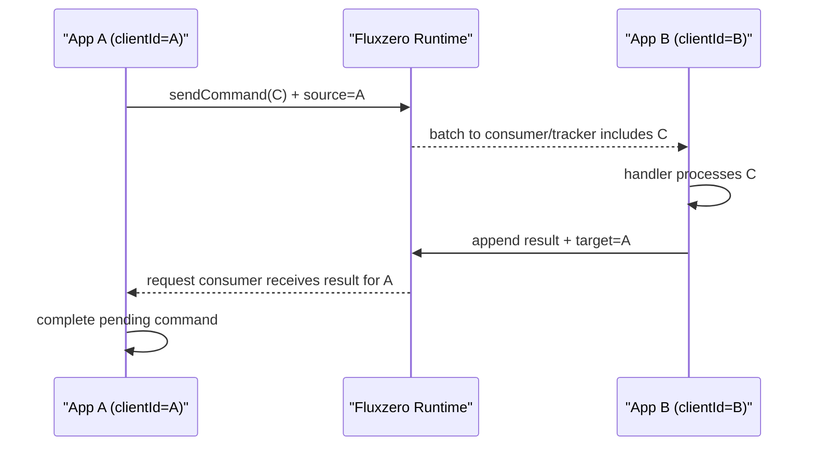
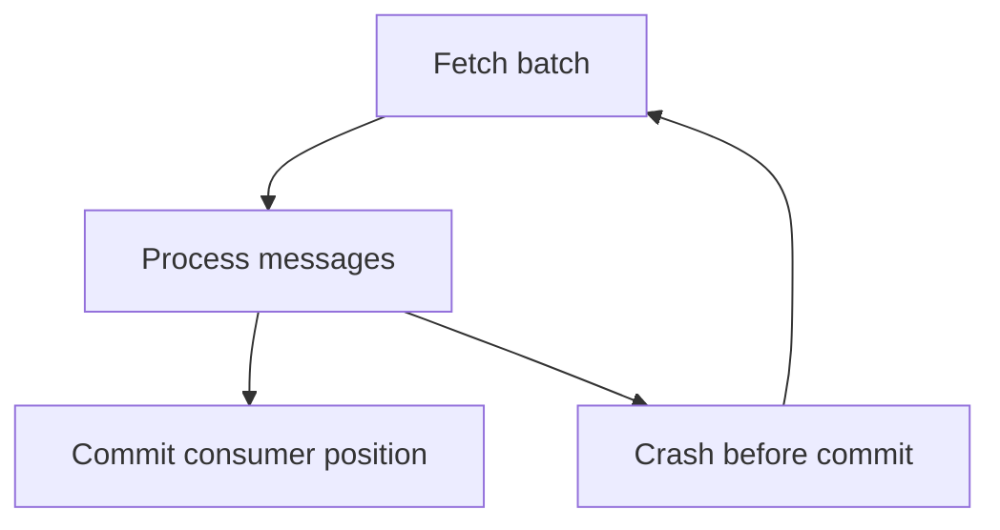
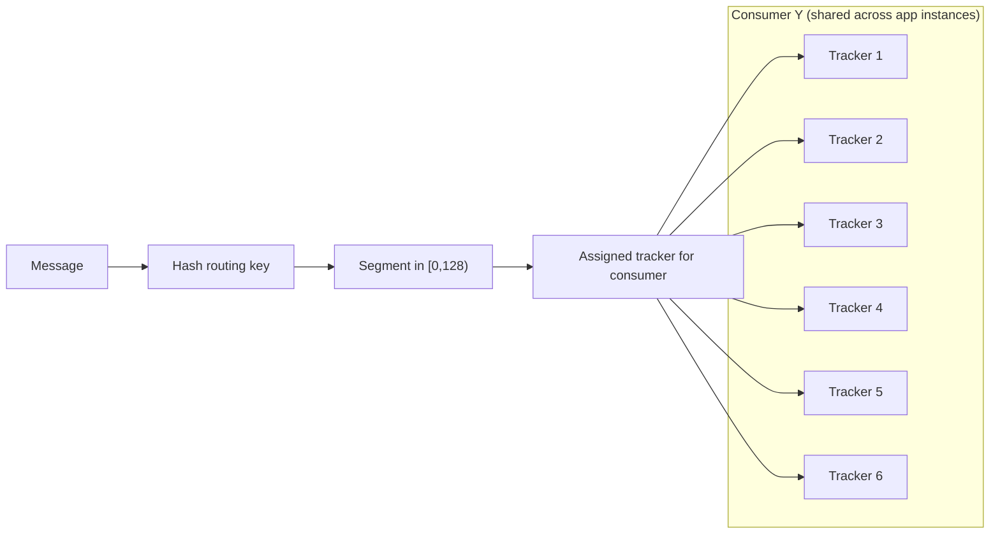

# Runtime Interaction

Fluxzero uses request/result logs in the runtime. Apps do not call each other directly.

1. App A sends command `C`.
2. SDK in App A sets `source = clientId(A)` on the request message.
3. A tracker in App B consumes a batch containing `C`.
4. A handler in App B handles `C`.
5. App B appends the handler result to the result log; SDK sets `target = clientId(A)`.
6. Request consumer in App A tails the result log and receives the result.
7. App A completes the pending command call.

### Command Followed by Query

For Models whose persistence set contains `DOCUMENT`, the direct document is part of Model-commit completion.
A command followed by a direct Model query therefore reads committed state. Whole-Graph projections and documents
written by event handlers remain asynchronous unless their own completion boundary is awaited.

---

## Delivery

Fluxzero aims to prevent duplicates, but the effective delivery contract for handlers is **at-least-once**.

Tracking loop (conceptually):

1. Get batch.
2. Process batch.
3. Commit tracking position in runtime.

If a consumer crashes before step 3, part of the batch can be handled again.

### Agent Rules

- Handlers with external side effects MUST be idempotent or compensatable.
- Replays/resetting consumer position intentionally re-deliver messages.
- If replay impact is unclear, ask the user before executing replay changes.

---

## Consumers

- Segment space is `[0, 128)`.
- Each message is hashed to one segment via routing key.
- Per consumer, each segment is assigned to exactly one active tracker.
- If you run multiple instances of the same app, trackers from all instances share that consumer's segment space.

Example:

- 2 app instances
- Same consumer config with `threads = 3`
- Total active trackers for that consumer = 6
- Segment space is divided over those 6 trackers

### Important Clarification

If multiple **different consumers** handle the same command type, that command can be handled multiple times and multiple
results can be produced.

Current request/result behavior:

- The first result appended to the runtime result log (lowest insertion index) is delivered first and used to complete the
  waiting request.
- Later results for the same request are currently ignored by the SDK.

This multi-consumer same-command setup is an advanced pattern and is discouraged by default unless explicitly requested.

---

