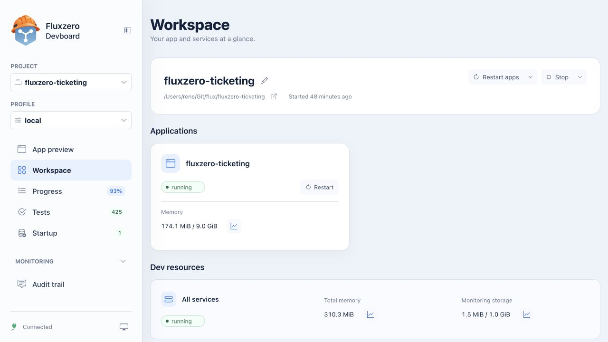

import { LinkCard } from '@astrojs/starlight/components';

Devboard is the browser view of the selected local development environment. Ask your agent to open it for the current project, or use the link provided by `fz dev`. The port is session-specific. For a guided introduction, follow [Explore a working app](/docs/building/local-development).

  <LinkCard title="Try the app" description="Preview navigation and opening a full window." href="#app-preview" />
  <LinkCard title="Inspect behavior" description="Scenario results, output and test controls." href="#tests" />
  <LinkCard title="Check the environment" description="Processes, measurements and restart scope." href="#workspace" />

## Project and profile

The project selector chooses the workspace. A profile selects a development configuration, including apps and services. Check both before interpreting results or restarting anything. A profile can connect to external services; consult the project's configuration before switching.

## App preview

**App preview** embeds the application's frontend and backend flow. Its toolbar supports back/forward navigation, reload, copying the app URL, expanding the preview and opening the application full page. Use a full page for sign-in, downloads or navigation that does not work correctly inside an iframe.

A successful preview can be the last working build while a newer edit fails. Use the agent's current build status before judging whether an edit has appeared. The [Dev Server](/docs/tools/dev-server) manages that build and replacement process.

## Workspace

**Workspace** shows the project directory, applications, local infrastructure and resource measurements. Open a memory or monitoring-storage measurement to inspect its graph. These measurements describe local development, not the cloud bill.

Restart and stop controls have a scope. An app restart, **Restart apps** and a full environment restart are different actions. Inspect the scope menu and description first. A full restart can replace ephemeral local data, while startup commands may populate it again.

## Progress

**Progress** groups registered features and fixes by product area. Filters select all, in-progress, planned or completed items. Expand a group and an item to read its intended outcome and history.

How to interpret the percentage and history

The completion percentage counts recorded items. It is not a time estimate, test-coverage measure or guarantee that the app is ready for release. History can be recorded retrospectively; read its explanation before treating it as a fresh verification result. The agent maintains this record as you agree and complete work.

## Tests

**Tests** lists scenarios and results from the managed test runs. Search by scenario, filter passed/failed/skipped entries and expand groups to inspect parameterized cases. A displayed scenario group can represent several tests, so the number of list rows need not equal the test count.

**Output** exposes test output. **Rerun** requests another run; **Pause** pauses automatic tests without being an instruction to stop the whole application. A paused or skipped test is not a passing result. Some projects have additional frontend/browser checks outside this list.

## Startup

**Startup** lists preparation actions, such as seeding demo data. Search or filter the list and expand an action to inspect its detail.

| Status | Meaning |
| --- | --- |
| Completed | The startup action completed |
| Failed | The action failed; inspect the reported error |
| Pending | The action has not completed and may be waiting or blocked by an earlier prerequisite |

If the app runs but expected demo data is missing, these results help separate a preparation failure from an application bug. Do not repeatedly rerun actions with side effects without understanding their behavior.

## Monitoring

Audit trail, Logs, Traces, Issues, Documents and Insights provide local evidence. Their availability depends on the environment. **Workspace** contains local resource measurements; the cloud dashboard also has a dedicated Resources view.

See [Monitoring views](/docs/building/monitoring) for controls and meanings, [understanding evidence](/docs/building/understanding-evidence) for interpretation, and [investigating a problem](/docs/building/investigate) for a procedure.
