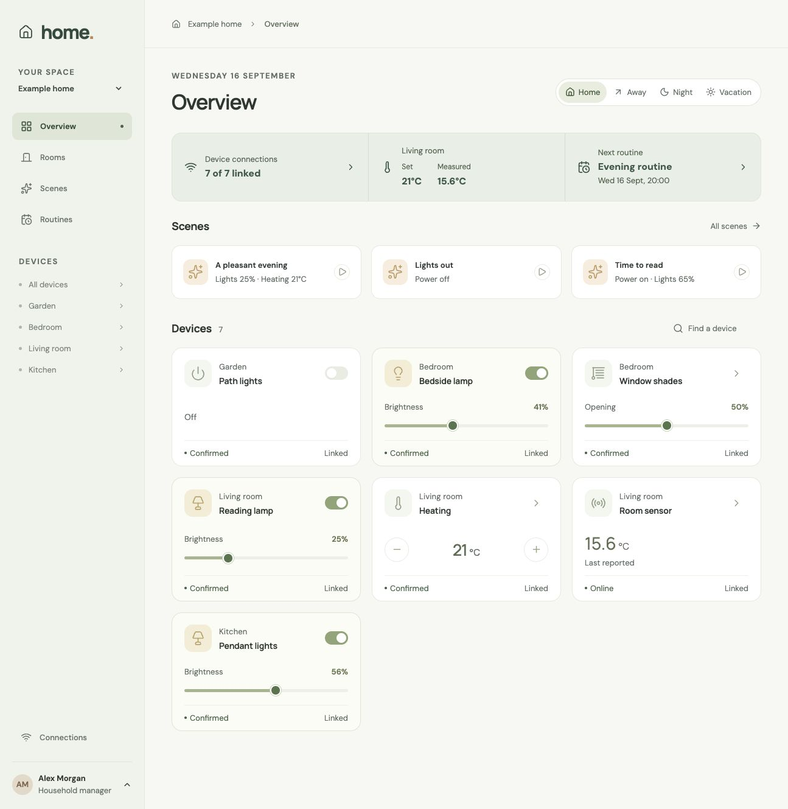
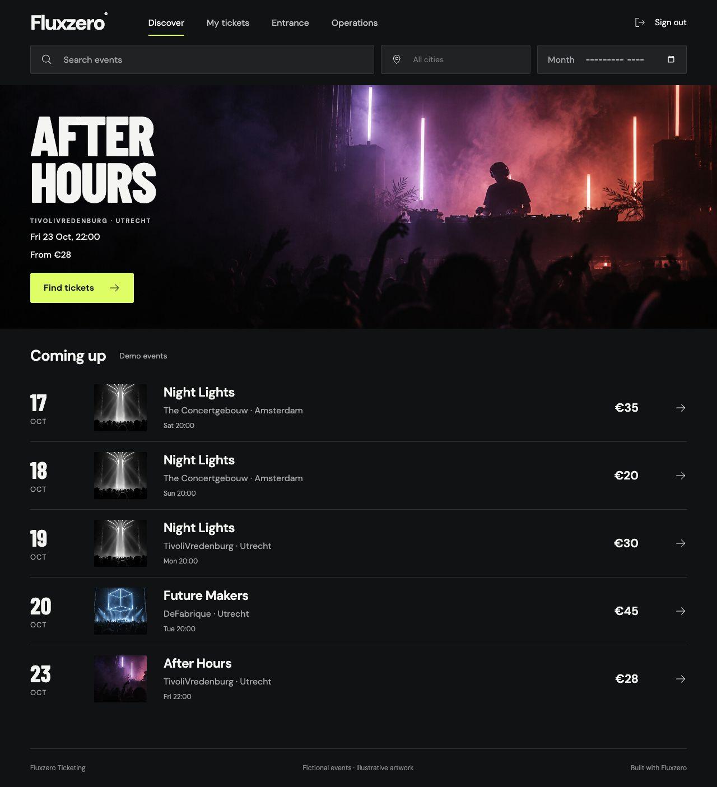

import { Aside, Card, CardGrid } from '@astrojs/starlight/components';

An existing app gives you something concrete to try before deciding what you want to build. These public examples
include a working UI, application rules, tests, and instructions for your agent. You can explore them or use them as
the starting point for your own changes. They use Fluxzero's SDK to build apps for the cloud; you can explore them
locally before publishing your own version on Fluxzero.

<CardGrid>
  <Card title="Home" icon="laptop">

Control devices, combine actions into scenes, and schedule daily routines.

[Try Home](#fluxzero-home) · [View on GitHub](https://github.com/fluxzero-io/fluxzero-sample-home)

  </Card>
  <Card title="Ticketing" icon="star">

Find an event, reserve places, and follow tickets through to admission.

[Try Ticketing](#fluxzero-ticketing) · [View on GitHub](https://github.com/fluxzero-io/fluxzero-sample-ticketing)

  </Card>
</CardGrid>

[Set up your agent with Fluxzero](/get-started), then use one of the requests below. “Clone” means making a local
copy of the repository on your computer; your changes there do not change the public example.

## Fluxzero Home

[Open Home on GitHub](https://github.com/fluxzero-io/fluxzero-sample-home)

Home brings rooms, devices, scenes, and daily routines together. It is a useful starting point if your product
organizes connected things and actions that happen now or at a chosen time. Its local demo runs without a
Home Assistant installation; connecting real devices is a separate step documented in the repository.

*From Home's GitHub repository, shown with its optional Home Assistant connection.*

> Clone https://github.com/fluxzero-io/fluxzero-sample-home and run this existing example locally. Follow its project
> instructions and use the Fluxzero tools. Open Devboard and help me try a scene with the demo devices.

Try a scene, look at the devices it affects, and explore the routines. Then ask your agent to explain one of the
scenarios in **Tests** in terms of what someone living in the home would experience.

<Aside type="tip" title="Make it yours">
Add a “Leaving home” scene for the demo home. Let me choose which lights it turns off, show what it will change,
and test that devices I did not select keep their current state.
</Aside>

## Fluxzero Ticketing

[Open Ticketing on GitHub](https://github.com/fluxzero-io/fluxzero-sample-ticketing)

Ticketing lets visitors find events and reserve places, and gives organizers tools to manage performances and
admission. Its flows include seat selection, reservation expiry, payments, refunds, and ticket delivery. It is a
useful example when your product has limited availability, deadlines, money, or actions with different permissions.

*From Ticketing's GitHub repository, showing its demo events.*

> Clone https://github.com/fluxzero-io/fluxzero-sample-ticketing and run it locally using its local demo profile.
> Follow its project instructions and open Devboard. Help me reserve two places, then show me the organizer workspace.

Start by browsing an event and reserving places. Ask your agent to show how a reservation expires and how the tests
check that a ticket cannot be admitted twice. The [Local development guide](/docs/building/local-development) uses
this app and shows where to find the preview, progress, and tests.

<Aside type="tip" title="Make it yours">
Let a visitor save favorite events and find them again after signing in. Keep each person's favorites private,
and show me the tests for that rule.
</Aside>

Use the local demo setup to explore first. Connecting an actual payment provider or installing tickets in a phone's
wallet requires the provider or issuer configuration described in the repository.

## Make it your own

Tell your agent which behavior you want to keep and what your version should do differently. Ask it to work in a
separate local copy and, when you want to keep or share the result, create your own GitHub repository or fork.
A fork is your own copy on GitHub. The repository's license explains the terms for using and sharing its code.

Try one complete change before expanding the scope. [Test and improve your app](/docs/building/test-and-improve)
helps you check the result; [Publishing your app](/docs/tutorials/cloud-deployment) covers taking your version live.

Both examples use Fluxzero 2.0. For developers interested in how their Models and Graphs work, see the
[Fluxzero 2.0 guide](/docs/fluxzero-2).
