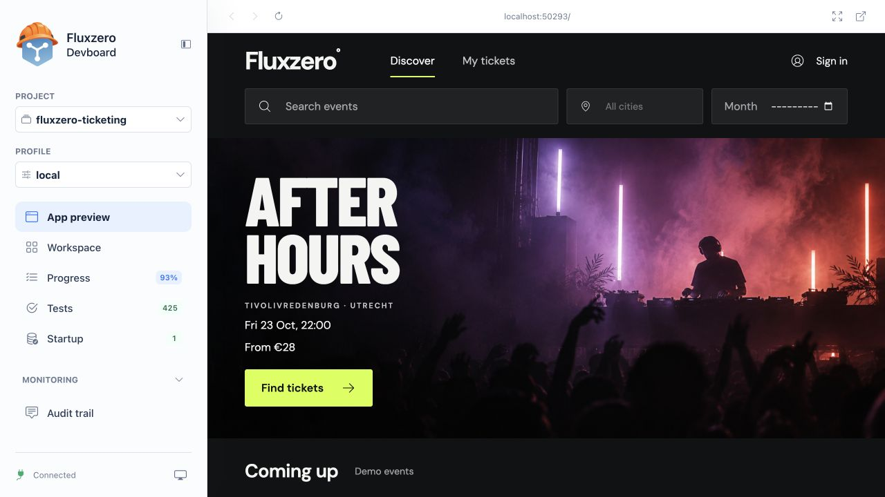
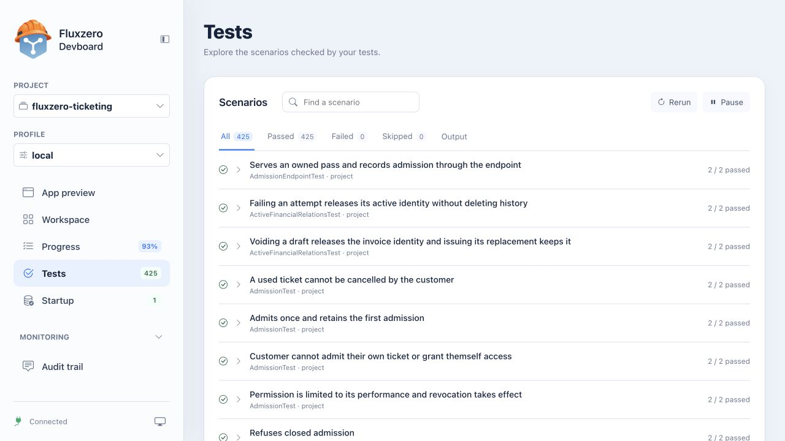
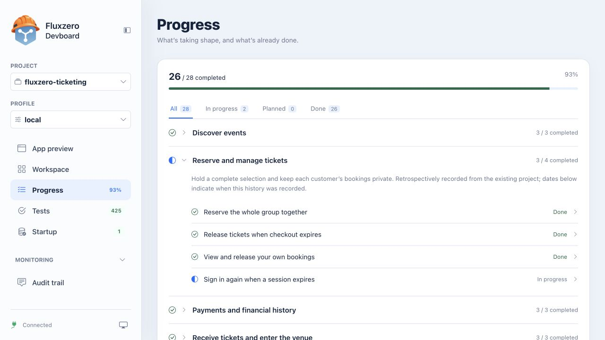
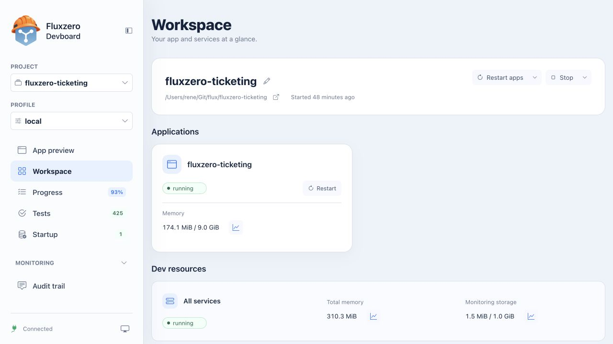

import { Aside, Card, CardGrid, LinkCard } from '@astrojs/starlight/components';

Build and test your complete app on your computer before publishing it on **Fluxzero, the cloud that runs it for your
users**. Your agent uses the CLI and Dev Server to manage the local environment. You use **Devboard** to try the app
and see what is being built.

This guide uses the public [Ticketing example](https://github.com/fluxzero-io/fluxzero-sample-ticketing): a working
app for finding events, reserving places, and admitting tickets. The screenshots show its local demo. Your own
project uses the same Devboard pages, with its own features and scenarios.

<CardGrid>
  <LinkCard title="Use your own app" description="Ask your agent to start your project and open Devboard." href="#1-open-your-app" />
  <LinkCard title="Explore a working example" description="Clone Ticketing or Home and extend it with your agent." href="/docs/building/example-apps" />
</CardGrid>

## 1. Open your app

After [setting up your agent](/get-started), ask:

> Start my app locally with the Fluxzero tools and open Devboard's App preview. Tell me one complete flow I can try.

To follow along with the example instead:

> Clone https://github.com/fluxzero-io/fluxzero-sample-ticketing and run it locally. Follow its project instructions,
> use the local demo profile, and open Devboard's App preview. Help me browse an event and reserve two places.

The agent checks the project and reuses its running environment, or starts one if needed. It gives you the current
local link. Use that link: ports can differ between projects and sessions. The local link works on the computer
running the Dev Server; publishing on Fluxzero gives your users a live address.

<Aside type="tip" title="A shortcut to Devboard">
With the Fluxzero plugin in an agent that supports its slash commands, enter `/fluxzero:devboard`.
You can also simply ask “Open Devboard”.
</Aside>

## 2. Try the whole app

**App preview** contains the application, with its UI and backend working together. In Ticketing, browse demo events,
search for **Night Lights**, clear the search, and open **After Hours** to explore its tickets.

Try the flow your agent suggested. Check whether you can find the information needed to act: the date, venue, price,
and available places. Then describe an improvement:

> Make it easier to tell when an event is sold out. Show the result here when it's ready, and test the behavior.

The preview toolbar can reload the app or open it in a full browser tab. A separate tab is useful for sign-in or
another flow that leaves the embedded preview.

### The preview follows your changes

The Dev Server watches the project, builds changes, runs tests automatically, and manages the backend, frontend,
and local services. Your agent can inspect failures through the same tools, so you do not need to start each service
or copy terminal output yourself.

If a new backend build fails, the last successfully started version can remain available while your agent fixes it.
Check the build status before assuming the preview includes the newest change. Developers who prefer a terminal
can use `fz dev` from the project directory; the [CLI reference](https://github.com/fluxzero-io/fluxzero-cli#readme)
covers its commands and configuration.

## 3. Check the tested behavior

Open **Tests**. Each scenario describes behavior checked automatically as your agent builds. Search for a flow you
care about, such as admission or cancellation, and expand a scenario to inspect its result.

Ticketing's tests include a ticket being admitted only once and a customer being unable to admit their own ticket.
These are product rules you can discuss without reading code. Ask your agent to explain a failure or add a missing case.

The page offers **Rerun** and filters for passed, failed, and skipped results. A green result means those scenarios
passed; trying the app yourself tells you whether the experience works for its users too.

## 4. Follow the work

Open **Progress**. Features and fixes are grouped by the part of the product they improve. Expand an item to see its
recorded detail, or filter for work in progress or completed work.

The percentage counts completed recorded items. Use the list to discuss scope: what has been delivered, what you
have tried, and what remains before publishing. It is not a time estimate. Ask your agent to keep it current as you
agree on new work.

## 5. Check the local environment

Open **Workspace** to see whether the app and its services are running. **Startup** shows actions that prepare the
local environment, such as creating Ticketing's demo programme. If the preview is unavailable or seems out of date,
ask your agent to inspect the build and startup results.

Workspace also shows memory and monitoring storage usage. Open a metric's graph to see how it changes over time.
Your agent can read the local status and resource measurements too: “Is the app ready, and is anything using more
memory than before?” gives it a concrete starting point.

The project selector switches between available projects. A **profile** selects a development setup, such as the
local demo or a connection to an external service. Changing profiles can change the services and data in use;
ask your agent which profile matches the flow you want to try.

## 6. Look behind an action

Open **Audit trail** after trying a flow. The overview lists the actions and changes recorded by your app. In
Ticketing, you can see reservations, cancellations, and changes to available places together.

Open **Documents** to see stored, searchable data. Choose a collection to browse its records: here the list contains
the demo events, including **After Hours**. Your agent can compare those records with what the app displays.

Your agent can search these records and follow traces through the Fluxzero tools. You do not have to copy long logs
into the chat. Describe what you did, approximately when, and what you expected:

> I cancelled my reservation, but the places still look unavailable. Inspect the audit trail, follow the trace,
> and check the saved data. Explain what happened, add a test for the problem, and verify the fix.

[Understand your app](/docs/building/monitoring) explains every monitoring view, including Logs, Traces, Issues,
Documents, Resources, and Insights, with a walkthrough from a user action to its result.

### Find the right view

<CardGrid>
  <Card title="App preview, Tests, Progress" icon="approve-check">
Try a complete flow, inspect the scenarios your agent checks, and follow the work needed for your next release.
  </Card>
  <Card title="Workspace, Startup, Monitoring" icon="magnifier">
See what is running and how it was prepared. Logs, messages, traces, issues, and documents give your agent evidence
to investigate behavior instead of guessing from a screenshot.
  </Card>
</CardGrid>

The local environment gives you access to Fluxzero's programming model and diagnostic tools before your app goes
live. After publishing, the [Fluxzero dashboard](https://dashboard.fluxzero.io) provides the operational view of your
running product; [Product insight](/product-insight) shows what that history can explain.

## Keep building, then publish

You now have a feedback loop: try a flow, describe a change, inspect its tests, and try again.
Use [Test and improve your app](/docs/building/test-and-improve) for the next change, or follow
[Publishing your app](/docs/tutorials/cloud-deployment) to make a checked version available on Fluxzero.
