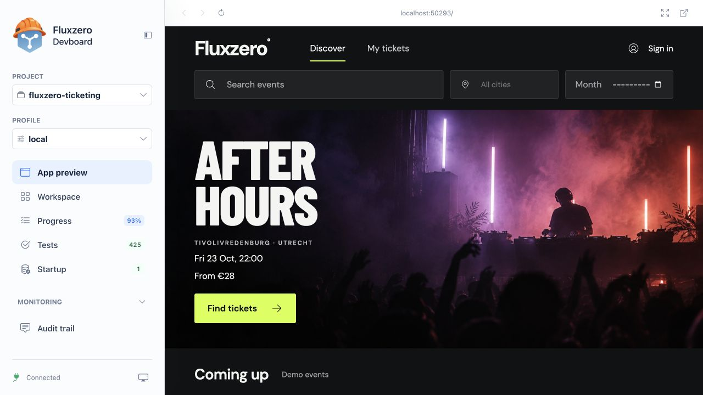
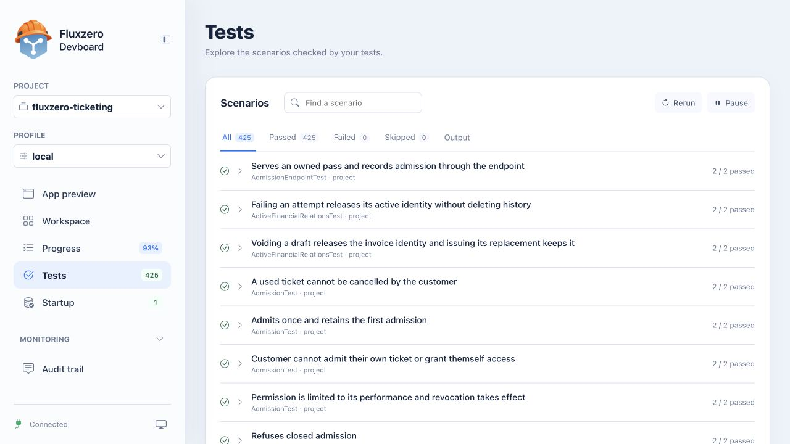
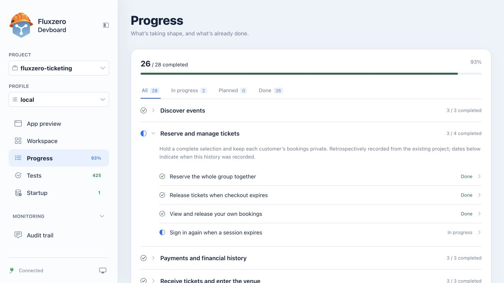

import { Steps, CardGrid, LinkCard } from '@astrojs/starlight/components';
import AgentPrompt from '~/components/docs/AgentPrompt.astro';

Reserve two places in Ticketing and see how the app holds them for you. Then look behind the screen: find a tested booking rule and the startup action that created the demo events.

Local demoNo payment or email account needed

## Before you start

[Set up your agent](/docs/tools/agent-plugin). Ask it to check the example’s prerequisites, including Mailpit for the local inbox. Use a separate copy of [Ticketing revision 6379847](https://github.com/fluxzero-io/fluxzero-sample-ticketing/tree/6379847b94c1a00719f1647347c1134805ea8a28), so your existing work stays intact. Newer revisions may have different screens or events.

<Steps>

1. ## Open the example

   
   
   

   Give your agent this request:

   <AgentPrompt text={"Make a separate local copy of https://github.com/fluxzero-io/fluxzero-sample-ticketing at revision 6379847b94c1a00719f1647347c1134805ea8a28 for this tutorial. Follow its project instructions and check the prerequisites. Start its local profile with the Fluxzero tools and open Devboard's App preview. Keep external payment and device connections disabled."} />

   Open the link your agent returns. Ports vary between sessions; use the link on the computer running the environment.

   
<strong>You should see</strong>
Ticketing’s event catalogue in App preview, ready to explore.

   

   If the catalogue has not appeared, let your agent finish or diagnose startup before continuing.

2. ## Reserve two places

   
   
   

   Open **Night Lights**, then its performance in the **Recital Hall**. Select two adjacent available seats, choose ticket types and continue to reserve the group. **Find together** can help; select available seats manually if it offers none.

   When asked to sign in, use a local demo username such as `demo-customer`. Then choose **Reserve tickets**.

   
<strong>You should see</strong>
<b>Your tickets are held</b>, the places you selected and a countdown of up to fifteen minutes. <b>Online payment unavailable</b> is the expected stopping point in this local demo.

   You have tried a complete flow: a screen, sign-in, availability checks and saved state. No real payment provider is needed.

   

   
Sign-in needs a full window, or no seats are available

   For sign-in, choose **Open application full page** in the preview toolbar, then return to Devboard. If there are no suitable seats, ask the agent to inspect the demo state. A full environment restart can create a fresh demo, but can also discard local work and reservations.

   

3. ## Find a rule in Tests

   
   
   

   Open **Tests** and search for a reservation or expiry scenario. Expand a grouped entry when necessary.

   Ask your agent: “Which test checks that a group reservation either holds every place or none of them?”

   

   
<strong>What this tells you</strong>
The scenario checks a product rule behind the screen. A passing result is evidence for that rule, not every screen or a live payment account.

4. ## Read Progress and Startup

   
   
   
   

   Open **Progress** and expand a completed feature. Read what it delivers and its recorded history. The percentage counts completed work items; it does not measure remaining time or test coverage.

   In **Startup**, find the demo programme action and its result. This is where the example events came from. In **Workspace**, check that the app and services are running.

   

   
Recognize the Progress view

   

   

5. ## Explain what you just checked

   
   
   
   
   
   
   
   
   

   You used **App preview** to try the flow, **Tests** to inspect a rule, **Progress** to read recorded work and **Startup** to understand the initial data.

   Now open **Audit trail**. Ask your agent to find the reservation you just made, using your demo username and approximate time. It can connect what you saw to the actions recorded by the app.

</Steps>

## Make it your own

<CardGrid>
  <LinkCard title="Make your first change" description="Improve the reservation screen with your agent." href="/docs/building/first-feature" />
  <LinkCard title="Devboard reference" description="Look up a screen, control or status as you explore." href="/docs/building/devboard" />
</CardGrid>

To return to your own project later, follow [Open an existing project](/docs/building/resume-a-project).
