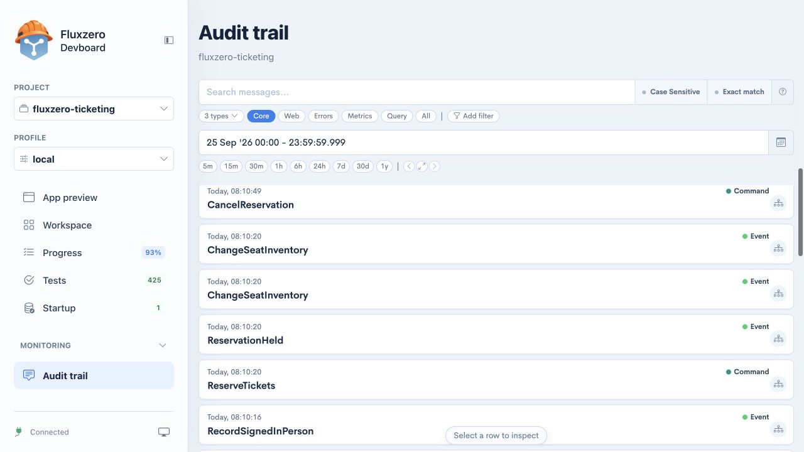
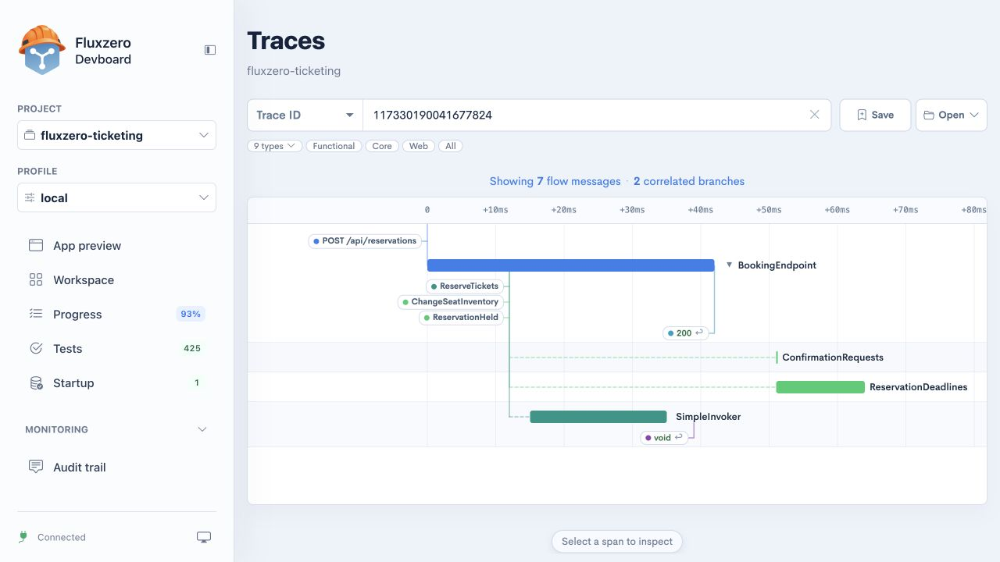
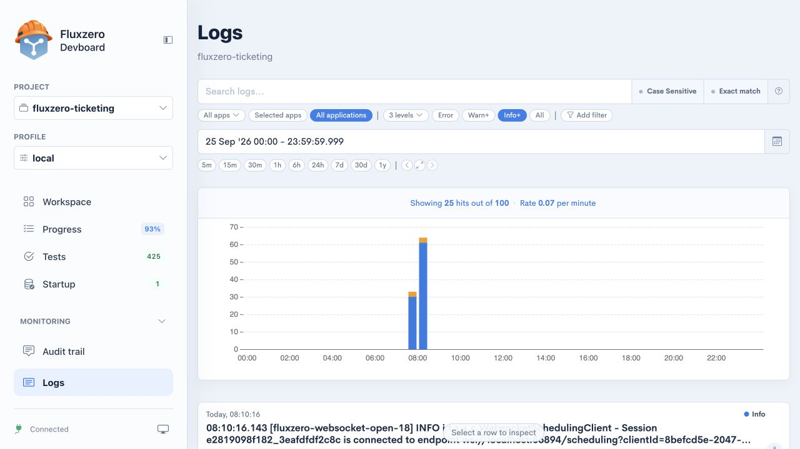
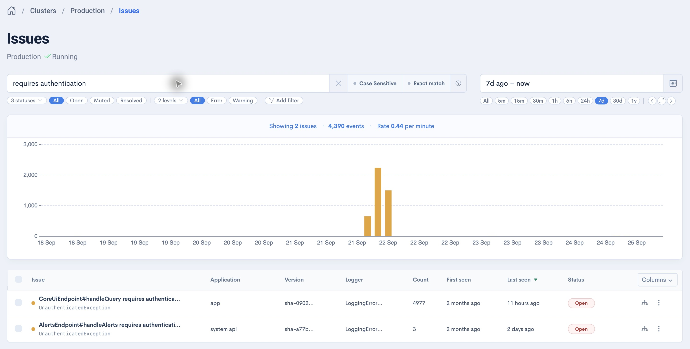
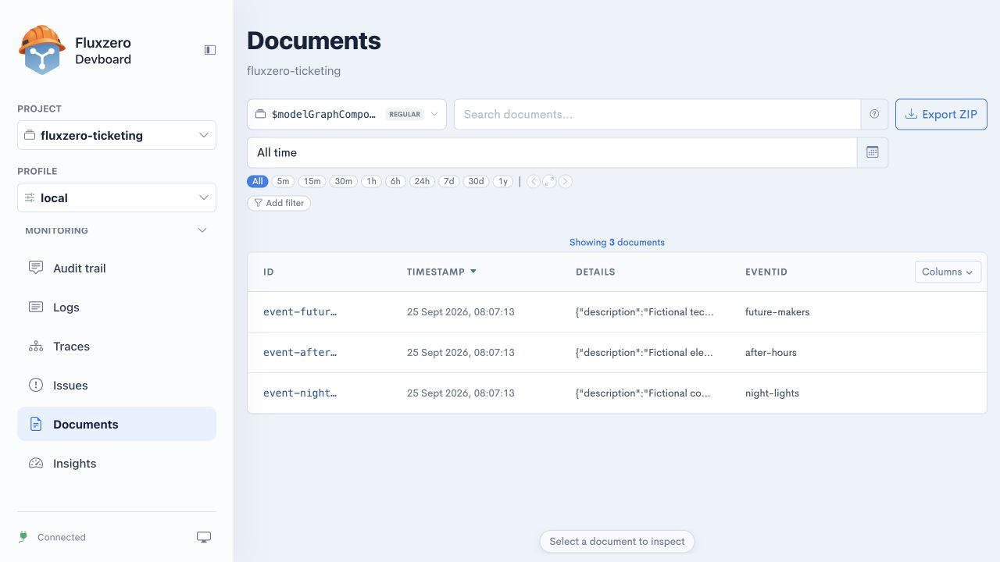
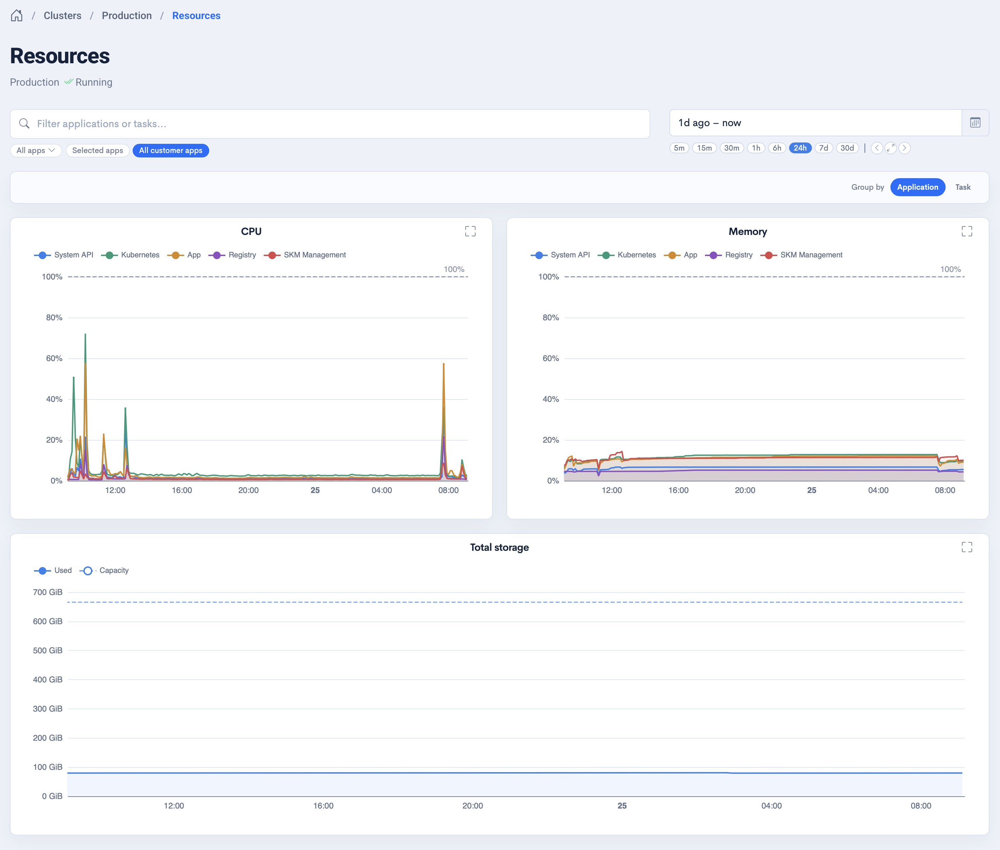
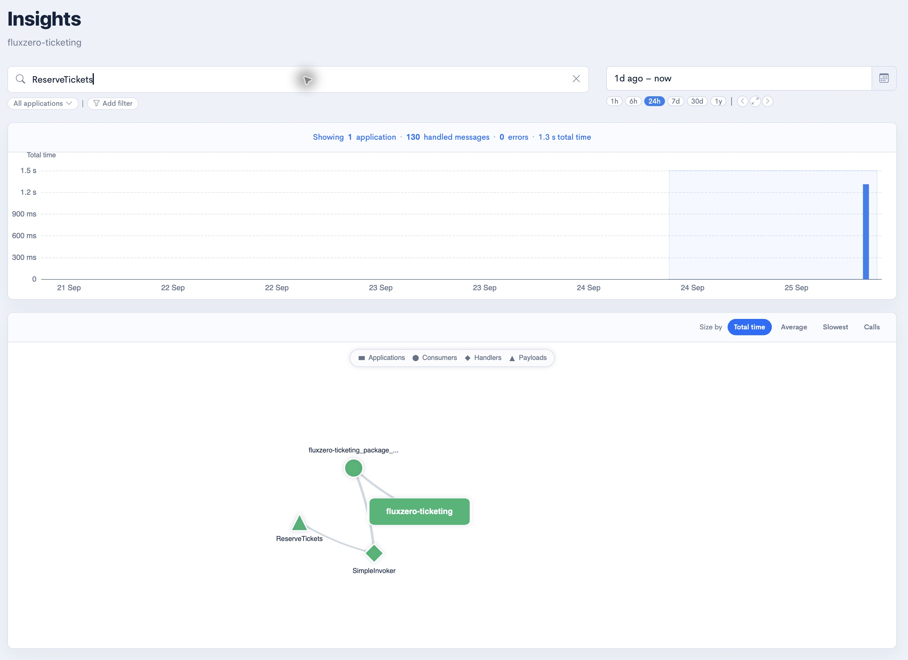

import { Aside, Card, CardGrid } from '@astrojs/starlight/components';

A customer says their reservation disappeared. Another says checkout is slow. You need to know what actually
happened: which action arrived, what the app did, what it saved, and where it failed or spent time.

**Fluxzero records that evidence as part of running your application.** Its dashboard brings activity, failures,
stored data, and performance together. Your agent can use the connected Fluxzero tools to investigate too,
then reproduce a problem in a test and check a fix.

You do not need to understand the implementation to use this chapter. Start with the question you want answered.

<CardGrid>
  <Card title="Follow one action" icon="magnifier">
Use **Audit trail** to find it and **Traces** to follow the connected work. Add **Logs** when you need the app's own
diagnostic messages.
  </Card>
  <Card title="Check what was saved" icon="document">
Use **Documents** to inspect searchable records. Compare the stored result with what the person saw on screen.
  </Card>
  <Card title="Find problems" icon="approve-check">
Use **Issues** to find recurring failures, inspect occurrences, and check whether the problem returns after a fix.
  </Card>
  <Card title="Understand workload" icon="rocket">
Use **Resources** for capacity and **Insights** for the work your app performs. Follow expensive operations back to
specific behavior.
  </Card>
</CardGrid>

## Open the right environment

For a published app, open the [Fluxzero dashboard](https://dashboard.fluxzero.io), choose the organization and cluster
that run it, and expand **Monitoring**. Select the relevant application and time range within the view.
A cluster is the environment containing your running applications and their data.

During [local development](/docs/building/local-development), open **Monitoring** in Devboard. You can learn the tools
by trying the public [Ticketing example](/docs/building/example-apps#fluxzero-ticketing) and following your own actions.

The screenshots use Ticketing's local demo, plus resource and issue overviews from Fluxzero's own running
applications. Your published app's activity is available in the Fluxzero dashboard; Devboard shows the selected local
project. Locally, resource measurements appear in **Workspace** rather than a separate **Resources** navigation item.

<Aside type="tip" title="Give an investigation a starting point">
Tell your agent which app and environment, what you did, roughly when, and what should have happened. Include a
reservation, order, or other record identifier when you have one. That lets it search a small, relevant slice of
activity instead of guessing from the current screen.
</Aside>

## Audit trail: what happened?

**Audit trail** is the history of messages moving through your app. In plain terms, these include requests from a
browser, actions your app was asked to perform, and facts recorded after a change.

In Ticketing, `ReserveTickets` means someone asked to reserve places. `ReservationHeld` records that the reservation
was held, and `ChangeSeatInventory` records a change to availability. Seeing a request alone does not prove that the
whole flow completed: follow the resulting messages as well.

Choose a time range, then search for an action name or a known identifier. The presets help narrow the results:
**Core** covers commands, events, and errors; **Web** focuses on web traffic; **Query** shows requests for information.
Use **Add filter** to narrow further when needed.

Select a result to open its details:

- **Overview** identifies the message, when it happened, and its connections to other work.
- **Metadata** holds contextual information that travels with the message.
- **Payload** contains the message's actual contents, such as the performance and places being reserved.

Use **See trace** to move from an individual record to its connected flow.

> Find my reservation action around 14:10. Was it accepted, and which changes followed it?

## Traces: how did the action travel through the app?

A **trace** connects work caused by an action. The timeline shows when each part started, how long it took, and the
messages and responses it produced. A *handler* is the part of the app that processes a particular message.

This example starts with `POST /api/reservations`, the browser asking to reserve tickets. The flow includes
`ReserveTickets`, an inventory change, and `ReservationHeld`. Follow-up handlers process confirmation requests and
reservation deadlines. The `200` response marks the successful response to the browser; background work can continue
on its own branches.

Open a trace from the audit trail, or use the search field when you already have a trace identifier. Click a message
or timing bar to inspect it. The type filters reduce visual noise; **Save** and **Open** let you return to a trace
while investigating.

A trace helps answer different questions from a list of logs: did the request reach the right code, which step
failed, did a follow-up run, and was the delay before processing or inside it?

> Follow this reservation's trace. Explain which steps completed and where the delay occurred before changing code.

## Logs: what did the app report?

**Logs** contains diagnostic messages written by the application. These can explain a connection failure, a rejected
response from another service, or a decision the app recorded while processing work.

Select the application, choose the time range, and search for relevant text. **Error**, **Warn+**, and **Info+** help
choose the amount of detail. Open a row for the complete entry and follow its trace link when one is available.

The audit trail tells you which messages passed through the system; logs add what the application reported about
its execution. A warning does not automatically mean a customer action failed. Match it to the action and its result.

> Check the logs around this failed request and follow any linked trace. Is the cause in our app or in the service
> it called?

During local development, your agent can also inspect Dev Server build and process output. That is useful when the
app never started; application logs become useful once it is running.

## Issues: which failures need attention?

**Issues** groups recorded problems so you can investigate a recurring failure without treating every occurrence as
an unrelated report. Filter by status, severity, text, and time range to focus on the problem you are examining.

The screenshot filters for authentication warnings. The chart shows when they occurred; the list groups repeated
reports and shows their application, version, count, and status. An authentication warning can mean access was
correctly refused, so investigate the context before deciding whether the application needs a fix.

Open a group to inspect its occurrences and available context. Compare when the problem started and recurred, then
follow the evidence into logs or traces to understand the cause.

**Open**, **Muted**, and **Resolved** describe how an issue is being tracked. Muting an issue does not fix the app.
Resolving it should follow a verified fix; check subsequent activity to see whether it returns.

> Investigate the most frequent open issue in this environment. Show an occurrence, explain the affected user flow,
> and reproduce it in a test before fixing it.

No matching issues means no issues were found within the selected scope. It does not prove that every product rule
is correct. Keep trying complete flows and maintaining the scenarios in **Tests**.

## Documents: what data was saved?

**Documents** lets you inspect stored, searchable data. Choose a collection, search or filter its records, and open a
row. The document view shows its contents; **Index metadata** describes the indexed record.

The overview lists the saved demo events, including `After Hours`. Your agent can inspect a record and compare it
with the app. If a screen shows an old title, that comparison helps decide whether to investigate saving, querying,
or displaying the information.

Collections depend on your app. They can contain its models or data prepared for search and screens. This view shows
the selected collection's records; the audit trail provides the history of actions that led to changes.

Use **Columns** to choose which fields to compare in the result table. **Export ZIP** is available when you need an
export of the selected search results. You usually do not need an export for debugging: the agent can search and
inspect the relevant records through its tools.

> Find the saved event for After Hours and compare its title with the event page. Trace the last relevant change
> if the values differ.

## Resources: is the app approaching its capacity?

**Resources** in the Fluxzero dashboard shows CPU, memory, and available storage measurements over time. Select the
application and period, and compare usage with its configured capacity. Grouping by application or task helps
separate the overall picture from individual running instances.

The overview compares applications over the same period. Here, short CPU peaks are visible alongside steadier
memory usage, while storage remains well below the available capacity. These are different signals: a CPU peak
alone does not mean the application needs more memory or storage.

CPU measures processing work; memory is the working space used while the application runs; storage holds retained
data. A brief spike and usage that stays close to a limit call for different investigations. Compare the same period
in **Insights** to see which application work was active.

In Devboard, **Workspace** shows the local app and services, memory measurements, and monitoring storage, with graphs
available from the metrics. Those describe your development environment, not the capacity or bill of your published app.

> Compare resource usage before and during the slowdown. Is one application under sustained pressure, and which
> operations account for its work?

## Insights: where does the app spend its time?

**Insights** summarizes activity across applications, consumers, handlers, and message types. A *consumer* is a group
that processes messages; the connected map lets you move from the application to the work performed inside it.

Choose an application and time range, or filter for the behavior you are investigating. The summary and histogram
show how much work happened and when. Use the connected map to explore where that work belongs.

**Size by** changes what stands out:

- **Total time** highlights work that consumes the most time overall.
- **Average** highlights work that is expensive per call.
- **Slowest** helps find unusually slow individual handling.
- **Calls** highlights frequently executed work.

These answer different questions. Something can dominate total time because it runs frequently while each call is
fast. An occasional slow operation can be hidden by a healthy average. Select a node to inspect its measurements
and connected work before drawing a conclusion.

> Find the operations taking the most total time, then compare their average and slowest calls. Explain which user
> flows they serve and whether a specific trace would help us investigate.

## Walkthrough: from a reservation to a verified result

Try this in the local Ticketing example:

1. In **App preview**, open an event and reserve available places. Note the approximate time and keep the reservation
   identifier if the app shows it.
2. In **Audit trail**, select that period and find `ReserveTickets`. Open its payload to check that it describes the
   action you just performed.
3. Follow **See trace**. Find the browser response, `ReservationHeld`, the inventory changes, and any follow-up work.
4. In **Documents**, ask your agent to find the related reservation and availability records. Compare them with the
   app's visible result.
5. Cancel the reservation in the app. Return to the audit trail and follow `CancelReservation` to its changes. Check
   whether the places become available again.

You have now compared the user's action, its execution, the saved result, and the screen. If one of those differs
from what you intended, give that concrete discrepancy to your agent:

> I cancelled this reservation at about 14:15, but its places still appeared unavailable. Use the monitoring tools
> to follow the cancellation and inspect the saved records. Explain the cause, add a test that reproduces it, fix
> the behavior, and show me the passing test and the working flow in App preview.

<Aside type="tip" title="Your agent can investigate with you">
With the Fluxzero tools connected to the relevant environment, the agent can search issues, logs, the audit trail,
traces, documents, and measurements directly. It can connect that evidence to the product code and tests. You provide
the intended behavior; the recorded activity supplies what actually happened.
</Aside>

For a published app, make sure the connected tools target the intended organization and environment. Reproduce and
verify the change locally, then follow [Publishing your app](/docs/tutorials/cloud-deployment) to release it. Inspect
new activity afterwards to confirm the affected flow now behaves as expected.

## When a view is empty

Check the selected project or organization, environment, application filters, message types, and time range. Recent
activity may take a moment to appear. Older evidence depends on the environment's retained history.

Ask your agent to check whether you are looking at the right source before restarting anything. Restarting a local
app does not necessarily clear retained monitoring history, and an empty result does not by itself explain why an
action failed.

Continue with [Test and improve your app](/docs/building/test-and-improve) to turn observations into checks for the next
version. Developers who want the underlying concepts can explore [Message handling](/docs/guides/messaging/message-handling).
