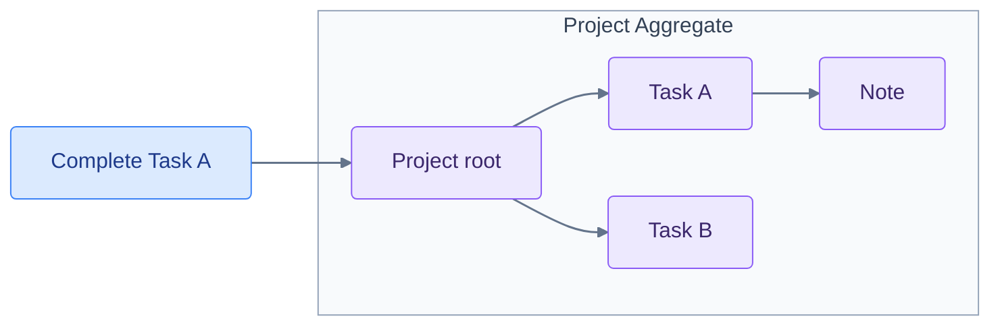

import { Tabs, TabItem } from '@astrojs/starlight/components';
import OverviewFigure from '~/components/docs/OverviewFigure.astro';

**Fluxzero 2.0 removes a fundamental constraint that has shaped every Fluxzero application until now.**

Before 2.0, Fluxzero used Aggregates to give domain state a clear, yet rigid structure. It was a powerful model, but it forced the domain into separate trees. Each tree had to serve four different concerns that did not necessarily share the same natural boundary. Whenever those boundaries diverged, the Aggregate model fell short.

1. **Relationships: what belongs together**
   Consider a project-management domain. A Task belongs to a Project. But what if that same Task also belongs to the Sprint in which it is planned? A tree can place the Task below only one root. The other relationship must cross the tree boundary or be duplicated.

2. **Consistency: what changes together**
   An Aggregate can change its root and Members atomically. But what if a Task moves from one Project to another? One business operation now affects two trees. Before 2.0, such a move required separate Aggregate commits, so it could not be stored atomically.

   Atomicity was only part of the problem. The Task's existing events belonged to the original Project stream. Its history could not move with it. Nested notes and attachments also had to be transferred, while their earlier changes remained part of the old Aggregate's history.

   <OverviewFigure name="aggregate-move" />

3. **Persistence: what is stored together**
   An event-sourced Aggregate gives its complete tree one shared history. But what if related state has different persistence needs? The business decisions made about a Task may need an event-sourced history. An externally reported progress status may change constantly while only its latest value matters. That status may be better stored as a document.

4. **Loading: what is loaded together**
   `@Member` and `loadEntity` made a Task directly addressable. But what if its Project contains thousands of other Tasks, notes and attachments? Loading that one Task still meant reconstructing the containing Project. Every Task change also passed through the same root. As the tree grew, that root became both a loading cost and a common gatekeeper for otherwise independent work.

   <OverviewFigure name="aggregate-load" />

**There was no Aggregate boundary that solved all four concerns.**

One option was to make the tree larger. Project, Sprint and Task could all be placed below a common root such as Workspace. That would bring their changes back inside one Aggregate, but it would also produce a god model. More state, history and traffic would accumulate behind the same root.

The other option was to split the tree into smaller Aggregates. That reduced loading costs, but lost atomic consistency across them. Moving a Task then required separate writes. All-or-nothing behavior needed custom coordination and compensation logic. Those writes and any rollback were still eventually consistent, so other processes could observe intermediate states.

**Once chosen, that boundary became increasingly difficult to change.**

Smaller Aggregates were difficult to evolve too. For example, if existing Projects later had to belong to different Organisations to support multiple tenants, their histories contained no Organisation ownership. Adding that boundary meant migrating the existing histories or making Organisation another, even larger Aggregate root.

A boundary chosen to solve one concern constrained the others. Once events had been recorded against that boundary, the choice was also encoded into the domain's history.

**Fluxzero 2.0 provides a way out by separating these four concerns.**

It does so by shifting the consistency boundary from the Aggregate being changed to the change itself. At first glance, the programming model remains familiar. Commands, applies, assertions and tests still work much as before. Yet its consequences for the domain model are fundamental.

**Before 2.0**



**With 2.0**

<div style="background:rgba(0,0,0,0.02);border-radius:8px;padding:16px;margin:1.5rem 0">
<svg viewBox="0 0 600 220" role="img" aria-labelledby="independent-models-title" style="display:block;width:100%;max-width:600px;margin:0 auto;color:#64748b;font:16px var(--sl-font)">
  <title id="independent-models-title">Complete Task A addresses Task A directly. Note points to Task A, and Task A points to Project through dotted parent relationships.</title>
  <defs>
    <marker id="independent-models-arrow" viewBox="0 0 10 10" refX="9" refY="5" markerWidth="6" markerHeight="6" orient="auto-start-reverse">
      <path d="M 0 0 L 10 5 L 0 10 z" fill="currentColor" />
    </marker>
  </defs>
  <rect x="215" y="20" width="170" height="48" rx="4" fill="#dbeafe" stroke="#3b82f6" stroke-width="1" />
  <g fill="#ede9fe" stroke="#8b5cf6" stroke-width="1">
    <rect x="30" y="145" width="120" height="48" rx="4" />
    <rect x="240" y="145" width="120" height="48" rx="4" />
    <rect x="450" y="145" width="120" height="48" rx="4" />
  </g>
  <g fill="#3b276b" text-anchor="middle" dominant-baseline="middle">
    <text x="300" y="44" fill="#1e3a8a">Complete Task A</text>
    <text x="90" y="169">Note</text>
    <text x="300" y="169">Task A</text>
    <text x="510" y="169">Project</text>
  </g>
  <g fill="none" stroke="currentColor" stroke-width="1.5" marker-end="url(#independent-models-arrow)">
    <path d="M 300 68 V 143" />
    <path d="M 150 169 H 238" stroke-dasharray="3 5" />
    <path d="M 360 169 H 448" stroke-dasharray="3 5" />
  </g>
</svg>
</div>

The domain relationships have not changed. Before 2.0, completing Task A addressed the Project Aggregate, so its complete tree was the storage, loading and consistency boundary. In 2.0, the operation addresses Task A directly. Note, Task and Project remain connected, but no longer form one rigidly stored object tree. Children point to their parents through loose relationships.

An operation can also change several of these independent entities together, without merging their state or histories.

First, let's see what this looks like in code. Then we will revisit the four concerns and explore what working with the new model looks like.

## From Aggregates to Models

In Fluxzero 2.0, an entity can belong to a larger whole without being stored inside it. This independent entity is called a Model. A Model keeps its own state and history; its relationships connect it to other Models.

In our project-management example, this is the familiar Aggregate declaration. Project holds the Task collection, and `@Member` lets the SDK find and update each Task inside it.

**Before 2.0: embedded Members**

<Tabs syncKey="language">
<TabItem label="Java">

```java
@Aggregate
record Project(@EntityId ProjectId projectId, ProjectDetails details,
               @Member List<Task> tasks) {}

@With
record Task(@EntityId TaskId taskId, TaskDetails details, boolean completed) {}
```

</TabItem>
<TabItem label="Kotlin">

```kotlin
@Aggregate
data class Project(
    @EntityId val projectId: ProjectId,
    val details: ProjectDetails,
    @field:Member val tasks: List<Task>
)

data class Task(@EntityId val taskId: TaskId, val details: TaskDetails, val completed: Boolean)
```

</TabItem>
</Tabs>

**With 2.0: independent Models, connected by a parent reference**

<Tabs syncKey="language">
<TabItem label="Java">

```java
@Model(searchable = false)
record Project(@EntityId ProjectId projectId, ProjectDetails details) {}

@Model(searchable = false)
@With
record Task(@EntityId TaskId taskId,
            @Parent(pathInParent = "tasks") ProjectId projectId,
            TaskDetails details, boolean completed) {}
```

</TabItem>
<TabItem label="Kotlin">

```kotlin
@Model(searchable = false)
data class Project(@EntityId val projectId: ProjectId, val details: ProjectDetails)

@Model(searchable = false)
data class Task(
    @EntityId val taskId: TaskId,
    @Parent(pathInParent = "tasks") val projectId: ProjectId,
    val details: TaskDetails,
    val completed: Boolean
)
```

</TabItem>
</Tabs>

`@Model` gives Project and Task their own storage boundaries. The Task collection disappears from Project. Instead, Task has a `@Parent` reference to its Project. The reference says where the Task belongs; it does not put the Task's state inside the Project. `pathInParent = "tasks"` names the collection when the connected Models are assembled together.

That is the small step in code. The following sections show how much it changes.

[Deep dive: Model declarations and relationships](/docs/fluxzero-2-deep-dive#model-the-lifecycle-then-choose-storage)

## Separating the four concerns

Relationships, consistency, persistence and loading can now have different boundaries. Starting with the same Project and Task, let's see what that makes possible.

### Independent state and history

Project and Task now have their own state and history. Notes and Attachments within a Task can be Models too, each with its own state and history. Being related does not mean sharing one event stream.

<OverviewFigure name="streams" />

A Task update can load and change that Task without reconstructing the Project or its other Tasks. Adding more Tasks, Notes or Attachments does not make them part of every Task load.

For example, completing Task A after a cold load could mean reconstructing **100,000 Project events** in the Aggregate design, versus just **10 events belonging to Task A** with Models:

<OverviewFigure name="replay" />

<Tabs syncKey="language">
<TabItem label="Java">

```java
// Aggregate design: both lookups reconstruct the containing root.
Fluxzero.loadAggregate("launch", Project.class);
Fluxzero.loadEntity("task-a", Task.class);

// Model design: load this Task's own state.
Fluxzero.loadModel(taskId);
```

</TabItem>
<TabItem label="Kotlin">

```kotlin
// Aggregate design: both lookups reconstruct the containing root.
Fluxzero.loadAggregate("launch", Project::class.java)
Fluxzero.loadEntity("task-a", Task::class.java)

// Model design: load this Task's own state.
Fluxzero.loadModel(taskId)
```

</TabItem>
</Tabs>

The benefit also applies to document-based storage. Loading a small Task document avoids reading and deserializing a large Project document containing hundreds of other Tasks.

[Deep dive: load, cache and document costs](/docs/fluxzero-2-deep-dive#small-changes-large-persistence-boundaries) · [Deep dive: Model boundaries, identities and storage choices](/docs/fluxzero-2-deep-dive#model-the-lifecycle-then-choose-storage)

### Multiple parents

The first concern in the introduction was a Task that belongs to both a Project and a Sprint. With Models, it can reference both. There is still only one Task, with one identity and one history:

<OverviewFigure name="parents" />

For that variant, add a second parent reference to Task:

<Tabs syncKey="language">
<TabItem label="Java">

```java
@Model(searchable = false)
@With
record Task(@EntityId TaskId taskId,
            @Parent(pathInParent = "tasks") ProjectId projectId,
            @Parent(pathInParent = "tasks") SprintId sprintId,
            TaskDetails details, boolean completed) {}
```

</TabItem>
<TabItem label="Kotlin">

```kotlin
@Model(searchable = false)
data class Task(
    @EntityId val taskId: TaskId,
    @Parent(pathInParent = "tasks") val projectId: ProjectId,
    @Parent(pathInParent = "tasks") val sprintId: SprintId,
    val details: TaskDetails,
    val completed: Boolean
)
```

</TabItem>
</Tabs>

Project and Sprint can each discover their Tasks. Neither has to contain the other, and the Task does not need to be duplicated. The remaining examples use the original Project-only declaration.

[Deep dive: multiple parents, ownership and graph shape](/docs/fluxzero-2-deep-dive#more-than-one-hierarchy)

### Moving Models between parents

A Task with a stable ID can move to another Project just by changing its parent reference. Its own history remains attached to the Task, and its Notes and Attachments remain connected to the same Task ID. Reorganising the work becomes a change to a relationship, without removing and recreating the Task and its descendants under another root.

<OverviewFigure name="model-move" />

<Tabs syncKey="language">
<TabItem label="Java">

```java
record MoveTask(TaskId taskId, ProjectId destinationId) {
    @Apply
    Task apply(Task task) {
        return task.withProjectId(destinationId);
    }
}
```

</TabItem>
<TabItem label="Kotlin">

```kotlin
data class MoveTask(val taskId: TaskId, val destinationId: ProjectId) {
    @Apply
    fun apply(task: Task) = task.copy(projectId = destinationId)
}
```

</TabItem>
</Tabs>

Now compare this with Member moves before 2.0: remove the Task from one Aggregate, add it to another, transfer its nested state, and leave its earlier events in the old stream. With Models, the Task and its history stay where they are. Only the parent reference changes.

[Deep dive: moves, destination rules and ancestor updates](/docs/fluxzero-2-deep-dive#move-a-task-by-changing-its-relationship)

### Independent extensions

A new feature can add state around an existing Model without becoming part of every update to that Model. Notes, a temporary approval process or an integration's status can each have their own behavior and history.

For example, a notes feature can add independently managed notes to a Task. The note declares its parent; Task needs no new field or collection and does not need to know the note's class:

<Tabs syncKey="language">
<TabItem label="Java">

```java
@Model(searchable = false)
record InternalNote(@EntityId String noteId,
                    @Parent(pathInParent = "notes") TaskId taskId,
                    NoteDetails details) {}
```

</TabItem>
<TabItem label="Kotlin">

```kotlin
@Model(searchable = false)
data class InternalNote(
    @EntityId val noteId: String,
    @Parent(pathInParent = "notes") val taskId: TaskId,
    val details: NoteDetails
)
```

</TabItem>
</Tabs>

The extension can even live in another application. Its `InternalNote` Model class can remain private to that application; the application owning Task does not need it. Both applications share the relationship, without having to share every Model class.

[Deep dive: shared relationships across applications](/docs/fluxzero-2-deep-dive#6-share-relationships-without-sharing-every-applications-implementation)

### Atomic updates across Models

One operation can update several Models, even if they do not share a common root. For example, this command completes two Tasks that may belong to different Projects:

<Tabs syncKey="language">
<TabItem label="Java">

```java
record CompleteTasks(TaskId firstTaskId, TaskId secondTaskId) {
    @Apply
    Task completeFirst(@Association("firstTaskId") Task task) {
        return task.withCompleted(true);
    }

    @Apply
    Task completeSecond(@Association("secondTaskId") Task task) {
        return task.withCompleted(true);
    }
}
```

</TabItem>
<TabItem label="Kotlin">

```kotlin
data class CompleteTasks(val firstTaskId: TaskId, val secondTaskId: TaskId) {
    @Apply
    fun completeFirst(@Association("firstTaskId") task: Task) = task.copy(completed = true)

    @Apply
    fun completeSecond(@Association("secondTaskId") task: Task) = task.copy(completed = true)
}
```

</TabItem>
</Tabs>

Each `@Apply` returns one changed Task. `@Association` tells the SDK which of the two IDs selects that Task. Both changes are committed together. If an assertion rejects the operation, neither Task is changed.

<OverviewFigure name="atomic" />

Existing commands can also be composed into one operation with `@InterceptApply`; the [deep dive shows that alternative](/docs/fluxzero-2-deep-dive#2-changing-several-models-atomically).

[Deep dive: atomic changes, command composition and ordering](/docs/fluxzero-2-deep-dive#2-changing-several-models-atomically)

### Business rules across Model boundaries

Changing several Models together is only half the story. A business decision can also depend on Models it does not change. For example, adding a Task may be allowed only while its Project has fewer than five Tasks.

To inspect that relationship, we use a **Graph**. If you know `Entity<T>` from earlier Fluxzero versions, `Graph<T>` plays a similar role: it gives you the state plus operations for navigating and changing it. But a Graph can follow relationships between independently stored Models. `Graph<Project>` gives you the Project through `get()` and access to its Tasks through `childModels(Task.class)`. Related state is loaded when you use it.

Here the assertion counts the Project's Tasks. It rejects the command if there are already five; otherwise the apply creates the new Task.

<Tabs syncKey="language">
<TabItem label="Java">

```java
record AddTask(TaskId taskId, ProjectId projectId, TaskDetails details) {
    @AssertLegal
    void checkCapacity(Graph<Project> project) {
        if (project.childModels(Task.class).size() >= 5) {
            throw ProjectErrors.capacityReached;
        }
    }

    @Apply
    Task apply(Project project) {
        return new Task(taskId, project.projectId(), details, false);
    }
}
```

</TabItem>
<TabItem label="Kotlin">

```kotlin
data class AddTask(
    val taskId: TaskId, val projectId: ProjectId, val details: TaskDetails
) {
    @AssertLegal
    fun checkCapacity(project: Graph<Project>) {
        if (project.childModels(Task::class.java).size >= 5) {
            throw ProjectErrors.capacityReached
        }
    }

    @Apply
    fun apply(project: Project) = Task(taskId, project.projectId, details, false)
}
```

</TabItem>
</Tabs>
What if two commands both see four Tasks and try to add a fifth? The first can commit. The second finds that the collection it counted has changed. **By default, Fluxzero retries the operation automatically against the updated state.** The assertion now sees five Tasks and rejects the second addition.

The same check applies to individual Models read by an assertion or apply, even when the operation does not change them. If one has changed in the meantime, Fluxzero retries the decision using the newer state. Your business rules run again; an earlier approval does not silently carry over.

[Deep dive: read dependencies, conflict policies and retry limits](/docs/fluxzero-2-deep-dive#concurrent-decisions-and-the-commit-boundary)

### Persistence and retention per Model

Task can keep an event-sourced history while its externally reported status only stores the latest value. Related Models do not have to use the same persistence strategy.

<OverviewFigure name="persistence" />

For example, this status Model uses document storage and disables the shared state cache:

<Tabs syncKey="language">
<TabItem label="Java">

```java
@Model(searchable = false, persistence = ModelPersistence.DOCUMENT, cached = false)
record TaskStatus(@EntityId String statusId,
                  @Parent TaskId taskId,
                  boolean online) {}
```

</TabItem>
<TabItem label="Kotlin">

```kotlin
@Model(searchable = false, persistence = [ModelPersistence.DOCUMENT], cached = false)
data class TaskStatus(
    @EntityId val statusId: String,
    @Parent val taskId: TaskId,
    val online: Boolean
)
```

</TabItem>
</Tabs>

Each status update replaces its stored document. It does not append to Task's history, and loading Task does not load the status. Caching is also a per-Model choice; it is enabled by default.

[Deep dive: per-Model persistence](/docs/fluxzero-2-deep-dive#different-persistence-for-different-parts)

### Four concerns, separate choices

The four concerns no longer have to fit inside one Aggregate boundary:

- **Relationships:** Task can belong to both Project and Sprint, and move between Projects.
- **Consistency:** an operation can commit changes to several Models together, wherever they belong.
- **Persistence:** Task can retain its events while TaskStatus stores only its latest document.
- **Loading:** completing Task A loads Task A, without reconstructing the rest of its Project.

These choices can evolve independently. Adding a relationship or a business rule no longer requires reshaping one stored tree to accommodate it.

## Working with Models and Graphs

The storage boundaries have changed. Commands, handlers and tests remain familiar, while Graphs provide connected state for event processing, UIs and APIs.

### Automatic command handling

A registered command with an applicable Model `@Apply` can now be handled directly. Fluxzero automatically resolves its target, runs validation and assertions, and commits the result. The command handler that previously loaded an Aggregate and called `assertAndApply` is no longer needed for this command. This is all that's needed now:

<Tabs syncKey="language">
<TabItem label="Java">

```java
record CompleteTask(TaskId taskId) {
    @Apply
    Task apply(Task task) {
        return task.withCompleted(true);
    }
}

Fluxzero.sendCommandAndWait(new CompleteTask(taskId));
```

</TabItem>
<TabItem label="Kotlin">

```kotlin
data class CompleteTask(val taskId: TaskId) {
    @Apply
    fun apply(task: Task) = task.copy(completed = true)
}

Fluxzero.sendCommandAndWait<Any?>(CompleteTask(taskId))
```

</TabItem>
</Tabs>

There is no need for a command interface annotated with `@TrackSelf` either.

Existing handlers can also invoke the Model pipeline explicitly with `Fluxzero.assertAndApply(command)`.

[Deep dive: automatic handling, Spring discovery and command ownership](/docs/fluxzero-2-deep-dive#automatic-command-handling-and-existing-handlers)

### Injection of related Models

Handler parameters can select Models using entity IDs carried by the command or query, and follow their relationships. This query carries only a Task ID; the Project parameter is resolved through the Task's parent relationship.

<Tabs syncKey="language">
<TabItem label="Java">

```java
record GetTask(TaskId taskId) implements Request<TaskSummary> {
    @HandleQuery
    TaskSummary handle(Task task, Project project) {
        return new TaskSummary(task.details().title(), project.details().name(), task.completed());
    }
}

record TaskSummary(String title, String projectName, boolean completed) {}
```

</TabItem>
<TabItem label="Kotlin">

```kotlin
data class GetTask(val taskId: TaskId) : Request<TaskSummary> {
    @HandleQuery
    fun handle(task: Task, project: Project) =
        TaskSummary(task.details.title, project.details.name, task.completed)
}

data class TaskSummary(val title: String, val projectName: String, val completed: Boolean)
```

</TabItem>
</Tabs>

The same resolution is available in assertions and applies. The handler does not need to load the Task first, extract its Project ID and then load the Project.

[Deep dive: Model injection and explicit associations](/docs/fluxzero-2-deep-dive#inject-models-from-message-properties)

### Historical Graphs

In a Model event handler, a Graph is **frozen at the state of that event**. This applies whether the Graph is injected or loaded with `Fluxzero.loadGraph(...)` inside the handler. Related Models follow the same point in history.

For example, Task A is completed at 10:00 and reopened at 10:05. A completion handler that runs at 10:10 still sees the completed Task. It can compare three distinct views:

<OverviewFigure name="history" />

<Tabs syncKey="language">
<TabItem label="Java">

```java
@HandleEvent
void completed(CompleteTask event, Graph<Task> task) {
    Task after = task.get();             // completed = true
    Task before = task.previous().get(); // completed = false
    Task now = task.current().get();      // completed = false

    // Explicit loading uses the same event boundary.
    Graph<Task> loaded = Fluxzero.loadGraph(event.taskId());
}
```

</TabItem>
<TabItem label="Kotlin">

```kotlin
@HandleEvent
fun completed(event: CompleteTask, task: Graph<Task>) {
    val after = task.get()             // completed = true
    val before = task.previous()?.get() // completed = false
    val now = task.current().get()      // completed = false

    // Explicit loading uses the same event boundary.
    val loaded = Fluxzero.loadGraph(event.taskId)
}
```

</TabItem>
</Tabs>

`previous()` selects the state just before this event. `current()` explicitly opens a current view; it does not change the historical Graph. The handler can therefore react to what happened then and, when needed, separately check what is true now. These historical reads use the event-sourced state introduced above.

[Deep dive: event-time views, current reads and available history](/docs/fluxzero-2-deep-dive#4-the-state-of-that-event-or-the-state-of-now)

### Graph-change handlers

A handler can subscribe to published changes to a complete Graph. This includes changes to the root and its descendants, such as a Task update, an added note or a moved Task.

<Tabs syncKey="language">
<TabItem label="Java">

```java
@HandleEvent
void projectChanged(Graph<Project> project) {
    Graph<Project> before = project.previous();
    // Changes to this Project, its Tasks and their children.
}

@HandleEvent
void taskChanged(Graph<Task> task) {
    Graph<Task> before = task.previous();
    // Changes to this Task and its children.
}
```

</TabItem>
<TabItem label="Kotlin">

```kotlin
@HandleEvent
fun projectChanged(project: Graph<Project>) {
    val before = project.previous()
    // Changes to this Project, its Tasks and their children.
}

@HandleEvent
fun taskChanged(task: Graph<Task>) {
    val before = task.previous()
    // Changes to this Task and its children.
}
```

</TabItem>
</Tabs>

`Graph<Project>` observes the Project and its descendants. `Graph<Task>` narrows that scope to one Task and its descendants, including its notes. Neither handler needs to enumerate the individual event types. The supplied Graph and its previous view represent the transition.

[Deep dive: Graph-change handlers and before/after transitions](/docs/fluxzero-2-deep-dive#5-react-to-the-whole-graph-without-enumerating-its-events)

### Deleting Models and their children

Returning `null` from an apply deletes the Model. For example, this command deletes a Task:

<Tabs syncKey="language">
<TabItem label="Java">

```java
record DeleteTask(TaskId taskId) {
    @Apply
    Task apply(Task task) {
        return null;
    }
}
```

</TabItem>
<TabItem label="Kotlin">

```kotlin
data class DeleteTask(val taskId: TaskId) {
    @Apply
    fun apply(task: Task): Task? = null
}
```

</TabItem>
</Tabs>

By default, deletion cascades through parent relationships: deleting a Project deletes its Tasks and their Notes. A child can opt out with `@Parent(deleteOnParentDeletion = false)`. Logical deletion removes current state while retaining event-sourced history.

Physical erasure is separate. For example, to erase a completed Approval Model without erasing its Task or Project, select only that Model:

<Tabs syncKey="language">
<TabItem label="Java">

```java
ModelDeletionPlan plan = Fluxzero.get().modelRepository()
        .planDeletion(approvalId, ModelDeletionCascade.NONE);
// Review the selected scope before executing the plan.
Fluxzero.get().modelRepository().deleteModel(plan).join();
```

</TabItem>
<TabItem label="Kotlin">

```kotlin
val plan = Fluxzero.get().modelRepository()
    .planDeletion(approvalId, ModelDeletionCascade.NONE)
// Review the selected scope before executing the plan.
Fluxzero.get().modelRepository().deleteModel(plan).join()
```

</TabItem>
</Tabs>

`NONE` selects only the Approval. The erasure covers its Model storage; globally published events and application-maintained copies have separate retention.

[Deep dive: cascading deletion, retained history and physical erasure](/docs/fluxzero-2-deep-dive#9-deleting-models-and-retaining-the-right-history)

### Automatically cancel schedules

A scheduled command or message can declare a parent Model. Deleting that Model triggers cancellation of its owned schedules. Cancellation also follows a deletion cascade: deleting Project deletes its Tasks and cancels their reminders. There is no need to enumerate those schedules in each deletion flow.

For example, schedule a reminder after its Task has been created:

<Tabs syncKey="language">
<TabItem label="Java">

```java
record RemindTask(@Parent TaskId taskId, Instant expectedDeadline) {}

Fluxzero.scheduleCommand(new RemindTask(taskId, deadline),
        new ScheduleId("reminder", taskId), deadline);
```

</TabItem>
<TabItem label="Kotlin">

```kotlin
data class RemindTask(@Parent val taskId: TaskId, val expectedDeadline: Instant)

Fluxzero.scheduleCommand(RemindTask(taskId, deadline),
    ScheduleId("reminder", taskId), deadline)
```

</TabItem>
</Tabs>

Cancellation follows ownership: a Task configured to survive Project deletion keeps its reminders. Cancellation is asynchronous; a handler still needs to check whether work that has already been delivered remains relevant.

[Deep dive: parent-owned schedules and cancellation](/docs/fluxzero-2-deep-dive#7-delayed-work-can-follow-its-owners-lifetime)

### Composed Graph responses

UIs and third-party APIs often need one complete view. For example, a Project page needs the Project plus its Tasks and notes, even though those Models are stored independently.

**Serializing a Graph assembles that connected state into one nested document.** Serializing `Graph<Project>` puts its Tasks under `tasks`, the path declared by `@Parent(pathInParent = "tasks")`. The same applies to each Task's notes.

<OverviewFigure name="response" />

For a Project with one Task and one Note, the JSON includes:

```json
{
  "projectId": "launch",
  "details": { "name": "Launch" },
  "tasks": [
    {
      "taskId": "task-a",
      "projectId": "launch",
      "details": { "title": "Ship 2.0" },
      "completed": true,
      "notes": [
        {
          "noteId": "n1",
          "taskId": "task-a",
          "details": { "text": "Ready for review" }
        }
      ]
    }
  ]
}
```

A tracking query handler or HTTP endpoint can return the Graph directly. Fluxzero serializes the response for the caller, so the UI or API client receives the composed JSON:

<Tabs syncKey="language">
<TabItem label="Java">

```java
@HandleGet("/projects/{projectId}")
Graph<Project> getProject(@PathParam("projectId") String projectId) {
    return Fluxzero.loadGraph(new ProjectId(projectId));
}
```

</TabItem>
<TabItem label="Kotlin">

```kotlin
@HandleGet("/projects/{projectId}")
fun getProject(@PathParam("projectId") projectId: String): Graph<Project> =
    Fluxzero.loadGraph(ProjectId(projectId))
```

</TabItem>
</Tabs>

Project still needs no embedded Task collection, and the endpoint needs no separate projection handler to keep that response assembled.

[Deep dive: Graph responses, view selection and JSON contracts](/docs/fluxzero-2-deep-dive#serialize-the-graph-as-a-composed-response)

### Derived response fields

`@GraphProperty` adds a field to the serialized Graph, using related state. Put this method **inside Task** to include its Project's name in each serialized Task:

<Tabs syncKey="language">
<TabItem label="Java">

```java
@GraphProperty
String projectName(Graph<Project> project) {
    Project parent = project.get();
    return parent == null ? null : parent.details().name();
}
```

</TabItem>
<TabItem label="Kotlin">

```kotlin
@GraphProperty
fun projectName(project: Graph<Project>): String? =
    project.get()?.details?.name
```

</TabItem>
</Tabs>

Each serialized Task includes `"projectName": "Launch"`. This is a serialization field, not an extra persisted field on Task. Renaming the Project is reflected in the next current response without rewriting any Tasks.

[Deep dive: derived fields](/docs/fluxzero-2-deep-dive#derived-values-without-duplicated-state)

### Content filtering across the Graph

Each Model can decide which content to expose to a caller. For example, add this method **inside InternalNote** to make its content visible only to team members:

<Tabs syncKey="language">
<TabItem label="Java">

```java
@FilterContent
InternalNote visibleTo(User user) {
    return user != null && user.hasRole("team") ? this : null;
}
```

</TabItem>
<TabItem label="Kotlin">

```kotlin
@FilterContent
fun visibleTo(user: User?): InternalNote? =
    if (user != null && user.hasRole("team")) this else null
```

</TabItem>
</Tabs>

Enable filtering on the endpoint returning the Graph:

<Tabs syncKey="language">
<TabItem label="Java">

```java
@HandleGet("/projects/{projectId}")
@FilterContent
Graph<Project> getProject(@PathParam("projectId") String projectId) {
    return Fluxzero.loadGraph(new ProjectId(projectId));
}
```

</TabItem>
<TabItem label="Kotlin">

```kotlin
@HandleGet("/projects/{projectId}")
@FilterContent
fun getProject(@PathParam("projectId") projectId: String): Graph<Project> =
    Fluxzero.loadGraph(ProjectId(projectId))
```

</TabItem>
</Tabs>

Filtering applies throughout the composed response, including Notes nested beneath Tasks. A team member receives the Project, Tasks and Notes. Another authorized reader receives the same Project and Tasks without the note values. The endpoint does not need to traverse the Graph or assemble a second response type. Request authorization remains separate.

[Deep dive: filtering Graph content for its audience](/docs/fluxzero-2-deep-dive#filter-graph-content-for-its-audience)

### OpenAPI for composed responses

The API schema can describe the same nested Project → Tasks → Notes response, even though those collections are absent from the Project and Task classes. Select the composed schema with `modelGraph`:

<Tabs syncKey="language">
<TabItem label="Java">

```java
@ApiDoc
class ProjectApi {
    @ApiDocResponse(status = 200, modelGraph = Project.class)
    @HandleGet("/projects/{projectId}")
    @FilterContent
    Graph<Project> getProject(@PathParam("projectId") String projectId) {
        return Fluxzero.loadGraph(new ProjectId(projectId));
    }
}
```

</TabItem>
<TabItem label="Kotlin">

```kotlin
@ApiDoc
class ProjectApi {
    @ApiDocResponse(status = 200, modelGraph = Project::class)
    @HandleGet("/projects/{projectId}")
    @FilterContent
    fun getProject(@PathParam("projectId") projectId: String): Graph<Project> =
        Fluxzero.loadGraph(ProjectId(projectId))
}
```

</TabItem>
</Tabs>

The schema follows the Models' declared composition paths. Filtering still determines which content each caller receives.

[Deep dive: composed OpenAPI schemas](/docs/fluxzero-2-deep-dive#openapi-that-understands-the-composed-response)

<span id="materialized-graph-search"></span>

### Searchable Graphs and optional materialization

`searchable = true` maintains indexed node documents for Project and its composed descendants, including Tasks. The default `GraphProjectionMode.NONE` composes them when queried. This also makes each Task directly searchable. `DOCUMENT` persistence and `pathInParent` do not activate search.

For frequent broad Graph queries, optional `ASYNC` or `AWAIT` materialization additionally stores the complete composed view. Fluxzero updates it automatically; you do not need an event handler to rebuild it. Both live and stored queries can match Task fields and return the containing Project Graph:

<Tabs syncKey="language">
<TabItem label="Java">

```java
@Model(searchable = true, graphProjection = @GraphProjection(mode = GraphProjectionMode.ASYNC))
record Project(@EntityId ProjectId projectId, ProjectDetails details) {}

List<Graph<Project>> projects = Fluxzero.searchGraph(Project.class)
        .match(true, "tasks/completed")
        .fetchAll();
```

</TabItem>
<TabItem label="Kotlin">

```kotlin
@Model(searchable = true, graphProjection = GraphProjection(mode = GraphProjectionMode.ASYNC))
data class Project(@EntityId val projectId: ProjectId, val details: ProjectDetails)

val projects: List<Graph<Project>> = Fluxzero.searchGraph(Project::class.java)
    .match(true, "tasks/completed")
    .fetchAll()
```

</TabItem>
</Tabs>

In this ASYNC example, Task changes update the stored view automatically; moving a Task updates both affected Projects. The stored view can lag behind node documents; AWAIT also waits for affected projections before commit completion. This replaces application projection handlers that rebuild the view after each relevant event. Individual nodes retain their own schema revisions and upcasters inside the stored Graph.

[Deep dive: materialization, projection completion and schema evolution](/docs/fluxzero-2-deep-dive#automatically-materialize-the-complete-graph)

## Upgrading an existing 2.x application

Every Model must now declare `searchable` explicitly. The former document/projector settings are not source-compatible. Existing canonical state can be retained, but changing annotations does not backfill missing indexes or replace old durable projection definitions. Coordinate all writers and Runtime instances using the [2.x search upgrade procedure](/docs/guides/modeling-and-persistence/model-query-guide#coordinating-the-upgrade); this is not a rolling upgrade with old Model writers.

## Upgrading from 1.x

Existing Aggregate applications can upgrade the SDK without immediately migrating their stored domain state. Models can be introduced for new state or through a deliberate migration of existing Aggregates. The [upgrade and migration walkthrough](/docs/fluxzero-2-deep-dive#upgrading-from-1x) covers both paths.

The [Home and Ticketing examples](/docs/building/example-apps) show these features in complete applications. The [deep dive](/docs/fluxzero-2-deep-dive) documents their configuration and behavioral contracts.
