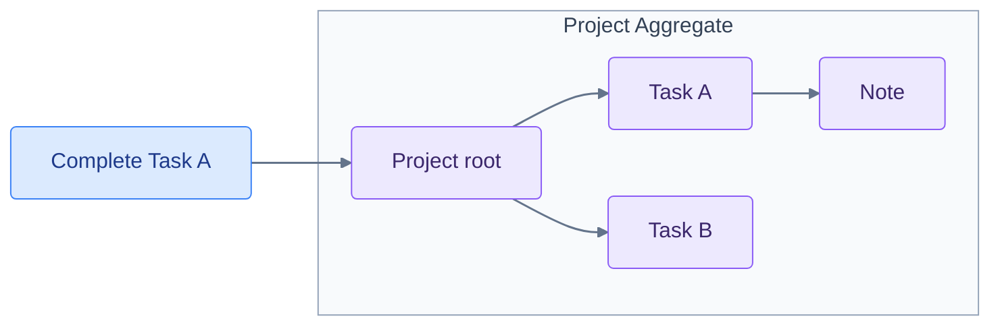

import { Tabs, TabItem } from '@astrojs/starlight/components';
import OverviewFigure from './_components/OverviewFigure.astro';

**Fluxzero 2.0 removes a fundamental constraint that has shaped every Fluxzero application until now.**

Before 2.0, Fluxzero used Aggregates to give domain state a clear, yet rigid structure. It was a powerful model, but it forced the domain into separate trees. Each tree had to serve four different concerns that did not necessarily share the same natural boundary. Whenever those boundaries diverged, the Aggregate model fell short.

1. **Relationships: what belongs together**
   Consider a project-management domain. A Task belongs to a Project. But what if that same Task also belongs to the Sprint in which it is planned? A tree can place the Task below only one root. The other relationship must cross the tree boundary or be duplicated.

2. **Consistency: what changes together**
   An Aggregate can change its root and Members atomically. But what if a Task moves from one Project to another? One business operation now affects two trees. Before 2.0, such a move required separate Aggregate commits, so it could not be stored atomically.

   Atomicity was only part of the problem. The Task's existing events belonged to the original Project stream. Its history could not move with it. Nested notes and attachments also had to be transferred, while their earlier changes remained part of the old Aggregate's history.

   <OverviewFigure name="aggregate-move" />

3. **Persistence: what is stored together**
   An event-sourced Aggregate gives its complete tree one shared history. But what if related state has different persistence needs? The business decisions made about a Task may need an event-sourced history. An externally reported progress status may change constantly while only its latest value matters. That status may be better stored as a document.

4. **Loading: what is loaded together**
   `@Member` and `loadEntity` made a Task directly addressable. But what if its Project contains thousands of other Tasks, notes and attachments? Loading that one Task still meant reconstructing the containing Project. Every Task change also passed through the same root. As the tree grew, that root became both a loading cost and a common gatekeeper for otherwise independent work.

   <OverviewFigure name="aggregate-load" />

**There was no Aggregate boundary that solved all four concerns.**

One option was to make the tree larger. Project, Sprint and Task could all be placed below a common root such as Workspace. That would bring their changes back inside one Aggregate, but it would also produce a god model. More state, history and traffic would accumulate behind the same root.

The other option was to split the tree into smaller Aggregates. That reduced loading costs, but lost atomic consistency across them. Moving a Task then required separate writes. All-or-nothing behavior needed custom coordination and compensation logic. Those writes and any rollback were still eventually consistent, so other processes could observe intermediate states.

**Once chosen, that boundary became increasingly difficult to change.**

Smaller Aggregates were difficult to evolve too. For example, if existing Projects later had to belong to different Organisations to support multiple tenants, their histories contained no Organisation ownership. Adding that boundary meant migrating the existing histories or making Organisation another, even larger Aggregate root.

A boundary chosen to solve one concern constrained the others. Once events had been recorded against that boundary, the choice was also encoded into the domain's history.

**Fluxzero 2.0 provides a way out by separating these four concerns.**

It does so by shifting the consistency boundary from the Aggregate being changed to the change itself. At first glance, the programming model remains familiar. Commands, applies, assertions and tests still work much as before. Yet its consequences for the domain model are fundamental.

**Before 2.0**



**Fluxzero 2.0**

<div style="background:rgba(0,0,0,0.02);border-radius:8px;padding:16px;margin:1.5rem 0">
<svg viewBox="0 0 600 220" role="img" aria-labelledby="independent-models-title" style="display:block;width:100%;max-width:600px;margin:0 auto;color:#64748b;font:16px var(--sl-font)">
  <title id="independent-models-title">Complete Task A addresses Task A directly. Note points to Task A, and Task A points to Project through dotted parent relationships.</title>
  <defs>
    <marker id="independent-models-arrow" viewBox="0 0 10 10" refX="9" refY="5" markerWidth="6" markerHeight="6" orient="auto-start-reverse">
      <path d="M 0 0 L 10 5 L 0 10 z" fill="currentColor" />
    </marker>
  </defs>
  <rect x="215" y="20" width="170" height="48" rx="4" fill="#dbeafe" stroke="#3b82f6" stroke-width="1" />
  <g fill="#ede9fe" stroke="#8b5cf6" stroke-width="1">
    <rect x="30" y="145" width="120" height="48" rx="4" />
    <rect x="240" y="145" width="120" height="48" rx="4" />
    <rect x="450" y="145" width="120" height="48" rx="4" />
  </g>
  <g fill="#3b276b" text-anchor="middle" dominant-baseline="middle">
    <text x="300" y="44" fill="#1e3a8a">Complete Task A</text>
    <text x="90" y="169">Note</text>
    <text x="300" y="169">Task A</text>
    <text x="510" y="169">Project</text>
  </g>
  <g fill="none" stroke="currentColor" stroke-width="1.5" marker-end="url(#independent-models-arrow)">
    <path d="M 300 68 V 143" />
    <path d="M 150 169 H 238" stroke-dasharray="3 5" />
    <path d="M 360 169 H 448" stroke-dasharray="3 5" />
  </g>
</svg>
</div>

The domain relationships have not changed. Before 2.0, completing Task A addressed the Project Aggregate, so its complete tree was the storage, loading and consistency boundary. In 2.0, the operation addresses Task A directly. Note, Task and Project remain connected, but no longer form one rigidly stored object tree. Children point to their parents through loose relationships.

When an operation needs more than one Model, it can include those Models in the same consistency boundary without merging their state or histories.

The following sections show those consequences one concern at a time, with links to the corresponding [deep dive](/docs/fluxzero-2-deep-dive).

## Independent state and history

In an Aggregate design, an embedded Task shares the Project's state and event history. With Models, Project, Task, Note and Attachment can each have their own persistence boundary. `@Parent` connects them without embedding their state.

<OverviewFigure name="streams" />

<Tabs syncKey="language">
<TabItem label="Java">

```java
@Model
record Project(@EntityId ProjectId projectId, ProjectDetails details) {}

@Model
@With
record Task(@EntityId TaskId taskId,
            @Parent(pathInParent = "tasks") ProjectId projectId,
            TaskDetails details, boolean completed) {}
```

</TabItem>
<TabItem label="Kotlin">

```kotlin
@Model
data class Project(@EntityId val projectId: ProjectId, val details: ProjectDetails)

@Model
data class Task(
    @EntityId val taskId: TaskId,
    @Parent(pathInParent = "tasks") val projectId: ProjectId,
    val details: TaskDetails,
    val completed: Boolean
)
```

</TabItem>
</Tabs>

A Task update can load and change that Task without reconstructing the Project or its other Tasks. Adding more Tasks, notes or attachments does not make them part of every Task load. Each Model also has its own history and erasure boundary. The examples use typed IDs (`ProjectId`, `TaskId`) and small value objects for details.

Consider a Project with **100,000 events**, while the Task you want to complete has only **10 events of its own**:

<OverviewFigure name="replay" />

<Tabs syncKey="language">
<TabItem label="Java">

```java
// Aggregate design: both lookups reconstruct the containing root.
Fluxzero.loadAggregate("launch", Project.class);
Fluxzero.loadEntity("task-a", Task.class);

// Model design: load this Task's own state.
Fluxzero.loadModel(taskId);
```

</TabItem>
<TabItem label="Kotlin">

```kotlin
// Aggregate design: both lookups reconstruct the containing root.
Fluxzero.loadAggregate("launch", Project::class.java)
Fluxzero.loadEntity("task-a", Task::class.java)

// Model design: load this Task's own state.
Fluxzero.loadModel(taskId)
```

</TabItem>
</Tabs>

The Aggregate calls refer to the earlier embedded design; the Model call uses the independent declarations above. Snapshots and caching reduce repeated work; independent Models also reduce the amount of unrelated state that a Task load needs to retain.

[Deep dive: load, cache and document costs](/docs/fluxzero-2-deep-dive#small-changes-large-persistence-boundaries) · [Deep dive: Model boundaries, identities and storage choices](/docs/fluxzero-2-deep-dive#model-the-lifecycle-then-choose-storage)

## Automatic command handling

A registered command with an applicable Model `@Apply` can be handled directly. Fluxzero resolves its target, runs validation and assertions, and commits the result. The forwarding handler that previously loaded an Aggregate and called `assertAndApply` is no longer needed for this command.

<Tabs syncKey="language">
<TabItem label="Java">

```java
record CompleteTask(TaskId taskId) {
    @Apply
    Task apply(Task task) {
        return task.withCompleted(true);
    }
}

Fluxzero.sendCommandAndWait(new CompleteTask(taskId));
```

</TabItem>
<TabItem label="Kotlin">

```kotlin
data class CompleteTask(val taskId: TaskId) {
    @Apply
    fun apply(task: Task) = task.copy(completed = true)
}

Fluxzero.sendCommandAndWait<Any?>(CompleteTask(taskId))
```

</TabItem>
</Tabs>

Existing handlers can also invoke the Model pipeline explicitly with `Fluxzero.assertAndApply(command)`.

[Deep dive: automatic handling, Spring discovery and command ownership](/docs/fluxzero-2-deep-dive#automatic-command-handling-and-existing-handlers)

## Injection of related Models

Handler parameters can select Models from message IDs and their relationships. This query carries only a Task ID; the Project parameter is resolved through the Task's parent relationship.

<Tabs syncKey="language">
<TabItem label="Java">

```java
record GetTask(TaskId taskId) implements Request<TaskSummary> {
    @HandleQuery
    TaskSummary handle(Task task, Project project) {
        return new TaskSummary(task.details().title(), project.details().name(), task.completed());
    }
}

record TaskSummary(String title, String projectName, boolean completed) {}
```

</TabItem>
<TabItem label="Kotlin">

```kotlin
data class GetTask(val taskId: TaskId) : Request<TaskSummary> {
    @HandleQuery
    fun handle(task: Task, project: Project) =
        TaskSummary(task.details.title, project.details.name, task.completed)
}

data class TaskSummary(val title: String, val projectName: String, val completed: Boolean)
```

</TabItem>
</Tabs>

The same resolution is available in assertions and applies. The handler does not need to load the Task first, extract its Project ID and then load the Project.

[Deep dive: Model injection and explicit associations](/docs/fluxzero-2-deep-dive#inject-models-from-message-properties)

## Moving Models between parents

A Task with a stable ID can move to another Project by changing its parent reference. Its own history remains attached to the Task, and its notes and attachments remain connected to the same Task ID. Reorganising the work becomes a change to a relationship, without removing and recreating the Task and its descendants under another root.

<OverviewFigure name="model-move" />

<Tabs syncKey="language">
<TabItem label="Java">

```java
record MoveTask(TaskId taskId, ProjectId destinationId) {
    @Apply
    Task apply(Task task) {
        return task.withProjectId(destinationId);
    }
}
```

</TabItem>
<TabItem label="Kotlin">

```kotlin
data class MoveTask(val taskId: TaskId, val destinationId: ProjectId) {
    @Apply
    fun apply(task: Task) = task.copy(projectId = destinationId)
}
```

</TabItem>
</Tabs>

For an embedded member, moving between Aggregates requires changing both roots and leaves earlier history under the original root. An independent Model retains its persistence boundary when its relationship changes.

[Deep dive: moves, destination rules and ancestor updates](/docs/fluxzero-2-deep-dive#move-a-task-by-changing-its-relationship)

## Atomic updates across Models

One Model operation can update several independent roots. It can also compose existing commands through `@InterceptApply`. In this example, all selected Tasks are completed in one atomic operation.

<OverviewFigure name="atomic" />

<Tabs syncKey="language">
<TabItem label="Java">

```java
record CompleteTasks(List<TaskId> taskIds) {
    @InterceptApply
    List<CompleteTask> expand() {
        return taskIds.stream().map(CompleteTask::new).toList();
    }
}
```

</TabItem>
<TabItem label="Kotlin">

```kotlin
data class CompleteTasks(val taskIds: List<TaskId>) {
    @InterceptApply
    fun expand(): List<CompleteTask> = taskIds.map(::CompleteTask)
}
```

</TabItem>
</Tabs>

The Tasks can belong to different Projects. Each command's assertions and applies run; if one is rejected, none of the staged changes are committed. A permanent shared Aggregate is not required for the atomic update.

[Deep dive: atomic changes, command composition and ordering](/docs/fluxzero-2-deep-dive#2-changing-several-models-atomically)

## Business rules across Model boundaries

Suppose a new rule needs both an Order and the Account placing it. They can retain their separate state and histories while the operation checks the Account and creates the Order consistently. The new rule does not require merging their storage boundaries.

An assertion can inspect related Models through a Graph. The inspected state participates in conflict checking even when the operation does not change it. Here, the Task collection is a dependency of the capacity check, so concurrent additions cannot both commit based on the same remaining slot.

<Tabs syncKey="language">
<TabItem label="Java">

```java
record AddTask(TaskId taskId, ProjectId projectId, TaskDetails details) {
    @AssertLegal
    void checkCapacity(Graph<Project> project) {
        if (project.childModels(Task.class).size() >= 5) {
            throw ProjectErrors.capacityReached;
        }
    }

    @Apply
    Task apply(Project project) {
        return new Task(taskId, project.projectId(), details, false);
    }
}
```

</TabItem>
<TabItem label="Kotlin">

```kotlin
data class AddTask(
    val taskId: TaskId, val projectId: ProjectId, val details: TaskDetails
) {
    @AssertLegal
    fun checkCapacity(project: Graph<Project>) {
        if (project.childModels(Task::class.java).size >= 5) {
            throw ProjectErrors.capacityReached
        }
    }

    @Apply
    fun apply(project: Project) = Task(taskId, project.projectId, details, false)
}
```

</TabItem>
</Tabs>

Read dependencies can also include unrelated Models, such as an Account whose spending limit is checked before an Order is created.

[Deep dive: read dependencies, conflict policies and retries](/docs/fluxzero-2-deep-dive#concurrent-decisions-and-the-commit-boundary)

## Historical Graphs

A Graph injected into a Model event handler is bound to that event's state. If a Task was completed and then reopened before the completion event is handled, this handler reads the completed revision. `previous()` selects the state before completion.

<OverviewFigure name="history" />

<Tabs syncKey="language">
<TabItem label="Java">

```java
@HandleEvent
void completed(CompleteTask event, Graph<Task> task) {
    Task after = task.get();
    Task before = task.previous().get();
    var projectAtThatTime = task.ancestorModel(Project.class);
}
```

</TabItem>
<TabItem label="Kotlin">

```kotlin
@HandleEvent
fun completed(event: CompleteTask, task: Graph<Task>) {
    val after = task.get()
    val before = task.previous()?.get()
    val projectAtThatTime = task.ancestorModel(Project::class.java)
}
```

</TabItem>
</Tabs>

Related event-sourced Models follow the same boundary. The handler can read the Project as it existed at completion, rather than combining the Task's old revision with the Project's latest state.

[Deep dive: event-time views, current reads and available history](/docs/fluxzero-2-deep-dive#4-the-state-of-that-event-or-the-state-of-now)

## Graph-change handlers

A handler can subscribe to published changes to a complete Graph. This includes changes to the root and its descendants, such as a Task update, an added note or a moved Task.

<Tabs syncKey="language">
<TabItem label="Java">

```java
@HandleEvent
void projectChanged(Graph<Project> project) {
    Graph<Project> before = project.previous();
    // Compare the views or refresh a connected UI.
}
```

</TabItem>
<TabItem label="Kotlin">

```kotlin
@HandleEvent
fun projectChanged(project: Graph<Project>) {
    val before = project.previous()
    // Compare the views or refresh a connected UI.
}
```

</TabItem>
</Tabs>

A consumer maintaining a Project view does not need a separate handler for each event type that can affect it. The supplied Graph and its previous view represent the transition.

[Deep dive: Graph-change handlers and before/after transitions](/docs/fluxzero-2-deep-dive#5-react-to-the-whole-graph-without-enumerating-its-events)

## Composed Graph responses

Keeping Models independent does not require clients to assemble every view themselves. A Project screen can receive its Tasks and notes together, even though each has its own state and lifecycle.

<OverviewFigure name="response" />

An endpoint can return `Graph<Project>` directly. Serialization combines the Project with its independently stored Tasks at their declared `pathInParent` paths.

<Tabs syncKey="language">
<TabItem label="Java">

```java
@HandleGet("/projects/{projectId}")
Graph<Project> getProject(@PathParam("projectId") String projectId) {
    return Fluxzero.loadGraph(new ProjectId(projectId));
}
```

</TabItem>
<TabItem label="Kotlin">

```kotlin
@HandleGet("/projects/{projectId}")
fun getProject(@PathParam("projectId") projectId: String): Graph<Project> =
    Fluxzero.loadGraph(ProjectId(projectId))
```

</TabItem>
</Tabs>

The HTTP response contains the composed JSON:

```json
{
  "projectId": "launch",
  "details": { "name": "Launch" },
  "tasks": [
    {
      "taskId": "task-a",
      "projectId": "launch",
      "details": { "title": "Ship 2.0" },
      "completed": true
    }
  ]
}
```

`selectPaths(...)` limits the included branches. The response does not require an embedded Task collection on Project or an application handler that maintains a separate projection for this endpoint.

[Deep dive: Graph responses, view selection and JSON contracts](/docs/fluxzero-2-deep-dive#serialize-the-graph-as-a-composed-response)

## Derived response fields

`@GraphProperty` adds fields during Graph serialization using related state. This method on Task includes the Project name in the response without storing a copy on Task:

<Tabs syncKey="language">
<TabItem label="Java">

```java
@GraphProperty
String projectName(Graph<Project> project) {
    Project parent = project.get();
    return parent == null ? null : parent.details().name();
}
```

</TabItem>
<TabItem label="Kotlin">

```kotlin
@GraphProperty
fun projectName(project: Graph<Project>): String? =
    project.get()?.details?.name
```

</TabItem>
</Tabs>

Each serialized Task includes `"projectName": "Launch"`. Renaming the Project is reflected in the next current view without rewriting the Tasks. Graph responses also support content filtering and composed OpenAPI schemas.

[Deep dive: derived fields](/docs/fluxzero-2-deep-dive#derived-values-without-duplicated-state) · [Content filtering](/docs/fluxzero-2-deep-dive#filter-graph-content-for-its-audience) · [OpenAPI](/docs/fluxzero-2-deep-dive#openapi-that-understands-the-composed-response)

## Materialized Graph search

`materializeGraph = true` maintains a searchable document containing the Project and its composed children. A query can match Task fields and return the containing Project Graph:

<Tabs syncKey="language">
<TabItem label="Java">

```java
@Model(materializeGraph = true)
record Project(@EntityId ProjectId projectId, ProjectDetails details) {}

List<Graph<Project>> projects = Fluxzero.searchGraph(Project.class)
        .match(true, "tasks/completed")
        .fetchAll();
```

</TabItem>
<TabItem label="Kotlin">

```kotlin
@Model(materializeGraph = true)
data class Project(@EntityId val projectId: ProjectId, val details: ProjectDetails)

val projects: List<Graph<Project>> = Fluxzero.searchGraph(Project::class.java)
    .match(true, "tasks/completed")
    .fetchAll()
```

</TabItem>
</Tabs>

Task changes update the materialized view automatically; moving a Task updates both affected Projects. This replaces application projection handlers that rebuild the view after each relevant event. Individual nodes retain their own schema revisions and upcasters inside the stored Graph.

[Deep dive: materialization, projection completion and schema evolution](/docs/fluxzero-2-deep-dive#automatically-materialize-the-complete-graph)

## Independent extensions

A new feature can add state around an existing Model without becoming part of every update to that Model. Notes, a temporary approval process or an integration's status can each have their own behavior and history.

A child Model declares its relationship to the parent. The parent needs no additional field or collection and does not need to know the child's class. For example, a device integration can own a lamp's reported status while another application owns the lamp and its desired state.

The same pattern connects independently managed notes to a Task:

<Tabs syncKey="language">
<TabItem label="Java">

```java
@Model
record InternalNote(@EntityId String noteId,
                    @Parent(pathInParent = "notes") TaskId taskId,
                    NoteDetails details) {}
```

</TabItem>
<TabItem label="Kotlin">

```kotlin
@Model
data class InternalNote(
    @EntityId val noteId: String,
    @Parent(pathInParent = "notes") val taskId: TaskId,
    val details: NoteDetails
)
```

</TabItem>
</Tabs>

[Deep dive: shared relationships across applications](/docs/fluxzero-2-deep-dive#6-share-relationships-without-sharing-every-applications-implementation)

## Multiple parents

A Model can have several parents. In the [Home example application](https://github.com/fluxzero-io/fluxzero-sample-home), one integration link connects a household Device and its Home Assistant connection:

<OverviewFigure name="parents" />

Deleting the integration removes its links while the household Devices and their histories remain. Relationship ownership can therefore differ from the shape of an application view.

[Deep dive: multiple parents, ownership and graph shape](/docs/fluxzero-2-deep-dive#more-than-one-hierarchy)

## Persistence and retention per Model

Different parts of the same domain can have different persistence needs. Task keeps its event history; an externally reported status may only need its latest value. The status can still belong to the Task Graph:

<OverviewFigure name="persistence" />

<Tabs syncKey="language">
<TabItem label="Java">

```java
@Model(persistence = ModelPersistence.DOCUMENT)
record TaskStatus(
        @EntityId(prefix = "task-status-") @Parent(pathInParent = "status") TaskId taskId,
        boolean online) {}
```

</TabItem>
<TabItem label="Kotlin">

```kotlin
@Model(persistence = [ModelPersistence.DOCUMENT])
data class TaskStatus(
    @EntityId(prefix = "task-status-") @Parent(pathInParent = "status") val taskId: TaskId,
    val online: Boolean
)
```

</TabItem>
</Tabs>

Loading Task does not load its status. Updating the status does not append to Task's history. Adding event sourcing to the status is a per-Model choice when its own history matters.

Independent history also gives you a smaller physical-erasure boundary. You can erase a completed approval process without erasing the Project and every Task beside it.

[Deep dive: per-Model persistence](/docs/fluxzero-2-deep-dive#different-persistence-for-different-parts) · [Physical deletion scope](/docs/fluxzero-2-deep-dive#delete-one-part-without-deleting-the-whole)

## Parent-owned schedules and deletion

A scheduled command can declare a parent Model. Deleting that Model triggers cancellation of its owned schedules, so each deletion flow does not need to enumerate and cancel them itself.

<Tabs syncKey="language">
<TabItem label="Java">

```java
record RemindTask(@Parent TaskId taskId, Instant expectedDeadline) {}

Fluxzero.scheduleCommand(new RemindTask(taskId, deadline),
        new ScheduleId("reminder", taskId), deadline);
```

</TabItem>
<TabItem label="Kotlin">

```kotlin
data class RemindTask(@Parent val taskId: TaskId, val expectedDeadline: Instant)

Fluxzero.scheduleCommand(RemindTask(taskId, deadline),
    ScheduleId("reminder", taskId), deadline)
```

</TabItem>
</Tabs>

Parent ownership also controls cascading deletion of child Models. Children can be configured to survive parent deletion. Logical deletion retains event-sourced history; physical erasure uses an explicit plan for the selected Models.

[Deep dive: parent-owned schedules](/docs/fluxzero-2-deep-dive#7-delayed-work-can-follow-its-owners-lifetime) · [Deletion and retained history](/docs/fluxzero-2-deep-dive#9-deleting-models-and-retaining-the-right-history)

## Testing with TestFixture

Models use the existing given/when/then fixture API. This test creates a Project and Task, completes the Task and verifies the query response:

<Tabs syncKey="language">
<TabItem label="Java">

```java
TestFixture.create()
        .givenCommands(new CreateProject(projectId, new ProjectDetails("Launch")),
                       new AddTask(taskId, projectId, new TaskDetails("Ship 2.0")),
                       new CompleteTask(taskId))
        .whenQuery(new GetTask(taskId))
        .expectResult(new TaskSummary("Ship 2.0", "Launch", true))
        .expectNoErrors();
```

</TabItem>
<TabItem label="Kotlin">

```kotlin
TestFixture.create()
    .givenCommands(CreateProject(projectId, ProjectDetails("Launch")),
                   AddTask(taskId, projectId, TaskDetails("Ship 2.0")),
                   CompleteTask(taskId))
    .whenQuery(GetTask(taskId))
    .expectResult(TaskSummary("Ship 2.0", "Launch", true))
    .expectNoErrors()
```

</TabItem>
</Tabs>

The fixture also supports reconstruction from Model events, schema evolution and migration scenarios.

[Deep dive: testing the application and its history](/docs/fluxzero-2-deep-dive#test-the-application-including-its-history)

## Upgrading from 1.x

Existing Aggregate applications can upgrade the SDK without immediately migrating their stored domain state. Models can be introduced for new state or through a deliberate migration of existing Aggregates. The [upgrade and migration walkthrough](/docs/fluxzero-2-deep-dive#upgrading-from-1x) covers both paths.

The [Home and Ticketing examples](/docs/building/example-apps) show these features in complete applications. The [deep dive](/docs/fluxzero-2-deep-dive) documents their configuration and behavioral contracts.
