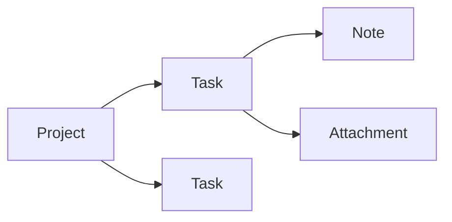
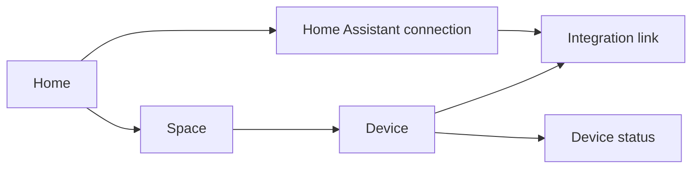

import { Tabs, TabItem } from '@astrojs/starlight/components';

A Task starts small. Then it gets comments, reminders, attachments and a history of its own. Moving it to another Project should be a change in your application—not a project to redesign its persistence.

Fluxzero 2.0 gives those objects **independent Models**, connects them through **Graphs**, and lets one business operation change them together. You keep the familiar commands, events, `@Apply`, `@AssertLegal` and tests. You gain much more freedom over how your domain grows.

Here's what that looks like in code.

## Give each object its own lifecycle

Project owns the project details. Task owns the task details. A parent reference connects them, while each keeps its own state and history.



<Tabs syncKey="language">
<TabItem label="Java">

```java
@Model
record Project(@EntityId ProjectId projectId, ProjectDetails details) {}

@Model
@With
record Task(@EntityId TaskId taskId,
            @Parent(pathInParent = "tasks") ProjectId projectId,
            TaskDetails details, boolean completed) {}
```

</TabItem>
<TabItem label="Kotlin">

```kotlin
@Model
data class Project(@EntityId val projectId: ProjectId, val details: ProjectDetails)

@Model
data class Task(
    @EntityId val taskId: TaskId,
    @Parent(pathInParent = "tasks") val projectId: ProjectId,
    val details: TaskDetails,
    val completed: Boolean
)
```

</TabItem>
</Tabs>

Project has no embedded Task list to maintain. New children can join the Graph without adding fields to Project. These examples use typed IDs (`ProjectId`, `TaskId`) and small value objects for details.

[Deep dive: Model boundaries, identities and storage choices →](/docs/fluxzero-2#model-the-lifecycle-then-choose-storage)

## Let commands do the work

Write the change on the command. Fluxzero supplies the Task, runs its business rules and commits the result. Once registered, this command needs no forwarding `@HandleCommand` method.

<Tabs syncKey="language">
<TabItem label="Java">

```java
record CompleteTask(TaskId taskId) {
    @Apply
    Task apply(Task task) {
        return task.withCompleted(true);
    }
}

Fluxzero.sendCommandAndWait(new CompleteTask(taskId));
```

</TabItem>
<TabItem label="Kotlin">

```kotlin
data class CompleteTask(val taskId: TaskId) {
    @Apply
    fun apply(task: Task) = task.copy(completed = true)
}

Fluxzero.sendCommandAndWait<Any?>(CompleteTask(taskId))
```

</TabItem>
</Tabs>

Java uses Lombok withers; Kotlin uses `copy`. Both describe the same state change.

[Deep dive: automatic handling, Spring discovery and command ownership →](/docs/fluxzero-2#automatic-command-handling-and-existing-handlers)

## Ask for the context you need

A query carries a Task ID. Its handler can ask for both the Task and its Project: Fluxzero follows the parent relationship for you.

<Tabs syncKey="language">
<TabItem label="Java">

```java
record GetTask(TaskId taskId) implements Request<TaskSummary> {
    @HandleQuery
    TaskSummary handle(Task task, Project project) {
        return new TaskSummary(task.details().title(), project.details().name(), task.completed());
    }
}

record TaskSummary(String title, String projectName, boolean completed) {}
```

</TabItem>
<TabItem label="Kotlin">

```kotlin
data class GetTask(val taskId: TaskId) : Request<TaskSummary> {
    @HandleQuery
    fun handle(task: Task, project: Project) =
        TaskSummary(task.details.title, project.details.name, task.completed)
}

data class TaskSummary(val title: String, val projectName: String, val completed: Boolean)
```

</TabItem>
</Tabs>

The same injection works in assertions and applies. Business behavior can use related state without a chain of repository calls.

[Deep dive: Model injection and explicit associations →](/docs/fluxzero-2#inject-models-from-message-properties)

## Move a Task and keep its story

Moving a Task changes its parent reference. The Task keeps its ID, history, notes and attachments.

<Tabs syncKey="language">
<TabItem label="Java">

```java
record MoveTask(TaskId taskId, ProjectId destinationId) {
    @Apply
    Task apply(Task task) {
        return task.withProjectId(destinationId);
    }
}
```

</TabItem>
<TabItem label="Kotlin">

```kotlin
data class MoveTask(val taskId: TaskId, val destinationId: ProjectId) {
    @Apply
    fun apply(task: Task) = task.copy(projectId = destinationId)
}
```

</TabItem>
</Tabs>

There is no removal-and-copy operation across two stored object trees. Changing the relationship changes where the Task appears.

[Deep dive: moves, destination rules and ancestor updates →](/docs/fluxzero-2#move-a-task-by-changing-its-relationship)

## Change several Models in one operation

Compose existing commands into one action. Completing three Tasks either succeeds together or leaves all three unchanged.

<Tabs syncKey="language">
<TabItem label="Java">

```java
record CompleteTasks(List<TaskId> taskIds) {
    @InterceptApply
    List<CompleteTask> expand() {
        return taskIds.stream().map(CompleteTask::new).toList();
    }
}
```

</TabItem>
<TabItem label="Kotlin">

```kotlin
data class CompleteTasks(val taskIds: List<TaskId>) {
    @InterceptApply
    fun expand(): List<CompleteTask> = taskIds.map(::CompleteTask)
}
```

</TabItem>
</Tabs>

Each Task's rules still run. The Models can belong to different Projects: one operation supplies the atomic commit boundary.

[Deep dive: atomic changes, command composition and ordering →](/docs/fluxzero-2#2-changing-several-models-atomically)

## Protect rules across the Graph

“Each Project can have at most five Tasks” becomes a rule over the Project's Graph. The SDK protects the collection read when committing a new Task, so concurrent additions cannot quietly overfill it.

<Tabs syncKey="language">
<TabItem label="Java">

```java
record AddTask(TaskId taskId, ProjectId projectId, TaskDetails details) {
    @AssertLegal
    void checkCapacity(Graph<Project> project) {
        if (project.childModels(Task.class).size() >= 5) {
            throw ProjectErrors.capacityReached;
        }
    }

    @Apply
    Task apply(Project project) {
        return new Task(taskId, project.projectId(), details, false);
    }
}
```

</TabItem>
<TabItem label="Kotlin">

```kotlin
data class AddTask(
    val taskId: TaskId, val projectId: ProjectId, val details: TaskDetails
) {
    @AssertLegal
    fun checkCapacity(project: Graph<Project>) {
        if (project.childModels(Task::class.java).size >= 5) {
            throw ProjectErrors.capacityReached
        }
    }

    @Apply
    fun apply(project: Project) = Task(taskId, project.projectId, details, false)
}
```

</TabItem>
</Tabs>

A rule can also read an unrelated Model—for example, an Account's spending limit before creating an Order. The relevant reads and writes belong to the same decision.

[Deep dive: read dependencies, conflict policies and retries →](/docs/fluxzero-2#concurrent-decisions-and-the-commit-boundary)

## See the Graph as it was

A delayed event handler can still see the state of its event. If a Task was completed and then reopened, the completion handler sees the completed Task. `previous()` takes it to the state just before completion.

<Tabs syncKey="language">
<TabItem label="Java">

```java
@HandleEvent
void completed(CompleteTask event, Graph<Task> task) {
    Task after = task.get();
    Task before = task.previous().get();
    var projectAtThatTime = task.ancestorModel(Project.class);
}
```

</TabItem>
<TabItem label="Kotlin">

```kotlin
@HandleEvent
fun completed(event: CompleteTask, task: Graph<Task>) {
    val after = task.get()
    val before = task.previous()?.get()
    val projectAtThatTime = task.ancestorModel(Project::class.java)
}
```

</TabItem>
</Tabs>

Related event-sourced Models follow the same historical boundary. You can navigate the context of the change as well as the changed object.

[Deep dive: event-time views, current reads and available history →](/docs/fluxzero-2#4-the-state-of-that-event-or-the-state-of-now)

## React to the whole Project

A Project screen changes when a Task changes, a note appears or a Task moves. One Graph handler can receive those published transitions without listing every event type.

<Tabs syncKey="language">
<TabItem label="Java">

```java
@HandleEvent
void projectChanged(Graph<Project> project) {
    Graph<Project> before = project.previous();
    // Compare the views or refresh a connected UI.
}
```

</TabItem>
<TabItem label="Kotlin">

```kotlin
@HandleEvent
fun projectChanged(project: Graph<Project>) {
    val before = project.previous()
    // Compare the views or refresh a connected UI.
}
```

</TabItem>
</Tabs>

Your subscription follows the Graph. A new kind of child can participate without another event handler for the Project view.

[Deep dive: Graph-change handlers and before/after transitions →](/docs/fluxzero-2#5-react-to-the-whole-graph-without-enumerating-its-events)

## Return a complete view from an endpoint

Keep Project and Task separate in storage, then return them together. A Graph response composes the root with its children at their declared paths.

<Tabs syncKey="language">
<TabItem label="Java">

```java
@HandleGet("/projects/{projectId}")
Graph<Project> getProject(@PathParam("projectId") String projectId) {
    return Fluxzero.loadGraph(new ProjectId(projectId));
}
```

</TabItem>
<TabItem label="Kotlin">

```kotlin
@HandleGet("/projects/{projectId}")
fun getProject(@PathParam("projectId") projectId: String): Graph<Project> =
    Fluxzero.loadGraph(ProjectId(projectId))
```

</TabItem>
</Tabs>

The HTTP response is ordinary JSON:

```json
{
  "projectId": "launch",
  "details": { "name": "Launch" },
  "tasks": [
    {
      "taskId": "ship",
      "projectId": "launch",
      "details": { "title": "Ship 2.0" },
      "completed": true
    }
  ]
}
```

Select only the branches a screen needs with `selectPaths(...)`. Graphs also support derived fields, content filtering and composed OpenAPI schemas.

[Deep dive: Graph responses, view selection and JSON contracts →](/docs/fluxzero-2#serialize-the-graph-as-a-composed-response)

## Derive response fields from the Graph

Add the Project name to each Task's response without copying it into every stored Task. A method on Task can derive it from its Graph context:

<Tabs syncKey="language">
<TabItem label="Java">

```java
@GraphProperty
String projectName(Graph<Project> project) {
    Project parent = project.get();
    return parent == null ? null : parent.details().name();
}
```

</TabItem>
<TabItem label="Kotlin">

```kotlin
@GraphProperty
fun projectName(project: Graph<Project>): String? =
    project.get()?.details?.name
```

</TabItem>
</Tabs>

Each Task response now includes `"projectName": "Launch"`. Renaming the Project changes the next current view without a command to rewrite all its Tasks. Content filters can similarly shape a Graph for its audience, and OpenAPI can describe the composed response.

[Deep dive: derived fields →](/docs/fluxzero-2#derived-values-without-duplicated-state) · [Content filtering →](/docs/fluxzero-2#filter-graph-content-for-its-audience) · [OpenAPI →](/docs/fluxzero-2#openapi-that-understands-the-composed-response)

## Make the whole Graph searchable

For a frequently used Project view, let Fluxzero maintain its search document. Enable materialization on Project, then search across its Tasks.

<Tabs syncKey="language">
<TabItem label="Java">

```java
@Model(materializeGraph = true)
record Project(@EntityId ProjectId projectId, ProjectDetails details) {}

List<Graph<Project>> projects = Fluxzero.searchGraph(Project.class)
        .match(true, "tasks/completed")
        .fetchAll();
```

</TabItem>
<TabItem label="Kotlin">

```kotlin
@Model(materializeGraph = true)
data class Project(@EntityId val projectId: ProjectId, val details: ProjectDetails)

val projects: List<Graph<Project>> = Fluxzero.searchGraph(Project::class.java)
    .match(true, "tasks/completed")
    .fetchAll()
```

</TabItem>
</Tabs>

This Project variant produces a searchable composed view. Task changes update it automatically; moving a Task updates both affected Projects. Each Model can evolve its schema independently, including inside the stored Graph.

[Deep dive: materialization, projection completion and schema evolution →](/docs/fluxzero-2#automatically-materialize-the-complete-graph)

## Extend an application without expanding its root

A device integration can report the lamp's actual state independently from the application requesting that it turn on. Add a status Model connected to the lamp; the lamp's Model needs no new field or collection. Different applications can own the two sides.

The same approach lets a Task gain independently managed internal notes:

<Tabs syncKey="language">
<TabItem label="Java">

```java
@Model
record InternalNote(@EntityId String noteId,
                    @Parent(pathInParent = "notes") TaskId taskId,
                    NoteDetails details) {}
```

</TabItem>
<TabItem label="Kotlin">

```kotlin
@Model
data class InternalNote(
    @EntityId val noteId: String,
    @Parent(pathInParent = "notes") val taskId: TaskId,
    val details: NoteDetails
)
```

</TabItem>
</Tabs>

[Deep dive: shared relationships across applications →](/docs/fluxzero-2#6-share-relationships-without-sharing-every-applications-implementation)

## View the same Model from different sides

A Model can have several parents. In the [Home example application](https://github.com/fluxzero-io/fluxzero-sample-home), one integration link connects a household Device and its Home Assistant connection:



Open a room to see its devices, or open an integration to see everything it connects. These views share the same Models. Removing the integration removes its links while the household devices remain.

[Deep dive: multiple parents, ownership and graph shape →](/docs/fluxzero-2#more-than-one-hierarchy)

## Let delayed work follow its owner

A reminder belongs to its Task. Mark that relationship on the scheduled command; deleting the Task triggers cancellation of its owned reminders.

<Tabs syncKey="language">
<TabItem label="Java">

```java
record RemindTask(@Parent TaskId taskId, Instant expectedDeadline) {}

Fluxzero.scheduleCommand(new RemindTask(taskId, deadline),
        new ScheduleId("reminder", taskId), deadline);
```

</TabItem>
<TabItem label="Kotlin">

```kotlin
data class RemindTask(@Parent val taskId: TaskId, val expectedDeadline: Instant)

Fluxzero.scheduleCommand(RemindTask(taskId, deadline),
    ScheduleId("reminder", taskId), deadline)
```

</TabItem>
</Tabs>

Ownership also guides deletion of child Models. You can retain selected children, keep event history after logical deletion, or inspect a plan when that history must be physically erased.

[Deep dive: parent-owned schedules →](/docs/fluxzero-2#7-delayed-work-can-follow-its-owners-lifetime) · [Deletion and retained history →](/docs/fluxzero-2#9-deleting-models-and-retaining-the-right-history)

## Keep your application tests

The familiar given/when/then flow exercises the new model. Create a Project and Task, complete the Task, and ask the application what the user should see.

<Tabs syncKey="language">
<TabItem label="Java">

```java
TestFixture.create()
        .givenCommands(new CreateProject(projectId, new ProjectDetails("Launch")),
                       new AddTask(taskId, projectId, new TaskDetails("Ship 2.0")),
                       new CompleteTask(taskId))
        .whenQuery(new GetTask(taskId))
        .expectResult(new TaskSummary("Ship 2.0", "Launch", true))
        .expectNoErrors();
```

</TabItem>
<TabItem label="Kotlin">

```kotlin
TestFixture.create()
    .givenCommands(CreateProject(projectId, ProjectDetails("Launch")),
                   AddTask(taskId, projectId, TaskDetails("Ship 2.0")),
                   CompleteTask(taskId))
    .whenQuery(GetTask(taskId))
    .expectResult(TaskSummary("Ship 2.0", "Launch", true))
    .expectNoErrors()
```

</TabItem>
</Tabs>

The fixture also supports reconstruction from Model events, schema evolution and migration scenarios.

[Deep dive: testing the application and its history →](/docs/fluxzero-2#test-the-application-including-its-history)

## Bring it into your application

Use Models for new independent domain state. Existing Aggregate applications can upgrade the SDK and migrate their domain incrementally. The [upgrade and migration walkthrough](/docs/fluxzero-2#upgrading-from-1x) covers the concrete steps.

For a complete running application, explore [Home or Ticketing](/docs/building/example-apps). For the rules behind any example above, continue with the [deep dive](/docs/fluxzero-2).
