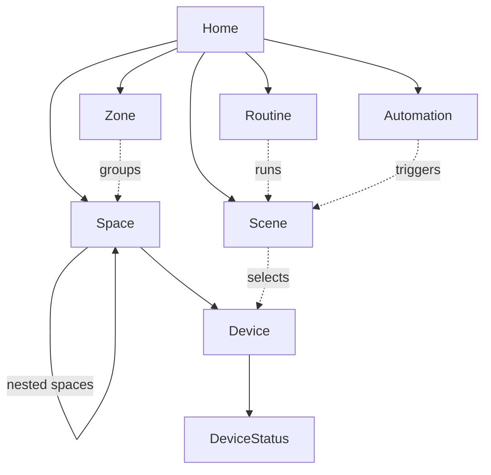
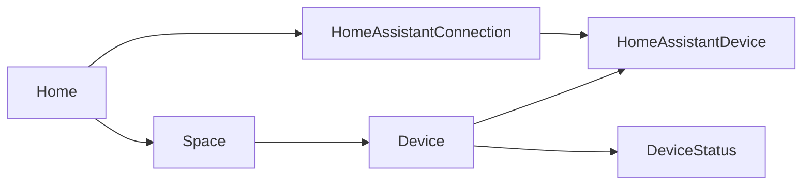
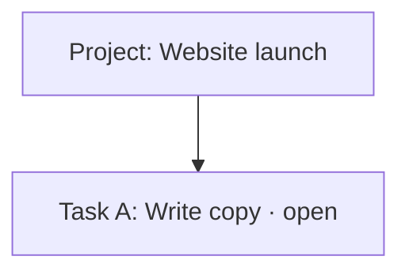
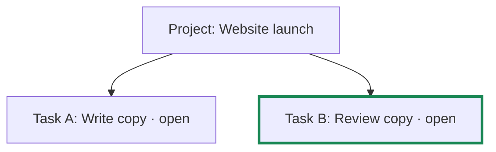
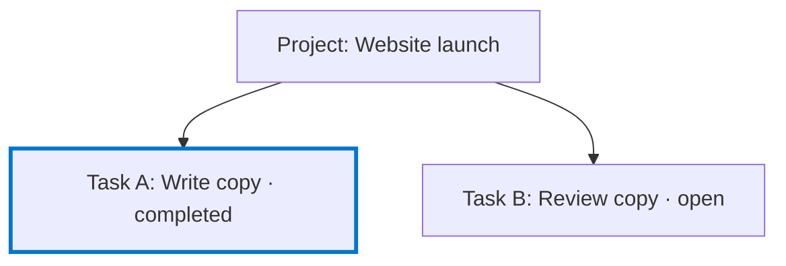
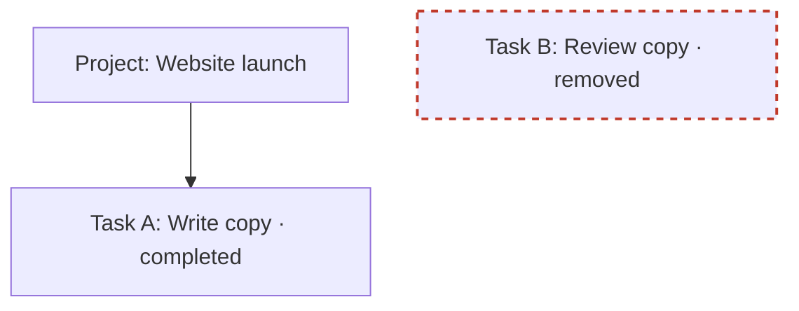

import { Aside, Tabs, TabItem } from '@astrojs/starlight/components';

Fluxzero 2.0 introduces a new foundation for persistent domain models, built around
**independent Models connected through Graphs**.

The aggregate has long brought related state, behavior and history together. But it also made one root
responsible for things that did not necessarily belong to the same lifecycle. Identity, persistence,
history, caching, concurrency and deletion became tied to the same boundary. As the application grew,
that boundary became harder to reshape.

Consider a project-management application. A project starts with a name and a few tasks. Then tasks get
comments, checklists and attachments.
Everything still lives under the project root. Updating one task goes through the project. Unrelated tasks
share its history and consistency boundary. Moving a task to another project means coordinating changes
to two aggregates; the task's earlier history remains part of the old project. Detaching it so it can live
on its own is no longer just a change in the domain—it becomes a change in how you persist it.

Fluxzero 2.0 separates those concerns—and brings the pieces back together where the application needs them:

- **Models own their state and lifecycle.** An object with its own lifecycle no longer needs to live inside
  somebody else's persistence root.
- **Relationships connect without embedding.** Move a task with its comments, rearrange a folder tree,
  or detach an object without copying its state between aggregate streams.
- **Graphs restore context without restoring coupling.** Bring related Models together for a business
  rule, a response or a historical view, without making them one stored object.
- **Atomic operations cross Model boundaries.** Separate persistence boundaries do not force one business action into
  several independently committed writes.

These are the parts of one design: **the objects that belong together do not all have to be stored together,
and the objects that change together do not all have to share a lifecycle.** Persistence choices, relationships,
conflict checking and composed views work together to make that distinction practical.

Commands, events, validation and `TestFixture` remain familiar. The new foundation works in Java and Kotlin,
alongside the existing Aggregate APIs. You can keep what already works and choose independent Models where
the domain needs that freedom.

<Aside type="note" title="How to read this chapter">

Coming from 1.x? Start with the comparison below. The examples then build up from independent Models to
Graph rules, queries and complete application views. [Upgrading from 1.x](#upgrading-from-1x) covers the
platform requirements and a three-step migration; the [API overview](#the-model-and-graph-api-at-a-glance)
collects the settings in one place. Use the page's contents to jump between sections.

</Aside>

## Explore complete applications

The public [Home and Ticketing examples](/docs/building/example-apps) show these ideas in working products.
[Home](https://github.com/fluxzero-io/fluxzero-sample-home) connects rooms, devices, scenes, and routines;
[Ticketing](https://github.com/fluxzero-io/fluxzero-sample-ticketing) connects venues, performances, reservations,
payments, and tickets. Both include a UI and application tests. Run one with your agent, try a flow, and then follow
its Models and Graphs through the code. The example page explains where to start and suggests features to extend.

## Coming from Fluxzero 1.x

The biggest change is the move from **`@Aggregate` as the persistence root to `@Model` as an independent
domain object**. To see what that means, start with the project-management example from the introduction.

In 1.x, you might store a Project and its Tasks together. Here is just their state, leaving out handlers
and imports:

<Tabs syncKey="language">
<TabItem label="Java">

```java
@Aggregate
record Project(@EntityId ProjectId projectId,
               ProjectDetails details,
               @Member List<Task> tasks) {}

record Task(@EntityId TaskId taskId, TaskDetails details, boolean completed) {}

record ProjectDetails(String name) {}
record TaskDetails(String title) {}
```

</TabItem>
<TabItem label="Kotlin">

```kotlin
@Aggregate
data class Project(
    @EntityId val projectId: ProjectId,
    val details: ProjectDetails,
    @Member val tasks: List<Task>
)

data class Task(@EntityId val taskId: TaskId, val details: TaskDetails, val completed: Boolean)

data class ProjectDetails(val name: String)
data class TaskDetails(val title: String)
```

</TabItem>
</Tabs>

Both versions use typed IDs: `ProjectId` extends `Id<Project>` and `TaskId` extends `Id<Task>`.
Their small definitions appear in the [fuller example below](#model-the-lifecycle-then-choose-storage).

Project is the aggregate root. Task has an identity inside it, but its state and changes belong to the
Project's stored state and event history. Updating a Task means updating that Project aggregate. That is
a useful arrangement when the whole collection genuinely belongs to one lifecycle.

In 2.0, you can give both objects their own persistence boundary:

<Tabs syncKey="language">
<TabItem label="Java">

```java
@Model
record Project(@EntityId ProjectId projectId, ProjectDetails details) {}

@Model
record Task(@EntityId TaskId taskId,
            @Parent(pathInParent = "tasks") ProjectId projectId,
            TaskDetails details,
            boolean completed) {}
```

</TabItem>
<TabItem label="Kotlin">

```kotlin
@Model
data class Project(@EntityId val projectId: ProjectId, val details: ProjectDetails)

@Model
data class Task(
    @EntityId val taskId: TaskId,
    @Parent(pathInParent = "tasks") val projectId: ProjectId,
    val details: TaskDetails,
    val completed: Boolean
)
```

</TabItem>
</Tabs>

These are alternative declarations for the same example domain, reusing the details value objects above.
The important difference is not just the annotation on Project: **Task is now a Model too**. Project no longer
stores a Task collection. Each Task owns its state and history, and can be loaded or changed independently.
Both use the default event-sourced persistence here; other persistence choices come later.

The relationship has not disappeared. `@Parent` on `Task.projectId` says which Project the Task belongs to.
The SDK infers the parent type from `ProjectId`; it does not need to be repeated in the annotation.
Its `pathInParent = "tasks"` gives that relationship a place in a combined view. Moving a Task can now mean
changing this reference, rather than removing embedded state from one aggregate and inserting it into another.

That combined view is a **Graph**. A `Project` value contains only the Project's own fields; a `Graph<Project>`
lets you read those fields and navigate its related Tasks. It brings independently stored objects together
when you need their context, without making them one persistence root again. Later sections show how to use
that view for rules, queries and responses.

Commands, queries, events, `@Apply`, `@AssertLegal` and `TestFixture` remain familiar. What changes is the
state they work with: an operation can address one Model or change several Models atomically, without
requiring those objects to live inside the same aggregate. Separately sent commands are still separate operations.

You do not have to replace existing Aggregates to upgrade. `@Aggregate` remains supported, and `@Member`
remains useful for state that intentionally shares its owner's lifecycle. The new approach is not a rename
of `@Aggregate` or an automatic conversion of stored data. The [upgrade checklist](#upgrading-from-1x) covers
Java 25 and compatibility; [migrating existing data](#migrate-an-aggregate-deliberatelynot-by-renaming-its-annotation)
is a separate choice. First, let's look at where independent Models make a difference.

## Why move beyond one growing aggregate?

An aggregate works well when its contents genuinely change and live together. The difficulty is making
that same boundary serve every purpose: identity, writes, history, read views and eventual deletion.

### Small changes, large persistence boundaries

Extend the project-management example with comments on tasks. With embedded members, the Project owns the
state and history of the entire tree:

```text
Project aggregate                    One persistence and lifecycle boundary
├── project details
├── Task A (@Member)
│   ├── Comment 1 (@Member)
│   └── Comment 2 (@Member)
└── Task B (@Member)
```

Project-wide rules are convenient, but every Task change belongs to the same root and its growing history.
A feature that needs only Task A still works through Project. In 2.0, those boundaries can separate:

```text
Project                             Each node is a Model with its own state/history
├── tasks → Task A
│           ├── comments → Comment 1
│           └── comments → Comment 2
└── tasks → Task B
```

Update Task A without loading Project, Task B or the comments. Inspect them together only when a rule or
view needs them. Unrelated Task updates need not contend on Project; a project-wide capacity rule still
creates the shared dependency it genuinely requires.

### Short-lived work, long-lived history

A Project may live for years while approvals and import jobs come and go. Embedding those processes
accumulates their events in the Project's stream long after they finish. Snapshots shorten reconstruction;
they do not give a process its own history or deletion boundary.

An independent process Model can instead have a small stream and its own retention lifecycle. Its parent
relationship keeps it discoverable without making the Project carry every former process forever.

### Different persistence for different parts

You may need a Task's complete decision history, but only the latest presence information showing who
is working on it. Embedding both in one event-sourced aggregate ties them to the same reconstruction model.
Separate Models let the Graph combine different persistence choices:

```text
Project                         EVENT_SOURCED — project history
└── tasks → Task                EVENT_SOURCED — task history
             └── TaskPresence   DOCUMENT      — current presence only
```

Task keeps the default `@Model`; its presence companion uses `@Model(persistence = ModelPersistence.DOCUMENT)`.
Task can also add a searchable document with `persistence = {EVENT_SOURCED, DOCUMENT}`. The choice belongs
to each Model. DOCUMENT-only nodes retain current state, not the history needed for `previous()`.

### Delete one part without deleting the whole

Removing an embedded child from current aggregate state leaves its earlier values in the root's history.
Erasing just that child is difficult when the rest of the aggregate depends on the same stored events.

Independent Models give Task A and its owned comments their own deletion boundary, while Project and
Task B remain. **Logical deletion** removes the branch from current state while retaining event-sourced
history. **Physical erasure** explicitly removes the selected Models' stored state and history.

The [lifecycle operations below](#9-deleting-models-and-retaining-the-right-history) distinguish those steps,
including planning erasure after a logical cascade and the limits around shared or external copies.

### Move the relationship, not the stored object tree

Suppose Task A needs to move to another project. With independent Models, change its parent reference:

```text
Before                              After

Project 1                           Project 1
├── Task A                          └── Task B
│   ├── Comment 1
│   └── Comment 2                    Project 2
└── Task B                          └── Task A
                                        ├── Comment 1
Project 2                               └── Comment 2
```

Task A keeps its identity and history; its comments follow because they still belong to Task A. Clearing
an optional parent instead detaches the Task. Neither operation copies a subtree between streams.
These examples use stable IDs: a parent-scoped identity deliberately changes when its parent changes.

### Atomic changes across independent roots

Small aggregates introduce the opposite pressure. In an ordering application, an Order and its Inventory
reservation may need to commit together: **both changes or neither**. Inventory does not belong inside
every Order, but separate writes leave the application coordinating partial completion and compensation.

Models separate the atomic operation from the permanent persistence boundary. Order and Inventory can
remain independent roots, without even a parent relationship, while one Model operation changes both.
The [ordering example below](#2-changing-several-models-atomically) shows the complete operation. Its atomicity
covers the Model changes; payment-provider calls remain a separate workflow.

### More than one hierarchy

An embedded tree gives an object one containment path, but the domain often has overlapping relationships.
In an ordering application, for example, a line item belongs to an order and refers to a product. Navigating
from either side should not require duplicating the line or making the product own its lifetime.

Graphs are not limited to trees. A Model can have several parents with different meanings:

```text
Order ────── lines ──────► LineItem ◄────── reference ────── Product
  owns its order lines                     does not own order-line lifetime
```

Relationships, ownership and presentation are separate decisions. A plain typed ID is a reference.
`@Parent` adds a navigable relationship and, by default, cascade deletion. Set
`deleteOnParentDeletion = false` for a non-owning relationship. Add `pathInParent` when the child belongs
at a named path in a composed Graph document. Recursive relationships such as Folder → Folder are supported;
cycles between actual Model identities are rejected.

### Extend the domain without expanding the root

Consider a device-management application that gains warranties, maintenance records and integrations.
Embedding every addition expands Device's responsibilities even when its original behavior has not changed.
Independent Models can add those capabilities through `@Parent`, with their own commands and lifecycle:

```text
Device                              The existing Model remains focused
├── status → DeviceStatus           Observations
├── warranty → Warranty             Coverage and expiry
└── maintenance → MaintenanceRecord Service history
```

Device needs no collection fields or rewritten historical events just to accommodate these new relationships.
A service screen can bring them together, while existing commands request only the state they need.
**Adding a capability no longer has to expand the persistence root used by every existing capability.**

These are illustrative extensions with independent lifecycles; ordinary Device fields should stay on Device.
Choose ownership deliberately and use scoped reads when consumers do not share every child type.

### Read views should not dictate write boundaries

A project screen needs tasks and comments together; an operations screen groups tasks across Projects.
Neither screen should dictate the persistence boundary. Graphs let the application navigate, serialize
or search related state without maintaining another domain hierarchy just to assemble a response.

For repeated whole-view searches, materialize a Graph. For selective access, navigate only the needed
relationships. Even a stored combined view keeps each node's schema identity, so its parts can evolve
independently. The [application-wide capabilities](#making-graphs-work-across-the-whole-application)
show how these views are filtered, documented, maintained and migrated.

### Different boundaries for different jobs

That is the central change in 2.0: **what belongs together, what changes together and what is stored together
can be different decisions.** Independent lifecycles, relationship changes, Graph reads and multi-Model commits
make that separation usable within the same application.

| Question | Aggregate-centered approach | Model/Graph approach in 2.0 |
| --- | --- | --- |
| Where does a task's history live? | With the aggregate when the task is an embedded member | In the task's own Model stream |
| Can related parts use different persistence? | Embedded state participates in its root's persistence and reconstruction | Event-sourced and DOCUMENT-only Models can coexist in one Graph |
| How do I update one task? | Through its owning aggregate | Address that task directly |
| How do I logically delete one branch? | Remove embedded state through the aggregate; its history remains in the root | Delete the selected Model, cascading through its owning relationships |
| How do I permanently erase that branch? | Its historical data is intertwined with the aggregate's history | Plan and erase the selected Models without erasing unrelated Model histories |
| How do I move a task to another project? | Coordinate removal and insertion across roots; earlier history belongs to the old root | Change its parent relationship; a stable-ID task retains its own history |
| How do I detach a task? | Extract embedded state into a separate persistence boundary | Clear an optional parent relationship; the Model already has its own boundary |
| How do I enforce a rule involving siblings? | Inspect the aggregate's embedded collection | Inspect the relevant Graph collection; commit checks its read dependencies |
| How do I atomically change several independent roots? | Requires coordination outside one aggregate boundary | Change independent roots in one all-or-nothing Model operation |
| How do I build a combined read view? | Embedded state or a separately maintained projection | Navigate a Graph, compose a document view, or materialize that view |

This is an additional way to model your application, not a reason to rewrite every existing aggregate.
`@Aggregate` remains supported. Likewise, `@Member` remains the right choice for intentionally embedded state
whose identity, changes, history and lifecycle belong to its owner. Choose the boundary from the domain,
not from JSON nesting, searchability or how often a field changes.

## An example: home automation

Home automation offers another example domain: rooms, devices, observations, scenes and routines. The
[Fluxzero Home example application](https://github.com/fluxzero-io/fluxzero-sample-home) connects them as a
Graph rather than one house-sized aggregate. Each node below is an independent
Model type. These are type diagrams, not individual objects: `Space → Space` means one Space can contain
other Spaces, not that a Space can be its own parent. Solid arrows are parent-to-child `@Parent` relationships;
dotted arrows are references or selections, not ownership.



A building, floor and room are all Spaces. Move a space by changing its parent; its nested spaces and
devices remain connected beneath it. A zone can group rooms across that hierarchy without taking ownership
of them. A routine runs a scene, but deleting the routine does not delete the scene.

Device observations have their own history. A temperature report does not become another event in a
house-sized stream. Yet a handler receiving `Graph<DeviceStatus>` can navigate to the owning Home and
compare the observation with `previous()`. The automation sees the before and after of that event,
not whatever temperature happens to be latest when the handler runs.

The complete home can still be addressed as one Graph. This is the example application's query:

<Tabs syncKey="language">
<TabItem label="Java">

```java
public record GetHome(HomeId homeId) implements Request<Graph<Home>> {
    @HandleQuery
    Graph<Home> handle() {
        return Fluxzero.loadGraph(homeId);
    }
}
```

</TabItem>
<TabItem label="Kotlin">

```kotlin
data class GetHome(val homeId: HomeId) : Request<Graph<Home>> {
    @HandleQuery
    fun handle(): Graph<Home> = Fluxzero.loadGraph(homeId)
}
```

</TabItem>
</Tabs>

That Graph supplies context on demand; the query does not turn the home into one stored aggregate.
The application's scene selection finds a Space in the home Graph and reads its
`descendantModels(Device.class)`. Activating a scene composes ordinary device commands and commits their
intentions together. Physical delivery happens afterwards: an atomic Model commit is not a promise that
every light bulb responds atomically.

### One Model can belong in two views

Home's integration links show why Graphs go beyond nested object trees:



`HomeAssistantDevice` is one Model with two parents: the household Device and its integration connection.
It can be reached from either side without storing two copies. Delete the connection and its links disappear,
but the household devices and their observation histories remain. Delete a device and its link disappears
from the connection's Graph too.

The same domain can therefore be viewed as rooms and equipment, as an integration and its linked devices,
or as the history behind one sensor reading. **These are different views over the same independent Models,
not competing copies of the domain.**

## Model the lifecycle, then choose storage

Models can be event-sourced and/or document-backed. Choose persistence per Model, after its domain boundary
is clear.

Start with `@Model`. The default is event sourcing with caching, without a public search document or periodic
snapshots. Add those representations when a concrete read or replay requirement calls for them.

For the API examples from here on, we return to the project-management domain. The following declarations
develop the introductory Project/Task example with explicit Model names and validation, and include the
typed ID definitions. The Java and Kotlin tabs show equivalent alternatives, not classes to combine.
Snippets omit imports; Java declarations can be nested in an example class. Later variants explicitly replace
earlier declarations. Kotlin examples use field-targeted validation annotations and nullable types for optional
state; the migration factory uses `@JvmStatic` so it is available as a static Model apply.

Use the normal [SDK project setup](/docs/getting-started/installation). For these Kotlin data classes,
include `kotlin-reflect` and `jackson-module-kotlin`; the bundled serializer discovers the Jackson module
automatically. See [Kotlin support](/docs/about/compatibility#kotlin-support) for the dependencies.

<Tabs syncKey="language">
<TabItem label="Java">

```java
@Model(name = "project")
record Project(@EntityId ProjectId projectId, ProjectDetails details) {}

record ProjectDetails(@NotBlank String name) {}

@Model(name = "task")
record Task(@EntityId TaskId taskId,
            @Parent(pathInParent = "tasks") ProjectId projectId,
            TaskDetails details,
            boolean completed) {}

record TaskDetails(@NotBlank String title) {}

static class ProjectId extends Id<Project> {
    public ProjectId(String value) { super(value, "project-"); }
}

static class TaskId extends Id<Task> {
    public TaskId(String value) { super(value, "task-"); }
}
```

</TabItem>
<TabItem label="Kotlin">

```kotlin
@Model(name = "project")
data class Project(@EntityId val projectId: ProjectId, val details: ProjectDetails)

data class ProjectDetails(@field:NotBlank val name: String)

@Model(name = "task")
data class Task(
    @EntityId val taskId: TaskId,
    @Parent(pathInParent = "tasks") val projectId: ProjectId,
    val details: TaskDetails,
    val completed: Boolean
)

data class TaskDetails(@field:NotBlank val title: String)
class ProjectId(value: String) : Id<Project>(value, "project-")
class TaskId(value: String) : Id<Task>(value, "task-")
```

</TabItem>
</Tabs>

Descriptive business data belongs in cohesive value objects—even if the first version contains only a name.
Identity, relationships and simple status can remain on the Model. `ProjectDetails` is an ordinary value:
it needs neither `@Model` nor `@Member`, and should not become a bucket for unrelated state.

The logical Model names and repository identities are durable contracts. Explicit names help keep those
contracts stable when reorganizing Java packages. Typed IDs identify their target and keep unrelated identity
spaces distinct. Model discovery uses the SDK annotation processor; `@RegisterType` is not required for it.


### Commands can own their behavior

A command with an applicable Model `@Apply` can be handled automatically. You do not need a service method
whose only job is to load the right object and forward the call. In our example, creating a Project and
completing a Task can be expressed directly on their commands:

<Tabs syncKey="language">
<TabItem label="Java">

```java
record CreateProject(@NotNull ProjectId projectId, @NotNull @Valid ProjectDetails details) {
    @Apply
    Project apply() {
        return new Project(projectId, details);
    }
}

record CompleteTask(TaskId taskId) {
    @Apply
    Task apply(Task task) {
        return new Task(task.taskId(), task.projectId(), task.details(), true);
    }
}
```

</TabItem>
<TabItem label="Kotlin">

```kotlin
data class CreateProject(
    @field:NotNull val projectId: ProjectId,
    @field:NotNull @field:Valid val details: ProjectDetails
) {
    @Apply
    fun apply() = Project(projectId, details)
}

data class CompleteTask(val taskId: TaskId) {
    @Apply
    fun apply(task: Task) = task.copy(completed = true)
}
```

</TabItem>
</Tabs>

Publish the command as usual:

<Tabs syncKey="language">
<TabItem label="Java">

```java
Fluxzero.sendCommandAndWait(new CompleteTask(taskId));
```

</TabItem>
<TabItem label="Kotlin">

```kotlin
Fluxzero.sendCommandAndWait<Any?>(CompleteTask(taskId))
```

</TabItem>
</Tabs>

For this example, the SDK carries the operation through the following steps:

```text
Receive CompleteTask
        ↓
Resolve the Task and any Models/Graphs requested by the operation
        ↓
Run assertions and applies against the attempt's read state
        ↓
Check conflicts and atomically commit the Model changes
        ↓
Publish the applied payload as an event; event handlers see that committed transition
```

Here `CompleteTask` is both the command payload and, after a successful change, the event payload. You do
not need a second handler just to translate it into another message. The command expresses the request;
the published event records that it was applied. The resulting Task is state, not the event itself.
With the default `IF_MODIFIED` publication policy, completing an already-completed Task produces no new event.

The `CreateProject` factory is create-only. A required current-Model parameter, as in `CompleteTask`, expects
existing state; a nullable one explicitly allows an upsert. Returning `null` logically deletes the target.

Behavior may also live on the Model itself. Keep business rules with their natural owner; the SDK supports
payload-side and Model-side handling rather than imposing a service layer for every action.

### Inject Models from message properties

A message already says which objects it concerns. Its handler can ask for those Models directly instead
of repeating the lookup. This works in command, event and query handlers, as well as Model assertions,
interceptors and applies. Request `Task` for its state or `Graph<Task>` for its surrounding relationships.

The SDK looks for a message property matching the Model's `@EntityId` property, or otherwise a unique
typed `Id<Task>`. It can also follow stored parent relationships to supply a Project, grandparent or further
ancestor. This query needs only a Task ID:

<Tabs syncKey="language">
<TabItem label="Java">

```java
record GetTask(TaskId taskId) implements Request<TaskSummary> {
    @HandleQuery
    TaskSummary handle(Task task, Project project) {
        return new TaskSummary(task.details().title(), project.details().name(), task.completed());
    }
}

record TaskSummary(String title, String projectName, boolean completed) {}
```

</TabItem>
<TabItem label="Kotlin">

```kotlin
data class GetTask(val taskId: TaskId) : Request<TaskSummary> {
    @HandleQuery
    fun handle(task: Task, project: Project) =
        TaskSummary(task.details.title, project.details.name, task.completed)
}

data class TaskSummary(val title: String, val projectName: String, val completed: Boolean)
```

</TabItem>
</Tabs>

The Task is addressed by `taskId`; the Project comes from its parent relationship. Other tasks do not have
to be loaded. Injecting a Model reads it—it does not by itself make that Model a write target. Returning an
ancestor from an applicable Model `@Apply` can update it in the same operation.

When a message refers to two Models of the same type, `@Association` makes the intended binding explicit:

<Tabs syncKey="language">
<TabItem label="Java">

```java
record CompareProjects(ProjectId leftId, ProjectId rightId) implements Request<List<String>> {
    @HandleQuery
    List<String> handle(@Association("leftId") Project left,
                        @Association("rightId") Project right) {
        return List.of(left.details().name(), right.details().name());
    }
}
```

</TabItem>
<TabItem label="Kotlin">

```kotlin
data class CompareProjects(val leftId: ProjectId, val rightId: ProjectId) : Request<List<String>> {
    @HandleQuery
    fun handle(
        @Association("leftId") left: Project,
        @Association("rightId") right: Project
    ): List<String> = listOf(left.details.name, right.details.name)
}
```

</TabItem>
</Tabs>

For message-handler parameters, an explicit association checks metadata before payload properties; use
`excludeMetadata = true` when the binding must come from the payload. When no direct ID is supplied for
that association, it can select an ancestor through its `@Parent(pathInParent = "...")` relationship path.
Ambiguous bindings must be qualified, not guessed. Injection is not an authorization check.

The handler context also determines the read boundary. A Model-commit event supplies event-bound state;
a query reads current state, and assertions/applies participate in their mutation's read dependencies.
The same convenient parameter syntax does not turn an ordinary query into a transaction.

### One-to-one without one shared lifecycle

Sometimes a Model extends another one without becoming part of its persistence boundary. For example, add
an operational-status companion to Project: one per Project, but independently updated and loaded.

<Tabs syncKey="language">
<TabItem label="Java">

```java
@Model
record ProjectStatus(
        @EntityId(prefix = "status-") @Parent(pathInParent = "status") ProjectId projectId,
        boolean online) {}

record PutProjectStatus(ProjectId projectId, boolean online) {
    @Apply
    ProjectStatus apply(Project project, @Nullable ProjectStatus current) {
        return new ProjectStatus(projectId, online);
    }
}
```

</TabItem>
<TabItem label="Kotlin">

```kotlin
@Model
data class ProjectStatus(
    @EntityId(prefix = "status-") @Parent(pathInParent = "status") val projectId: ProjectId,
    val online: Boolean
)

data class PutProjectStatus(val projectId: ProjectId, val online: Boolean) {
    @Apply
    fun apply(project: Project, @Nullable current: ProjectStatus?): ProjectStatus =
        ProjectStatus(projectId, online)
}
```

</TabItem>
</Tabs>

The same property supplies identity and the parent relationship. With the earlier `ProjectId("launch")`,
the Project's storage ID is `project-launch`; its companion's is `status-project-launch`. No second ID needs
to travel through the command. Use `jakarta.annotation.Nullable` here: it makes this an intentional upsert,
while the required Project parameter checks that the parent exists. A factory without a current-state
parameter is create-only and rejects a duplicate.

Load the companion with `Fluxzero.loadModel(projectId, ProjectStatus.class)`; loading only `projectId` selects
the Project. The `status` Graph path is still a collection, with at most one member from this identity scheme.
Removing the companion leaves its parent intact; default parent-owned deletion removes it with the Project.
This is useful for independently owned integrations, status and extensions—not an obligation to split every value.

## Building with Models and Graphs

### 1. Business rules that span a Graph

Suppose our example application allows at most five Tasks per Project. Creating a Task must then check the
Project and its existing Tasks:

<Tabs syncKey="language">
<TabItem label="Java">

```java
record AddTask(@NotNull TaskId taskId,
               @NotNull ProjectId projectId,
               @NotNull @Valid TaskDetails details) {
    @AssertLegal
    void checkCapacity(Graph<Project> project) {
        if (project.childModels("tasks", Task.class).size() >= 5) {
            throw new IllegalCommandException("This project already has five tasks");
        }
    }

    @Apply
    Task apply(Project project) {
        return new Task(taskId, projectId, details, false);
    }
}
```

</TabItem>
<TabItem label="Kotlin">

```kotlin
data class AddTask(
    @field:NotNull val taskId: TaskId,
    @field:NotNull val projectId: ProjectId,
    @field:NotNull @field:Valid val details: TaskDetails
) {
    @AssertLegal
    fun checkCapacity(project: Graph<Project>) {
        if (project.childModels("tasks", Task::class.java).size >= 5) {
            throw IllegalCommandException("This project already has five tasks")
        }
    }

    @Apply
    fun apply(project: Project) = Task(taskId, projectId, details, false)
}
```

</TabItem>
</Tabs>

Five is this example's business limit, not an SDK limit.

The important part is what happens when two writers see the same remaining slot. The inspected child
collection is a commit dependency, including when it was empty. A concurrent addition, deletion or move
can invalidate that read. The default **RETRY** policy reevaluates the operation against a new attempt
boundary rather than accepting a decision based on the old collection. Independent read Models are protected
too; a dependency does not have to be one of the Models being changed.

Injected Graphs and synchronous manual Graph reads within the same Model mutation participate in that
attempt's read state. Only inspected relationships are dependencies; loading a Graph does not eagerly
read the whole domain. Conflict checking is optimistic and takes place at commit, rather than holding
locks while your business logic runs. A document search or a manual `loadModel` call is not an equivalent
transactional read. Use injection or the transactional Graph route for invariants.

Choose `FAIL` when a conflict should be returned to the caller. Choose `ACCEPT` deliberately when the decision
should be retained and derived state rebased; it does not revalidate assertion-only reads. Retries are bounded,
and handler logic must be safe to reevaluate. A business rejection is still a rejection, not a request to keep
trying until newer state permits it. External calls do not belong inside retryable apply logic.

### 2. Changing several Models atomically

One command can return changes to several independent roots. Consider the ordering example: placing an
Order must reserve Inventory in the same operation, but neither object owns the other. The following types
use `OrderId extends Id<Order>` and `InventoryId extends Id<Inventory>`, following the earlier typed-ID pattern:

<Tabs syncKey="language">
<TabItem label="Java">

```java
@Model
record Order(@EntityId OrderId orderId, InventoryId inventoryId, OrderDetails details) {}

record OrderDetails(int quantity) {}

@Model
record Inventory(@EntityId InventoryId inventoryId, int available) {}

record PlaceOrder(@NotNull OrderId orderId,
                  @NotNull InventoryId inventoryId,
                  @Positive int quantity) {
    @AssertLegal
    void checkStock(Inventory inventory) {
        if (inventory.available() < quantity) {
            throw new IllegalCommandException("Insufficient stock");
        }
    }

    @Apply
    Order createOrder() {
        return new Order(orderId, inventoryId, new OrderDetails(quantity));
    }

    @Apply
    Inventory reserve(Inventory inventory) {
        return new Inventory(inventory.inventoryId(), inventory.available() - quantity);
    }
}
```

</TabItem>
<TabItem label="Kotlin">

```kotlin
@Model
data class Order(
    @EntityId val orderId: OrderId,
    val inventoryId: InventoryId,
    val details: OrderDetails
)

data class OrderDetails(val quantity: Int)

@Model
data class Inventory(@EntityId val inventoryId: InventoryId, val available: Int)

data class PlaceOrder(
    @field:NotNull val orderId: OrderId,
    @field:NotNull val inventoryId: InventoryId,
    @field:Positive val quantity: Int
) {
    @AssertLegal
    fun checkStock(inventory: Inventory) {
        if (inventory.available < quantity) {
            throw IllegalCommandException("Insufficient stock")
        }
    }

    @Apply
    fun createOrder() = Order(orderId, inventoryId, OrderDetails(quantity))

    @Apply
    fun reserve(inventory: Inventory) = inventory.copy(available = inventory.available - quantity)
}
```

</TabItem>
</Tabs>

There is no `@Parent` here. The ordinary Inventory reference on Order does not make Inventory its child.
Both applies participate in the same atomic commit. Insufficient stock, a duplicate Order or an unresolved
commit conflict cannot leave a newly stored Order without its reservation, or a reservation without its Order.
External payment or delivery remains a post-commit workflow.

The `PlaceOrder` event belongs to both Model streams and is published once globally. One business action
can therefore have one event while changing several independent pieces of state.

#### Move a Task by changing its relationship

Returning to the project-management example, moving a Task changes its parent reference. Its identity,
completion state and details stay the same. Since our example limits Projects to five Tasks, the move also
checks the destination's capacity:

<Tabs syncKey="language">
<TabItem label="Java">

```java
record MoveTask(TaskId taskId, ProjectId destinationId) {
    @AssertLegal
    void checkCapacity(Task task, @Association("destinationId") Graph<Project> destination) {
        if (!task.projectId().equals(destinationId)
                && destination.childModels("tasks", Task.class).size() >= 5) {
            throw new IllegalCommandException("The destination already has five tasks");
        }
    }

    @Apply
    Task apply(Task task, @Association("destinationId") Project destination) {
        return new Task(task.taskId(), destination.projectId(), task.details(), task.completed());
    }
}
```

</TabItem>
<TabItem label="Kotlin">

```kotlin
data class MoveTask(val taskId: TaskId, val destinationId: ProjectId) {
    @AssertLegal
    fun checkCapacity(task: Task, @Association("destinationId") destination: Graph<Project>) {
        if (task.projectId != destinationId
            && destination.childModels("tasks", Task::class.java).size >= 5) {
            throw IllegalCommandException("The destination already has five tasks")
        }
    }

    @Apply
    fun apply(task: Task, @Association("destinationId") destination: Project) =
        task.copy(projectId = destination.projectId)
}
```

</TabItem>
</Tabs>

The required destination parameter verifies that the new Project exists. Its inspected collection joins
conflict checking. The Task's children remain attached to the same Task ID, so there is no remove-and-copy
operation for its comments or history.

#### A variable number of changes

The set of Models does not have to be known in the command's Java signature. An apply can read the selected
children and return their replacements. Here, one command completes every Task in the selected Project:

<Tabs syncKey="language">
<TabItem label="Java">

```java
record CompleteAllTasks(ProjectId projectId) {
    @Apply
    List<Task> apply(Graph<Project> project) {
        return project.childModels("tasks", Task.class).stream()
                .map(task -> new Task(task.taskId(), task.projectId(), task.details(), true))
                .toList();
    }
}
```

</TabItem>
<TabItem label="Kotlin">

```kotlin
data class CompleteAllTasks(val projectId: ProjectId) {
    @Apply
    fun apply(project: Graph<Project>): List<Task> =
        project.childModels("tasks", Task::class.java).map { it.copy(completed = true) }
}
```

</TabItem>
</Tabs>

The inspected collection and each Task's own revision travel into conflict checking. This is one atomic
operation, not a loop of independently dispatched commands. Use Models from the tracked Graph in that
evaluation, not detached search results that have lost their read boundary.

If each part already has its own domain command, compose those commands instead:

<Tabs syncKey="language">
<TabItem label="Java">

```java
record CompleteTasks(List<TaskId> taskIds) {
    @InterceptApply
    List<CompleteTask> expand() {
        return taskIds.stream().map(CompleteTask::new).toList();
    }
}
```

</TabItem>
<TabItem label="Kotlin">

```kotlin
data class CompleteTasks(val taskIds: List<TaskId>) {
    @InterceptApply
    fun expand(): List<CompleteTask> = taskIds.map(::CompleteTask)
}
```

</TabItem>
</Tabs>

Each effective command runs through its own assertions and applies, in order. Later parts see earlier staged
changes; a rejection rolls back the whole operation. An interceptor replaces the outer payload: put shared
rules on the effective commands or matching Model-side assertions, not only on the replaced wrapper.

For an existing handler that genuinely needs to invoke this pipeline locally, use
`Fluxzero.assertAndApply(new CompleteTasks(taskIds))`. `assertLegal(...)` is only a preflight—no apply or
commit—whereas `sendCommandAndWait(...)` dispatches a command through normal routing. Several separately
dispatched commands are not made atomic by waiting for them.

### 3. Querying Model state and related data

Load by identity when you need authoritative state and relationships:

<Tabs syncKey="language">
<TabItem label="Java">

```java
Graph<Project> project = Fluxzero.loadGraph(projectId);
ProjectDetails details = project.get().details();
List<Task> tasks = project.childModels("tasks", Task.class);
```

</TabItem>
<TabItem label="Kotlin">

```kotlin
val project: Graph<Project> = Fluxzero.loadGraph(projectId)
val details = requireNotNull(project.get()) { "Project not found" }.details
val tasks: List<Task> = project.childModels("tasks", Task::class.java)
```

</TabItem>
</Tabs>

The Task's explicit `tasks` path also supplies an internal document for relationship-scoped search:

<Tabs syncKey="language">
<TabItem label="Java">

```java
List<Task> completedTasks = Fluxzero.search(Task.class)
        .whereParent(projectId)
        .match(true, "completed")
        .fetchAll();
```

</TabItem>
<TabItem label="Kotlin">

```kotlin
val completedTasks: List<Task> = Fluxzero.search(Task::class.java)
    .whereParent(projectId)
    .match(true, "completed")
    .fetchAll()
```

</TabItem>
</Tabs>

No `DOCUMENT` setting was needed for that query. If you need an application-wide task list, add
`persistence = {EVENT_SOURCED, DOCUMENT}` to Task. If you need a reusable, searchable whole-project view,
use `@Model(name = "project", materializeGraph = true)` on Project and query its composed paths:

<Tabs syncKey="language">
<TabItem label="Java">

```java
List<Graph<Project>> projects = Fluxzero.searchGraph(Project.class)
        .match(true, "tasks/completed")
        .fetchAll();
```

</TabItem>
<TabItem label="Kotlin">

```kotlin
val projects: List<Graph<Project>> = Fluxzero.searchGraph(Project::class.java)
    .match(true, "tasks/completed")
    .fetchAll()
```

</TabItem>
</Tabs>

That snippet uses the materialized Project variant. A match returns the composed Project, not just the
Task that matched. The [materialization section](#automatically-materialize-the-complete-graph) explains
automatic maintenance and waiting for a projection to catch up.

| Need | Choose |
| --- | --- |
| A Model's value or navigable relationships by ID | `loadModel` / `loadGraph`; no search document required |
| Filter children below a known parent or ancestor | `search(T.class).whereParent(...)` / `whereAncestor(...)`, with a suitable component or document |
| List every Model of a type | An explicit `DOCUMENT` projection and `search(T.class)` |
| Filter roots by related Model contents | `whereChild` / `whereDescendant` with suitable related documents |
| Query a combined hierarchy | `searchGraph`, composed live or materialized for repeated queries |

Direct `DOCUMENT` projections are separate from internal Graph sources. Updating a public read projection
does not redefine authoritative Model state or the data used to compose a Graph.

Search reads documents, not an atomic historical snapshot or a mutation's read dependencies. Materialized
Graphs may lag; live composition trades that projection lag for composition work. Use Graph reads inside
the Model operation for business invariants, not a search count. The [query guide](/docs/guides/modeling-and-persistence/model-query-guide)
provides the full capability and consistency matrix.

The content-predicate overloads of `whereParent` and `whereAncestor` can also find Tasks by their Project's
name, using suitable indexed Model documents. You need neither a copied name on every Task nor a materialized
root Graph. Live Graph composition likewise assembles a view from maintained component documents.

### 4. The state of that event, or the state of now

Event processing often needs two different questions answered: “what changed then?” and “what should we do now?”
Graphs make that distinction explicit. For a Task-completion event in our example:

<Tabs syncKey="language">
<TabItem label="Java">

```java
@HandleEvent
void onTaskCompleted(CompleteTask event, Graph<Task> task) {
    Task then = task.get();
    Graph<Task> previous = task.previous();
    Task before = previous == null ? null : previous.get();
    Graph<Task> now = task.current();
    // Compare before/then for this transition; consult now for current-intent reconciliation.
}
```

</TabItem>
<TabItem label="Kotlin">

```kotlin
@HandleEvent
fun onTaskCompleted(event: CompleteTask, task: Graph<Task>) {
    val then = task.get()
    val before = task.previous()?.get()
    val now: Graph<Task> = task.current()
    // Compare before/then for this transition; consult now for current-intent reconciliation.
}
```

</TabItem>
</Tabs>

The event-bound Graph stays historical even when later commands have already run. `current()` creates a
fresh view outside a mutation; it does not mutate the original Graph. Inside a Model mutation, current reads
share that attempt's boundary instead of silently switching snapshots halfway through a decision.

Keep `EVENT_SOURCED` when you need `previous()` and historical reconstruction. `DOCUMENT` alone retains
current state, not arbitrary previous document versions. Adding `DOCUMENT` alongside event sourcing does
not remove the event history.

For an explicit historical view, `graph.atStateIndex(index)` resolves Model values and relationships at one
shared committed boundary. It is not a collection of independently loaded latest values. The necessary
history must still exist; physical erasure cannot be undone by requesting an older boundary.

### 5. React to the whole Graph, without enumerating its events

In the project-management example, the overview should change when a Task changes—not only when the
Project itself receives an update.
You should not have to maintain a list of every command or event that might affect that overview.

Use an unqualified `Graph<Project>` as the **only handler parameter**:

<Tabs syncKey="language">
<TabItem label="Java">

```java
@HandleEvent
void projectChanged(Graph<Project> project) {
    Graph<Project> before = project.previous();
    // React to this Graph transition, whether the root or a descendant changed.
}
```

</TabItem>
<TabItem label="Kotlin">

```kotlin
@HandleEvent
fun projectChanged(project: Graph<Project>) {
    val before = project.previous()
    // React to this Graph transition, whether the root or a descendant changed.
}
```

</TabItem>
</Tabs>

The SDK discovers the affected roots from the durable Model commit. The event does not have to repeat the
Project ID. If several Models below the same root change in one committed substep, that root is delivered
once for that substep. This is not an exactly-once delivery guarantee; normal handler retry rules still apply.

The Graph shows the state at that change, even if the consumer is catching up later. `previous()` supplies
the preceding Graph when the inspected state has retained event-sourced history. Creation has no previous
Graph; deletion supplies an empty current Graph. Moving a child notifies both the old and new roots.
Cascaded logical deletion also reaches the deleted child's own Graph handler; physical erasure does not
manufacture a domain event, and suppressed event publication does not manufacture notifications.

`@HandleNotification` supports the same Graph-change signature without regular consumer segmentation—useful,
for example, for refreshing a connected viewer's home overview. Home uses this pattern in its socket handler.
By contrast, `onTaskCompleted(CompleteTask event, Graph<Task> task)` remains a handler for that specific
payload; adding a Graph parameter does not broaden its subscription to every Graph change.

For a Project with Graph materialization enabled, you can instead observe the stored view:

<Tabs syncKey="language">
<TabItem label="Java">

```java
@HandleDocument(modelGraph = Project.class)
void projectViewChanged(Graph<Project> project) {
    // React to an updated materialized Project Graph.
}
```

</TabItem>
<TabItem label="Kotlin">

```kotlin
@HandleDocument(modelGraph = Project::class)
fun projectViewChanged(project: Graph<Project>) {
    // React to an updated materialized Project Graph.
}
```

</TabItem>
</Tabs>

This route follows the **document projection**, which can skip superseded intermediate versions. Use events
for individual published transitions, documents for the stored view and its
[schema evolution](#evolving-stored-graphs-with-handledocument).


### Watch the Graph evolve

Imagine opening a project's activity view. A task appears, is completed, and is later removed. You want to show what
changed at each step, including its surrounding project, even if you process that activity tomorrow.

Select a step to follow the same graph through time:

<Tabs>
  <TabItem label="1 · Created">



The project has one task. A creation handler sees Task A; it has no previous value.

  </TabItem>
  <TabItem label="2 · Added">



Task B was added. In the Project's graph-change handler, the current children contain A and B;
the children of `project.previous()` contain only A.

  </TabItem>
  <TabItem label="3 · Changed">



Task A changed. Its value before this transition was open; afterward it is completed.
The Project itself didn't need a new field or update just because a task changed.

  </TabItem>
  <TabItem label="4 · Removed">



Task B was logically deleted. It is absent from the current children, but the previous graph still contains it.
The detached dashed node illustrates the removal; it is not part of the current graph.

  </TabItem>
</Tabs>

These are snapshots, not four copies of your domain model. The same Model identities are reconstructed at different
committed boundaries. Relationships belong to those boundaries too: if a task moves, its historical parent is the
project it belonged to then.

This is useful for an activity timeline, an audit explanation, or understanding why a rule fired. It also lets a
handler detect a transition such as “all tasks have now completed” by comparing the before and after views. You do
not need an extra generic `ProjectChanged` event to discover every kind of child change.

Outside a complete graph-change handler, `previous()` walks the selected Model's revisions. A Project revision
list is **not** a list of every update to all its tasks. Use complete graph-change handlers for each published tree
transition, or select a known committed boundary with `atStateIndex(...)` for a historical view.

See [Temporal Graphs](/docs/guides/modeling-and-persistence/temporal-graphs) for navigation, before/after comparisons,
and the history needed to make those views reliable.

### 6. Share relationships without sharing every application's implementation

Typed Graph navigation selects locally known matching types without reconstructing unrelated children.
When another application owns a child type, you can still inspect relationship metadata by logical name.
For example, count the Project's direct children named `"task"`, including those whose class is unavailable locally:

<Tabs syncKey="language">
<TabItem label="Java">

```java
int taskCount = project.namedChildren("task", false).size();
```

</TabItem>
<TabItem label="Kotlin">

```kotlin
val taskCount = project.namedChildren("task", false).size
```

</TabItem>
</Tabs>

Here `false` means include unknown types too. These nodes expose their identity and metadata;
`knownType()` tells you whether the local class is available. Reading an unknown node's value fails explicitly
instead of pretending that it is absent. Class-based selection only covers locally known assignable types,
so it is not a complete cross-application count by itself.

For a shared Model with a maintained current source document, `loadCurrentModelState(...)` offers a verified,
read-only state view without replaying writer-local events. The state contract must still be available locally.
Ordinary event-sourced loads continue to require the historical event contracts and replay behavior.
Neither API imports missing classes, and current-state reads do not join a mutation's readset.

### 7. Delayed work can follow its owner's lifetime

Use the same relationship vocabulary for scheduled work. For example, a reminder can belong to the Task
it concerns:

<Tabs syncKey="language">
<TabItem label="Java">

```java
record RemindTask(@Parent TaskId taskId, Instant expectedDeadline) {}

Fluxzero.scheduleCommand(new RemindTask(taskId, deadline), "reminder-" + taskId, deadline);
```

</TabItem>
<TabItem label="Kotlin">

```kotlin
data class RemindTask(@Parent val taskId: TaskId, val expectedDeadline: Instant)

Fluxzero.scheduleCommand(RemindTask(taskId, deadline), "reminder-$taskId", deadline)
```

</TabItem>
</Tabs>

Plan it after the Task has committed. Deleting that Task, including an `@Apply` returning `null` or a parent cascade, automatically
cancels its owned schedules without a bespoke cleanup consumer. Automatic cancellation emits
`ScheduleAutoCancelled` metrics. Ownership follows the committed lifetime, so deleting and recreating the
same ID does not bring an old schedule back to life.

Cancellation is asynchronous. Already delivered work cannot be recalled: keep stale-deadline and current-intent
checks in the scheduled handler. Ownership is not automatic deadline synchronization; completion, pausing or
moving a deadline still needs your scheduling policy.

For explicit ownership on a Schedule message, `schedule.withParents(taskId)` supplies the same lifecycle link
and overrides payload declarations. With multiple owning parents, deletion of any one cancels the schedule.
Schedules do not become Graph nodes, and `pathInParent` is not needed for this use of `@Parent`.

### 8. Small, explicit atomic state transformations

Commands remain the normal route for domain behavior. For a direct update of one existing Model,
`Graph` also offers familiar revision-checked operations. The two alternatives below mark the example Task
as completed: one uses the observed revision, the other can recalculate after a conflict.

<Tabs syncKey="language">
<TabItem label="Java">

```java
Graph<Task> observed = Fluxzero.loadCurrentGraph(taskId);
Task old = Objects.requireNonNull(observed.get(), "Task not found");
boolean applied = observed.compareAndSet(
        new Task(old.taskId(), old.projectId(), old.details(), true));
```

</TabItem>
<TabItem label="Kotlin">

```kotlin
val observed: Graph<Task> = Fluxzero.loadCurrentGraph(taskId)
val old = requireNotNull(observed.get()) { "Task not found" }
val applied: Boolean = observed.compareAndSet(old.copy(completed = true))
```

</TabItem>
</Tabs>

Alternatively, compute the replacement from fresh state, with at most two retries:

<Tabs syncKey="language">
<TabItem label="Java">

```java
Graph<Task> updated = Fluxzero.loadCurrentGraph(taskId).updateAndGet(
        current -> current.update(task -> new Task(
                task.taskId(), task.projectId(), task.details(), true)), 2);
```

</TabItem>
<TabItem label="Kotlin">

```kotlin
val updated: Graph<Task> = Fluxzero.loadCurrentGraph(taskId).updateAndGet(
    { current -> current.update { task -> task.copy(completed = true) } }, 2
)
```

</TabItem>
</Tabs>

`compareAndSet` makes one attempt against the receiver's revision. `updateAndGet` and `getAndUpdate` accept
a Graph transformation and an explicit `maxRetries`; the default is zero. A budget of two permits at most
three attempts. Results are returned after a successful durable commit.

These APIs do not invoke a domain command's `@Apply` or `@AssertLegal` handlers. Check required invariants
inside the transformation, keep it free of external effects and do not nest it inside another Model mutation.
The [recipes](/docs/guides/modeling-and-persistence/model-recipes) also cover consume-once
and explain why claiming state and invoking an external provider are separate operations.

### 9. Deleting Models and retaining the right history

Logical deletion uses the same apply pipeline as other changes:

<Tabs syncKey="language">
<TabItem label="Java">

```java
record DeleteTask(TaskId taskId) {
    @Apply
    Task apply(Task task) {
        return null;
    }
}
```

</TabItem>
<TabItem label="Kotlin">

```kotlin
data class DeleteTask(val taskId: TaskId) {
    @Apply
    fun apply(task: Task): Task? = null
}
```

</TabItem>
</Tabs>

The Task disappears from current state. Owned descendants follow the parent-deletion policy, and owned
schedules are cancelled asynchronously. Event-sourced history remains available for historical processing.

When that history must also be erased, use an explicit physical deletion plan for the selected Models.
Inspect the plan before executing it; erasure is not an ordinary domain event or an automatic consequence
of the command above.

Planning follows retained deleted-parent relationships after a logical cascade, including nested descendants
and surviving children detached by parent deletion. Earlier ordinary moves or detachments are not included
as deleted-parent lineage.

Model erasure is a precise storage operation, not a blanket privacy-compliance guarantee. Globally published
events, shared payloads still referenced by surviving Models, external copies and backups have separate
retention boundaries. See the [deletion contract](/docs/guides/modeling-and-persistence/model-state-boundaries#deletion-versions-and-rollout)
when designing sensitive-state cleanup.

## Making Graphs work across the whole application

An aggregate gives application code a related object tree. Independent Models must not mean rebuilding
that convenience by hand at every API boundary. Graph support therefore extends through serialization,
filtering, API schemas, searchable views, schema evolution and testing.

**These capabilities complete the Model/Graph design:** the application can work with related objects as
a whole while each object keeps its own persistence and lifecycle. The following examples carry one Project
Graph through those everyday application concerns.

### Serialize the Graph as a composed response

Independent storage does not mean a client must assemble independent responses. A Graph can provide the
composed response without a hand-written root DTO declaring every independently added child type.

The serializer is replaceable; JSON is not a requirement of the Model/Graph programming model. The examples
here use the bundled `JacksonSerializer`. Its Graph support produces the root's state with children nested
at their `@Parent(pathInParent = "...")` paths—not a wrapper full of SDK bookkeeping.

With that serializer, a query can keep a typed Graph internally while promising ordinary JSON to its caller:

<Tabs syncKey="language">
<TabItem label="Java">

```java
record GetProject(ProjectId projectId) implements Request<JsonNode> {
    @HandleQuery
    Graph<Project> handle() {
        return Fluxzero.loadGraph(projectId);
    }
}
```

</TabItem>
<TabItem label="Kotlin">

```kotlin
data class GetProject(val projectId: ProjectId) : Request<JsonNode> {
    @HandleQuery
    fun handle(): Graph<Project> = Fluxzero.loadGraph(projectId)
}
```

</TabItem>
</Tabs>

The handler works with `Graph<Project>`; the caller receives `JsonNode`. With our Project and Task,
the composed response contains:

```json
{
  "projectId": "launch",
  "details": { "name": "Launch" },
  "tasks": [
    {
      "taskId": "ship",
      "projectId": "launch",
      "details": { "title": "Ship 2.0" },
      "completed": false
    }
  ]
}
```

Typed ID prefixes address storage; their functional values appear here. Relations without a composition path
remain navigable but do not invent a JSON property. Returning the plain `Project` value does not automatically
attach its children.

Serialization visits the included values, so lazy loading is not a reason to return an unlimited domain tree.
Choose the response view explicitly when a screen needs only part of it:

<Tabs syncKey="language">
<TabItem label="Java">

```java
return Fluxzero.loadGraph(projectId).selectPaths("tasks");
// Include task notes too, but not every other project branch:
return Fluxzero.loadGraph(projectId).selectPaths("tasks/notes");
```

</TabItem>
<TabItem label="Kotlin">

```kotlin
return Fluxzero.loadGraph(projectId).selectPaths("tasks")
// Include task notes too, but not every other project branch:
return Fluxzero.loadGraph(projectId).selectPaths("tasks/notes")
```

</TabItem>
</Tabs>

These are alternative immutable views; they do not copy or change Models. A selected nested path includes
its ancestors. Response scoping does not require a stored Graph projection or `DOCUMENT` persistence.

#### Derived values without duplicated state

Graph context can also supply fields that should not be stored on every child. For example, extend Task with:

<Tabs syncKey="language">
<TabItem label="Java">

```java
@GraphProperty
String projectName(Graph<Project> project) {
    Project parent = project.get();
    return parent == null ? null : parent.details().name();
}
```

</TabItem>
<TabItem label="Kotlin">

```kotlin
@GraphProperty
fun projectName(project: Graph<Project>): String? = project.get()?.details?.name
```

</TabItem>
</Tabs>

Each serialized Task now includes `"projectName": "Launch"`, derived from the parent at the same Graph
boundary. Renaming the Project does not require rewriting its Tasks. Moving a Task changes the ancestor used
for the next current view; historical views retain their historical context.

In the Home example domain, the same pattern can store `Space.primaryLightId` once and derive `Device.primary`,
rather than storing both as independent truth. `@GraphProperty` runs for Graph serialization, not for a raw Model value. It can
appear in a materialized view, but is not a second authoritative state field. It does not enforce selection
integrity or clear stale IDs: express those rules in assertions and atomic changes. The
[preference recipe](/docs/guides/modeling-and-persistence/model-recipes#one-preference-multiple-graph-views)
shows selection, moving and deletion together.

### Filter Graph content for its audience

The same domain Graph can serve different audiences without different persisted copies. `@FilterContent`
can retain, transform or omit values while preparing a response, with access to the user and Graph context.

Suppose Tasks have internal notes:

<Tabs syncKey="language">
<TabItem label="Java">

```java
@Model
record InternalNote(@EntityId String noteId,
                    @Parent(pathInParent = "notes") TaskId taskId,
                    NoteDetails details) {
    @FilterContent
    InternalNote visibleTo(User user) {
        return user != null && user.hasRole("team") ? this : null;
    }
}

record NoteDetails(String text) {}
```

</TabItem>
<TabItem label="Kotlin">

```kotlin
@Model
data class InternalNote(
    @EntityId val noteId: String,
    @Parent(pathInParent = "notes") val taskId: TaskId,
    val details: NoteDetails
) {
    @FilterContent
    fun visibleTo(user: User?): InternalNote? =
        if (user != null && user.hasRole("team")) this else null
}

data class NoteDetails(val text: String)
```

</TabItem>
</Tabs>

Opt the query handler into content filtering:

<Tabs syncKey="language">
<TabItem label="Java">

```java
record GetProject(ProjectId projectId) implements Request<JsonNode> {
    @HandleQuery
    @FilterContent
    Graph<Project> handle() {
        return Fluxzero.loadGraph(projectId);
    }
}
```

</TabItem>
<TabItem label="Kotlin">

```kotlin
data class GetProject(val projectId: ProjectId) : Request<JsonNode> {
    @HandleQuery
    @FilterContent
    fun handle(): Graph<Project> = Fluxzero.loadGraph(projectId)
}
```

</TabItem>
</Tabs>

A team member receives the notes beneath each Task. Another authorized reader receives the Project and
Tasks without those note values. Filtering happens before response serialization, so the rules can still
use typed Graphs and ancestors. A filter may also return a transformed copy instead of `null`; explicit
`filterNodes(...)` and `filterBranches(...)` provide immutable view operations when a response needs them.

This is output filtering, not permission to execute commands, encryption of stored data or physical erasure.
Keep request authorization explicit. Defining a filter on a Model does not automatically opt every handler
into filtering, and a fresh `.current()` view does not inherit an earlier view's presentation filters.

### OpenAPI that understands the composed response

In our example, the Project class no longer declares its Task collection. Its API documentation should not
lose that collection either. The OpenAPI support understands composed Model Graphs, including nested relationship paths.

Expose the preceding JSON query through an endpoint with an explicit Graph schema:

<Tabs syncKey="language">
<TabItem label="Java">

```java
@ApiDoc
@ApiDocInfo(title = "Project API", version = "1.0",
            serveOpenApi = true, openApiPath = "/openapi.json")
@RequiresUser
class ProjectApi {
    @ApiDoc(operationId = "getProject")
    @ApiDocResponse(status = 200, modelGraph = Project.class)
    @HandleGet("/projects/{projectId}")
    JsonNode get(@PathParam("projectId") String projectId) {
        return Fluxzero.queryAndWait(new GetProject(new ProjectId(projectId)));
    }
}
```

</TabItem>
<TabItem label="Kotlin">

```kotlin
@ApiDoc
@ApiDocInfo(title = "Project API", version = "1.0",
    serveOpenApi = true, openApiPath = "/openapi.json")
@RequiresUser
class ProjectApi {
    @ApiDoc(operationId = "getProject")
    @ApiDocResponse(status = 200, modelGraph = Project::class)
    @HandleGet("/projects/{projectId}")
    fun get(@PathParam("projectId") projectId: String): JsonNode =
        Fluxzero.queryAndWait(GetProject(ProjectId(projectId)))
}
```

</TabItem>
</Tabs>

Document the relationship at its declaration on Task:

<Tabs syncKey="language">
<TabItem label="Java">

```java
@Parent(pathInParent = "tasks",
        apiDoc = @ApiDoc(description = "Tasks in this project"))
ProjectId projectId
```

</TabItem>
<TabItem label="Kotlin">

```kotlin
@Parent(pathInParent = "tasks",
    apiDoc = ApiDoc(description = "Tasks in this project"))
val projectId: ProjectId
```

</TabItem>
</Tabs>

The generated `200` response describes Project fields and a `tasks` array of Task objects, rather than an
opaque Graph or an empty JSON object. Documented nested paths add their own composed schemas. Annotation
processing writes `META-INF/fluxzero/openapi.json`; the opt-in endpoint serves the API description.

For a deliberately scoped response, `@ApiDocResponse(modelGraph = Project.class, modelGraphPaths = {"tasks"})`
describes that selection. Pair it with the actual `selectPaths("tasks")` response: documentation annotations
do not filter runtime data. Similarly, excluding a relationship from the schema is not access control.
The schema describes the possible response shape, not which notes a particular user's filter will retain.
Configure OpenAPI security declarations separately; `@RequiresUser` enforces the endpoint but does not invent
an authentication scheme for the generated document.

### Automatically materialize the complete Graph

The Graph is not limited to an on-demand response. Fluxzero can **automatically maintain a searchable document
of the entire composed hierarchy**—without an application event handler that rebuilds the root after every
possible child event.

For the project-management example, enable it on Project:

<Tabs syncKey="language">
<TabItem label="Java">

```java
@Model(name = "project", materializeGraph = true)
record Project(@EntityId ProjectId projectId, ProjectDetails details) {}
```

</TabItem>
<TabItem label="Kotlin">

```kotlin
@Model(name = "project", materializeGraph = true)
data class Project(@EntityId val projectId: ProjectId, val details: ProjectDetails)
```

</TabItem>
</Tabs>

Keep the existing `@Parent(pathInParent = "tasks")` on Task and `@Parent(pathInParent = "notes")` on
InternalNote. Fluxzero maintains the resulting document:

```text
Independently stored Models             Automatically maintained search document

Project                                Project
  ├── Task                               └── tasks[]
  │    └── InternalNote                        ├── task fields
  └── Task                                    └── notes[]
                                                   └── note fields
```

Changes to composed descendants update the affected root view. Moving a Task updates the old and new Project
views, including its placed descendants. Deletion removes the corresponding composed state. The Models remain
independent; the combined document is a read projection, not a new aggregate or second write owner.

Query the stored hierarchy directly:

<Tabs syncKey="language">
<TabItem label="Java">

```java
Fluxzero.searchGraph(Project.class)
        .match(true, "tasks/completed")
        .fetchAll();
```

</TabItem>
<TabItem label="Kotlin">

```kotlin
Fluxzero.searchGraph(Project::class.java)
    .match(true, "tasks/completed")
    .fetchAll()
```

</TabItem>
</Tabs>

This returns matching Project Graphs, not merely the matching Task fragments. `DOCUMENT` on Project is not
required: a standalone Project document and its complete Graph projection are separate choices. “Complete”
means the declared composition paths recursively; a pathless relation is still navigable but does not acquire
a made-up position in the search document.

Materialization is asynchronous by default and can combine successive changes. If the caller must search the
updated projection immediately after a command, select `AWAIT`:

<Tabs syncKey="language">
<TabItem label="Java">

```java
@Model(name = "project", materializeGraph = true,
       graphProjection = @GraphProjection(completion = GraphProjectionCompletion.AWAIT))
record Project(@EntityId ProjectId projectId, ProjectDetails details) {}
```

</TabItem>
<TabItem label="Kotlin">

```kotlin
@Model(name = "project", materializeGraph = true,
    graphProjection = GraphProjection(completion = GraphProjectionCompletion.AWAIT))
data class Project(@EntityId val projectId: ProjectId, val details: ProjectDetails)
```

</TabItem>
</Tabs>

The result waits for affected projections to reach that command's committed boundary—not for future changes
or arbitrary event handlers. Prefer an operation-level override when only selected commands need to wait.
The projection can be tracked through `@HandleDocument(modelGraph = Project.class)` and evolved using the
node-aware schema migration described next.

### Evolving stored Graphs with @HandleDocument

Splitting a domain into independent Models should not leave you with a giant, fragile schema when you
bring them back together for search. **A materialized Graph remembers the type and schema revision of every
Model inside it.** Its root can evolve without forcing every child to the same revision, and a child can
evolve without a new schema version for every Graph in which it appears.

If you use upcasters in 1.x, this builds on the mechanism you already know. The new part is applying that
mechanism throughout a composed Graph—and persisting the evolved view with a Graph-in, Graph-out handler.

#### Each Model evolves independently

Suppose an older Project stored `name` directly, and you move it into `ProjectDetails`. Its tasks have not
changed. The stored Graph can evolve like this; these are schema revisions, not business-event versions:

```text
Before                              After

Project · revision 0                Project · revision 1
  name: "Launch"                     details.name: "Launch"
├── Task A · revision 3              ├── Task A · revision 3
└── Task B · revision 3              └── Task B · revision 3
```

Raise Project's `@Revision` to `1` and register an ordinary upcaster for its old serialized type.
For a Project class in `com.example`, the value-preserving transformation is:

<Tabs syncKey="language">
<TabItem label="Java">

```java
class ProjectSchema {
    @Upcast(type = "com.example.Project", revision = 0)
    JsonNode moveName(ObjectNode json) {
        JsonNode name = json.remove("name");
        if (name == null || !name.isTextual()) {
            throw new IllegalArgumentException("Revision 0 requires a textual name");
        }
        json.putObject("details").set("name", name);
        return json;
    }
}
```

</TabItem>
<TabItem label="Kotlin">

```kotlin
class ProjectSchema {
    @Upcast(type = "com.example.Project", revision = 0)
    fun moveName(json: ObjectNode): JsonNode {
        val name = json.remove("name")
        require(name != null && name.isTextual) { "Revision 0 requires a textual name" }
        json.putObject("details").set<JsonNode>("name", name)
        return json
    }
}
```

</TabItem>
</Tabs>

The original name survives. The same registered caster handles Project state when encountered as a node
inside a materialized Graph; there is no separate whole-Graph upcaster. Task nodes keep their own revisions
and caster chains. Register casters through the application serializer or Spring caster beans; in a fixture,
use `.registerCasters(new ProjectSchema())` explicitly. Changed event types need their own casters too.

#### Graph in, evolved Graph out

Read-time upcasting gives application code the new shape, but it does not change the paths already indexed
for search. A predicate on `details/name` cannot match a stored document that still has only `name`.

For the Project variant with `materializeGraph = true`, register the caster and this consumer:

<Tabs syncKey="language">
<TabItem label="Java">

```java
@Consumer(name = "project-graphs-schema-1", minIndex = 0)
class EvolveProjectGraphs {
    @HandleDocument(modelGraph = Project.class)
    Graph<Project> evolve(Graph<Project> graph) {
        return graph;
    }
}
```

</TabItem>
<TabItem label="Kotlin">

```kotlin
@Consumer(name = "project-graphs-schema-1", minIndex = 0)
class EvolveProjectGraphs {
    @HandleDocument(modelGraph = Project::class)
    fun evolve(graph: Graph<Project>): Graph<Project> = graph
}
```

</TabItem>
</Tabs>

**Yes, the handler returns the Graph it received.** The SDK applies the registered node upcasters and
serializes the complete evolved Graph. When a node's serialized type or revision changed, it conditionally
replaces the stored projection. Returning an already-current Graph is a no-op. Use a higher `@Revision`
for a schema change; changing JSON without advancing the type or revision does not trigger this migration.

The consumer starts at the beginning of the document stream to process existing projections as well as new
ones. It sees retained current documents, not every intermediate version. After catch-up, the new stored
Graph supports the new query path:

<Tabs syncKey="language">
<TabItem label="Java">

```java
Fluxzero.searchGraph(Project.class)
        .match("Launch", "details/name")
        .fetchAll();
```

</TabItem>
<TabItem label="Kotlin">

```kotlin
Fluxzero.searchGraph(Project::class.java)
    .match("Launch", "details/name")
    .fetchAll()
```

</TabItem>
</Tabs>

The handler must preserve the root identity, read boundary, nodes and their placement. A delayed rewrite
cannot replace a newer Graph projection. Deleted roots are not brought back. Model event histories and
relationships are not rewritten, and no domain command is replayed merely to update this search view.
Moving a task or renaming a project is still a business operation, not a schema migration.

#### Choose which stored representation to evolve

Graph evolution does not silently rewrite every other representation of its Models. The selectors make
that choice explicit:

| Handler | Representation it evolves | What that enables |
| --- | --- | --- |
| `@HandleDocument(modelGraph = Project.class)` | The complete materialized Graph | New root and nested paths in stored Graph searches |
| `@HandleDocument(modelState = Project.class)` | The verified internal current Model source | Updated source paths for live composition and related-content searches |
| `@HandleDocument(documentClass = Project.class)` | The separate public `DOCUMENT` projection, if enabled | Updated paths for direct Project searches |

For a maintained internal source, the schema-only handler is similarly small:

<Tabs syncKey="language">
<TabItem label="Java">

```java
@Consumer(name = "project-sources-schema-1", minIndex = 0)
class EvolveProjectSources {
    @HandleDocument(modelState = Project.class)
    Project evolve(Project project) {
        return project;
    }
}
```

</TabItem>
<TabItem label="Kotlin">

```kotlin
@Consumer(name = "project-sources-schema-1", minIndex = 0)
class EvolveProjectSources {
    @HandleDocument(modelState = Project::class)
    fun evolve(project: Project): Project = project
}
```

</TabItem>
</Tabs>

Here the returned value must equal the upcast state: changing business data or returning `null` is rejected.
The rewrite is guarded against concurrent Model changes and deletion, without advancing Model history.
Ordinary public-document handlers retain their existing revision-aware behavior; they do not acquire this
Model-source guard.

Migrate internal sources before rebuilding Graph projections, wait for catch-up before switching search
predicates, and keep the Graph consumer active through the rollout so subsequent projections are covered.
Qualify this through application queries against retained old data: the original names must survive, the new
search paths must work, and historical queries must still answer correctly. The
[migration guide](/docs/guides/modeling-and-persistence/model-migration-tests)
covers that rollout and type-renaming cases in detail.

### Test the application, including its history

Test through the application's inputs and observable outputs: send commands, ask queries, and verify
responses, published events or outgoing work. The test should describe behavior, not inspect the
application's internal Model state. The new modeling route uses the existing given/when/then style:

<Tabs syncKey="language">
<TabItem label="Java">

```java
TestFixture.create()
        .givenCommands(new CreateProject(projectId, new ProjectDetails("Launch")),
                       new AddTask(taskId, projectId, new TaskDetails("Ship 2.0")),
                       new CompleteTask(taskId))
        .whenQuery(new GetTask(taskId))
        .expectResult(new TaskSummary("Ship 2.0", "Launch", true))
        .expectNoErrors();
```

</TabItem>
<TabItem label="Kotlin">

```kotlin
TestFixture.create()
    .givenCommands(CreateProject(projectId, ProjectDetails("Launch")),
                   AddTask(taskId, projectId, TaskDetails("Ship 2.0")),
                   CompleteTask(taskId))
    .whenQuery(GetTask(taskId))
    .expectResult(TaskSummary("Ship 2.0", "Launch", true))
    .expectNoErrors()
```

</TabItem>
</Tabs>

The query exercises Model injection and returns the application's response. The test does not reach into
the repository to inspect a cached Task. The same approach proves that moving a Task changes its visible
Project while preserving its own contents:

<Tabs syncKey="language">
<TabItem label="Java">

```java
TestFixture.create()
        .givenCommands(new CreateProject(sourceId, new ProjectDetails("Launch")),
                       new CreateProject(destinationId, new ProjectDetails("Next release")),
                       new AddTask(taskId, sourceId, new TaskDetails("Ship 2.0")),
                       new MoveTask(taskId, destinationId))
        .whenQuery(new GetTask(taskId))
        .expectResult(new TaskSummary("Ship 2.0", "Next release", false))
        .expectNoErrors();
```

</TabItem>
<TabItem label="Kotlin">

```kotlin
TestFixture.create()
    .givenCommands(CreateProject(sourceId, ProjectDetails("Launch")),
                   CreateProject(destinationId, ProjectDetails("Next release")),
                   AddTask(taskId, sourceId, TaskDetails("Ship 2.0")),
                   MoveTask(taskId, destinationId))
    .whenQuery(GetTask(taskId))
    .expectResult(TaskSummary("Ship 2.0", "Next release", false))
    .expectNoErrors()
```

</TabItem>
</Tabs>

Use `TestFixture.createAsync()` to exercise asynchronous handling too. `givenModelEvents(...)` supplies
Model history for reconstruction tests; register application upcasters explicitly in a manually configured
fixture. Retained-storage migration tests go further by checking data written by an older SDK, not merely
old JSON passed through today's command handler.

Scheduling assertions distinguish work scheduled during the test action from **all active schedules**.
Use `expectOnlyActiveScheduledCommands(...)` when proving that old work was removed.

## Supporting capabilities in 2.0

- **Flexible identity.** Parent-scoped identities, one-to-one companions, aliases and `Graph.functionalId()`
  let storage identity and a domain-facing identifier serve their different purposes.
- **Stable Model names.** `@Model(name = "task")` keeps the logical Model identity independent of its Java
  package or class name. Retain that name when moving a class; serialized state/event type changes still need
  their own compatible mapping or upcaster. Renaming a durable Model identity is a migration, not a refactor.
- **Polymorphic IDs.** Properties such as `@Parent(types = {Project.class, Folder.class}) Id<?> parentId`
  retain the concrete type. Model IDs use their logical name; other polymorphic IDs use `@class`.
  Concrete ID properties remain scalar. Ambiguous historical scalar values need an explicit migration, not guessing.
- **Optional routing inference.** Simple, unambiguous single-Model commands and events can use the canonical
  Model ID when no explicit route is declared. Enable `fluxzero.model.automaticRouting=true`, or opt into
  defaults version `2026.09.10` or later. Explicit routing declarations keep precedence; multi-target commands
  do not receive an arbitrary route.
- **Java 25 foundation.** The SDK requires Java 25+ and uses explicit workers for its asynchronous work.
  This is not a claim that every JDK or dependency operation runs on virtual threads.
- **Compression and historical reads.** ZSTD is the default for documents and WebSocket transport.
  Historical LZ4 documents remain readable through the bounds-checked Java codec. Explicit LZ4 remains available;
  its encoding cost differs from the former native implementation.
- **No-change event policy.** Models default to `EventPublication.IF_MODIFIED`: an apply that leaves state
  unchanged does not normally emit another Model event. Choose `ALWAYS` when that event is itself a meaningful
  notification. This is distinct from command-delivery deduplication.

Unconfigured handlers can also be grouped by exact package and message type, giving a domain package a shared
consumer without annotating every handler:

```properties
fluxzero.tracking.unconfiguredHandlerConsumerMode=perPackage
```

Defaults version `2026.07.27` or later selects this mode when there is no explicit override. Existing explicit
consumers still win; applications without a defaults-version opt-in retain their previous shared-application
default. Consumer boundaries determine ordering and failure isolation, so review this choice during an upgrade.

The improvements already delivered on the 1.x line remain part of 2.0 as well. The defining change here is
the Model/Graph programming model, not a claim that every surrounding SDK feature is newly introduced.

## Upgrading from 1.x

### Upgrade the SDK; migrate your domain at your own pace

Existing Aggregate applications remain supported. Moving to SDK 2.0 does **not** automatically convert their
data into Models, and it does not require an immediate domain rewrite. New Model-based features and retained
aggregate-based features can coexist while you choose a migration boundary.

This is a major-version upgrade, not a blanket source- or binary-compatibility promise. Rebuild application
modules and custom SDK integrations, and qualify the behavior your application relies on.

1. **Move builds and deployments to Java 25 or newer.** This includes Java and Kotlin JVM targets, test jobs,
   tools embedding SDK artifacts and application images. Preview features are not required.
2. **Align SDK artifacts at `2.0.0`.** Use the Fluxzero BOM where appropriate, including test-server/proxy
   dependencies rather than mixing SDK majors. The [installation guide](/docs/getting-started/installation)
   covers Maven/Gradle and Fluxzero Packages.
3. **Update explicit extension points.** A custom `User` must implement the stable `id()` contract;
   `getName()` defaults to that ID but is not its replacement. Check custom search/document-store implementations
   against the typed `Search<R>` API, and rebuild code that implements SDK interfaces.
4. **Keep existing identities, serializers and upcasters in place.** An SDK upgrade is not a reason to rename
   persisted event types or discard historical handlers. Historical LZ4 documents remain readable without a
   compression-only bulk rewrite.
5. **Choose defaults deliberately.** Existing versioned-default opt-ins and dedicated property overrides still
   matter. Model conflict handling defaults to RETRY for both creation and update; the Java baseline and ZSTD
   defaults are 2.0 changes, not settings activated by `fluxzero.defaults.version`.
6. **Run application acceptance and reconstruction tests.** Include authentication, retries, scheduling,
   stored history, search and custom integrations—not just compilation or newly created data.

For new Models, enable SDK annotation processing in each contract module (Kotlin: kapt). Preserve all generated
Model indexes when assembling a shaded JAR; one module's index must not overwrite another's. Rebuild shared
contract libraries so discovery works from a cold start.

### Aggregate is a migration API

Treat `@Aggregate` as deprecated for application design, although the Java annotation does not yet carry
`@Deprecated`. Use `@Model` for domain state. Keeping the Aggregate API available lets existing stored applications
continue to work while their owners plan a data migration; it is not a second recommended modeling style.

`@Member` has a narrower role: embedded state whose creation, changes, history, retention and deletion all belong
to its owner. Plain details values need no such annotation. Prefer independent Models joined by `@Parent` for
recognizable child lifecycles; a collection field alone is not a reason to choose members.

Applications that used prerelease member handling should reconstruct affected Model state from events if snapshots
were produced while member handlers were skipped. Correct replay does not retroactively repair those snapshots.
Likewise, a schema upcaster cannot backfill storage representations absent from a prerelease's stored format;
qualify that storage transition separately before switching writers.

### Migrate an aggregate deliberately—not by renaming its annotation

An aggregate's embedded children, stream, snapshots and documents do not become independent Models by
changing `@Aggregate` to `@Model`. Decide what should become independent, which values remain embedded,
how identities map and which event contracts reconstruct the replacement state.

The migration can be organized into three steps:

```text
1. Separate new app          2. Move handlers             3. Retire old app
   Define Models               Queries and listeners       New app owns the workflow
   Replay legacy events   →    Then switch writers     →    Old app is stopped
   Old app keeps writing       One write owner at a time
```

#### 1. Build the Models in a separate application

For the project-management example, put the replacement `@Model` Project and Task classes in a new
application. Keep the old aggregate application running as the business-write owner. The separate app
also lets you reuse a class name without trying to load the old Aggregate and its replacement Model in
the same classloader.

Teach the replacement Models how existing published events affect them. Suppose the old Project aggregate
published `TaskAdded`, with the contract shown below. The replacement Task can reconstruct itself from that
same event using a Model-side replay apply:

<Tabs syncKey="language">
<TabItem label="Java">

```java
// The existing event contract, reused in the new app with its original serialized identity.
record TaskAdded(TaskId taskId, ProjectId projectId, String title) {}

@Model(name = "task")
record Task(@EntityId TaskId taskId,
            @Parent(pathInParent = "tasks") ProjectId projectId,
            TaskDetails details,
            boolean completed) {
    @Apply
    static Task from(TaskAdded event) {
        return new Task(event.taskId(), event.projectId(), new TaskDetails(event.title()), false);
    }
}
```

</TabItem>
<TabItem label="Kotlin">

```kotlin
// The existing event contract, reused in the new app with its original serialized identity.
data class TaskAdded(val taskId: TaskId, val projectId: ProjectId, val title: String)

@Model(name = "task")
data class Task(
    @EntityId val taskId: TaskId,
    @Parent(pathInParent = "tasks") val projectId: ProjectId,
    val details: TaskDetails,
    val completed: Boolean
) {
    companion object {
        @JvmStatic
        @Apply
        fun from(event: TaskAdded) =
            Task(event.taskId, event.projectId, TaskDetails(event.title), false)
    }
}
```

</TabItem>
</Tabs>

The old event added an embedded Task; the new apply creates an independently stored Task with the same
identity and Project relationship. You write this mapping; the migration runner supplies the original
events and checkpoints progress. Include Project reconstruction and every subsequent update, move and
deletion too. Preserve legacy serialized types and required upcasters rather than inventing new event
identities for replay. The earlier command examples alone are not a mapping for different legacy event types.

`PublishedEventModelMigration`
then supplies the replay runner. In the new application's migration entry point:

<Tabs syncKey="language">
<TabItem label="Java">

```java
PublishedEventModelMigration migration = PublishedEventModelMigration.builder()
        .name("projects-to-models-v1")
        .client(migrationClient)
        .serializer(serializerWithLegacyUpcasters)
        .modelTypes(Project.class, Task.class)
        .build();

migration.run(args);
```

</TabItem>
<TabItem label="Kotlin">

```kotlin
val migration = PublishedEventModelMigration.builder()
    .name("projects-to-models-v1")
    .client(migrationClient)
    .serializer(serializerWithLegacyUpcasters)
    .modelTypes(Project::class.java, Task::class.java)
    .build()

migration.run(*args)
```

</TabItem>
</Tabs>

Here `migrationClient` is a dedicated client connected to the same environment as the old app, and
`serializerWithLegacyUpcasters` is configured to read its published events. Include every replacement Model
in the catalog; `.modelsInPackage("com.example.projects")` is an alternative to listing them individually.
Keep the migration name stable across restarts.

Run this entry point **without arguments** to replay and keep following events. The runner owns an isolated
migration context: it does not start ordinary application handlers or automatic Model command handling.
Replay has durable progress, is idempotent and does not republish the historical events. It executes replay
applies, not command assertions or interceptors. Compare the reconstructed values, relationships and query
results with the old application before moving traffic.

#### 2. Move handlers to the new application

Move queries and read-only listeners first, changing aggregate lookups to the new Model/Graph reads.
For listeners that still receive legacy events, configure the new application's repository before starting
those handlers:

<Tabs syncKey="language">
<TabItem label="Java">

```java
Fluxzero.get().modelRepository()
        .followPublishedEventMigration("projects-to-models-v1");
```

</TabItem>
<TabItem label="Kotlin">

```kotlin
Fluxzero.get().modelRepository()
    .followPublishedEventMigration("projects-to-models-v1")
```

</TabItem>
</Tabs>

This connects event-bound Model/Graph reads to the migration's event mapping, with bounded waiting when
replay is behind. It does not start the migration itself. Preserve consumer progress and avoid duplicate
side effects while transferring listeners. Moved read-only listeners must not write back to legacy Aggregates.

Move command handlers and other business-write paths last. Prepare them in the new app, but keep them
inactive until the ownership switch. Pause the old app's writes, drain in-flight operations, record the
final published event index and let replay reach it. Stop the replay runner, then start the same migration
entry point with `adopt <cutover-event-index>`. Equivalently, build a fresh runner with the same configuration
and invoke:

<Tabs syncKey="language">
<TabItem label="Java">

```java
migration.run("adopt", Long.toString(cutoverEventIndex));
```

</TabItem>
<TabItem label="Kotlin">

```kotlin
migration.run("adopt", cutoverEventIndex.toString())
```

</TabItem>
</Tabs>

`cutoverEventIndex` is that recorded final boundary, not an arbitrary timestamp. Adoption verifies durable
catch-up and adopts staged documents where applicable; it is resumable. Verify the resulting Models, Graphs
and queries, then enable the new application's write handlers while the old ones stay disabled. There must
never be two independent business-write owners for the migrated state.

#### 3. Switch off the old application

Once the new app owns the migrated queries, listeners, commands and scheduled work, stop the old app and
retire the migration runner. Check that no remaining route or worker depends on the old handlers. Keep
the historical event contracts and data needed for reconstruction; switching off the app is not an instruction
to erase its history.

#### Migration boundaries to keep explicit

The route consumes the published event log. Legacy `STORE_ONLY` events are not recovered by that backfill.
Document-backed adoption verifies staged state before adopting it. Compare actual values and relationships,
not only counts, and validate application search behavior as well as replay.

Once ordinary Model writes begin, recovery is forward-only: there is no generic switch back to the former
aggregate representation. Plan that cutover explicitly. A simple maintenance-window migration may be a better
fit for a small application; the API does not make every project require a live migration.

Finally, distinguish **reading old data** from **changing stored search data**. An upcaster can move
`name` into `details.name` while preserving its value, but it does not automatically rewrite existing query
paths. Test searches before and after the appropriate reindexing, and retain event sourcing when historical
comparisons are part of the application contract.

## The Model and Graph API at a glance

Start with `@Model`, an `@EntityId` and the relationships the domain actually needs. The settings below are
choices to make deliberately, not a checklist of annotations every Model should carry. The examples above
show the normal route; this overview makes the available controls discoverable in one place.

### Annotations and their roles

| Annotation | Role in the 2.0 model |
| --- | --- |
| `@Model` | An independent state, persistence and lifecycle boundary. |
| `@Parent` | A directed relationship to another Model; also ownership for scheduled payloads. |
| `@GraphProperty` | A serialized value derived from the current node or its typed ancestor Graphs. Its optional `value` sets the JSON property name. |
| `@DocumentProjection` | Settings for the separate direct Model document, nested in `@Model(document = ...)`. |
| `@GraphProjection` | Settings for the complete materialized view, nested in `@Model(graphProjection = ...)`. |
| `@GraphPathOverride` | A projection-local replacement of a relationship path; does not change the domain relation. |
| `@EntityId`, `@Alias` | Primary and alternative identity, including prefixes and scoped identity. |
| `@Apply`, `@InterceptApply`, `@AssertLegal` | Apply, compose and validate domain operations using Models and Graphs. |
| `@Association` | Disambiguate an injected reference when ordinary property/typed-ID binding is insufficient. |
| `@HandleEvent`, `@HandleNotification`, `@HandleDocument` | Observe event-bound Graph changes or maintained document views. |
| `@FilterContent`, `@ApiDocResponse` | Control audience-facing content and describe composed API responses. |
| `@Member` | Retain intentionally embedded state that shares its owner's lifecycle; it is not another independent Model. |

Some of these annotations are familiar from 1.x. Their participation in the Model/Graph pipeline is new;
you do not need a parallel validation or messaging vocabulary.

### All Model settings

These are the settings on `@Model`. `DEFAULT` policy values inherit wider configuration; they are not an
additional behavior alongside the resolved policy.

| Setting | Default | Choose it for |
| --- | --- | --- |
| `name` | Simple class name | A stable logical identity, e.g. `name = "project"`, independent of Java packaging. |
| `persistence` | `{EVENT_SOURCED}` | Event-sourced state, `DOCUMENT`-only current state, or both. History needs event sourcing. |
| `conflictPolicy` | `DEFAULT` → application default `RETRY` | `RETRY`, `FAIL` or deliberately retained decisions with `ACCEPT`. |
| `automaticHandling` | `DEFAULT` | Inherit, enable or disable automatic command handling for eligible Model applies. |
| `commitPolicy` | `DEFAULT` → `ASYNC_AFTER_HANDLER_AWAIT_AFTER_BATCH` | When commits start and are awaited. Batch coordination does not combine independent commands into one transaction. |
| `eventPublication` | `IF_MODIFIED` | Emit only when modified, `ALWAYS`, or `NEVER` where the persistence contract allows it. |
| `publicationStrategy` | `DEFAULT` | Where produced events are stored/published. Event-sourced changes must retain reconstructing events. |
| `ignoreUnknownEvents` | `false` | Explicit replay compatibility policy; ignoring an event is not generally a safe solution to a missing contract. |
| `snapshotPeriod` | `0` | Opt into periodic snapshots after measuring replay cost. Zero disables periodic snapshots. |
| `maxSnapshotCount` | `1` | How many snapshots to retain; not how much event history to keep. |
| `cached` | `true` | Shared application caching of the latest Model state. Commit-local state is a separate concern. |
| `cachingDepth` | `1` | Older versions retained in cache: `0` keeps only current; `-1` retains all available cached versions. This is not durable history retention. |
| `checkpointPeriod` | `100` | Intermediate replay checkpoints within a reconstruction session, not extra stored document versions. |
| `document` | `@DocumentProjection` | Configure the direct document when `DOCUMENT` persistence is enabled. |
| `materializeGraph` | `false` | Automatically maintain a searchable complete composed Graph. |
| `graphProjection` | `@GraphProjection` | Configure that Graph's collection, paths and completion behavior. Does not enable materialization by itself. |

Changing persistence or durable identities on existing data deserves a migration plan. Enabling a cache,
snapshot or projection does not redefine which object owns a domain lifecycle.

### Parent relationships and identity settings

| `@Parent` setting | Default | Meaning |
| --- | --- | --- |
| `value` | Unspecified | Explicit parent class for an untyped reference, e.g. `@Parent(Project.class) String projectId`; typed IDs normally supply it. |
| `types` | Empty | Allowed Model types for a polymorphic `Id<?>`; mutually exclusive with `value`. |
| `pathInParent` | Empty | Optional slash-separated composition path, e.g. `"tasks"`. Its final segment is a collection, even for a one-to-one companion. |
| `deleteOnParentDeletion` | `true` | Owning cascade. `false` keeps a normal non-owning Graph relation; it does not block parent deletion. |
| `apiDoc` | `@ApiDoc` | Describe the composed relationship in Graph-aware OpenAPI; not a runtime content filter. |

A plain typed ID is only a reference until `@Parent` declares a Graph edge. A null parent reference detaches
that edge. A Model may have multiple parents, including parents of its own type for recursive structures;
concrete cycles are rejected. Each edge has its own ownership policy.

`@EntityId` has `prefix = ""`, `postfix = ""` and `parentScoped = false`. Affixes affect repository identity,
not the stored functional value. Parent-scoped IDs combine the functional ID with one non-null parent: moving
such a Model changes its repository identity. Use a stable global identity when moves must preserve it.
`@Alias` has optional `prefix` and `postfix` too; its current aliases are replaced atomically with state and
must be unique across independent Models. An alias is not another Model or another lifecycle.

### Document and Graph projection settings

| Configuration | Settings and defaults |
| --- | --- |
| `@DocumentProjection` | `searchable = true`; `collection = ""` resolves to the logical Model name; `timestampPath = ""` and `endPath = ""` optionally select document time fields. |
| `@GraphProjection` | `completion = DEFAULT`, ultimately `ASYNC`; `collection = ""` derives the Graph collection; `pathOverrides = {}` leaves canonical paths unchanged. Use `AWAIT` when result completion must include the projection. |
| `@GraphPathOverride` | Required `path` and `projectionPath`: replace a canonical path only inside this materialized projection. |

For example, keep the relationship named `tasks` while placing it differently in one stored view:

<Tabs syncKey="language">
<TabItem label="Java">

```java
@Model(name = "project", materializeGraph = true,
       graphProjection = @GraphProjection(collection = "project-views", pathOverrides = {
           @GraphPathOverride(path = "tasks", projectionPath = "work/tasks")
       }))
record Project(@EntityId ProjectId projectId, ProjectDetails details) {}
```

</TabItem>
<TabItem label="Kotlin">

```kotlin
@Model(name = "project", materializeGraph = true,
    graphProjection = GraphProjection(collection = "project-views", pathOverrides = [
        GraphPathOverride(path = "tasks", projectionPath = "work/tasks")
    ]))
data class Project(@EntityId val projectId: ProjectId, val details: ProjectDetails)
```

</TabItem>
</Tabs>

A direct document with `searchable = false` is not an authorization boundary: unrestricted typed search is
disabled, but exact relationship-based retrieval remains possible. Required internal Graph components are
maintained independently. Do not use a search setting as protection for secrets.

### Working with the Graph interface

`Graph<T>` combines a Model value, identity, relationship context and a read boundary. It is not a mutable
container that must be saved wholesale. `ModelRepository` owns loading and commits; the `Fluxzero` facade
provides the common entry points. `Id<T>` carries identity plus the referenced Model type.

| Need | Main Graph methods |
| --- | --- |
| Inspect the root value | `get()`, `optional()`, `isPresent()`, `isEmpty()`, `map(...)`, `orElse(...)` |
| Inspect identity/type | `id()`, `functionalId()`, `modelName()`, `type()`, `knownType()`, `aliases()` |
| Navigate upward | `parent()`, `parents()`, `parent(Type.class)`, `ancestor(Type.class)` and value-returning `parentModel` / `ancestorModel` |
| Navigate downward | `children(...)`, `descendants(...)`, `childModels(...)`, `descendantModels(...)`; scope by class and/or path |
| Address locally unknown types | `namedChildren(...)`, `namedDescendants(...)` and name/path overloads with explicit `knownOnly` selection |
| Find or traverse nodes | `find(...)`, `stream()`, `root()`, `relationshipPath()`; `GraphLookupPolicy` controls ambiguous typed lookups |
| Shape a response | `selectPaths(...)`, `filterNodes(...)`, `filterBranches(...)`, `withContext(...)` / `context(...)` |
| Inspect time and change | `stateIndex()`, `revisionStateIndex()`, `sequenceNumber()`, `timestamp()`, `previous()`, `revisions()`, `hasChanged(...)`, `previousValue(...)` |
| Choose a different view | `current()`, `atStateIndex(...)`, `playBackToEvent(...)`, `playBackToCondition(...)` |
| Stage a change | `apply(...)`, `update(...)`, `delete()`, then the appropriate commit path |
| Validate and execute | `assertLegal(...)`, `assertAndApply(...)`, `commit()` |
| Perform an independent revision-checked update | `compareAndSet(...)`, `updateAndGet(...)`, `getAndUpdate(...)` |

The distinction between **staging**, **executing an asserted domain operation** and **direct atomic replacement**
matters: `update(...)` is not an automatic business assertion, and the CAS helpers do not run a command's
apply pipeline. Likewise, `current()` gives a current view without mutating the historical Graph you held.
During a Model mutation, Graph reads use its shared attempt boundary rather than mixing unrelated snapshots.
Historical values require retained event-sourced history; caching does not give DOCUMENT-only Models a history.

The [Model recipes](/docs/guides/modeling-and-persistence/model-recipes) and
[loading guide](/docs/guides/modeling-and-persistence/entity-loading) cover these operations
and their full overloads. The policy types—`ModelPersistence`, `ModelConflictPolicy`, `ModelCommitPolicy`,
`AutomaticModelHandling`, `GraphProjectionCompletion` and `GraphLookupPolicy`—make these separate choices
explicit instead of treating “a Model” as one fixed bundle of storage, consistency and query behavior.

## Where to go next

- [Design Model state](/docs/guides/modeling-and-persistence/model-state): lifecycle boundaries,
  details values and intentionally embedded members.
- [Choose Model and Graph queries](/docs/guides/modeling-and-persistence/model-query-guide):
  configuration, query examples and consistency in one place.
- [Use Model recipes](/docs/guides/modeling-and-persistence/model-recipes): companions, derived
  preferences, atomic operations and orchestration.
- [Test Model migrations](/docs/guides/modeling-and-persistence/model-migration-tests):
  value-preserving upcasts, reconstruction and retained storage.
- [Bind schedules to their owners](/docs/guides/messaging/parent-owned-schedules).
