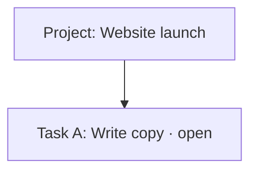
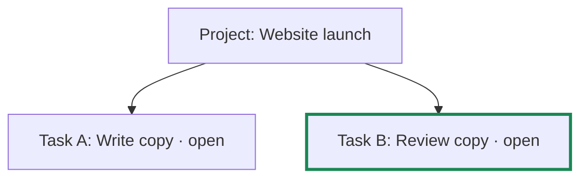
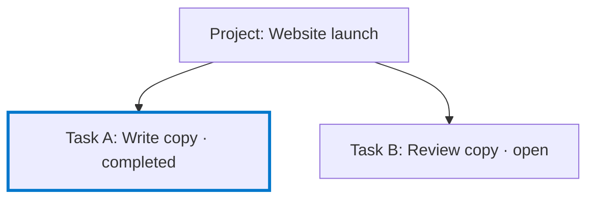
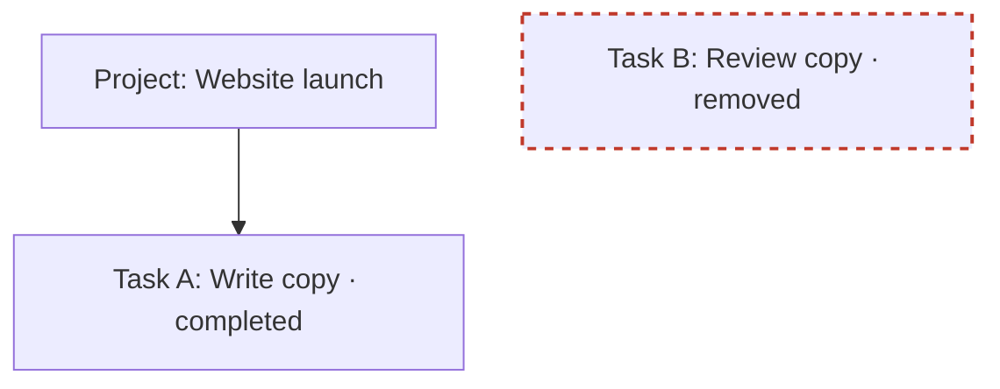

import { Aside, Tabs, TabItem } from '@astrojs/starlight/components';

This chapter defines Model and Graph behavior: registration and ownership, persistence representations, mutation dependencies, historical read boundaries, projection completion and lifecycle operations. Start with the [feature tour](/docs/fluxzero-2-overview) to see what you can build, then use this guide to choose the right contract for your application.

The Java and Kotlin examples form a Project/Task domain. Configuration variants replace earlier declarations; they are not extra classes to register alongside them.

## Coming from Fluxzero 1.x

The API distinction is between an `Entity<T>` inside an Aggregate boundary and an independently persisted `@Model` reached through `Graph<T>`. A Model operation can span several such boundaries. Existing `@Apply`, `@AssertLegal`, `@InterceptApply` and fixture patterns remain applicable.

Adopting the new boundary is a data migration, not an annotation rename. The [migration section](#migrate-an-aggregate-deliberatelynot-by-renaming-its-annotation) defines replay/adoption, read cutover and write ownership. The [overview](/docs/fluxzero-2-overview) shows the programming model in action; the rest of this chapter defines its contracts.

## Why move beyond one growing aggregate?

Choose the following boundaries independently, then configure the places where they must interact.

| Boundary | Determined by | Does not by itself imply |
| --- | --- | --- |
| Identity and retained history | The independent Model and its storage ID | The same lifecycle as its parent |
| Atomic mutation | The operation's writes and inspected read dependencies | Every reachable Graph node participates |
| Navigable relationship | A declared `@Parent` edge | A composed JSON property |
| Composed output | `pathInParent` and the selected Graph view | A stored whole-Graph document |
| Stored search view | Model document and Graph projection settings | Historical or transactional reads |
| Logical cascade | Parent ownership and `deleteOnParentDeletion` | Physical erasure of retained history |

### Small changes, large persistence boundaries

Updating Task does not inherently load or update Project or sibling Tasks. Once an assertion inspects Project's children, however, that membership becomes a read dependency. Independence of persistence does not exempt a genuinely shared rule from concurrency checks. [Read dependency semantics](#concurrent-decisions-and-the-commit-boundary) distinguish metadata, membership and value reads.

### Short-lived work, long-lived history

An independent process Model has its own stream and can be selected for physical erasure independently of its long-lived parent. Merely finishing or logically deleting the process does not erase that stream. Snapshots affect reconstruction cost; they do not change history ownership or perform erasure.

### Different persistence for different parts

Persistence settings are per Model. `EVENT_SOURCED` supports reconstruction from retained events; `DOCUMENT` maintains current state. Selecting both keeps event history and adds document persistence. A DOCUMENT-only child does not inherit historical reconstruction from an event-sourced parent. See the [storage matrix](#which-documents-are-stored) and [historical read constraints](#state-indexes-and-mixed-persistence).

### Delete one part without deleting the whole

Logical deletion removes current state and applies the parent-cascade policy. Physical erasure is an explicit repository operation over a selected set. It has separate scope, planning and shared-data constraints. The [deletion section](#9-deleting-models-and-retaining-the-right-history) specifies surviving children, retained relationship lineage and plan execution.

### Move the relationship, not the stored object tree

Changing a parent reference on a stable-ID Model changes its relationship while retaining its stream. Descendants still reference the same child ID. Parent-scoped identity is a different case: changing the parent also changes that identity and cannot be treated as a stable-ID move. Clearing an optional parent detaches that relationship. The [move example](#move-a-task-by-changing-its-relationship) combines the new relation with a destination-capacity assertion.

### Atomic changes across independent roots

A Model operation can change unrelated roots atomically. The guarantee covers its staged Model changes, not separately dispatched commands or external effects. Keep payment calls, outgoing HTTP and other irreversible actions outside retryable assertions/applies. [Multi-Model operations](#2-changing-several-models-atomically) show direct applies and composed payloads.

### More than one hierarchy

Relationship discovery, cascade ownership and output placement are separate settings:

| Declaration on an ID field | Graph edge | Deleted with parent | Placement in composed output |
| --- | --- | --- | --- |
| Plain typed ID | No | No | None |
| `@Parent` | Yes | Yes | No named child path |
| `@Parent(deleteOnParentDeletion = false)` | Yes | No | No named child path |
| `@Parent(pathInParent = "tasks")` | Yes | Yes | `tasks` |
| `@Parent(pathInParent = "tasks", deleteOnParentDeletion = false)` | Yes | No | `tasks` |

A Model may declare several edges. Recursive Model types are allowed; cycles between actual Model identities are rejected. Multiple candidate parents of the same type require an unambiguous selection; use the [association rules](#inject-models-from-message-properties). A non-owning edge remains navigable while the parent exists; deleting that parent detaches the edge without rewriting the child's ID field.

### Extend the domain without expanding the root

A child declaration supplies its relation to the parent; the parent does not need a collection field or knowledge of the child's Java class. Applications sharing relationship metadata may still have different type catalogs. Unknown nodes are available to metadata navigation but cannot be read as locally unavailable classes. Use [scoped Graph reads](#6-share-relationships-without-sharing-every-applications-implementation) deliberately at that boundary.

### Read views should not dictate write boundaries

`loadGraph` navigates authoritative Models and relationships. `searchGraph` reads a composed document representation, live or materialized. A JSON response is another view of those nodes. These paths have different consistency and completion contracts; they are not interchangeable implementations of one transactional read. [Queries and search](#3-querying-model-state-and-related-data) specify the required documents and visibility.

### Different boundaries for different jobs

Do not infer lifecycle ownership from JSON nesting, or mutation atomicity from a shared parent. Use independent Models for independently changing state and ordinary values for data wholly owned by a Model. `@Member` remains supported for deliberate embedding; `@Aggregate` remains the legacy/migration API.

## An example: home automation

The [Home example](https://github.com/fluxzero-io/fluxzero-sample-home) exercises these distinctions with recursive Spaces, independent Device observations and integration links. Its [overview diagram](/docs/fluxzero-2-overview#multiple-parents) shows the domain; for implementation, distinguish persisted relationships from ordinary references or application selections. A scene referencing a device does not make the scene the device's lifecycle owner.

### One Model can belong in two views

`HomeAssistantDevice` has two parents: its Device and its integration connection. Deleting either owner can delete the link without deleting the other parent. The link remains one independently persisted Model when reached through either Graph. Combining desired device changes in a Model operation commits those intentions atomically; physical device delivery is outside that storage guarantee.

## Model the lifecycle, then choose storage

Models can be event-sourced and/or document-backed. Choose persistence per Model, after its domain boundary
is clear.

Start with `@Model`. The default is event sourcing with caching, without a public search document or periodic
snapshots. Add those representations when a concrete read or replay requirement calls for them.

The following Project/Task declarations use explicit Model names and validation, and include the typed ID definitions. The Java and Kotlin tabs show equivalent alternatives, not classes to combine.
Snippets omit imports and use the normal [SDK project setup](/docs/getting-started/installation). Java examples use Lombok `@With` for immutable updates; Kotlin examples use `copy`. Later variants explicitly replace earlier declarations.

<Tabs syncKey="language">
<TabItem label="Java">

```java
@Model(name = "project")
record Project(@EntityId ProjectId projectId, ProjectDetails details) {}

record ProjectDetails(@NotBlank String name) {}

@Model(name = "task")
@With
record Task(@EntityId TaskId taskId,
            @Parent(pathInParent = "tasks") ProjectId projectId,
            TaskDetails details,
            boolean completed) {}

record TaskDetails(@NotBlank String title) {}

static class ProjectId extends Id<Project> {
    public ProjectId(String value) { super(value); }
}

static class TaskId extends Id<Task> {
    public TaskId(String value) { super(value); }
}
```

</TabItem>
<TabItem label="Kotlin">

```kotlin
@Model(name = "project")
data class Project(@EntityId val projectId: ProjectId, val details: ProjectDetails)

data class ProjectDetails(@field:NotBlank val name: String)

@Model(name = "task")
data class Task(
    @EntityId val taskId: TaskId,
    @Parent(pathInParent = "tasks") val projectId: ProjectId,
    val details: TaskDetails,
    val completed: Boolean
)

data class TaskDetails(@field:NotBlank val title: String)
class ProjectId(value: String) : Id<Project>(value)
class TaskId(value: String) : Id<Task>(value)
```

</TabItem>
</Tabs>

Descriptive business data belongs in cohesive value objects—even if the first version contains only a name.
Identity, relationships and simple status can remain on the Model. `ProjectDetails` is an ordinary value:
it needs neither `@Model` nor `@Member`, and should not become a bucket for unrelated state.

The default logical Model name is the **simple class name**: `Project`, regardless of its package. Here we explicitly choose `project` and `task`. An explicit name can stay unchanged when the class itself is renamed. Logical Model names are distinct from serialized Java type names and from individual Model IDs.

`ProjectId("launch")` has storage ID `launch`; `TaskId("ship")` has storage ID `ship`. These example ID classes add no prefix. IDs must be unique in the Model repository: the Java ID type alone does not create a separate storage namespace. Model discovery uses the SDK annotation processor; `@RegisterType` is not required for it.


### Commands can own their behavior

A command with an applicable Model `@Apply` can be handled automatically. You do not need a service method
whose only job is to load the right object and forward the call. In our example, creating a Project and
completing a Task can be expressed directly on their commands:

<Tabs syncKey="language">
<TabItem label="Java">

```java
record CreateProject(@NotNull ProjectId projectId, @NotNull @Valid ProjectDetails details) {
    @Apply
    Project apply() {
        return new Project(projectId, details);
    }
}

record CompleteTask(TaskId taskId) {
    @Apply
    Task apply(Task task) {
        return task.withCompleted(true);
    }
}
```

</TabItem>
<TabItem label="Kotlin">

```kotlin
data class CreateProject(
    @field:NotNull val projectId: ProjectId,
    @field:NotNull @field:Valid val details: ProjectDetails
) {
    @Apply
    fun apply() = Project(projectId, details)
}

data class CompleteTask(val taskId: TaskId) {
    @Apply
    fun apply(task: Task) = task.copy(completed = true)
}
```

</TabItem>
</Tabs>

Publish the command as usual:

<Tabs syncKey="language">
<TabItem label="Java">

```java
Fluxzero.sendCommandAndWait(new CompleteTask(taskId));
```

</TabItem>
<TabItem label="Kotlin">

```kotlin
Fluxzero.sendCommandAndWait<Any?>(CompleteTask(taskId))
```

</TabItem>
</Tabs>

For this example, the SDK carries the operation through the following steps:

```text
Receive CompleteTask
        ↓
Resolve the Task and any Models/Graphs requested by the operation
        ↓
Run assertions and applies against the attempt's read state
        ↓
Check conflicts and atomically commit the Model changes
        ↓
Publish the applied payload as an event; event handlers see that committed transition
```

Here `CompleteTask` is both the command payload and, after a successful change, the event payload. You do
not need a second handler just to translate it into another message. The command expresses the request;
the published event records that it was applied. The resulting Task is state, not the event itself.
With the default `IF_MODIFIED` publication policy, completing an already-completed Task produces no new event.

The `CreateProject` factory is create-only. A required current-Model parameter, as in `CompleteTask`, expects
existing state; a nullable one explicitly allows an upsert. Returning `null` logically deletes the target.

Behavior may also live on the Model itself. Keep business rules with their natural owner; the SDK supports
payload-side and Model-side handling rather than imposing a service layer for every action.

### Automatic command handling and existing handlers

In an Aggregate application, the command typically enters an explicit handler that loads the root:

<Tabs syncKey="language">
<TabItem label="Java">

```java
@HandleCommand
void handle(CompleteTask command) {
    Fluxzero.loadAggregate(command.taskId()).assertAndApply(command);
}
```

</TabItem>
<TabItem label="Kotlin">

```kotlin
@HandleCommand
fun handle(command: CompleteTask) {
    Fluxzero.loadAggregate(command.taskId).assertAndApply(command)
}
```

</TabItem>
</Tabs>

That is the old shape for a Task stored as an Aggregate root. With the Model version above, register the Model and its command behavior and send `CompleteTask` directly. Its applicable `@Apply` provides the command handler; remove the forwarding method. The normal handling path still validates input, runs domain assertions and commits the resulting changes.

#### Discovery and application ownership

With the Fluxzero Spring configuration, component scanning discovers `@Model` classes, self-applying command classes with Model-returning `@Apply` methods, and `@InterceptApply` payloads within the application's scan packages. They become tracked prototypes: sending a command from the same Spring application does not make it a local call. A reachable Model apply is required for automatic command handling. An annotation-processor discovery index makes Model types findable for loading; it does **not** register their command handlers in every application.

Outside Spring, register the owning types explicitly, for example:

<Tabs syncKey="language">
<TabItem label="Java">

```java
fluxzero.registerHandlers(Project.class, Task.class, CreateProject.class, CompleteTask.class);
```

</TabItem>
<TabItem label="Kotlin">

```kotlin
fluxzero.registerHandlers(Project::class.java, Task::class.java,
    CreateProject::class.java, CompleteTask::class.java)
```

</TabItem>
</Tabs>

Choose one application as the command owner. If a shared module puts the same command/Model behavior inside the scan packages of two applications with different consumers, both can consume the command. A read-only application should load the shared state contract without registering its writes. Narrow its scan/registration scope or configure `fluxzero.model.automaticHandling=DISABLED` (`FLUXZERO_MODEL_AUTOMATIC_HANDLING`). The builder alternative is `configureAutomaticModelHandling(AutomaticModelHandling.DISABLED)`; `@Model` and `@Apply` also allow explicit overrides. An explicit apply setting wins over the Model setting, then the application default; therefore an explicitly enabled apply needs its own ownership review.

#### Consumer rules still apply

Automatic commands use normal tracked consumers. Put `@Consumer` on the command type or its package to give it a stable group and configure threads, retries and segmentation. For example, add `@Consumer(name = "project-commands")` to the `CompleteTask` declaration above. A consumer on a separate Model class does not automatically give every self-applying command that consumer.

Replicas of the same logical command owner share a consumer position and divide its segments. Distinct consumers each receive their own delivery; assigning two different names does not prevent duplicate command handling. Without an explicit consumer, the configured unconfigured-handler policy applies: legacy application grouping, per-handler grouping or per-package grouping. See [message tracking](/docs/guides/messaging/message-tracking) for the versioned defaults and overrides. `@Consumer` configures tracking; it is not a Spring component-registration annotation.

#### Calling the pipeline from your own handler

Keep an explicit handler when it has real work to coordinate. Invoke the Model pipeline with `Fluxzero.assertAndApply(command)` rather than manually loading and updating each Model. Disable the automatic entry point for that command when the explicit handler owns it. The same command can still contain its applies:

<Tabs syncKey="language">
<TabItem label="Java">

```java
record CompleteTask(TaskId taskId) {
    @Apply(automaticHandling = AutomaticModelHandling.DISABLED)
    Task apply(Task task) {
        return task.withCompleted(true);
    }
}

@HandleCommand
void handle(CompleteTask command) {
    Fluxzero.assertAndApply(command);
    // Other orchestration belongs here, outside retryable applies.
}
```

</TabItem>
<TabItem label="Kotlin">

```kotlin
data class CompleteTask(val taskId: TaskId) {
    @Apply(automaticHandling = AutomaticModelHandling.DISABLED)
    fun apply(task: Task) = task.copy(completed = true)
}

@HandleCommand
fun handle(command: CompleteTask) {
    Fluxzero.assertAndApply(command)
    // Other orchestration belongs here, outside retryable applies.
}
```

</TabItem>
</Tabs>

This example shows the explicit alternative, not an extra handler to add beside the automatic one.

| API | What it does |
| --- | --- |
| `sendCommandAndWait(command)` | Dispatches through normal command routing and waits for the result. Separately dispatched commands remain separate operations. |
| `Fluxzero.assertAndApply(command)` | Runs assertions and applies locally through the Model pipeline; related changes share the operation's commit. |
| `Fluxzero.assertLegal(command)` | Checks legality only. It applies no changes and commits nothing; later execution must still validate its own state. |

### Inject Models from message properties

A message already says which objects it concerns. Its handler can ask for those Models directly instead
of repeating the lookup. This works in command, event and query handlers, as well as Model assertions,
interceptors and applies. Request `Task` for its state or `Graph<Task>` for its surrounding relationships.

The SDK looks for a message property matching the Model's `@EntityId` property, or otherwise a unique
typed `Id<Task>`. It can also follow stored parent relationships to supply a Project, grandparent or further
ancestor. This query needs only a Task ID:

<Tabs syncKey="language">
<TabItem label="Java">

```java
record GetTask(TaskId taskId) implements Request<TaskSummary> {
    @HandleQuery
    TaskSummary handle(Task task, Project project) {
        return new TaskSummary(task.details().title(), project.details().name(), task.completed());
    }
}

record TaskSummary(String title, String projectName, boolean completed) {}
```

</TabItem>
<TabItem label="Kotlin">

```kotlin
data class GetTask(val taskId: TaskId) : Request<TaskSummary> {
    @HandleQuery
    fun handle(task: Task, project: Project) =
        TaskSummary(task.details.title, project.details.name, task.completed)
}

data class TaskSummary(val title: String, val projectName: String, val completed: Boolean)
```

</TabItem>
</Tabs>

The Task is addressed by `taskId`; the Project comes from its stored parent relationship. The Task parameter is not needed to enable Project injection: `handle(Project project)` would resolve the same parent from the query's `taskId`. No sibling Tasks need to be loaded. Injecting a Model reads it; an apply must return a change before that Model becomes a write target.

When a message refers to two Models of the same type, `@Association` makes the intended binding explicit:

<Tabs syncKey="language">
<TabItem label="Java">

```java
record CompareProjects(ProjectId leftId, ProjectId rightId) implements Request<List<String>> {
    @HandleQuery
    List<String> handle(@Association("leftId") Project left,
                        @Association("rightId") Project right) {
        return List.of(left.details().name(), right.details().name());
    }
}
```

</TabItem>
<TabItem label="Kotlin">

```kotlin
data class CompareProjects(val leftId: ProjectId, val rightId: ProjectId) : Request<List<String>> {
    @HandleQuery
    fun handle(
        @Association("leftId") left: Project,
        @Association("rightId") right: Project
    ): List<String> = listOf(left.details.name, right.details.name)
}
```

</TabItem>
</Tabs>

An association also helps when the property has a different name and no typed ID to identify its target:

<Tabs syncKey="language">
<TabItem label="Java">

```java
record GetProjectName(String reference) implements Request<String> {
    @HandleQuery
    String handle(@Association("reference") Project project) {
        return project.details().name();
    }
}
```

</TabItem>
<TabItem label="Kotlin">

```kotlin
data class GetProjectName(val reference: String) : Request<String> {
    @HandleQuery
    fun handle(@Association("reference") project: Project): String = project.details.name
}
```

</TabItem>
</Tabs>

Here `reference = "launch"` selects Project `launch`. The same parameter annotation works in message handlers, `@AssertLegal`, `@Apply` and `@InterceptApply`.

`@Association` can also select a relationship path. Given a message containing only a Task ID, `@Association("tasks") Project project` follows the Task's `@Parent(pathInParent = "tasks")` relationship. This is useful when the child has several parents of the same type under different paths. Use the path that identifies the intended relation; do not rely on parameter order to disambiguate parents.

Which revision gets injected depends on the handler. A query reads current state; a Model event reads the state of that event; an assertion or apply reads its mutation attempt's state. [Read boundaries](#4-the-state-of-that-event-or-the-state-of-now) explains each with a concrete timeline.

### One-to-one without one shared lifecycle

Sometimes a Model extends another one without becoming part of its persistence boundary. For example, add
an operational-status companion to Project: one per Project, but independently updated and loaded.

<Tabs syncKey="language">
<TabItem label="Java">

```java
@Model
record ProjectStatus(
        @EntityId(prefix = "status-") @Parent(pathInParent = "status") ProjectId projectId,
        boolean online) {}

record PutProjectStatus(ProjectId projectId, boolean online) {
    @Apply
    ProjectStatus apply(Project project, @Nullable ProjectStatus current) {
        return new ProjectStatus(projectId, online);
    }
}
```

</TabItem>
<TabItem label="Kotlin">

```kotlin
@Model
data class ProjectStatus(
    @EntityId(prefix = "status-") @Parent(pathInParent = "status") val projectId: ProjectId,
    val online: Boolean
)

data class PutProjectStatus(val projectId: ProjectId, val online: Boolean) {
    @Apply
    fun apply(project: Project, @Nullable current: ProjectStatus?): ProjectStatus =
        ProjectStatus(projectId, online)
}
```

</TabItem>
</Tabs>

The same property supplies identity and the parent relationship. With the earlier `ProjectId("launch")`,
the Project's storage ID is `launch`; its companion's is `status-launch`. No second ID needs
to travel through the command. Use `jakarta.annotation.Nullable` here: it makes this an intentional upsert,
while the required Project parameter checks that the parent exists. A factory without a current-state
parameter is create-only and rejects a duplicate.

Load the companion with `Fluxzero.loadModel(projectId, ProjectStatus.class)`; loading only `projectId` selects
the Project. The `status` Graph path is still a collection, with at most one member from this identity scheme.
Removing the companion leaves its parent intact; default parent-owned deletion removes it with the Project.
For example, an automation application can request that a lamp turn on, while a device integration reports whether the physical lamp is actually on. The reported state belongs to that integration and changes on its own schedule. It can be a companion Model in another application, even when the application owning the lamp does not know the companion's Java class. The shared relationship still connects them; typed value reads require the local state contract, while metadata navigation can inspect unknown children.

The one-per-Project limit here follows from using the same Project ID plus a fixed `status-` prefix. `@Parent` has no `maxChildren` setting; a different identity scheme needs an explicit business rule to enforce a cardinality limit.

## Building with Models and Graphs

### 1. Business rules that span a Graph

Suppose our example application allows at most five Tasks per Project. Creating a Task must then check the
Project and its existing Tasks:

<Tabs syncKey="language">
<TabItem label="Java">

```java
record AddTask(@NotNull TaskId taskId,
               @NotNull ProjectId projectId,
               @NotNull @Valid TaskDetails details) {
    @AssertLegal
    void checkCapacity(Graph<Project> project) {
        if (project.childModels(Task.class).size() >= 5) {
            throw ProjectErrors.capacityReached;
        }
    }

    @Apply
    Task apply(Project project) {
        return new Task(taskId, projectId, details, false);
    }
}
```

</TabItem>
<TabItem label="Kotlin">

```kotlin
data class AddTask(
    @field:NotNull val taskId: TaskId,
    @field:NotNull val projectId: ProjectId,
    @field:NotNull @field:Valid val details: TaskDetails
) {
    @AssertLegal
    fun checkCapacity(project: Graph<Project>) {
        if (project.childModels(Task::class.java).size >= 5) {
            throw ProjectErrors.capacityReached
        }
    }

    @Apply
    fun apply(project: Project) = Task(taskId, projectId, details, false)
}
```

</TabItem>
</Tabs>

Five is this example's business limit. `ProjectErrors.capacityReached` is an application-defined functional exception; the examples omit the error declarations. Use the same domain-error convention for the other refusals below.

### Concurrent decisions and the commit boundary

Suppose a Project has four Tasks. Two commands each read four children and decide that adding one more is allowed. Both decisions were individually reasonable; committing both would violate the limit.

The SDK includes the inspected membership in the commit boundary. The first addition succeeds. The second conflicts because the collection it read has changed. With the default **RETRY**, the SDK runs the operation again: it now sees five Tasks, and `ProjectErrors.capacityReached` rejects the addition. Empty collections are protected too; additions, removals and moves can all invalidate a collection read.

A read dependency does not need to be a write target. `AddTask` reads the Project and its Task collection even though it only creates one Task. A command can likewise read an independent Account's `suspended` flag before creating an Order: if another writer suspends that Account before commit, the decision must be reevaluated even though this command does not change the Account.

Injected Models and inspected Graph values participate in that attempt's read dependencies. Counting `project.children(Task.class).size()` protects membership without needing every Task's value. Reading `childModels(Task.class)` also inspects the returned values. Synchronous `loadGraph(...)` calls inside the mutation join the same attempt. Merely constructing an unused Graph does not read its complete tree. Document search and arbitrary `loadModel(...)` calls do not provide this transactional read tracking.

| Conflict policy | What happens after a concurrent change? |
| --- | --- |
| `RETRY` (default) | Rerun the operation, including assertions and applies, on a new attempt boundary. A now-invalid business action is rejected. |
| `FAIL` | Return the conflict to the caller. |
| `ACCEPT` | Keep the accepted decision and rebase the applies on newer state. Assertions are **not** rerun; assertion-only reads no longer protect the decision. |

The default budget is **three retries after the initial attempt**, at most four attempts. Configure `fluxzero.model.maxConflictRetries` (`FLUXZERO_MODEL_MAX_CONFLICT_RETRIES`) when a different bound is needed. Business rejections are not commit conflicts and do not consume repeated attempts hoping the rule will later pass. Keep retryable assertions and applies free of external effects: sending a payment request cannot be undone by rolling back a Model commit.

### 2. Changing several Models atomically

One command can return changes to several independent roots. Consider the ordering example: placing an
Order must reserve Inventory in the same operation, but neither object owns the other. The following types
use `OrderId extends Id<Order>` and `InventoryId extends Id<Inventory>`, following the earlier typed-ID pattern:

<Tabs syncKey="language">
<TabItem label="Java">

```java
record PlaceOrder(@NotNull OrderId orderId,
                  @NotNull InventoryId inventoryId,
                  @Positive int quantity) {
    @AssertLegal
    void checkStock(Inventory inventory) {
        if (inventory.available() < quantity) {
            throw OrderErrors.insufficientStock;
        }
    }

    @Apply
    Order createOrder() {
        return new Order(orderId, inventoryId, new OrderDetails(quantity));
    }

    @Apply
    Inventory reserve(Inventory inventory) {
        return inventory.withAvailable(inventory.available() - quantity);
    }
}

@Model
record Order(@EntityId OrderId orderId, InventoryId inventoryId, OrderDetails details) {}

record OrderDetails(int quantity) {}

@Model
@With
record Inventory(@EntityId InventoryId inventoryId, int available) {}
```

</TabItem>
<TabItem label="Kotlin">

```kotlin
data class PlaceOrder(
    @field:NotNull val orderId: OrderId,
    @field:NotNull val inventoryId: InventoryId,
    @field:Positive val quantity: Int
) {
    @AssertLegal
    fun checkStock(inventory: Inventory) {
        if (inventory.available < quantity) {
            throw OrderErrors.insufficientStock
        }
    }

    @Apply
    fun createOrder() = Order(orderId, inventoryId, OrderDetails(quantity))

    @Apply
    fun reserve(inventory: Inventory) = inventory.copy(available = inventory.available - quantity)
}

@Model
data class Order(
    @EntityId val orderId: OrderId,
    val inventoryId: InventoryId,
    val details: OrderDetails
)

data class OrderDetails(val quantity: Int)

@Model
data class Inventory(@EntityId val inventoryId: InventoryId, val available: Int)
```

</TabItem>
</Tabs>

There is no `@Parent` here. The ordinary Inventory reference on Order does not make Inventory its child.
Both applies participate in the same atomic commit. Insufficient stock, a duplicate Order or an unresolved
commit conflict cannot leave a newly stored Order without its reservation, or a reservation without its Order.
External payment or delivery remains a post-commit workflow.

The `PlaceOrder` event belongs to both Model streams and is published once globally. One business action
can therefore have one event while changing several independent pieces of state.

#### Move a Task by changing its relationship

Returning to the project-management example, moving a Task changes its parent reference. Its identity,
completion state and details stay the same. Since our example limits Projects to five Tasks, the move also
checks the destination's capacity:

<Tabs syncKey="language">
<TabItem label="Java">

```java
record MoveTask(TaskId taskId, ProjectId destinationId) {
    @AssertLegal
    void checkCapacity(Task task, @Association("destinationId") Graph<Project> destination) {
        if (!task.projectId().equals(destinationId)
                && destination.childModels(Task.class).size() >= 5) {
            throw ProjectErrors.capacityReached;
        }
    }

    @Apply
    Task apply(Task task) {
        return task.withProjectId(destinationId);
    }
}
```

</TabItem>
<TabItem label="Kotlin">

```kotlin
data class MoveTask(val taskId: TaskId, val destinationId: ProjectId) {
    @AssertLegal
    fun checkCapacity(task: Task, @Association("destinationId") destination: Graph<Project>) {
        if (task.projectId != destinationId
            && destination.childModels(Task::class.java).size >= 5) {
            throw ProjectErrors.capacityReached
        }
    }

    @Apply
    fun apply(task: Task) = task.copy(projectId = destinationId)
}
```

</TabItem>
</Tabs>

The assertion's required destination Graph verifies that the new Project exists. Its inspected collection joins
conflict checking. The Task's children remain attached to the same Task ID, so there is no remove-and-copy
operation for its comments or history.

#### An apply can update an ancestor

A Model-side apply may return a change to a resolved ancestor. For example, let completing a Task also update a Project's `lastCompletedTaskId`. In this variant, Project has that additional field and both Java Models use Lombok `@With`:

<Tabs syncKey="language">
<TabItem label="Java">

```java
record CompleteTask(TaskId taskId) {
    @Apply
    Task apply(Task task) {
        return task.withCompleted(true);
    }
}

@Model(name = "task")
@With
record Task(@EntityId TaskId taskId,
            @Parent(pathInParent = "tasks") ProjectId projectId,
            TaskDetails details, boolean completed) {
    @Apply
    Project rememberCompletion(CompleteTask command, Project project) {
        return project.withLastCompletedTaskId(taskId);
    }
}

@Model(name = "project")
@With
record Project(@EntityId ProjectId projectId, ProjectDetails details,
               TaskId lastCompletedTaskId) {}
```

</TabItem>
<TabItem label="Kotlin">

```kotlin
data class CompleteTask(val taskId: TaskId) {
    @Apply
    fun apply(task: Task) = task.copy(completed = true)
}

@Model(name = "task")
data class Task(
    @EntityId val taskId: TaskId,
    @Parent(pathInParent = "tasks") val projectId: ProjectId,
    val details: TaskDetails, val completed: Boolean
) {
    @Apply
    fun rememberCompletion(command: CompleteTask, project: Project): Project =
        project.copy(lastCompletedTaskId = taskId)
}

@Model(name = "project")
data class Project(@EntityId val projectId: ProjectId, val details: ProjectDetails,
                   val lastCompletedTaskId: TaskId?)
```

</TabItem>
</Tabs>

The payload apply completes the Task. The Task's Model-side apply then returns the updated Project selected through the Task's parent relationship. Both replacements join one atomic operation. Merely injecting the Project would have made it a read dependency; returning the replacement is what changes it.

#### A variable number of changes

The set of Models does not have to be known in the command's Java signature. An apply can read the selected
children and return their replacements. Here, one command completes every Task in the selected Project:

<Tabs syncKey="language">
<TabItem label="Java">

```java
record CompleteAllTasks(ProjectId projectId) {
    @Apply
    List<Task> apply(Graph<Project> project) {
        return project.childModels(Task.class).stream()
                .map(task -> task.withCompleted(true))
                .toList();
    }
}
```

</TabItem>
<TabItem label="Kotlin">

```kotlin
data class CompleteAllTasks(val projectId: ProjectId) {
    @Apply
    fun apply(project: Graph<Project>): List<Task> =
        project.childModels(Task::class.java).map { it.copy(completed = true) }
}
```

</TabItem>
</Tabs>

The inspected collection and each Task's own revision travel into conflict checking. This is one atomic
operation, not a loop of independently dispatched commands. Use Models from the tracked Graph in that
evaluation, not detached search results that have lost their read boundary.

If each part already has its own domain command, compose those commands instead:

<Tabs syncKey="language">
<TabItem label="Java">

```java
record CompleteTasks(List<TaskId> taskIds) {
    @InterceptApply
    List<CompleteTask> expand() {
        return taskIds.stream().map(CompleteTask::new).toList();
    }
}
```

</TabItem>
<TabItem label="Kotlin">

```kotlin
data class CompleteTasks(val taskIds: List<TaskId>) {
    @InterceptApply
    fun expand(): List<CompleteTask> = taskIds.map(::CompleteTask)
}
```

</TabItem>
</Tabs>

For `CompleteTasks([a, b])`, the interceptor produces `CompleteTask(a)` followed by `CompleteTask(b)`. The SDK checks and applies the first, then checks and applies the second against the staged result of the first. Neither Task is committed halfway through. If the second action is rejected, the first change is discarded too.

Write each Task's rules on `CompleteTask` or on the applicable Model-side assertions. The interceptor replaces `CompleteTasks` as the payload being applied, so assertions that exist only on that outer wrapper are not a substitute for validating the resulting actions. This composition is useful when an existing command already captures the required business rule.

### 3. Querying Model state and related data

Use identity-based loads for domain state. A Graph reads Models and relationships lazily, under its selected state boundary; creating a Graph does not eagerly reconstruct the complete tree. Calling `get()` or reading child values performs the corresponding value reads. A deliberately current DOCUMENT-only root is captured eagerly so its head and value agree; its descendants remain lazy.

<Tabs syncKey="language">
<TabItem label="Java">

```java
Graph<Project> project = Fluxzero.loadGraph(projectId);
ProjectDetails details = project.get().details();
List<Task> tasks = project.childModels(Task.class);
List<Graph<Task>> taskNodes = project.children(Task.class);
var placedChildren = project.children("tasks");
var allDirectChildren = project.children();
var namedTasks = project.namedChildren("task", false);
```

</TabItem>
<TabItem label="Kotlin">

```kotlin
val project: Graph<Project> = Fluxzero.loadGraph(projectId)
val details = requireNotNull(project.get()).details
val tasks: List<Task> = project.childModels(Task::class.java)
val taskNodes = project.children(Task::class.java)
val placedChildren = project.children("tasks")
val allDirectChildren = project.children()
val namedTasks = project.namedChildren("task", false)
```

</TabItem>
</Tabs>

These are different selectors: class selects locally known assignable Models; a path selects the declared composition placement; no selector returns direct children; logical name selects metadata and `false` includes types unknown to this application. Use `childModels(...)` for values and `children(...)` for navigable Graph nodes. None of these identity-based operations requires `DOCUMENT` or `materializeGraph`.

#### Which documents are stored?

A **Model source document** contains one Model's own current state. A **public document** is its separate direct-search projection. A **Graph document** contains a root and recursively composed children. These are separate storage roles, even when two initially contain the same fields.

The following rows describe the Model carrying the configuration. They do not implicitly change the configuration of its parent or children.

| Configuration | Authoritative state | Documents maintained per Model | Whole Graph stored? |
| --- | --- | --- | --- |
| Plain `@Model`, no composition path | Events | None | No |
| `@Model` with `@Parent(pathInParent = "tasks")` | Events | One internal, indexed source for this child | No |
| `@Model(persistence = {EVENT_SOURCED, DOCUMENT})` | Events | Internal source plus separate public document | No |
| `@Model(persistence = DOCUMENT)` | Current internal source | Internal source plus separate public document; no durable previous versions promised | No |
| `@Model(materializeGraph = true)` | Events, unless configured otherwise | Internal source for this root plus a composed Graph projection | Yes, under declared composition paths |
| `DOCUMENT` plus `materializeGraph = true` | Events if `EVENT_SOURCED` is also selected; otherwise current internal source | Internal source, public document and composed Graph projection | Yes |

The explicit `tasks` path therefore creates a source for each Task even when Project is plain event-sourced and has no document at all. Project does **not** need `materializeGraph = true` for the child to be stored or searched beneath its parent. Adding `DOCUMENT` to a child also enables parent/ancestor-scoped search, even if its parent relation has no composition path. A root only needs its own source when a query searches its contents or uses it as a `searchGraph` root.

`document = @DocumentProjection(searchable = false)` keeps the public document retrievable by identity and parent/ancestor IDs but removes its normal content indexes and unrestricted typed search visibility. A separate composition role can still require an indexed internal source. The [query guide](/docs/guides/modeling-and-persistence/model-query-guide) covers these advanced combinations.

#### Search a Model or search a Graph?

`search(Task.class)` returns Task values. `searchGraph(Project.class)` returns composed Project Graphs. Neither reconstructs historical events to answer a search.

The original Task has an indexed source because of its `tasks` path. That supports a scoped query immediately, without adding `DOCUMENT`:

<Tabs syncKey="language">
<TabItem label="Java">

```java
List<Task> completed = Fluxzero.search(Task.class)
        .whereParent(projectId)
        .match(true, "completed")
        .fetchAll();
```

</TabItem>
<TabItem label="Kotlin">

```kotlin
val completed: List<Task> = Fluxzero.search(Task::class.java)
    .whereParent(projectId)
    .match(true, "completed")
    .fetchAll()
```

</TabItem>
</Tabs>

Task remains event-sourced: the source is a maintained read representation, not a change to its persistence policy. For a list of **all** Tasks, without a parent/ancestor selector, add `persistence = {EVENT_SOURCED, DOCUMENT}` to Task (`[EVENT_SOURCED, DOCUMENT]` in Kotlin). Ordinary `search(Task.class)` reads that public projection and includes only Task's own fields, not independently stored notes or children.

To find Tasks by their Project's name, Project needs an indexed source too. For example, add `{EVENT_SOURCED, DOCUMENT}` to Project and query:

<Tabs syncKey="language">
<TabItem label="Java">

```java
List<Task> launchTasks = Fluxzero.search(Task.class)
        .whereParent(Project.class, MatchConstraint.match("Launch", "details/name"))
        .fetchAll();
```

</TabItem>
<TabItem label="Kotlin">

```kotlin
val launchTasks: List<Task> = Fluxzero.search(Task::class.java)
    .whereParent(Project::class.java, MatchConstraint.match("Launch", "details/name"))
    .fetchAll()
```

</TabItem>
</Tabs>

The predicate reads Project's source and follows its relations to Tasks. The Task need not copy the Project name. `whereAncestor(Project.class, ...)` works the same way through more than one parent edge. No whole-Graph document is required for either query.

Now use `searchGraph` when the response should contain the Project **and** its composed Tasks:

<Tabs syncKey="language">
<TabItem label="Java">

```java
List<Graph<Project>> projects = Fluxzero.searchGraph(Project.class)
        .match(true, "tasks/completed")
        .fetchAll();
```

</TabItem>
<TabItem label="Kotlin">

```kotlin
val projects: List<Graph<Project>> = Fluxzero.searchGraph(Project::class.java)
    .match(true, "tasks/completed")
    .fetchAll()
```

</TabItem>
</Tabs>

This works with the DOCUMENT-enabled Project above: the SDK composes Graphs **live** from root and child source documents. It also works with `materializeGraph = true`: the SDK searches the **stored whole-Graph projection** instead. `searchGraph(Project.class, true)` explicitly chooses live composition when materialization is enabled. Plain Project with no source supports `loadGraph(projectId)` but cannot be a `searchGraph` root.

A matching Project includes its composed Tasks, not only the completed ones. `whereDescendant(Task.class, MatchConstraint.match(true, "completed"))` can instead narrow candidate roots using Task source documents before composition. Live composition costs work at query time; materialization pays that work after commits and can lag. [Materialization and completion](#automatically-materialize-the-complete-graph) explains when to wait for the stored view.

#### A search projection is not a second way to edit domain state

Suppose Project's public search document is reindexed by a document handler to add a display label. That does not apply a domain command, rename the authoritative Project, or change the source used to compose its Graph. Model commits maintain the source and public projection; independent public projection updates change only the search view. With `DOCUMENT`-only persistence, the **internal source** is still the authoritative state, not an independently edited public projection.

Search sees current documents or a possibly delayed materialized projection. It does not join a command's transactional read dependencies and does not become historical inside an old event handler. For the five-Task invariant, keep the Graph read inside `@AssertLegal`; a search count cannot protect that decision at commit.

### 4. The state of that event, or the state of now

Imagine Task A was completed at 10:00, reopened at 10:05, and its completion event is handled at 10:10.

| Read at 10:10 | State you receive |
| --- | --- |
| `Graph<Task>` injected into the completion event handler | Completed, at the 10:00 commit boundary. Related event-sourced nodes are read at that same boundary. |
| `task.previous()` in that handler | The state just before completion: Task A was open. |
| `task.current()` or `loadCurrentGraph(taskId)` outside a mutation | A fresh current view: Task A is open after the 10:05 change. |
| `Task` or `Graph<Task>` injected into a query | Current authoritative state, not the old event's state. |
| Injected Models/Graphs inside an assertion or apply | The mutation attempt's boundary plus its earlier staged changes; consumed reads participate in conflict detection. |
| Document or Graph search | Search-visible documents, independent of the event boundary. |

An ordinary query is not a transaction spanning arbitrary separate reads. For an invariant, perform the related reads inside a Model operation. `current()` inside that operation retains its attempt boundary; it does not let half the rule switch to newer state.

For the completion event:

<Tabs syncKey="language">
<TabItem label="Java">

```java
@HandleEvent
void onTaskCompleted(CompleteTask event, Graph<Task> task) {
    Task then = task.get();
    Graph<Task> previous = task.previous();
    Task before = previous == null ? null : previous.get();
    Graph<Task> now = task.current();
    // Compare before/then for this transition; consult now for current-intent reconciliation.
}
```

</TabItem>
<TabItem label="Kotlin">

```kotlin
@HandleEvent
fun onTaskCompleted(event: CompleteTask, task: Graph<Task>) {
    val then = task.get()
    val before = task.previous()?.get()
    val now: Graph<Task> = task.current()
    // Compare before/then for this transition; consult now for current-intent reconciliation.
}
```

</TabItem>
</Tabs>

The event-bound Graph stays historical even when later commands have already run. `current()` creates a
fresh view outside a mutation; it does not mutate the original Graph. Inside a Model mutation, current reads
share that attempt's boundary instead of silently switching snapshots halfway through a decision.

Keep `EVENT_SOURCED` when you need `previous()` and historical reconstruction. `DOCUMENT` alone retains
current state, not arbitrary previous document versions. Adding `DOCUMENT` alongside event sourcing does
not remove the event history.

#### State indexes and mixed persistence

A **state index** identifies a committed Model-state boundary. Storage assigns ordered state indexes when accepting a commit. Changes within one committed substep share a state index; a composed operation can contain several ordered substeps while still committing atomically. It is separate from a message's event-log index. `graph.stateIndex()` selects the Graph's read boundary; `revisionStateIndex()` identifies the selected Model revision, which may be older when only another node changed.

State indexes encode time in the same way as message indexes. `IndexUtils.timestampFromIndex(index)` decodes the timestamp. For a time-based view, use `graph.atStateIndex(IndexUtils.maxIndexFromMillis(instant.toEpochMilli()))` to include the commits through that millisecond. This requires retained reconstructible history; it cannot undo physical erasure.

A mixed Graph can contain event-sourced Project/Task nodes and a DOCUMENT-only status node. If the status at 10:00 was overwritten at 10:05, reading that node in the 10:00 Graph cannot silently return the newer status. The SDK keeps the historical boundary and fails the value read if it cannot reconstruct the requested revision. Lazy navigation means a handler that never reads that status may still use the reconstructible parts of the Graph.

`previous()` does not make a DOCUMENT-only node stay current inside an otherwise historical Graph. A standalone current DOCUMENT-only Model may have no previous value (`previous() == null` after cache loss); a complete Graph-change handler's explicit before-boundary still cannot manufacture missing document history. Event injection has the same restriction. Choose `{EVENT_SOURCED, DOCUMENT}` when both search and durable historical processing are required. Use an explicitly separate current read when current status is the actual question.

### 5. React to the whole Graph, without enumerating its events

In the project-management example, the overview should change when a Task changes—not only when the
Project itself receives an update.
You should not have to maintain a list of every command or event that might affect that overview.

Use an unqualified `Graph<Project>` as the single parameter for complete Graph-change delivery. In the current SDK, adding a `Message`, `Metadata` or payload parameter makes this a different handler signature; the complete-change selector currently requires exactly one parameter. Read message context through `DeserializingMessage.getCurrent()` inside this handler when needed:

<Tabs syncKey="language">
<TabItem label="Java">

```java
@HandleEvent
void projectChanged(Graph<Project> project) {
    Graph<Project> before = project.previous();
    // React to this Graph transition, whether the root or a descendant changed.
}
```

</TabItem>
<TabItem label="Kotlin">

```kotlin
@HandleEvent
fun projectChanged(project: Graph<Project>) {
    val before = project.previous()
    // React to this Graph transition, whether the root or a descendant changed.
}
```

</TabItem>
</Tabs>

The SDK discovers the affected roots from the durable Model commit. The event does not have to repeat the
Project ID. If several Models below the same root change in one committed substep, that root is delivered
once for that substep. This is not an exactly-once delivery guarantee; normal handler retry rules still apply.

The Graph shows the state at that change, even if the consumer is catching up later. `previous()` supplies
the preceding Graph when the inspected state has retained event-sourced history. Creation has no previous
Graph; deletion supplies an empty current Graph. Moving a child notifies both the old and new roots.
Cascaded logical deletion also reaches the deleted child's own Graph handler; physical erasure does not
manufacture a domain event, and suppressed event publication does not manufacture notifications.

`@HandleNotification` supports the same Graph-change signature without regular consumer segmentation—useful,
for example, for sending a WebSocket update that refreshes a connected UI.
By contrast, `onTaskCompleted(CompleteTask event, Graph<Task> task)` remains a handler for that specific
payload; adding a Graph parameter does not broaden its subscription to every Graph change.

For a Project with Graph materialization enabled, you can instead observe the stored view:

<Tabs syncKey="language">
<TabItem label="Java">

```java
@HandleDocument(modelGraph = Project.class)
void projectViewChanged(Graph<Project> project) {
    // React to an updated materialized Project Graph.
}
```

</TabItem>
<TabItem label="Kotlin">

```kotlin
@HandleDocument(modelGraph = Project::class)
fun projectViewChanged(project: Graph<Project>) {
    // React to an updated materialized Project Graph.
}
```

</TabItem>
</Tabs>

This route follows the **document projection**, which can skip superseded intermediate versions. Use events
for individual published transitions, documents for the stored view and its
[schema evolution](#evolving-stored-graphs-with-handledocument).


### Watch the Graph evolve

Imagine opening a project's activity view. A task appears, is completed, and is later removed. You want to show what
changed at each step, including its surrounding project, even if you process that activity tomorrow.

Select a step to follow the same graph through time:

<Tabs>
  <TabItem label="1 · Created">


```mermaid
flowchart TD
    P[Project: Website launch] --> A[Task A: Write copy · open]
```

The project has one task. A creation handler sees Task A; it has no previous value.

  </TabItem>
  <TabItem label="2 · Added">


```mermaid
flowchart TD
    P[Project: Website launch] --> A[Task A: Write copy · open]
    P --> B[Task B: Review copy · open]
    style B stroke:#198754,stroke-width:3px
```

Task B was added. In the Project's graph-change handler, the current children contain A and B;
the children of `project.previous()` contain only A.

  </TabItem>
  <TabItem label="3 · Changed">


```mermaid
flowchart TD
    P[Project: Website launch] --> A[Task A: Write copy · completed]
    P --> B[Task B: Review copy · open]
    style A stroke:#0077cc,stroke-width:3px
```

Task A changed. Its value before this transition was open; afterward it is completed.
The Project itself didn't need a new field or update just because a task changed.

  </TabItem>
  <TabItem label="4 · Removed">


```mermaid
flowchart TD
    P[Project: Website launch] --> A[Task A: Write copy · completed]
    B[Task B: Review copy · removed]
    style B stroke:#c0392b,stroke-width:2px,stroke-dasharray:5 5
```

Task B was logically deleted. It is absent from the current children, but the previous graph still contains it.
The detached dashed node illustrates the removal; it is not part of the current graph.

  </TabItem>
</Tabs>

These are snapshots, not four copies of your domain model. The same Model identities are reconstructed at different
committed boundaries. Relationships belong to those boundaries too: if a task moves, its historical parent is the
project it belonged to then.

This is useful for an activity timeline, an audit explanation, or understanding why a rule fired. It also lets a
handler detect a transition such as “all tasks have now completed” by comparing the before and after views. You do
not need an extra generic `ProjectChanged` event to discover every kind of child change.

Outside a complete graph-change handler, `previous()` walks the selected Model's revisions. A Project revision
list is **not** a list of every update to all its tasks. Use complete graph-change handlers for each published tree
transition. For a convenient predicate-based lookup through the selected Task's revisions:

<Tabs syncKey="language">
<TabItem label="Java">

```java
Optional<Graph<Task>> lastOpen = Fluxzero.loadGraph(taskId)
        .playBackToCondition(g -> g.get() != null && !g.get().completed());
```

</TabItem>
<TabItem label="Kotlin">

```kotlin
val lastOpen = Fluxzero.loadGraph(taskId)
    .playBackToCondition { g -> g.get()?.completed == false }
```

</TabItem>
</Tabs>

This returns the first matching retained revision while walking backward, including the starting revision. It does not enumerate every change to every child of a Project. Use `atStateIndex(...)` for a known committed or time-based boundary, or Graph-change handlers for each published tree transition.

See [Temporal Graphs](/docs/guides/modeling-and-persistence/temporal-graphs) for navigation, before/after comparisons,
and the history needed to make those views reliable.

### 6. Share relationships without sharing every application's implementation

Typed Graph navigation selects locally known matching types without reconstructing unrelated children.
When another application owns a child type, you can still inspect relationship metadata by logical name.
For example, count the Project's direct children named `"task"`, including those whose class is unavailable locally:

<Tabs syncKey="language">
<TabItem label="Java">

```java
int taskCount = project.namedChildren("task", false).size();
```

</TabItem>
<TabItem label="Kotlin">

```kotlin
val taskCount = project.namedChildren("task", false).size
```

</TabItem>
</Tabs>

Here `false` means include unknown types too. These nodes expose their identity and metadata;
`knownType()` tells you whether the local class is available. Reading an unknown node's value fails explicitly
instead of pretending that it is absent. Class-based selection only covers locally known assignable types,
so it is not a complete cross-application count by itself.

For a shared Model with a maintained current source document, `loadCurrentModelState(...)` offers a verified,
read-only state view without replaying writer-local events. The state contract must still be available locally.
Ordinary event-sourced loads continue to require the historical event contracts and replay behavior.
Neither API imports missing classes, and current-state reads do not join a mutation's readset.

### 7. Delayed work can follow its owner's lifetime

Use the same relationship vocabulary for scheduled work. For example, a reminder can belong to the Task
it concerns:

<Tabs syncKey="language">
<TabItem label="Java">

```java
record RemindTask(@Parent TaskId taskId, Instant expectedDeadline) {}

Fluxzero.scheduleCommand(new RemindTask(taskId, deadline), new ScheduleId("reminder", taskId), deadline);
```

</TabItem>
<TabItem label="Kotlin">

```kotlin
data class RemindTask(@Parent val taskId: TaskId, val expectedDeadline: Instant)

Fluxzero.scheduleCommand(RemindTask(taskId, deadline), ScheduleId("reminder", taskId), deadline)
```

</TabItem>
</Tabs>

Plan it after the Task has committed. Deleting that Task, including an `@Apply` returning `null` or a parent cascade, automatically
cancels its owned schedules without a bespoke cleanup consumer. Automatic cancellation emits
`ScheduleAutoCancelled` metrics. Ownership follows the committed lifetime, so deleting and recreating the
same ID does not bring an old schedule back to life.

Cancellation is asynchronous. Already delivered work cannot be recalled: keep stale-deadline and current-intent
checks in the scheduled handler. Ownership is not automatic deadline synchronization; completion, pausing or
moving a deadline still needs your scheduling policy.

For explicit ownership on a Schedule message, `schedule.withParents(taskId)` supplies the same lifecycle link
and overrides payload declarations. With multiple owning parents, deletion of any one cancels the schedule.
Schedules do not become Graph nodes, and `pathInParent` is not needed for this use of `@Parent`.

### 8. Small, explicit atomic state transformations

Send a command for normal domain behavior, or use `Fluxzero.assertAndApply(new CompleteTask(taskId))` from an existing handler to invoke the same assertions and applies locally. See [automatic and explicit handling](#automatic-command-handling-and-existing-handlers).

For a direct update of one existing Model, `Graph` also offers revision-checked operations. The two alternatives below mark the example Task
as completed: one uses the observed revision, the other can recalculate after a conflict.

<Tabs syncKey="language">
<TabItem label="Java">

```java
Graph<Task> observed = Fluxzero.loadCurrentGraph(taskId);
Task old = Objects.requireNonNull(observed.get(), "Task not found");
boolean applied = observed.compareAndSet(old.withCompleted(true));
```

</TabItem>
<TabItem label="Kotlin">

```kotlin
val observed: Graph<Task> = Fluxzero.loadCurrentGraph(taskId)
val old = requireNotNull(observed.get()) { "Task not found" }
val applied: Boolean = observed.compareAndSet(old.copy(completed = true))
```

</TabItem>
</Tabs>

Alternatively, compute the replacement from fresh state, with at most two retries:

<Tabs syncKey="language">
<TabItem label="Java">

```java
Graph<Task> updated = Fluxzero.loadCurrentGraph(taskId).updateAndGet(
        current -> current.update(task -> task.withCompleted(true)), 2);
```

</TabItem>
<TabItem label="Kotlin">

```kotlin
val updated: Graph<Task> = Fluxzero.loadCurrentGraph(taskId).updateAndGet(
    { current -> current.update { task -> task.copy(completed = true) } }, 2
)
```

</TabItem>
</Tabs>

`compareAndSet` makes one attempt against the receiver's revision. `updateAndGet` and `getAndUpdate` accept
a Graph transformation and an explicit `maxRetries`; the default is zero. A budget of two permits at most
three attempts. Results are returned after a successful durable commit.

These APIs do not invoke a domain command's `@Apply` or `@AssertLegal` handlers. Check required invariants
inside the transformation, keep it free of external effects and do not nest it inside another Model mutation.
The [recipes](/docs/guides/modeling-and-persistence/model-recipes) also cover consume-once
and explain why claiming state and invoking an external provider are separate operations.

### 9. Deleting Models and retaining the right history

Logical deletion uses the same apply pipeline as other changes:

<Tabs syncKey="language">
<TabItem label="Java">

```java
record DeleteTask(TaskId taskId) {
    @Apply
    Task apply(Task task) {
        return null;
    }
}
```

</TabItem>
<TabItem label="Kotlin">

```kotlin
data class DeleteTask(val taskId: TaskId) {
    @Apply
    fun apply(task: Task): Task? = null
}
```

</TabItem>
</Tabs>

The Task disappears from current state. Owned descendants follow the parent-deletion policy, and owned
schedules are cancelled asynchronously. Event-sourced history remains available for historical processing.

#### Retain a child after its parent is deleted

By default, deleting Project cascades to its Tasks. To retain Tasks independently in this variant, change the relation on Task:

<Tabs syncKey="language">
<TabItem label="Java">

```java
@Parent(pathInParent = "tasks", deleteOnParentDeletion = false)
ProjectId projectId
```

</TabItem>
<TabItem label="Kotlin">

```kotlin
@Parent(pathInParent = "tasks", deleteOnParentDeletion = false)
val projectId: ProjectId
```

</TabItem>
</Tabs>

Deleting Project now removes the active relationship but leaves Task alive. The Task's stored `projectId` field is not rewritten to `null`: it can still contain the deleted Project's ID, while current Graph navigation no longer exposes that parent. A parent ID in the value is therefore not proof of a currently live parent relation. If the domain wants to clear or replace that field, model that as an explicit state change. The option does not block Project deletion; a business rule can do that.

#### Inspect and execute a physical deletion plan

Logical deletion retains event-sourced history. To erase a Project and selected descendants from Model storage, first obtain a non-mutating plan:

<Tabs syncKey="language">
<TabItem label="Java">

```java
ModelDeletionPlan plan = Fluxzero.get().modelRepository()
        .planDeletion(projectId, ModelDeletionCascade.DESCENDANTS);
int models = plan.getModelCount();
int shared = plan.getExternallySharedModelCount();
List<String> sample = plan.getSampleModelIds();
long publishedEvents = plan.getPublishedEventCount();
// Present these details for review before confirming this plan.
```

</TabItem>
<TabItem label="Kotlin">

```kotlin
val plan = Fluxzero.get().modelRepository()
    .planDeletion(projectId, ModelDeletionCascade.DESCENDANTS)
val models = plan.modelCount
val shared = plan.externallySharedModelCount
val sample = plan.sampleModelIds
val publishedEvents = plan.publishedEventCount
// Present these details for review before confirming this plan.
```

</TabItem>
</Tabs>

After the application/operator confirms that exact plan, execute it:

<Tabs syncKey="language">
<TabItem label="Java">

```java
Fluxzero.get().modelRepository().deleteModel(plan).join();
```

</TabItem>
<TabItem label="Kotlin">

```kotlin
Fluxzero.get().modelRepository().deleteModel(plan).join()
```

</TabItem>
</Tabs>

`sampleModelIds` is a bounded sample, not the full selection; the plan's fingerprint identifies the complete selected set. `DESCENDANTS` is an explicit physical-erasure scope, separate from `deleteOnParentDeletion`. It follows retained deleted-parent lineage after a logical cascade, including nested descendants and surviving children detached by parent deletion. That lineage is maintained automatically; there is no annotation to turn it on. Earlier ordinary moves or detachments are excluded. Review surviving/shared children before confirming a descendant plan, and use an exact-Model deletion when those children must remain.


Model erasure is a precise storage operation, not a blanket privacy-compliance guarantee. Globally published
events, shared payloads still referenced by surviving Models, external copies and backups have separate
retention boundaries. See the [deletion contract](/docs/guides/modeling-and-persistence/model-state-boundaries#deletion-versions-and-rollout)
when designing sensitive-state cleanup.

## Making Graphs work across the whole application

An aggregate gives application code a related object tree. Independent Models must not mean rebuilding
that convenience by hand at every API boundary. Graph support therefore extends through serialization,
filtering, API schemas, searchable views, schema evolution and testing.

**These capabilities complete the Model/Graph design:** the application can work with related objects as
a whole while each object keeps its own persistence and lifecycle. The following examples carry one Project
Graph through those everyday application concerns.

### Serialize the Graph as a composed response

Independent storage does not mean a client must assemble independent responses. A Graph can provide the
composed response without a hand-written root DTO declaring every independently added child type.

The serializer is replaceable; JSON is not a requirement of the Model/Graph programming model. The examples
here use the bundled `JacksonSerializer`. Its Graph support produces the root's state with children nested
at their `@Parent(pathInParent = "...")` paths—not a wrapper full of SDK bookkeeping.

A web endpoint can return the Graph directly:

<Tabs syncKey="language">
<TabItem label="Java">

```java
@HandleGet("/projects/{projectId}")
Graph<Project> getProject(@PathParam("projectId") String projectId) {
    return Fluxzero.loadGraph(new ProjectId(projectId));
}
```

</TabItem>
<TabItem label="Kotlin">

```kotlin
@HandleGet("/projects/{projectId}")
fun getProject(@PathParam("projectId") projectId: String): Graph<Project> =
    Fluxzero.loadGraph(ProjectId(projectId))
```

</TabItem>
</Tabs>

The method works with a typed Graph. The HTTP caller receives composed JSON, for example:

```json
{
  "projectId": "launch",
  "details": { "name": "Launch" },
  "tasks": [
    {
      "taskId": "ship",
      "projectId": "launch",
      "details": { "title": "Ship 2.0" },
      "completed": false
    }
  ]
}
```

Relations without a composition path
remain navigable but do not invent a JSON property. Returning the plain `Project` value does not automatically
attach its children.

Serialization visits the included values, so lazy loading is not a reason to return an unlimited domain tree.
Choose the response view explicitly when a screen needs only part of it:

<Tabs syncKey="language">
<TabItem label="Java">

```java
@HandleGet("/projects/{projectId}/tasks")
Graph<Project> getProjectTasks(@PathParam("projectId") String projectId) {
    return Fluxzero.loadGraph(new ProjectId(projectId)).selectPaths("tasks");
}
```

</TabItem>
<TabItem label="Kotlin">

```kotlin
@HandleGet("/projects/{projectId}/tasks")
fun getProjectTasks(@PathParam("projectId") projectId: String): Graph<Project> =
    Fluxzero.loadGraph(ProjectId(projectId)).selectPaths("tasks")
```

</TabItem>
</Tabs>

Use `selectPaths("tasks/notes")` instead when the endpoint also needs notes. These are immutable views; they do not change stored Models. A selected nested path includes its ancestors. Response scoping requires neither a stored Graph projection nor `DOCUMENT` persistence.

#### Local Graph results and transported query results

For a query callable across applications, declare the response shape explicitly:

<Tabs syncKey="language">
<TabItem label="Java">

```java
record GetProject(ProjectId projectId) implements Request<JsonNode> {
    @HandleQuery
    Graph<Project> handle() {
        return Fluxzero.loadGraph(projectId);
    }
}
```

</TabItem>
<TabItem label="Kotlin">

```kotlin
data class GetProject(val projectId: ProjectId) : Request<JsonNode> {
    @HandleQuery
    fun handle(): Graph<Project> = Fluxzero.loadGraph(projectId)
}
```

</TabItem>
</Tabs>

The `Request<JsonNode>` contract makes the caller receive JSON **both locally and through tracking**. The SDK converts the returned Graph before returning the local result or publishing the transported result. A local call does not bypass this declared JSON contract.

When an in-process caller actually needs Graph navigation, use a self-handling query with a Graph response contract:

<Tabs syncKey="language">
<TabItem label="Java">

```java
record GetProjectGraph(ProjectId projectId) implements Request<Graph<Project>> {
    @HandleQuery
    Graph<Project> handle() {
        return Fluxzero.loadGraph(projectId);
    }
}
```

</TabItem>
<TabItem label="Kotlin">

```kotlin
data class GetProjectGraph(val projectId: ProjectId) : Request<Graph<Project>> {
    @HandleQuery
    fun handle(): Graph<Project> = Fluxzero.loadGraph(projectId)
}
```

</TabItem>
</Tabs>

A self-handling query is handled locally by default; no extra `@LocalHandler` or `@LocalOnly` annotations are needed for this example. The response contract is the relevant choice: `Request<Graph<Project>>` preserves the Graph locally, while `Request<JsonNode>` requests the JSON conversion shown above. For a query deliberately handled through tracking, promise a JSON/DTO response; serialized Graph JSON is a response tree, not a transportable live repository view.

#### Derived values without duplicated state

Graph context can also supply fields that should not be stored on every child. For example, extend Task with:

<Tabs syncKey="language">
<TabItem label="Java">

```java
@GraphProperty
String projectName(Graph<Project> project) {
    Project parent = project.get();
    return parent == null ? null : parent.details().name();
}
```

</TabItem>
<TabItem label="Kotlin">

```kotlin
@GraphProperty
fun projectName(project: Graph<Project>): String? = project.get()?.details?.name
```

</TabItem>
</Tabs>

Each serialized Task now includes `"projectName": "Launch"`, derived from the parent at the same Graph
boundary. Renaming the Project does not require rewriting its Tasks. Moving a Task changes the ancestor used
for the next current view; historical views retain their historical context.

In the Home example domain, the same pattern can store `Space.primaryLightId` once and derive `Device.primary`,
rather than storing both as independent truth. `@GraphProperty` runs for Graph serialization, not for a raw Model value. It can
appear in a materialized view, but is not a second authoritative state field. It does not enforce selection
integrity or clear stale IDs: express those rules in assertions and atomic changes. The
[preference recipe](/docs/guides/modeling-and-persistence/model-recipes#one-preference-multiple-graph-views)
shows selection, moving and deletion together.

### Filter Graph content for its audience

The same domain Graph can serve different audiences without different persisted copies. `@FilterContent`
can retain, transform or omit values while preparing a response, with access to the user and Graph context.

Suppose Tasks have internal notes:

<Tabs syncKey="language">
<TabItem label="Java">

```java
@Model
record InternalNote(@EntityId String noteId,
                    @Parent(pathInParent = "notes") TaskId taskId,
                    NoteDetails details) {
    @FilterContent
    InternalNote visibleTo(User user) {
        return user != null && user.hasRole("team") ? this : null;
    }
}

record NoteDetails(String text) {}
```

</TabItem>
<TabItem label="Kotlin">

```kotlin
@Model
data class InternalNote(
    @EntityId val noteId: String,
    @Parent(pathInParent = "notes") val taskId: TaskId,
    val details: NoteDetails
) {
    @FilterContent
    fun visibleTo(user: User?): InternalNote? =
        if (user != null && user.hasRole("team")) this else null
}

data class NoteDetails(val text: String)
```

</TabItem>
</Tabs>

Opt the query handler into content filtering:

<Tabs syncKey="language">
<TabItem label="Java">

```java
record GetProject(ProjectId projectId) implements Request<JsonNode> {
    @HandleQuery
    @FilterContent
    Graph<Project> handle() {
        return Fluxzero.loadGraph(projectId);
    }
}
```

</TabItem>
<TabItem label="Kotlin">

```kotlin
data class GetProject(val projectId: ProjectId) : Request<JsonNode> {
    @HandleQuery
    @FilterContent
    fun handle(): Graph<Project> = Fluxzero.loadGraph(projectId)
}
```

</TabItem>
</Tabs>

A team member receives the notes beneath each Task. Another authorized reader receives the Project and
Tasks without those note values. Filtering happens before response serialization, so the rules can still
use typed Graphs and ancestors. A filter may also return a transformed copy instead of `null`; explicit
`filterNodes(...)` and `filterBranches(...)` provide immutable view operations when a response needs them.

This is output filtering, not permission to execute commands, encryption of stored data or physical erasure.
Keep request authorization explicit. Defining a filter on a Model does not automatically opt every handler
into filtering, and a fresh `.current()` view does not inherit an earlier view's presentation filters.

### OpenAPI that understands the composed response

In our example, the Project class no longer declares its Task collection. Its API documentation should not
lose that collection either. The OpenAPI support understands composed Model Graphs, including nested relationship paths.

Add a composed response schema to the same small endpoint:

<Tabs syncKey="language">
<TabItem label="Java">

```java
@ApiDoc
class ProjectApi {
    @ApiDocResponse(status = 200, modelGraph = Project.class)
    @HandleGet("/projects/{projectId}")
    Graph<Project> get(@PathParam("projectId") String projectId) {
        return Fluxzero.loadGraph(new ProjectId(projectId));
    }
}
```

</TabItem>
<TabItem label="Kotlin">

```kotlin
@ApiDoc
class ProjectApi {
    @ApiDocResponse(status = 200, modelGraph = Project::class)
    @HandleGet("/projects/{projectId}")
    fun get(@PathParam("projectId") projectId: String): Graph<Project> =
        Fluxzero.loadGraph(ProjectId(projectId))
}
```

</TabItem>
</Tabs>

`modelGraph` explicitly selects the composed schema. Returning `Graph<Project>` handles runtime serialization but does not by itself select this OpenAPI schema. Authentication and serving the generated OpenAPI document are configured separately.


Document the relationship at its declaration on Task:

<Tabs syncKey="language">
<TabItem label="Java">

```java
@Parent(pathInParent = "tasks",
        apiDoc = @ApiDoc(description = "Tasks in this project"))
ProjectId projectId
```

</TabItem>
<TabItem label="Kotlin">

```kotlin
@Parent(pathInParent = "tasks",
    apiDoc = ApiDoc(description = "Tasks in this project"))
val projectId: ProjectId
```

</TabItem>
</Tabs>

The generated `200` response describes Project fields and a `tasks` array of Task objects, rather than an
opaque Graph or an empty JSON object. Documented nested paths add their own composed schemas. Annotation
processing writes `META-INF/fluxzero/openapi.json`. Use `@ApiDocInfo(serveOpenApi = true)` in the application's API configuration to serve that document.

For a deliberately scoped response, `@ApiDocResponse(status = 200, modelGraph = Project.class, modelGraphPaths = {"tasks"})`
describes that selection. Pair it with the actual `selectPaths("tasks")` response: documentation annotations
do not filter runtime data. Similarly, excluding a relationship from the schema is not access control.
The schema describes the possible response shape, not which notes a particular user's filter will retain.
Configure endpoint authorization and the OpenAPI security declaration for your application separately.

### Automatically materialize the complete Graph

The [storage table](#which-documents-are-stored) distinguishes a composed Graph document from per-Model sources. This section shows how the stored Graph is maintained and when command completion waits for it. Enable the projection on Project:

<Tabs syncKey="language">
<TabItem label="Java">

```java
@Model(name = "project", materializeGraph = true)
record Project(@EntityId ProjectId projectId, ProjectDetails details) {}
```

</TabItem>
<TabItem label="Kotlin">

```kotlin
@Model(name = "project", materializeGraph = true)
data class Project(@EntityId val projectId: ProjectId, val details: ProjectDetails)
```

</TabItem>
</Tabs>

Keep the existing `@Parent(pathInParent = "tasks")` on Task and `@Parent(pathInParent = "notes")` on
InternalNote. Fluxzero maintains the resulting document:

```text
Independently stored Models             Automatically maintained search document

Project                                Project
  ├── Task                               └── tasks[]
  │    └── InternalNote                        └── Task
  └── Task                                         ├── task fields
                                                   └── notes[]
                                                        └── note fields
```

Changes to composed descendants update the affected root view. Moving a Task updates the old and new Project
views, including its placed descendants. Deletion removes the corresponding composed state. The Models remain
independent; the combined document is a read projection, not a new aggregate or second write owner.

Query the stored hierarchy directly:

<Tabs syncKey="language">
<TabItem label="Java">

```java
Fluxzero.searchGraph(Project.class)
        .match(true, "tasks/completed")
        .fetchAll();
```

</TabItem>
<TabItem label="Kotlin">

```kotlin
Fluxzero.searchGraph(Project::class.java)
    .match(true, "tasks/completed")
    .fetchAll()
```

</TabItem>
</Tabs>

This returns matching Project Graphs, not merely the matching Task fragments. `DOCUMENT` on Project is not
required: a standalone Project document and its complete Graph projection are separate choices. “Complete”
means the declared composition paths recursively; a pathless relation is still navigable but does not acquire
a made-up position in the search document.

Materialization is asynchronous by default and can combine successive changes. If the caller must search the
updated projection immediately after a command, select `AWAIT`:

<Tabs syncKey="language">
<TabItem label="Java">

```java
@Model(name = "project", materializeGraph = true,
       graphProjection = @GraphProjection(completion = GraphProjectionCompletion.AWAIT))
record Project(@EntityId ProjectId projectId, ProjectDetails details) {}
```

</TabItem>
<TabItem label="Kotlin">

```kotlin
@Model(name = "project", materializeGraph = true,
    graphProjection = GraphProjection(completion = GraphProjectionCompletion.AWAIT))
data class Project(@EntityId val projectId: ProjectId, val details: ProjectDetails)
```

</TabItem>
</Tabs>

The result waits for affected projections to reach that command's committed boundary—not for future changes
or arbitrary event handlers. Prefer an operation-level override when only selected commands need to wait.
The projection can be tracked through `@HandleDocument(modelGraph = Project.class)` and evolved using the
node-aware schema migration described next.

### Evolving stored Graphs with @HandleDocument

Splitting a domain into independent Models should not leave you with a giant, fragile schema when you
bring them back together for search. **A materialized Graph remembers the type and schema revision of every
Model inside it.** Its root can evolve without forcing every child to the same revision, and a child can
evolve without a new schema version for every Graph in which it appears.

If you use upcasters in 1.x, this builds on the mechanism you already know. The new part is applying that
mechanism throughout a composed Graph—and persisting the evolved view with a Graph-in, Graph-out handler.

#### Each Model evolves independently

Suppose an older Project stored `name` directly, and you move it into `ProjectDetails`. Its tasks have not
changed. The stored Graph can evolve like this; these are schema revisions, not business-event versions:

```text
Before                              After

Project · revision 0                Project · revision 1
  name: "Launch"                     details.name: "Launch"
├── Task A · revision 3              ├── Task A · revision 3
└── Task B · revision 3              └── Task B · revision 3
```

Raise Project's `@Revision` to `1` and register an ordinary upcaster for its old serialized type.
For a Project class in `com.example`, the value-preserving transformation is:

<Tabs syncKey="language">
<TabItem label="Java">

```java
class ProjectSchema {
    @Upcast(type = "com.example.Project", revision = 0)
    JsonNode moveName(ObjectNode json) {
        JsonNode name = json.remove("name");
        if (name == null || !name.isTextual()) {
            throw new IllegalArgumentException("Revision 0 requires a textual name");
        }
        json.putObject("details").set("name", name);
        return json;
    }
}
```

</TabItem>
<TabItem label="Kotlin">

```kotlin
class ProjectSchema {
    @Upcast(type = "com.example.Project", revision = 0)
    fun moveName(json: ObjectNode): JsonNode {
        val name = json.remove("name")
        require(name != null && name.isTextual) { "Revision 0 requires a textual name" }
        json.putObject("details").set<JsonNode>("name", name)
        return json
    }
}
```

</TabItem>
</Tabs>

The original name survives. The same registered caster handles Project state when encountered as a node
inside a materialized Graph; there is no separate whole-Graph upcaster. Task nodes keep their own revisions
and caster chains. See [Model migration tests](/docs/guides/modeling-and-persistence/model-migration-tests) for caster registration and reconstruction tests.

#### Graph in, evolved Graph out

Read-time upcasting gives application code the new shape, but it does not change the paths already indexed
for search. A predicate on `details/name` cannot match a stored document that still has only `name`.

For the Project variant with `materializeGraph = true`, register the caster and this consumer:

<Tabs syncKey="language">
<TabItem label="Java">

```java
@Consumer(name = "project-graphs-schema-1", minIndex = 0)
class EvolveProjectGraphs {
    @HandleDocument(modelGraph = Project.class)
    Graph<Project> evolve(Graph<Project> graph) {
        return graph;
    }
}
```

</TabItem>
<TabItem label="Kotlin">

```kotlin
@Consumer(name = "project-graphs-schema-1", minIndex = 0)
class EvolveProjectGraphs {
    @HandleDocument(modelGraph = Project::class)
    fun evolve(graph: Graph<Project>): Graph<Project> = graph
}
```

</TabItem>
</Tabs>

Keep `modelGraph = Project.class` here (`Project::class` in Kotlin). It selects the materialized Graph collection and its node-aware handling. It is not inferred from the generic `Graph<Project>` parameter; an unqualified `@HandleDocument` uses ordinary first-parameter collection inference instead.

**The handler returns the Graph it received.** The SDK applies the registered node upcasters and
serializes the complete evolved Graph. When a node's serialized type or revision changed, it conditionally
replaces the stored projection. Returning an already-current Graph is a no-op. Use a higher `@Revision`
for a schema change; changing JSON without advancing the type or revision does not trigger this migration.

The consumer starts at the beginning of the document stream to process existing projections as well as new
ones. It sees retained current documents, not every intermediate version. After catch-up, the new stored
Graph supports the new query path:

<Tabs syncKey="language">
<TabItem label="Java">

```java
Fluxzero.searchGraph(Project.class)
        .match("Launch", "details/name")
        .fetchAll();
```

</TabItem>
<TabItem label="Kotlin">

```kotlin
Fluxzero.searchGraph(Project::class.java)
    .match("Launch", "details/name")
    .fetchAll()
```

</TabItem>
</Tabs>

The handler must preserve the root identity, read boundary, nodes and their placement. A delayed rewrite
cannot replace a newer Graph projection. Deleted roots are not brought back. Model event histories and
relationships are not rewritten, and no domain command is replayed merely to update this search view.
Moving a task or renaming a project is still a business operation, not a schema migration.

#### Choose which stored representation to evolve

Graph evolution does not silently rewrite every other representation of its Models. The selectors make
that choice explicit:

| Handler | Representation it evolves | What that enables |
| --- | --- | --- |
| `@HandleDocument(modelGraph = Project.class)` | The complete materialized Graph | New root and nested paths in stored Graph searches |
| `@HandleDocument(modelState = Project.class)` | The verified internal current Model source | Updated source paths for live composition and related-content searches |
| `@HandleDocument(documentClass = Project.class)` | The separate public `DOCUMENT` projection, if enabled | Updated paths for direct Project searches |

For a maintained internal source, the schema-only handler is similarly small:

<Tabs syncKey="language">
<TabItem label="Java">

```java
@Consumer(name = "project-sources-schema-1", minIndex = 0)
class EvolveProjectSources {
    @HandleDocument(modelState = Project.class)
    Project evolve(Project project) {
        return project;
    }
}
```

</TabItem>
<TabItem label="Kotlin">

```kotlin
@Consumer(name = "project-sources-schema-1", minIndex = 0)
class EvolveProjectSources {
    @HandleDocument(modelState = Project::class)
    fun evolve(project: Project): Project = project
}
```

</TabItem>
</Tabs>

Here the returned value must equal the upcast state: changing business data or returning `null` is rejected.
The rewrite is guarded against concurrent Model changes and deletion, without advancing Model history.
Ordinary public-document handlers retain their existing revision-aware behavior; they do not acquire this
Model-source guard.

Migrate internal sources before rebuilding Graph projections, wait for catch-up before switching search
predicates, and keep the Graph consumer active through the rollout so subsequent projections are covered.
Qualify this through application queries against retained old data: the original names must survive, the new
search paths must work, and historical queries must still answer correctly. The
[migration guide](/docs/guides/modeling-and-persistence/model-migration-tests)
covers that rollout and type-renaming cases in detail.

### Test the application, including its history

Test through the application's inputs and observable outputs: send commands, ask queries, and verify
responses, published events or outgoing work. The test should describe behavior, not inspect the
application's internal Model state. The new modeling route uses the existing given/when/then style:

<Tabs syncKey="language">
<TabItem label="Java">

```java
TestFixture.create()
        .givenCommands(new CreateProject(projectId, new ProjectDetails("Launch")),
                       new AddTask(taskId, projectId, new TaskDetails("Ship 2.0")),
                       new CompleteTask(taskId))
        .whenQuery(new GetTask(taskId))
        .expectResult(new TaskSummary("Ship 2.0", "Launch", true))
        .expectNoErrors();
```

</TabItem>
<TabItem label="Kotlin">

```kotlin
TestFixture.create()
    .givenCommands(CreateProject(projectId, ProjectDetails("Launch")),
                   AddTask(taskId, projectId, TaskDetails("Ship 2.0")),
                   CompleteTask(taskId))
    .whenQuery(GetTask(taskId))
    .expectResult(TaskSummary("Ship 2.0", "Launch", true))
    .expectNoErrors()
```

</TabItem>
</Tabs>

The query exercises Model injection and returns the application's response. The test does not reach into
the repository to inspect a cached Task. The same approach proves that moving a Task changes its visible
Project while preserving its own contents:

<Tabs syncKey="language">
<TabItem label="Java">

```java
TestFixture.create()
        .givenCommands(new CreateProject(sourceId, new ProjectDetails("Launch")),
                       new CreateProject(destinationId, new ProjectDetails("Next release")),
                       new AddTask(taskId, sourceId, new TaskDetails("Ship 2.0")),
                       new MoveTask(taskId, destinationId))
        .whenQuery(new GetTask(taskId))
        .expectResult(new TaskSummary("Ship 2.0", "Next release", false))
        .expectNoErrors();
```

</TabItem>
<TabItem label="Kotlin">

```kotlin
TestFixture.create()
    .givenCommands(CreateProject(sourceId, ProjectDetails("Launch")),
                   CreateProject(destinationId, ProjectDetails("Next release")),
                   AddTask(taskId, sourceId, TaskDetails("Ship 2.0")),
                   MoveTask(taskId, destinationId))
    .whenQuery(GetTask(taskId))
    .expectResult(TaskSummary("Ship 2.0", "Next release", false))
    .expectNoErrors()
```

</TabItem>
</Tabs>

Use `TestFixture.createAsync()` to exercise asynchronous handling too. `givenModelEvents(...)` supplies
Model history for reconstruction tests; register application upcasters explicitly in a manually configured
fixture. Retained-storage migration tests go further by checking data written by an older SDK, not merely
old JSON passed through today's command handler.

Scheduling assertions distinguish work scheduled during the test action from **all active schedules**.
Use `expectOnlyActiveScheduledCommands(...)` when proving that old work was removed.

## Supporting capabilities in 2.0

- **Flexible identity.** Parent-scoped identities, one-to-one companions, aliases and `Graph.functionalId()`
  let storage identity and a domain-facing identifier serve their different purposes.
- **Stable Model names.** The default is the simple class name, without the package. `@Model(name = "task")` supplies an explicit logical name that can survive a class rename. Serialized state/event type changes still need their own compatible mapping or upcaster. Renaming a durable Model identity is a migration, not a refactor.
- **Polymorphic IDs.** Properties such as `@Parent(types = {Project.class, Folder.class}) Id<?> parentId`
  retain the concrete type. Model IDs use their logical name; other polymorphic IDs use `@class`.
  Concrete ID properties remain scalar. Ambiguous historical scalar values need an explicit migration, not guessing.
- **Optional routing inference.** Simple, unambiguous single-Model commands and events can use the canonical
  Model ID when no explicit route is declared. Enable `fluxzero.model.automaticRouting=true`, or opt into
  defaults version `2026.09.10` or later. Explicit routing declarations keep precedence; multi-target commands
  do not receive an arbitrary route.
- **Java 25 foundation.** The SDK requires Java 25+ and uses explicit workers for its asynchronous work.
  This is not a claim that every JDK or dependency operation runs on virtual threads.
- **Compression and historical reads.** ZSTD is the default for documents and WebSocket transport.
  Historical LZ4 documents remain readable through the bounds-checked Java codec. Explicit LZ4 remains available;
  its encoding cost differs from the former native implementation.
- **No-change event policy.** Models default to `EventPublication.IF_MODIFIED`: an apply that leaves state
  unchanged does not normally emit another Model event. Choose `ALWAYS` when that event is itself a meaningful
  notification. This is distinct from command-delivery deduplication.

Unconfigured handlers can also be grouped by exact package and message type, giving a domain package a shared
consumer without annotating every handler:

```properties
fluxzero.tracking.unconfiguredHandlerConsumerMode=perPackage
```

Defaults version `2026.07.27` or later selects this mode when there is no explicit override. Existing explicit
consumers still win; applications without a defaults-version opt-in retain their previous shared-application
default. Consumer boundaries determine ordering and failure isolation, so review this choice during an upgrade.

The improvements already delivered on the 1.x line remain part of 2.0 as well. The defining change here is
the Model/Graph programming model, not a claim that every surrounding SDK feature is newly introduced.

## Upgrading from 1.x

### Upgrade the SDK; migrate your domain at your own pace

Existing Aggregate applications remain supported. Moving to SDK 2.0 does **not** automatically convert their
data into Models, and it does not require an immediate domain rewrite. New Model-based features and retained
aggregate-based features can coexist while you choose a migration boundary.

This is a major-version upgrade, not a blanket source- or binary-compatibility promise. Rebuild application
modules and custom SDK integrations, and qualify the behavior your application relies on.

1. **Move builds and deployments to Java 25 or newer.** This includes Java and Kotlin JVM targets, test jobs,
   tools embedding SDK artifacts and application images. Preview features are not required.
2. **Align SDK artifacts at `2.0.0`.** Use the Fluxzero BOM where appropriate, including test-server/proxy
   dependencies rather than mixing SDK majors. The [installation guide](/docs/getting-started/installation)
   covers Maven/Gradle and Fluxzero Packages.
3. **Update explicit extension points.** A custom `User` must implement the stable `id()` contract;
   `getName()` defaults to that ID but is not its replacement. Check custom search/document-store implementations
   against the typed `Search<R>` API, and rebuild code that implements SDK interfaces.
4. **Keep existing identities, serializers and upcasters in place.** An SDK upgrade is not a reason to rename
   persisted event types or discard historical handlers. Historical LZ4 documents remain readable without a
   compression-only bulk rewrite.
5. **Choose defaults deliberately.** Existing versioned-default opt-ins and dedicated property overrides still
   matter. Model conflict handling defaults to RETRY for both creation and update; the Java baseline and ZSTD
   defaults are 2.0 changes, not settings activated by `fluxzero.defaults.version`.
6. **Run application acceptance and reconstruction tests.** Include authentication, retries, scheduling,
   stored history, search and custom integrations—not just compilation or newly created data.

For new Models, enable SDK annotation processing in each contract module (Kotlin: kapt). Preserve all generated
Model indexes when assembling a shaded JAR; one module's index must not overwrite another's. Rebuild shared
contract libraries so discovery works from a cold start.

### Aggregate is a migration API

Treat `@Aggregate` as deprecated for application design, although the Java annotation does not yet carry
`@Deprecated`. Use `@Model` for domain state. Keeping the Aggregate API available lets existing stored applications
continue to work while their owners plan a data migration; it is not a second recommended modeling style.

`@Member` has a narrower role: embedded state whose creation, changes, history, retention and deletion all belong
to its owner. Plain details values need no such annotation. Prefer independent Models joined by `@Parent` for
recognizable child lifecycles; a collection field alone is not a reason to choose members.

Applications that used prerelease member handling should reconstruct affected Model state from events if snapshots
were produced while member handlers were skipped. Correct replay does not retroactively repair those snapshots.
Likewise, a schema upcaster cannot backfill storage representations absent from a prerelease's stored format;
qualify that storage transition separately before switching writers.

### Migrate an aggregate deliberately—not by renaming its annotation

An aggregate's embedded children, stream, snapshots and documents do not become independent Models by
changing `@Aggregate` to `@Model`. Decide what should become independent, which values remain embedded,
how identities map and which event contracts reconstruct the replacement state.

The migration can be organized into three steps:

```text
1. Separate new app          2. Move handlers             3. Retire old app
   Define Models               Queries and listeners       New app owns the workflow
   Replay legacy events   →    Then switch writers     →    Old app is stopped
   Old app keeps writing       One write owner at a time
```

#### 1. Build the Models in a separate application

For the project-management example, put the replacement `@Model` Project and Task classes in a new
application. Keep the old aggregate application running as the business-write owner. The separate app
also lets you reuse a class name without trying to load the old Aggregate and its replacement Model in
the same classloader.

Teach the replacement Models how existing published events affect them. Suppose the old Project aggregate
published `TaskAdded`, with the contract shown below. The replacement Task can reconstruct itself from that
same event using a Model-side replay apply:

<Tabs syncKey="language">
<TabItem label="Java">

```java
// The existing event contract, reused in the new app with its original serialized identity.
record TaskAdded(TaskId taskId, ProjectId projectId, String title) {}

@Model(name = "task")
@With
record Task(@EntityId TaskId taskId,
            @Parent(pathInParent = "tasks") ProjectId projectId,
            TaskDetails details,
            boolean completed) {
    @Apply
    static Task from(TaskAdded event) {
        return new Task(event.taskId(), event.projectId(), new TaskDetails(event.title()), false);
    }
}
```

</TabItem>
<TabItem label="Kotlin">

```kotlin
// The existing event contract, reused in the new app with its original serialized identity.
data class TaskAdded(val taskId: TaskId, val projectId: ProjectId, val title: String)

@Model(name = "task")
data class Task(
    @EntityId val taskId: TaskId,
    @Parent(pathInParent = "tasks") val projectId: ProjectId,
    val details: TaskDetails,
    val completed: Boolean
) {
    companion object {
        @JvmStatic
        @Apply
        fun from(event: TaskAdded) =
            Task(event.taskId, event.projectId, TaskDetails(event.title), false)
    }
}
```

</TabItem>
</Tabs>

The old event added an embedded Task; the new apply creates an independently stored Task with the same
identity and Project relationship. You write this mapping; the migration runner supplies the original
events and checkpoints progress. Include Project reconstruction and every subsequent update, move and
deletion too. Preserve legacy serialized types and required upcasters rather than inventing new event
identities for replay. The earlier command examples alone are not a mapping for different legacy event types.

`PublishedEventModelMigration`
then supplies the replay runner. In the new application's migration entry point:

<Tabs syncKey="language">
<TabItem label="Java">

```java
PublishedEventModelMigration migration = PublishedEventModelMigration.builder()
        .name("projects-to-models-v1")
        .client(migrationClient)
        .serializer(serializerWithLegacyUpcasters)
        .modelTypes(Project.class, Task.class)
        .build();

migration.run(args);
```

</TabItem>
<TabItem label="Kotlin">

```kotlin
val migration = PublishedEventModelMigration.builder()
    .name("projects-to-models-v1")
    .client(migrationClient)
    .serializer(serializerWithLegacyUpcasters)
    .modelTypes(Project::class.java, Task::class.java)
    .build()

migration.run(*args)
```

</TabItem>
</Tabs>

Here `migrationClient` is a dedicated client connected to the same environment as the old app, and
`serializerWithLegacyUpcasters` is configured to read its published events. Include every replacement Model
in the catalog; `.modelsInPackage("com.example.projects")` is an alternative to listing them individually.
Keep the migration name stable across restarts.

Run this entry point **without arguments** to replay and keep following events. The runner owns an isolated
migration context: it does not start ordinary application handlers or automatic Model command handling.
Replay has durable progress, is idempotent and does not republish the historical events. It executes replay
applies, not command assertions or interceptors. Compare the reconstructed values, relationships and query
results with the old application before moving traffic.

#### 2. Move handlers to the new application

Move queries and read-only listeners first, changing aggregate lookups to the new Model/Graph reads.
For listeners that still receive legacy events, configure the new application's repository before starting
those handlers:

<Tabs syncKey="language">
<TabItem label="Java">

```java
Fluxzero.get().modelRepository()
        .followPublishedEventMigration("projects-to-models-v1");
```

</TabItem>
<TabItem label="Kotlin">

```kotlin
Fluxzero.get().modelRepository()
    .followPublishedEventMigration("projects-to-models-v1")
```

</TabItem>
</Tabs>

This connects event-bound Model/Graph reads to the migration's event mapping, with bounded waiting when
replay is behind. It does not start the migration itself. Preserve consumer progress and avoid duplicate
side effects while transferring listeners. Moved read-only listeners must not write back to legacy Aggregates.

Move command handlers and other business-write paths last. Prepare them in the new app, but keep them
inactive until the ownership switch. Pause the old app's writes, drain in-flight operations, record the
final published event index and let replay reach it. Stop the replay runner, then start the same migration
entry point with `adopt <cutover-event-index>`. Equivalently, build a fresh runner with the same configuration
and invoke:

<Tabs syncKey="language">
<TabItem label="Java">

```java
migration.run("adopt", Long.toString(cutoverEventIndex));
```

</TabItem>
<TabItem label="Kotlin">

```kotlin
migration.run("adopt", cutoverEventIndex.toString())
```

</TabItem>
</Tabs>

`cutoverEventIndex` is that recorded final boundary, not an arbitrary timestamp. Adoption verifies durable
catch-up and adopts staged documents where applicable; it is resumable. Verify the resulting Models, Graphs
and queries, then enable the new application's write handlers while the old ones stay disabled. There must
never be two independent business-write owners for the migrated state.

#### 3. Switch off the old application

Once the new app owns the migrated queries, listeners, commands and scheduled work, stop the old app and
retire the migration runner. Check that no remaining route or worker depends on the old handlers. Keep
the historical event contracts and data needed for reconstruction; switching off the app is not an instruction
to erase its history.

#### Migration boundaries to keep explicit

The route consumes the published event log. Legacy `STORE_ONLY` events are not recovered by that backfill.
Document-backed adoption verifies staged state before adopting it. Compare actual values and relationships,
not only counts, and validate application search behavior as well as replay.

Once ordinary Model writes begin, recovery is forward-only: there is no generic switch back to the former
aggregate representation. Plan that cutover explicitly. A simple maintenance-window migration may be a better
fit for a small application; the API does not make every project require a live migration.

Finally, distinguish **reading old data** from **changing stored search data**. An upcaster can move
`name` into `details.name` while preserving its value, but it does not automatically rewrite existing query
paths. Test searches before and after the appropriate reindexing, and retain event sourcing when historical
comparisons are part of the application contract.

## The Model and Graph API at a glance

Start with `@Model`, an `@EntityId` and the relationships the domain actually needs. The settings below are
choices to make deliberately, not a checklist of annotations every Model should carry. The examples above
show the normal route; this overview makes the available controls discoverable in one place.

### Annotations and their roles

| Annotation | Role in the 2.0 model |
| --- | --- |
| `@Model` | An independent state, persistence and lifecycle boundary. |
| `@Parent` | A directed relationship to another Model; also ownership for scheduled payloads. |
| `@GraphProperty` | A serialized value derived from the current node or its typed ancestor Graphs. Its optional `value` sets the JSON property name. |
| `@DocumentProjection` | Settings for the separate direct Model document, nested in `@Model(document = ...)`. |
| `@GraphProjection` | Settings for the complete materialized view, nested in `@Model(graphProjection = ...)`. |
| `@GraphPathOverride` | A projection-local replacement of a relationship path; does not change the domain relation. |
| `@EntityId`, `@Alias` | Primary and alternative identity, including prefixes and scoped identity. |
| `@Apply`, `@InterceptApply`, `@AssertLegal` | Apply, compose and validate domain operations using Models and Graphs. |
| `@Association` | Disambiguate an injected reference when ordinary property/typed-ID binding is insufficient. |
| `@HandleEvent`, `@HandleNotification`, `@HandleDocument` | Observe event-bound Graph changes or maintained document views. |
| `@FilterContent`, `@ApiDocResponse` | Control audience-facing content and describe composed API responses. |
| `@Member` | Retain intentionally embedded state that shares its owner's lifecycle; it is not another independent Model. |

Some of these annotations are familiar from 1.x. Their participation in the Model/Graph pipeline is new;
you do not need a parallel validation or messaging vocabulary.

### All Model settings

These are the settings on `@Model`. `DEFAULT` policy values inherit wider configuration; they are not an
additional behavior alongside the resolved policy.

| Setting | Default | Choose it for |
| --- | --- | --- |
| `name` | Simple class name | A stable logical identity, e.g. `name = "project"`, independent of Java packaging. |
| `persistence` | `{EVENT_SOURCED}` | Event-sourced state, `DOCUMENT`-only current state, or both. History needs event sourcing. |
| `conflictPolicy` | `DEFAULT` → application default `RETRY` | `RETRY`, `FAIL` or deliberately retained decisions with `ACCEPT`. |
| `automaticHandling` | `DEFAULT` | Inherit, enable or disable automatic command handling for eligible Model applies. |
| `commitPolicy` | `DEFAULT` → `ASYNC_AFTER_HANDLER_AWAIT_AFTER_BATCH` | When commits start and are awaited. Batch coordination does not combine independent commands into one transaction. |
| `eventPublication` | `IF_MODIFIED` | Emit only when modified, `ALWAYS`, or `NEVER` where the persistence contract allows it. |
| `publicationStrategy` | `DEFAULT` | Where produced events are stored/published. Event-sourced changes must retain reconstructing events. |
| `ignoreUnknownEvents` | `false` | Explicit replay compatibility policy; ignoring an event is not generally a safe solution to a missing contract. |
| `snapshotPeriod` | `0` | Opt into periodic snapshots after measuring replay cost. Zero disables periodic snapshots. |
| `maxSnapshotCount` | `1` | How many snapshots to retain; not how much event history to keep. |
| `cached` | `true` | Shared application caching of the latest Model state. Commit-local state is a separate concern. |
| `cachingDepth` | `1` | Older versions retained in cache: `0` keeps only current; `-1` retains all available cached versions. This is not durable history retention. |
| `checkpointPeriod` | `100` | Intermediate replay checkpoints within a reconstruction session, not extra stored document versions. |
| `document` | `@DocumentProjection` | Configure the direct document when `DOCUMENT` persistence is enabled. |
| `materializeGraph` | `false` | Automatically maintain a searchable complete composed Graph. |
| `graphProjection` | `@GraphProjection` | Configure that Graph's collection, paths and completion behavior. Does not enable materialization by itself. |

Changing persistence or durable identities on existing data deserves a migration plan. Enabling a cache,
snapshot or projection does not redefine which object owns a domain lifecycle.

### Parent relationships and identity settings

| `@Parent` setting | Default | Meaning |
| --- | --- | --- |
| `value` | Unspecified | Explicit parent class for an untyped reference, e.g. `@Parent(Project.class) String projectId`; typed IDs normally supply it. |
| `types` | Empty | Allowed Model types for a polymorphic `Id<?>`; mutually exclusive with `value`. |
| `pathInParent` | Empty | Optional slash-separated composition path, e.g. `"tasks"`. Its final segment is a collection, even for a one-to-one companion. |
| `deleteOnParentDeletion` | `true` | Owning cascade. `false` keeps a normal non-owning Graph relation; it does not block parent deletion. |
| `apiDoc` | `@ApiDoc` | Describe the composed relationship in Graph-aware OpenAPI; not a runtime content filter. |

A plain typed ID is only a reference until `@Parent` declares a Graph edge. A null parent reference detaches
that edge. A Model may have multiple parents, including parents of its own type for recursive structures;
concrete cycles are rejected. Each edge has its own ownership policy.

`@EntityId` has `prefix = ""`, `postfix = ""` and `parentScoped = false`. Affixes affect repository identity,
not the stored functional value. Parent-scoped IDs combine the functional ID with one non-null parent: moving
such a Model changes its repository identity. Use a stable global identity when moves must preserve it.
`@Alias` has optional `prefix` and `postfix` too; its current aliases are replaced atomically with state and
must be unique across independent Models. An alias is not another Model or another lifecycle.

### Document and Graph projection settings

| Configuration | Settings and defaults |
| --- | --- |
| `@DocumentProjection` | `searchable = true`; `collection = ""` resolves to the logical Model name; `timestampPath = ""` and `endPath = ""` optionally select document time fields. |
| `@GraphProjection` | `completion = DEFAULT`, ultimately `ASYNC`; `collection = ""` derives the Graph collection; `pathOverrides = {}` leaves canonical paths unchanged. Use `AWAIT` when result completion must include the projection. |
| `@GraphPathOverride` | Required `path` and `projectionPath`: replace a canonical path only inside this materialized projection. |

For example, keep the relationship named `tasks` while placing it differently in one stored view:

<Tabs syncKey="language">
<TabItem label="Java">

```java
@Model(name = "project", materializeGraph = true,
       graphProjection = @GraphProjection(collection = "project-views", pathOverrides = {
           @GraphPathOverride(path = "tasks", projectionPath = "work/tasks")
       }))
record Project(@EntityId ProjectId projectId, ProjectDetails details) {}
```

</TabItem>
<TabItem label="Kotlin">

```kotlin
@Model(name = "project", materializeGraph = true,
    graphProjection = GraphProjection(collection = "project-views", pathOverrides = [
        GraphPathOverride(path = "tasks", projectionPath = "work/tasks")
    ]))
data class Project(@EntityId val projectId: ProjectId, val details: ProjectDetails)
```

</TabItem>
</Tabs>

A direct document with `searchable = false` is not an authorization boundary: unrestricted typed search is
disabled, but exact relationship-based retrieval remains possible. Required internal Graph components are
maintained independently. Do not use a search setting as protection for secrets.

### Working with the Graph interface

`Graph<T>` combines a Model value, identity, relationship context and a read boundary. It is not a mutable
container that must be saved wholesale. `ModelRepository` owns loading and commits; the `Fluxzero` facade
provides the common entry points. `Id<T>` carries identity plus the referenced Model type.

| Need | Main Graph methods |
| --- | --- |
| Inspect the root value | `get()`, `optional()`, `isPresent()`, `isEmpty()`, `map(...)`, `orElse(...)` |
| Inspect identity/type | `id()`, `functionalId()`, `modelName()`, `type()`, `knownType()`, `aliases()` |
| Navigate upward | `parent()`, `parents()`, `parent(Type.class)`, `ancestor(Type.class)` and value-returning `parentModel` / `ancestorModel` |
| Navigate downward | `children(...)`, `descendants(...)`, `childModels(...)`, `descendantModels(...)`; scope by class and/or path |
| Address locally unknown types | `namedChildren(...)`, `namedDescendants(...)` and name/path overloads with explicit `knownOnly` selection |
| Find or traverse nodes | `find(...)`, `stream()`, `root()`, `relationshipPath()`; `GraphLookupPolicy` controls ambiguous typed lookups |
| Shape a response | `selectPaths(...)`, `filterNodes(...)`, `filterBranches(...)`, `withContext(...)` / `context(...)` |
| Inspect time and change | `stateIndex()`, `revisionStateIndex()`, `sequenceNumber()`, `timestamp()`, `previous()`, `revisions()`, `hasChanged(...)`, `previousValue(...)` |
| Choose a different view | `current()`, `atStateIndex(...)`, `playBackToEvent(...)`, `playBackToCondition(...)` |
| Stage a change | `apply(...)`, `update(...)`, `delete()`, then the appropriate commit path |
| Validate and execute | `assertLegal(...)`, `assertAndApply(...)`, `commit()` |
| Perform an independent revision-checked update | `compareAndSet(...)`, `updateAndGet(...)`, `getAndUpdate(...)` |

The distinction between **staging**, **executing an asserted domain operation** and **direct atomic replacement**
matters: `update(...)` is not an automatic business assertion, and the CAS helpers do not run a command's
apply pipeline. Likewise, `current()` gives a current view without mutating the historical Graph you held.
During a Model mutation, Graph reads use its shared attempt boundary rather than mixing unrelated snapshots.
Historical values require retained event-sourced history; caching does not give DOCUMENT-only Models a history.

The [Model recipes](/docs/guides/modeling-and-persistence/model-recipes) and
[loading guide](/docs/guides/modeling-and-persistence/entity-loading) cover these operations
and their full overloads. The policy types—`ModelPersistence`, `ModelConflictPolicy`, `ModelCommitPolicy`,
`AutomaticModelHandling`, `GraphProjectionCompletion` and `GraphLookupPolicy`—make these separate choices
explicit instead of treating “a Model” as one fixed bundle of storage, consistency and query behavior.

## Where to go next

- [Design Model state](/docs/guides/modeling-and-persistence/model-state): lifecycle boundaries,
  details values and intentionally embedded members.
- [Choose Model and Graph queries](/docs/guides/modeling-and-persistence/model-query-guide):
  configuration, query examples and consistency in one place.
- [Use Model recipes](/docs/guides/modeling-and-persistence/model-recipes): companions, derived
  preferences, atomic operations and orchestration.
- [Test Model migrations](/docs/guides/modeling-and-persistence/model-migration-tests):
  value-preserving upcasts, reconstruction and retained storage.
- [Bind schedules to their owners](/docs/guides/messaging/parent-owned-schedules).
