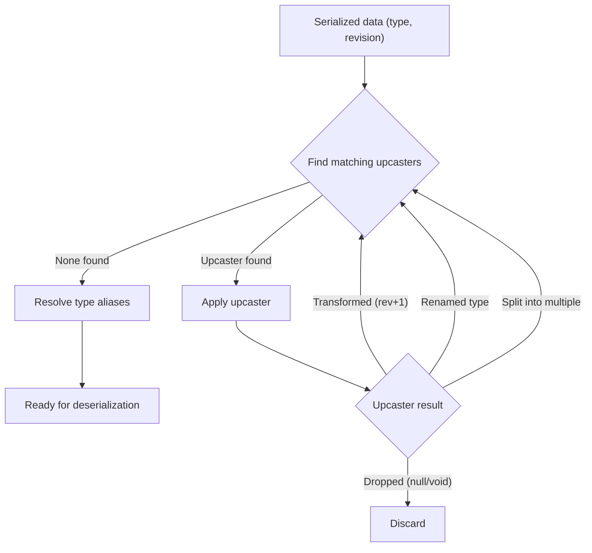

import { Aside, Tabs, TabItem } from '@astrojs/starlight/components';

Fluxzero uses a `Serializer` to convert message payloads, snapshots, key-value entries, and other stored data into
a binary format (typically `byte[]`). By default, the client uses a Jackson-based implementation that serializes objects
to JSON.

The serializer is fully pluggable, and you can supply your own by implementing or extending `AbstractSerializer`.

---

## Registered simple type names

Use `@RegisterType` when a frontend or another external producer should not need to send a Java/Kotlin fully qualified
name. The annotation processor indexes a type or package at compile time.

<Tabs>
  <TabItem label="Java">
    ```java
    @RegisterType
    package com.example.api;
    ```
  </TabItem>
  <TabItem label="Kotlin">
    ```kotlin
    @RegisterType(root = "com.example.api")
    object TypeRegistryMarker
    ```
  </TabItem>
</Tabs>

The producer can then use `CreateUser`, or a distinguishing suffix such as `user.CreateUser`, as the serialized
envelope type. This is not limited to commands and queries: events, documents, snapshots, and other serialized payloads
use the same resolution. Root and nested JSON `@class` values use the same registry:

```json
{
  "@class": "CreateUser",
  "userId": "user-123"
}
```

Simple names must be unique across the registered types. When names collide, send enough trailing package segments to
distinguish the intended class. Annotation processing must run in every module that contributes registered types;
Kotlin uses `kapt`.

Separate classpath entries and Spring Boot nested JARs retain the generated module indexes automatically. A custom
uber-JAR is responsible for combining the fixed registry resource itself. With Maven Shade, for example:

```xml
<transformer implementation="org.apache.maven.plugins.shade.resource.AppendingTransformer">
    <resource>META-INF/io.fluxzero.common.serialization.TypeRegistry</resource>
</transformer>
```

Fully qualified names continue to work. Use [type aliases](#type-aliases) for old FQNs that may already be stored or
queued after a package move; use registered simple names to keep current producers independent of backend package
layout.

Resolution first applies historical exact or package aliases and then resolves the resulting unique registered name.
Canonical generic type declarations and unknown identifiers retain Jackson's existing behavior.
For incoming envelope types, registered names are normalized before revision upcasters are selected. Older revisions
therefore use the same upcaster as their fully qualified type. Historical aliases intentionally remain a post-upcast
compatibility step, allowing an upcaster for the old type to run before its package is mapped.

---

## Revisions

To track changes in your data model, annotate your class with `@Revision`. When deserializing, Fluxzero will use this
revision number to determine whether any transformation is required.

<Tabs>
  <TabItem label="Java">
    ```java
    @Revision(1)
    public record CreateUser(String userId) { // userId renamed from id
    }
    ```
  </TabItem>
  <TabItem label="Kotlin">
    ```kotlin
    @Revision(1)
    data class CreateUser(val userId: String) // userId renamed from id
    ```
  </TabItem>
</Tabs>

---

## Upcasting

Upcasting transforms a serialized object from an older revision to a newer one.

If only the fully qualified type or package name changed and the JSON structure stayed compatible, use a
[type alias](#type-aliases) instead of an upcaster.

<Aside type="note">
Upcasters operate on top-level serialized objects (payloads, documents, snapshots, key-value entries), not on nested
types in isolation. If a nested model change affects multiple top-level payload/document types, add upcasters (and new
`@Revision`s) for each affected top-level type.
</Aside>

<Tabs>
  <TabItem label="Java">
    ```java
    class CreateUserUpcaster {

        @Upcast(type = "com.example.CreateUser", revision = 0)
        ObjectNode upcastV0toV1(ObjectNode json) {
            json.set("userId", json.remove("id"));
            return json;
        }
    }
    ```
  </TabItem>
  <TabItem label="Kotlin">
    ```kotlin
    class CreateUserUpcaster {

        @Upcast(type = "com.example.CreateUser", revision = 0)
        fun upcastV0toV1(json: ObjectNode): ObjectNode {
            json.set("userId", json.remove("id"))
            return json
        }
    }
    ```
  </TabItem>
</Tabs>

This method is applied before deserialization. The object is transformed as needed so your code always receives the
current version.

To also modify the **type name**, return a `Data<ObjectNode>`:

<Tabs>
  <TabItem label="Java">
    ```java
    @Upcast(type = "com.example.CreateUser", revision = 0)
    Data<ObjectNode> renameType(Data<ObjectNode> data) {
        return data.withType("com.example.RegisterUser");
    }
    ```
  </TabItem>
  <TabItem label="Kotlin">
    ```kotlin
    @Upcast(type = "com.example.CreateUser", revision = 0)
    fun renameType(data: Data<ObjectNode>): Data<ObjectNode> {
        return data.withType("com.example.RegisterUser")
    }
    ```
  </TabItem>
</Tabs>

You can even change a message’s metadata during upcasting:

<Tabs>
  <TabItem label="Java">
    ```java
    @Upcast(type = "com.example.CreateUser", revision = 0)
    Metadata changeMetadata(Metadata metadata, SerializedMessage message) {
        return metadata.with("timestamp", Instant.ofEpochMilli(message.getTimestamp()).toString());
    }
    ```
  </TabItem>
  <TabItem label="Kotlin">
    ```kotlin
    @Upcast(type = "com.example.CreateUser", revision = 0)
    fun changeMetadata(metadata: Metadata, message: SerializedMessage): Metadata {
        return metadata.with("timestamp", Instant.ofEpochMilli(message.timestamp).toString())
    }
    ```
  </TabItem>
</Tabs>

`Metadata` can be injected alongside the payload, `Data`, or `SerializedMessage`. Returning `Metadata` replaces the
message metadata, leaves the payload unchanged, and advances the revision. The original `SerializedMessage` is not
mutated.

This can be useful for retrofitting missing fields, adding tracing info, or migrating older messages to include
required metadata keys.

Upcasting also applies to stored data that has no message context, such as snapshots, key-value entries, and documents.
Such input cannot provide metadata. A non-nullable `Metadata` parameter therefore causes deserialization to fail. If
the upcaster supports both cases, make the parameter nullable:

<Tabs>
  <TabItem label="Java">
    ```java
    @Upcast(type = "com.example.CreateUser", revision = 0)
    ObjectNode upcast(ObjectNode json, @Nullable Metadata metadata) {
        return metadata == null ? json : json.put("tenant", metadata.get("tenant"));
    }
    ```
  </TabItem>
  <TabItem label="Kotlin">
    ```kotlin
    @Upcast(type = "com.example.CreateUser", revision = 0)
    fun upcast(json: ObjectNode, metadata: Metadata?): ObjectNode {
        return metadata?.get("tenant")?.let { json.put("tenant", it) } ?: json
    }
    ```
  </TabItem>
</Tabs>

For Java, any runtime annotation whose simple name is `Nullable` is accepted. Kotlin nullable parameter types are
recognized directly. Returning `Metadata` still requires message input because non-message data has nowhere to store
it.

---

### Dropping or splitting messages

Upcasters can also drop a message by returning `null` or `void`, or split it into multiple new ones:

<Tabs>
  <TabItem label="Java">
    ```java
    @Upcast(type = "com.example.CreateUser", revision = 0)
    void dropIfDeprecated(ObjectNode json) {
        // returning void removes this message from the stream
    }

    @Upcast(type = "com.example.CreateUser", revision = 0)
    Stream<Data<ObjectNode>> split(Data<ObjectNode> data) {
        return Stream.of(data, new Data<>(...));
    }
    ```
  </TabItem>
  <TabItem label="Kotlin">
    ```kotlin
    @Upcast(type = "com.example.CreateUser", revision = 0)
    fun dropIfDeprecated(json: ObjectNode) {
        // returning Unit removes this message from the stream
    }

    @Upcast(type = "com.example.CreateUser", revision = 0)
    fun split(data: Data<ObjectNode>): Stream<Data<ObjectNode>> {
        return Stream.of(data, Data(...))
    }
    ```
  </TabItem>
</Tabs>

This works for any stored data — not just messages, but also snapshots, key-value entries, and documents.

---

## Type aliases

Use a type alias when serialized data contains an old Java/Kotlin type name, but its payload and revision do not need
to change. For most applications, configure all exact aliases and package aliases together in
`application.properties`:

```properties
fluxzero.serialization.typeAliases=host.example.LegacyCommand=io.example.CurrentCommand,host.example.events.*=io.example.events.*
```

For deployment configuration, use the conventional environment-variable name. Quote the value so the shell does not
interpret the `*` characters:

```bash
export FLUXZERO_SERIALIZATION_TYPE_ALIASES='host.example.LegacyCommand=io.example.CurrentCommand,host.example.events.*=io.example.events.*'
```

The compact `FLUXZERO_SERIALIZATION_TYPEALIASES` spelling is also accepted. Environment variables follow the normal
property resolution order and take precedence over system and application properties. The selected property value is
the complete comma-, semicolon-, or newline-separated alias list. Add `.*` on both sides to identify a package alias.

Aliases apply to the top-level serialized type, to polymorphic `@class` values nested anywhere in Jackson JSON, and to
JSON-encoded message metadata when it is read as an object through `Metadata#get`. Raw metadata strings remain
unchanged. `TestFixture` also resolves a legacy root `@class` in a non-revisioned fixture. A revisioned fixture keeps
its declared old type through the upcaster chain and applies the alias afterwards.

Use `FluxzeroBuilder` when the aliases are intentionally owned by application code or a test:

<Tabs>
  <TabItem label="Java">
    ```java
    Fluxzero fluxzero = DefaultFluxzero.builder()
            .addTypeAlias("host.example.LegacyCommand", "io.example.CurrentCommand")
            .addPackageAlias("host.example.events", "io.example.events")
            .build(client);
    ```
  </TabItem>
  <TabItem label="Kotlin">
    ```kotlin
    val fluxzero = DefaultFluxzero.builder()
        .addTypeAlias("host.example.LegacyCommand", "io.example.CurrentCommand")
        .addPackageAlias("host.example.events", "io.example.events")
        .build(client)
    ```
  </TabItem>
</Tabs>

A package alias includes the package itself and all its subpackages while preserving the remainder of the class name.
Package boundaries are respected: `host.example` does not match `host.examples.SomeType`. Exact aliases take
precedence over package aliases, and the longest matching package prefix wins when package aliases overlap. Aliases
may chain, but cycles are rejected during registration.

Programmatic aliases take precedence over property aliases with the same source. Aliases are configured on the
primary and snapshot serializers and on a serializer-backed document serializer. A custom `Serializer` may support
exact aliases through `registerTypeAlias(...)` while opting out of package aliases.

<Aside type="note">
Upcasters run before aliases. An `@Upcast` method must therefore select the serialized source type, even when an alias
ultimately resolves that type to its current class name. Use an upcaster when the payload or revision changes; use an
alias for a pure type or package rename. They can be combined when both are needed.
</Aside>

---

## Upcasting flow

When a stored data object is deserialized, Fluxzero uses the object’s **type** and **revision** to traverse the tree of registered upcasters. Each upcaster specifies which type+revision it can handle, and may:

- Transform the data to the next revision,
- Change the type name,
- Split the object into multiple new ones,
- Or drop it entirely.

The traversal continues until no upcasters match the current type+revision. Fluxzero then resolves exact and package
aliases before deserializing the data into a Java/Kotlin object.



<Aside type="note">
Each object may pass through multiple upcasters in sequence. Fluxzero guarantees that your application code only ever sees the latest revision.
</Aside>

---

## Testing upcasters from JSON

Use `@class` and `@revision` to pass an older serialized payload through the normal upcaster chain without declaring a
full `Data` wrapper:

```json
{
  "@class": "com.example.CreateUser",
  "@revision": 0,
  "id": "user-123"
}
```

<Tabs>
  <TabItem label="Java">

```java
fixture.whenUpcasting("/users/create-user-revision-0.json")
       .expectResult(new CreateUser("user-123"));
```

  </TabItem>
  <TabItem label="Kotlin">

```kotlin
fixture.whenUpcasting("/users/create-user-revision-0.json")
    .expectResult(CreateUser("user-123"))
```

  </TabItem>
</Tabs>

The `@class` value is used as `Data.type`, so the upcaster is selected by the same type-and-revision pair as stored
data. Both control markers are removed before upcasting. Registered exact and package aliases are then applied to the
resulting type before deserialization. Configure them through `fluxzero.serialization.typeAliases` or
`FLUXZERO_SERIALIZATION_TYPE_ALIASES`, on `FluxzeroBuilder`, or directly on the fixture with
`registerTypeAlias(...)` and `registerPackageAlias(...)`. A property named `revision` without the `@` prefix is always
ordinary payload data.

Untyped `JsonUtils.fromFile(...)` and `JsonUtils.fromJson(...)` calls expose the same representation as
`Data<JsonNode>`, making revisioned JSON useful outside `TestFixture` as well. Explicitly typed `JsonUtils` overloads
keep their declared return type.

---

## Downcasting

Downcasting does the reverse: it converts a newer object into an older format. This is useful for emitting
legacy-compatible data or supporting external systems.

<Tabs>
  <TabItem label="Java">
    ```java
    class CreateUserDowncaster {

        @Downcast(type = "com.example.CreateUser", revision = 1)
        ObjectNode downcastV1toV0(ObjectNode json) {
            json.set("id", json.remove("userId"));
            return json;
        }
    }
    ```
  </TabItem>
  <TabItem label="Kotlin">
    ```kotlin
    class CreateUserDowncaster {

        @Downcast(type = "com.example.CreateUser", revision = 1)
        fun downcastV1toV0(json: ObjectNode): ObjectNode {
            json.set("id", json.remove("userId"))
            return json
        }
    }
    ```
  </TabItem>
</Tabs>

To downcast an object to a desired revision, use:

<Tabs>
  <TabItem label="Java">
    ```java
    Fluxzero.downcast(object, revision);
    ```
  </TabItem>
  <TabItem label="Kotlin">
    ```kotlin
    Fluxzero.downcast(object, revision)
    ```
  </TabItem>
</Tabs>

<Aside type="note">
This returns the downcasted version of the object in serialized form (e.g., as an <code>ObjectNode</code>), allowing you to
inspect or persist the object as it would appear in an earlier revision.
</Aside>

---

## Registration

When using Spring, any bean containing `@Upcast` or `@Downcast` methods is automatically registered with the
serializer.

Outside of Spring, register them manually:

<Tabs>
  <TabItem label="Java">
    ```java
    serializer.registerCasters(new CreateUserUpcaster(), new CreateUserDowncaster());
    ```
  </TabItem>
  <TabItem label="Kotlin">
    ```kotlin
    serializer.registerCasters(CreateUserUpcaster(), CreateUserDowncaster())
    ```
  </TabItem>
</Tabs>

---

## How it works

- On deserialization:
  - Fluxzero detects the revision of the stored object
  - Applies all applicable `@Upcast` methods (in order)
  - Resolves exact and package type aliases
  - Then deserializes into the latest version

- On serialization:
  - Fluxzero stores the latest type and revision
  - If needed, a `@Downcast` can adapt it for external use

All casting occurs in your application, not in the Fluxzero Runtime. Stored messages remain unchanged.

---

## Best practices

- Use `@Revision` to version any payloads that are stored or transmitted
- Use type or package aliases for pure fully qualified name changes that do not alter the payload or revision
- Use `ObjectNode` for simple structural changes, or `Data<ObjectNode>` to modify metadata
- Chain upcasters one revision at a time (`v0 → v1`, `v1 → v2`, etc.)
- Ensure upcasters are side-effect free and deterministic

<Aside type="note">
Upcasting is essential when using event sourcing or durable message storage — these messages may live for years.
</Aside>
