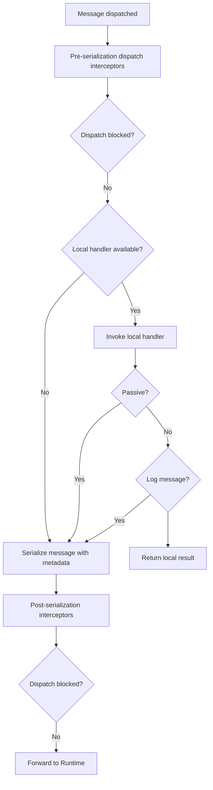

import { Tabs, TabItem } from '@astrojs/starlight/components';
import { Aside } from '@astrojs/starlight/components';

Fluxzero provides a unified way to send all types of messages — **commands**, **events**, **queries**, **schedules**, **web requests**, **metrics**, and more.

All messages are routed through the same infrastructure, with built-in support for:

- **Location transparency** — handlers may run locally or remotely, but behave the same
- **Dispatch interceptors** — for enriching, logging, suppressing, or validating messages
- **Local-first handling** — handlers in the current process are invoked directly
- **Automatic forwarding** to the Fluxzero Runtime if no local handler is present
- **Serialization and correlation** — all messages carry metadata for tracing, retries, and audit

---

## Delivery defaults and completion

`Guarantee.DEFAULT` applies to publication, results/HTTP responses, WebSocket messages/ping/close, indexing,
document deletion/movement, collection deletion, audit trails, key-value writes, schedules, retention, and truncation.
SDK 2.x resolves it to `STORED`; SDK 1.x normally resolves it to `NONE`, while schedule-client creation and cancellation retain `SENT` without an override. This choice is independent of
`fluxzero.defaults.version`. Configure `fluxzero.publishing.defaultGuarantee`
(`FLUXZERO_PUBLISHING_DEFAULT_GUARANTEE`) as `NONE`, `SENT`, or `STORED` to override it. Despite its historic
property name, this setting applies beyond publication. The standard builder resolves its own property source
before creating components, including namespace views and TestFixture components. Direct WebSocket client calls use
that client's `ClientConfig.fromProperties(source)` policy, independent of application gateway configuration.
Metrics retain `NONE`; request/result dispatch retains `SENT`; ordinary bulk execution and explicit `AndWait`
operations retain `STORED`. Internal model/aggregate/stateful-handler persistence keeps explicit durable guarantees.
Explicit concrete guarantees remain unchanged. `DEFAULT` is an SDK choice, never a wire value.

Convenience calls return after dispatch/local handling, without waiting for each remote storage acknowledgement.
The default consumer's `awaitOutgoingWrites=true` waits for registered outgoing-command futures before committing
its position. A finished handler, a stored outgoing message, and a committed input position are separate boundaries.
This is at-least-once processing: a crash after publication but before position commit can repeat side effects;
use idempotent consumers. Storage acknowledgement does not mean that a downstream handler finished.

Outgoing commands within a batch can overlap their acknowledgements; independent trackers can keep processing while
another awaits storage. A tracker drains its own batch before claiming the next one, preserving segment ownership
and bounding pending completion state to the batch. Delayed acknowledgements apply backpressure there. Failed or
cancelled delivery prevents that batch's position from advancing, subject to the configured consumer error policy.
Transport retry/reconnect behaviour is unchanged. Shutdown cannot make an unacknowledged publication durable;
an uncommitted input remains replayable.

With asynchronous handling, the completion scope includes the framework-managed handler invocation. If
`awaitAsyncResults=false`, work started only by a later continuation of an unawaited returned stage is outside that
boundary. Incomplete streamed messages and invocations queued behind them retain deferred completion, because their bodies
may require later input batches; they cannot hold the current chunk position until the whole stream finishes.
Arbitrary application-created background work is also outside the tracked scope. Setting
`awaitOutgoingWrites=false` deliberately opts out of the outgoing-command barrier.

Outside tracking there is no consumer-position barrier. To observe acknowledgement or asynchronous failure,
keep the returned future:

```java
CompletableFuture<Void> delivery = Fluxzero.get().eventGateway()
        .publish(new Message(event), Guarantee.DEFAULT);
delivery.join(); // Wait at an explicit application boundary, not once per event in a handler.
```

```kotlin
val delivery = Fluxzero.get().eventGateway().publish(Message(event), Guarantee.DEFAULT)
delivery.join()
```

Locally handled or suppressed messages retain their existing local behaviour; `STORED` does not force a local-only
message into the Runtime. Request/response calls keep their response-completion contract. Metrics/transport diagnostics, internal durable persistence and position-store operations retain their explicit
guarantees. Low-level WebSocket client methods resolve DEFAULT from their client configuration; raw protocol
request objects require concrete guarantees.

---

## Logical messages and transport envelopes

A `Message` contains payload, metadata, message ID and timestamp. A `SerializedMessage` additionally carries
transport fields such as source, target, request ID and log index. Converting a received wrapper to a logical
Message and sending it again is a new dispatch, not transparent forwarding of the original envelope.

| Route for a command/query | Supplied logical message ID | Transport source |
| --- | --- | --- |
| Serialize, edit envelope, then deserialize | Preserved | Preserved on that serialized wrapper |
| Local in-process handling / synchronous TestFixture | Preserved unless deliberately replaced | No transport source |
| Tracked request via LocalClient / asynchronous TestFixture | Preserved unless deliberately replaced | Sending client's ID |
| Tracked request across WebSocket clients | Preserved unless deliberately replaced | Sending client's ID |

These rows apply equally to future-returning and blocking calls. `queryAndWait` and `sendCommandAndWait` can
wait for a remote consumer; `send` can complete locally. Async TestFixture can also contain explicitly local
handlers, so fixture mode alone is not proof that a specific message crossed transport.

Request transport assigns source for response correlation. Do not depend on a manually supplied source surviving
redispatch, and do not treat source or a caller-selected message ID as authenticated identity. Use application
metadata for a deliberately forwarded correlation value and preserve the appropriate trusted user context.

### Replacements and interceptors

For a logical identity change, return a replacement rather than mutating a cached serialized representation:

```java
Message replacement = incoming.toMessage().withMessageId("new-logical-id");
DeserializingMessage view = incoming.withMessage(replacement);
Fluxzero.sendCommand(view);
```

```kotlin
val replacement = incoming.toMessage().withMessageId("new-logical-id")
val view = incoming.withMessage(replacement)
Fluxzero.sendCommand(view)
```

For an edited serialized envelope, finish edits before calling `serializer.deserializeMessage(...)`.
Treat input as read-only afterwards: a `DeserializingMessage` lazily caches its logical Message, and later
serialized mutations do not synchronize that existing value. Deserialize again after deliberate envelope editing.
Do not mutate a submitted message while dispatch/serialization may still be using it.

`DispatchInterceptor.interceptDispatch` returns logical replacements for local and external dispatch.
`modifySerializedMessage` concerns the serialized publication path and is not a general local-handler hook;
request transport can still assign its own correlation fields afterwards. A metadata/payload-only replacement
should retain the existing identity unless a genuinely distinct message is intended.

Absolute HTTP stubs in TestFixture run normal handlers, not a real native HTTP client or proxy. They are unsuitable
for proving a remote source/target envelope. Direct native HTTP carries HTTP headers and bodies, not a Fluxzero
command/query envelope; mapping extra metadata into HTTP must be explicit.

---

## Sending a message

The simplest way to send messages is via static methods on the `Fluxzero` class:

<Tabs>
<TabItem value="Java" label="Java">

```java
Fluxzero.sendCommand(new CreateUser("Alice")); // Async command
Fluxzero.queryAndWait(new GetUser("user-123")); // Blocking query
Fluxzero.publishEvent(new UserSignedUp(...)); // Fire-and-forget event
Fluxzero.schedule(new RetryPayment(...), Duration.ofMinutes(5)); // Delayed schedule
```

</TabItem>
<TabItem value="Kotlin" label="Kotlin">

```kotlin
Fluxzero.sendCommand(CreateUser("Alice"))
Fluxzero.queryAndWait(GetUser("user-123"))
Fluxzero.publishEvent(UserSignedUp(...))
Fluxzero.schedule(RetryPayment(...), Duration.ofMinutes(5))
```

</TabItem>
</Tabs>

Messages can include metadata:

```java
Fluxzero.sendCommand(new CreateUser("Bob"),
                     Metadata.of("source", "admin-ui"));
```

<Aside type="tip">
  Messages are not addressed to specific destinations. Fluxzero handles routing based on message type, not location.
</Aside>

---

### Commands

Commands trigger domain behavior and optionally return a result.

**Fire-and-forget:**

```java
Fluxzero.sendAndForgetCommand(new CreateUser("Alice"));
```

**Send and wait:**

```java
UserId id = Fluxzero.sendCommandAndWait(new CreateUser("Charlie"));
```

**Async:**

```java
CompletableFuture<UserId> future =
    Fluxzero.sendCommand(new CreateUser("Bob"));
```

---

### Queries

Queries retrieve state from read models or projections.

**Blocking:**

```java
UserProfile profile =
    Fluxzero.queryAndWait(new GetUserProfile("user456"));
```

**Async:**

```java
CompletableFuture<UserProfile> result =
    Fluxzero.query(new GetUserProfile("user123"));
```

---

### Events

Events can be published via:

```java
Fluxzero.publishEvent(new UserLoggedIn("user789"));
```

By default:

- ✅ Events are **persisted** in the event log for downstream processing.
- ⚠️ If a **local handler exists**, the event will not be forwarded unless `@LocalHandler(logMessage = true)`.

<Aside type="tip">
  To publish an event for an entity, use <code>entity.apply(...)</code>. This ensures the event is conditionally logged and published according to entity configuration.
</Aside>

---

### Schedules

Schedule messages for future delivery:

```java
Fluxzero.schedule(new ReminderFired(), Duration.ofMinutes(5));
```

Schedule periodic tasks:

```java
Fluxzero.schedulePeriodic(new PollExternalApi());
```

---

### Web requests

Send outbound HTTP calls through the Fluxzero Runtime:

```java
WebRequest request = WebRequest
    .get("https://api.example.com/data").build();
WebResponse response = Fluxzero.get()
    .webRequestGateway().sendAndWait(request);
```

---

### Metrics

Send custom metric messages:

```java
Fluxzero.publishMetrics(
    new SystemLoadMetric(cpu, memory));
```

---

## Dispatch interceptors

A `DispatchInterceptor` lets you hook into the message pipeline before it’s published to Fluxzero or handled locally. Interceptors are a powerful way to enrich, validate, log, or even block messages at dispatch time.

<Tabs>
  <TabItem label="Java">
    ```java
    public class LoggingInterceptor implements DispatchInterceptor {
        @Override
        public Message interceptDispatch(Message message, MessageType type,
                                         String topic) {
            log.info("Dispatching: {} to topic {}", type, topic);
            return message;
        }
    }
    ```
  </TabItem>
  <TabItem label="Kotlin">
    ```kotlin
    class LoggingInterceptor : DispatchInterceptor {
        override fun interceptDispatch(message: Message, type: MessageType,
                                       topic: String): Message {
            log.info("Dispatching: {} to topic {}", type, topic)
            return message
        }
    }
    ```
  </TabItem>
</Tabs>

**What you can do with an interceptor:**

- `interceptDispatch(...)` — inspect, modify, or block a message before it’s dispatched
- `modifySerializedMessage(...)` — adjust the serialized form of a message before it’s sent across the wire
- `monitorDispatch(...)` — observe or log the final message as it leaves the system

To block dispatch, simply return `null` from the `interceptDispatch` method.

**Registering an interceptor globally**
Assuming you are configuring a `FluxzeroBuilder builder`:
<Tabs>
  <TabItem label="Java">
```java
builder.addDispatchInterceptor(new LoggingInterceptor(), MessageType.COMMAND, MessageType.EVENT);
```
  </TabItem>
  <TabItem label="Kotlin">
```kotlin
builder.addDispatchInterceptor(LoggingInterceptor(), MessageType.COMMAND, MessageType.EVENT)
```
  </TabItem>
</Tabs>

See [Configuring Fluxzero](/docs/guides/configuration/configuring-fluxzero) for details on registration.

---

## What happens after dispatch?

Fluxzero processes the message through the following pipeline:

### 1. Pre-serialization interceptors

All configured `DispatchInterceptor`s run first. They may:

- Inject or modify metadata
- Validate or mutate the message
- Block or suppress delivery

### 2. Local handlers

If a local handler matches the message type/topic, it’s invoked immediately. Otherwise, the message is forwarded.

<Aside type="tip">
  Local handlers with <code>@LocalHandler(logMessage = true)</code> allow messages to be both handled and forwarded.
</Aside>

### 3. Serialization

The message is serialized (typically via Jackson), tagged with metadata, and versioned for transport.

### 4. Post-serialization interceptors

A second pass of interceptors may adjust or enrich the serialized form before sending.

### 5. Runtime forwarding

Messages not handled locally are published to the Fluxzero Runtime. From there, delivery guarantees, retries, rate limits, and remote handler routing apply.

### Full dispatch flow

The diagram below illustrates the full dispatch pipeline. At each step, processing may end early if the message is blocked or suppressed.



---

## Routing keys

Sometimes you need all messages with the same identifier to be processed in order, while still allowing parallelism across unrelated entities. Fluxzero supports this through the <code>@RoutingKey</code> annotation.


Apply <code>@RoutingKey</code> to a field in your message payload (or metadata) to ensure that all messages sharing the same key are handled sequentially. This is especially useful for per-customer, per-order, or per-entity consistency.

Routing keys are converted into a hash using **consistent hashing** at dispatch time. This ensures even distribution across segments while maintaining order for messages that share the same key.

Handlers may also override the routing key for finer control. See [Custom routing keys](/docs/guides/messaging/message-tracking/#custom-routing-keys) for details.

### Examples
You can place the annotation directly on a field, or point it to a nested property path:

<Tabs>
<TabItem value="Java" label="Java">

```java
public record ShipOrder(@RoutingKey OrderId orderId) {
}
```

```java
@RoutingKey("customer/id")
public record OrderPlaced(Customer customer) {
}
```

</TabItem>
<TabItem value="Kotlin" label="Kotlin">

```kotlin
data class ShipOrder(
    @RoutingKey val orderId: OrderId
)
```

```kotlin
@RoutingKey("customer/id")
data class OrderPlaced(
    val customer: Customer
)
```

</TabItem>
</Tabs>

---

## Request timeouts

Apply `@Timeout` to a payload class (command or query) to enforce maximum wait time for blocking calls:

```java
@Timeout(value = 3, timeUnit = TimeUnit.SECONDS)
public record CalculatePremium(UserProfile profile)
    implements Request<BigDecimal> {}
```

When sent using `queryAndWait(...)`, this timeout is respected:

```java
BigDecimal result = Fluxzero
    .queryAndWait(new CalculatePremium(user));
```

If no response arrives in time, a `TimeoutException` is thrown.

<Aside type="tip">
  Asynchronous requests like <code>send(...)</code> don’t enforce timeouts automatically. Use <code>orTimeout(...)</code> on the returned `CompletableFuture` if needed.
</Aside>
