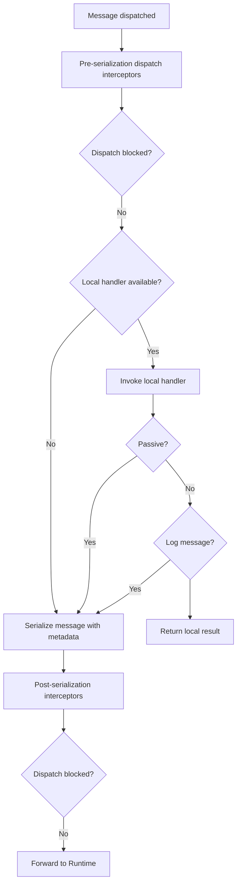

import Jdoclink from '~/components/jdoclink.astro';

import { Tabs, TabItem } from '@astrojs/starlight/components';
import { Aside } from '@astrojs/starlight/components';

Send a message to ask your application to do work or provide information. The sender names the action; Fluxzero
finds the handler, so the sender does not need its process address.

| Intent | Message kind |
| --- | --- |
| Ask for a change, such as creating a user | Command |
| Ask for information, such as a user's profile | Query |
| Announce something that happened | Event |
| Perform work later | Schedule |

## Sending a message

The simplest way to send messages is via static methods on the `Fluxzero` class:

<Tabs>
<TabItem value="Java" label="Java">

```java
Fluxzero.sendCommand(new CreateUser("Alice")); // Async command
```

</TabItem>
<TabItem value="Kotlin" label="Kotlin">

```kotlin
Fluxzero.sendCommand(CreateUser("Alice"))
```

</TabItem>
</Tabs>

Here `CreateUser` is your application's command payload, for example `record CreateUser(String name) {}`.
Its command handler decides what creating a user means. `sendCommand` returns a future for the result;
the variants below let you choose whether and how to wait.

Messages can include metadata:

<Tabs>
<TabItem label="Java">

```java
Fluxzero.sendCommand(new CreateUser("Bob"),
                     Metadata.of("source", "admin-ui"));
```

</TabItem>
<TabItem label="Kotlin">

```kotlin
Fluxzero.sendCommand<Any?>(CreateUser("Bob"), Metadata.of("source", "admin-ui"))
```

</TabItem>
</Tabs>

<Aside type="tip">
  Messages are not addressed to specific destinations. Fluxzero handles routing based on message type, not location.
</Aside>

---

### Commands

Commands trigger domain behavior and optionally return a result.

**Fire-and-forget:**

<Tabs>
<TabItem label="Java">

```java
Fluxzero.sendAndForgetCommand(new CreateUser("Alice"));
```

</TabItem>
<TabItem label="Kotlin">

```kotlin
Fluxzero.sendAndForgetCommand(CreateUser("Alice"))
```

</TabItem>
</Tabs>

**Send and wait:**

<Tabs>
<TabItem label="Java">

```java
UserId id = Fluxzero.sendCommandAndWait(new CreateUser("Charlie"));
```

</TabItem>
<TabItem label="Kotlin">

```kotlin
val id: UserId = Fluxzero.sendCommandAndWait(CreateUser("Charlie"))
```

</TabItem>
</Tabs>

**Async:**

<Tabs>
<TabItem label="Java">

```java
CompletableFuture<UserId> future =
    Fluxzero.sendCommand(new CreateUser("Bob"));
```

</TabItem>
<TabItem label="Kotlin">

```kotlin
val future: CompletableFuture<UserId> = Fluxzero.sendCommand(CreateUser("Bob"))
```

</TabItem>
</Tabs>

---

### Queries

Queries retrieve state from read models or projections.

**Blocking:**

<Tabs>
<TabItem label="Java">

```java
UserProfile profile =
    Fluxzero.queryAndWait(new GetUserProfile("user456"));
```

</TabItem>
<TabItem label="Kotlin">

```kotlin
val profile: UserProfile = Fluxzero.queryAndWait(GetUserProfile("user456"))
```

</TabItem>
</Tabs>

**Async:**

<Tabs>
<TabItem label="Java">

```java
CompletableFuture<UserProfile> result =
    Fluxzero.query(new GetUserProfile("user123"));
```

</TabItem>
<TabItem label="Kotlin">

```kotlin
val result: CompletableFuture<UserProfile> = Fluxzero.query(GetUserProfile("user123"))
```

</TabItem>
</Tabs>

---

### Events

Events can be published via:

<Tabs>
<TabItem label="Java">

```java
Fluxzero.publishEvent(new UserLoggedIn("user789"));
```

</TabItem>
<TabItem label="Kotlin">

```kotlin
Fluxzero.publishEvent(UserLoggedIn("user789"))
```

</TabItem>
</Tabs>

By default:

- ✅ Events are **persisted** in the event log for downstream processing.
- ⚠️ If a **local handler exists**, the event will not be forwarded unless `@LocalHandler(logMessage = true)`.

<Aside type="tip">
  For persisted domain changes, use the <a href="/docs/guides/modeling-and-persistence/updating-entities">Model update APIs</a>. They manage event storage and publication according to the Model configuration.
</Aside>

---

### Schedules

Schedule messages for future delivery:

<Tabs>
<TabItem label="Java">

```java
Fluxzero.schedule(new ReminderFired(), Duration.ofMinutes(5));
```

</TabItem>
<TabItem label="Kotlin">

```kotlin
Fluxzero.schedule(ReminderFired(), Duration.ofMinutes(5))
```

</TabItem>
</Tabs>

Schedule periodic tasks:

<Tabs>
<TabItem label="Java">

```java
Fluxzero.schedulePeriodic(new PollExternalApi());
```

</TabItem>
<TabItem label="Kotlin">

```kotlin
Fluxzero.schedulePeriodic(PollExternalApi())
```

</TabItem>
</Tabs>

---

### Web requests

Send outbound HTTP calls through the Fluxzero Runtime:

<Tabs>
<TabItem label="Java">

```java
WebRequest request = WebRequest
    .get("https://api.example.com/data").build();
WebResponse response = Fluxzero.get()
    .webRequestGateway().sendAndWait(request);
```

</TabItem>
<TabItem label="Kotlin">

```kotlin
val request = WebRequest.get("https://api.example.com/data").build()
val response = Fluxzero.get().webRequestGateway().sendAndWait(request)
```

</TabItem>
</Tabs>

---

### Metrics

Send custom metric messages:

<Tabs>
<TabItem label="Java">

```java
Fluxzero.publishMetrics(
    new SystemLoadMetric(cpu, memory));
```

</TabItem>
<TabItem label="Kotlin">

```kotlin
Fluxzero.publishMetrics(SystemLoadMetric(cpu, memory))
```

</TabItem>
</Tabs>

---

## Dispatch interceptors

A `DispatchInterceptor` lets you hook into the message pipeline before it’s published to Fluxzero or handled locally. Interceptors are a powerful way to enrich, validate, log, or even block messages at dispatch time.

<Tabs>
  <TabItem label="Java">
    ```java
    public class LoggingInterceptor implements DispatchInterceptor {
        @Override
        public Message interceptDispatch(Message message, MessageType type,
                                         String topic) {
            log.info("Dispatching: {} to topic {}", type, topic);
            return message;
        }
    }
    ```
  </TabItem>
  <TabItem label="Kotlin">
    ```kotlin
    class LoggingInterceptor : DispatchInterceptor {
        override fun interceptDispatch(message: Message, type: MessageType,
                                       topic: String): Message {
            log.info("Dispatching: {} to topic {}", type, topic)
            return message
        }
    }
    ```
  </TabItem>
</Tabs>

**What you can do with an interceptor:**

- `interceptDispatch(...)` — inspect, modify, or block a message before it’s dispatched
- `modifySerializedMessage(...)` — adjust the serialized form of a message before it’s sent across the wire
- `monitorDispatch(...)` — observe or log the final message as it leaves the system

To block dispatch, simply return `null` from the `interceptDispatch` method.

**Registering an interceptor globally**
Assuming you are configuring a `FluxzeroBuilder builder`:
<Tabs>
  <TabItem label="Java">
```java
builder.addDispatchInterceptor(new LoggingInterceptor(), MessageType.COMMAND, MessageType.EVENT);
```
  </TabItem>
  <TabItem label="Kotlin">
```kotlin
builder.addDispatchInterceptor(LoggingInterceptor(), MessageType.COMMAND, MessageType.EVENT)
```
  </TabItem>
</Tabs>

See [Configuring Fluxzero](/docs/guides/configuration/configuring-fluxzero) for details on registration.

---

## What happens after dispatch?

Fluxzero processes the message through the following pipeline:

### 1. Pre-serialization interceptors

All configured `DispatchInterceptor`s run first. They may:

- Inject or modify metadata
- Validate or mutate the message
- Block or suppress delivery

### 2. Local handlers

If a local handler matches the message type/topic, it’s invoked immediately. Otherwise, the message is forwarded.

<Aside type="tip">
  Local handlers with <code>@LocalHandler(logMessage = true)</code> allow messages to be both handled and forwarded.
</Aside>

### 3. Serialization

The message is serialized (typically via Jackson), tagged with metadata, and versioned for transport.

### 4. Post-serialization interceptors

A second pass of interceptors may adjust or enrich the serialized form before sending.

### 5. Runtime forwarding

Messages not handled locally are published to the Fluxzero Runtime. From there, delivery guarantees, retries, rate limits, and remote handler routing apply.

### Full dispatch flow

The diagram below illustrates the full dispatch pipeline. At each step, processing may end early if the message is blocked or suppressed.


```mermaid
graph TD
    START[Message dispatched] --> PRE[Pre-serialization dispatch interceptors]
    PRE --> PRE_BLOCK{Dispatch blocked?}
    PRE_BLOCK -->|No| HANDLERS{Local handler available?}
    HANDLERS -->|Yes| LOCAL[Invoke local handler]
    HANDLERS -->|No| SERIALIZE[Serialize message with metadata]
    LOCAL --> PASSIVE{Passive?}
    PASSIVE -->|Yes| SERIALIZE
    PASSIVE -->|No| LOG_MESSAGE{Log message?}
    LOG_MESSAGE -->|Yes| SERIALIZE
    LOG_MESSAGE --> RETURN_LOCAL_RESULT[Return local result]
    SERIALIZE --> POST[Post-serialization interceptors]
    POST --> POST_BLOCK{Dispatch blocked?}
    POST_BLOCK -->|No| FORWARD[Forward to Runtime]
```

---

## Routing keys

Sometimes you need all messages with the same identifier to be processed in order, while still allowing parallelism across unrelated entities. Fluxzero supports this through the <code>@RoutingKey</code> annotation.


Apply <code>@RoutingKey</code> to a field in your message payload (or metadata) to ensure that all messages sharing the same key are handled sequentially. This is especially useful for per-customer, per-order, or per-entity consistency.

Routing keys are converted into a hash using **consistent hashing** at dispatch time. This ensures even distribution across segments while maintaining order for messages that share the same key.

Handlers may also override the routing key for finer control. See [Custom routing keys](/docs/guides/messaging/message-tracking/#custom-routing-keys) for details.

### Examples
You can place the annotation directly on a field, or point it to a nested property path:

<Tabs>
<TabItem value="Java" label="Java">

```java
public record ShipOrder(@RoutingKey OrderId orderId) {
}
```

```java
@RoutingKey("customer/id")
public record OrderPlaced(Customer customer) {
}
```

</TabItem>
<TabItem value="Kotlin" label="Kotlin">

```kotlin
data class ShipOrder(
    @RoutingKey val orderId: OrderId
)
```

```kotlin
@RoutingKey("customer/id")
data class OrderPlaced(
    val customer: Customer
)
```

</TabItem>
</Tabs>

---

## Request timeouts

Apply `@Timeout` to a payload class (command or query) to enforce maximum wait time for blocking calls:

<Tabs>
<TabItem label="Java">

```java
@Timeout(value = 3, timeUnit = TimeUnit.SECONDS)
public record CalculatePremium(UserProfile profile)
    implements Request<BigDecimal> {}
```

</TabItem>
<TabItem label="Kotlin">

```kotlin
@Timeout(value = 3, timeUnit = TimeUnit.SECONDS)
data class CalculatePremium(val profile: UserProfile) : Request<BigDecimal>
```

</TabItem>
</Tabs>

When sent using `queryAndWait(...)`, this timeout is respected:

<Tabs>
<TabItem label="Java">

```java
BigDecimal result = Fluxzero
    .queryAndWait(new CalculatePremium(user));
```

</TabItem>
<TabItem label="Kotlin">

```kotlin
val result: BigDecimal = Fluxzero.queryAndWait(CalculatePremium(user))
```

</TabItem>
</Tabs>

If no response arrives in time, a `TimeoutException` is thrown.

<Aside type="tip">
  Asynchronous requests like <code>send(...)</code> don’t enforce timeouts automatically. Use <code>orTimeout(...)</code> on the returned `CompletableFuture` if needed.
</Aside>

---

## Delivery defaults and completion

A handler's response and a storage acknowledgement answer different questions. The response tells you the result
of the command or query. A storage acknowledgement tells you that the Runtime stored the outgoing message; it does
not mean a downstream handler has finished.

For ordinary outgoing messages, SDK 2.x uses `Guarantee.STORED` by default. You can override
`fluxzero.publishing.defaultGuarantee` (`FLUXZERO_PUBLISHING_DEFAULT_GUARANTEE`), or select a guarantee for one call:

<Tabs>
<TabItem label="Java">

```java
Fluxzero.sendCommand(new CreateUser("Alice"), Metadata.empty(), Guarantee.STORED);
```

</TabItem>
<TabItem label="Kotlin">

```kotlin
Fluxzero.sendCommand(CreateUser("Alice"), Metadata.empty(), Guarantee.STORED)
```

</TabItem>
</Tabs>

`NONE` does not await a transport acknowledgement, `SENT` waits for sending, and `STORED` waits for storage.
These choices do not change request/reply futures into delivery receipts or force local messages through the Runtime.
They are independent of `fluxzero.defaults.version`.

Convenience methods such as `publishEvent` do not individually wait for remote storage. When you need to observe
acknowledgement outside a handler, use the gateway overload that returns a future and await that future at the
application boundary. During tracked handling, the default consumer waits for registered outgoing writes before
advancing its position. Processing remains at least once: a crash can cause a message to be handled again, so
external side effects should be idempotent. See [Consumer settings](/docs/guides/messaging/message-tracking/#consumer-settings).

### Logical messages and transport envelopes

<span id="replacements-and-interceptors"></span>

A `Message` holds the payload, metadata, ID and timestamp. Sending a received message again creates a new dispatch;
the SDK assigns the transport information needed for that request. Use application metadata for correlation you
want to carry forward, and never treat a caller-supplied message ID or transport source as authenticated identity.

For exact overloads and completion contracts, see <Jdoclink className="GenericGateway" /> and
<Jdoclink className="Guarantee" />. Message replacement APIs are documented in
<Jdoclink className="DeserializingMessage" />.
