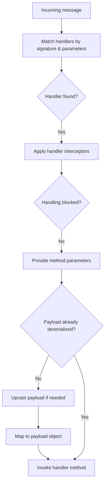

import { Aside, Tabs, TabItem } from '@astrojs/starlight/components';

A handler is the application code that responds to a message. Its annotation selects the kind of message; its
parameter type selects the payload. A return value becomes the answer to a command or query.

Here is a query and its complete handler:

<Tabs>
  <TabItem label="Java">

```java
public record GetGreeting(String name) implements Request<String> {}

class GreetingHandler {
    @HandleQuery
    String handle(GetGreeting query) {
        return "Hello, " + query.name() + "!";
    }
}
```

  </TabItem>
  <TabItem label="Kotlin">

```kotlin
data class GetGreeting(val name: String) : Request<String>

class GreetingHandler {
    @HandleQuery
    fun handle(query: GetGreeting) = "Hello, ${query.name}!"
}
```

  </TabItem>
</Tabs>

Register `GreetingHandler` with your application, or make it a Spring `@Component` for discovery.
Then ask the query through Fluxzero:

<Tabs>
  <TabItem label="Java">

```java
String greeting = Fluxzero.queryAndWait(new GetGreeting("Alice")); // "Hello, Alice!"
```

  </TabItem>
  <TabItem label="Kotlin">

```kotlin
val greeting = Fluxzero.queryAndWait(GetGreeting("Alice")) // "Hello, Alice!"
```

  </TabItem>
</Tabs>

`Request<String>` declares the answer's type. You can
[test this handler locally](/docs/guides/messaging/testing-your-handlers) without starting a Runtime.

### Reacting to an event

An event tells you something happened. A handler can start another action in response. For example, given your
application's `CreateUser` and `SendWelcomeEmail` payloads:

<Tabs>
  <TabItem label="Java">

```java
class UserEventHandler {
    @HandleEvent
    void handle(CreateUser event) {
        Fluxzero.sendCommand(new SendWelcomeEmail(event.getUserProfile()));
    }
}
```

  </TabItem>
  <TabItem label="Kotlin">

```kotlin
class UserEventHandler {
    @HandleEvent
    fun handle(event: CreateUser) {
        Fluxzero.sendCommand(SendWelcomeEmail(event.userProfile))
    }
}
```

  </TabItem>
</Tabs>

The email command has its own handler. This keeps reacting to user creation separate from sending the email.
Inside handlers, static `Fluxzero` calls use the current application instance.

## Handlers on the payload

Reusable operations can keep their handler on the command/query payload itself. This is also the default for an
external API interaction: the local `@HandleCommand` or `@HandleQuery` method makes the `WebRequestGateway` call,
and other handlers dispatch its payload instead of injecting an API-service bean. No `@TrackSelf` or `@Consumer` is
required merely for an external call. See [Local handling](/docs/guides/messaging/local-handling) and the complete
[outbound integration example](/docs/guides/messaging/sending-web-requests).

## Returning futures

Handler methods may also return a `CompletableFuture<T>` instead of a direct value. Fluxzero will publish the result when the future completes:

<Tabs>
<TabItem value="Java" label="Java">

```java
class AsyncUserQueryHandler {
    @HandleQuery
    CompletableFuture<UserProfile> handle(GetUserProfile query) {
        return userService.fetchAsync(query.getUserId());
    }
}
```

</TabItem>
<TabItem value="Kotlin" label="Kotlin">

```kotlin
class AsyncUserQueryHandler {
    @HandleQuery
    fun handle(query: GetUserProfile): java.util.concurrent.CompletableFuture<UserProfile> {
        return userService.fetchAsync(query.userId)
    }
}
```

</TabItem>
</Tabs>

<Aside type="caution">
    By default, a tracked consumer does not wait for a returned future before advancing its position. Use
    <code>@Consumer(awaitAsyncResults = true)</code> when completion must wait for that asynchronous work.
    See <a href="/docs/guides/messaging/message-tracking#completion-and-shutdown">completion and shutdown</a>
    for consumer completion settings.
</Aside>

## Handler matching & passive handlers

Fluxzero resolves which handler(s) should run based on **message type** and **specificity**.

### Most specific handler wins

If multiple methods in the *same class* match a message, only the most specific one is invoked.

<Tabs>
<TabItem value="Java" label="Java">

```java
class SpecificityExample {
    @HandleEvent
    void handle(Object event) { /* generic fallback */ }

    @HandleEvent
    void handle(CreateUser event) { /* specific handler */ }
}
```

</TabItem>
<TabItem value="Kotlin" label="Kotlin">

```kotlin
class SpecificityExample {
    @HandleEvent
    fun handle(event: Any) { /* generic fallback */ }

    @HandleEvent
    fun handle(event: CreateUser) { /* specific handler */ }
}
```

</TabItem>
</Tabs>

### Multiple classes are all invoked

When different classes handle the same payload, each eligible handler runs independently.

<Tabs>
<TabItem value="Java" label="Java">

```java
class BusinessHandler {
    @HandleEvent
    void handle(CreateUser event) { /* business logic */ }
}

class LoggingHandler {
    @HandleEvent
    void log(Object event) { /* audit/metrics */ }
}
```

</TabItem>
<TabItem value="Kotlin" label="Kotlin">

```kotlin
class BusinessHandler {
    @HandleEvent
    fun handle(event: CreateUser) { /* business logic */ }
}

class LoggingHandler {
    @HandleEvent
    fun log(event: Any) { /* audit/metrics */ }
}
```

</TabItem>
</Tabs>

### Requests prefer a single active handler

For **commands**, **queries**, and **web requests**, a single non-passive handler should produce the response. Additional passive handlers can observe for metrics/auditing.

<Tabs>
<TabItem value="Java" label="Java">

```java
class UserHandler {
    @HandleQuery
    UserAccount handle(GetUser query) {
        return userRepository.find(query.getUserId());
    }
}

class QueryMetricsHandler {
    @HandleQuery(passive = true)
    void record(Object query) {
        metrics.increment("queries." + query.getClass().getSimpleName());
    }
}
```

</TabItem>
<TabItem value="Kotlin" label="Kotlin">

```kotlin
class UserHandler {
    @HandleQuery
    fun handle(query: GetUser): UserAccount {
        return userRepository.find(query.userId)
    }
}

class QueryMetricsHandler {
    @HandleQuery(passive = true)
    fun record(query: Any) {
        metrics.increment("queries.${query::class.simpleName}")
    }
}
```

</TabItem>
</Tabs>

## Parameter resolvers

Fluxzero allows fine-grained control over handler method parameters using the `ParameterResolver` interface. This lets you inject any value into annotated handler methods — beyond just the payload or Message metadata.

When a message is dispatched to a handler (e.g. via `@HandleEvent`, `@HandleCommand`, etc.), the framework inspects the method’s parameters and resolves each one using the configured `ParameterResolvers`.

By default, Fluxzero supports injection of the following:

- The message payload (automatically matched by parameter type)
- The full **`Message`**, **`Schedule`**, or **`WebRequest`**
- The raw **`DeserializingMessage`** (for low-level access)
- The message **`Metadata`**
- The currently authenticated **`User`** (if available)
- The associated **`Entity`** wrapper or the entity value itself
- The triggering message (annotated with `@Trigger`)
- Any Spring bean (when Spring integration is enabled)

Other contextual values like message ID or timestamp can be obtained from the `Message`:

<Tabs>
  <TabItem label="Java">
    ```java
    @HandleEvent
    void handle(CreateUser event, Message message) {
        log.info("User created at {}", message.getTimestamp());
    }
    ```
  </TabItem>
  <TabItem label="Kotlin">
    ```kotlin
    @HandleEvent
    fun handle(event: CreateUser, message: Message) {
        log.info("User created at {}", message.timestamp)
    }
    ```
  </TabItem>
</Tabs>

### Writing your own resolver

You can create a custom resolver to inject arbitrary values, such as headers, timestamps, or contextual objects:

<Tabs>
  <TabItem label="Java">
    ```java
    public class TimestampParameterResolver implements ParameterResolver<DeserializingMessage> {
        @Override
        public Function<DeserializingMessage, Object> resolve(Parameter parameter, Annotation methodAnnotation) {
            if (parameter.getType().equals(Instant.class)) {
                return DeserializingMessage::getTimestamp;
            }
            return null;
        }
    }
    ```
  </TabItem>
  <TabItem label="Kotlin">
    ```kotlin
    class TimestampParameterResolver : ParameterResolver<DeserializingMessage> {
        override fun resolve(parameter: Parameter, methodAnnotation: Annotation): Function<DeserializingMessage, Any>? {
            return if (parameter.type == Instant::class.java) {
                Function { msg -> msg.timestamp }
            } else null
        }
    }
    ```
  </TabItem>
</Tabs>

Then register it via your builder:
Assuming you are configuring a `FluxzeroBuilder builder`:

<Tabs>
  <TabItem label="Java">
```java
    builder
        .addParameterResolver(new TimestampParameterResolver())
        .build();
```
  </TabItem>
  <TabItem label="Kotlin">
```kotlin
    builder
        .addParameterResolver(TimestampParameterResolver())
        .build()
```
  </TabItem>
</Tabs>

And use it in your handler:

<Tabs>
  <TabItem label="Java">
    ```java
    @HandleCommand
    void handle(CreateOrder command, Instant timestamp) {
        log.info("Command received at {}", timestamp);
    }
    ```
  </TabItem>
  <TabItem label="Kotlin">
    ```kotlin
    @HandleCommand
    fun handle(command: CreateOrder, timestamp: Instant) {
        log.info("Command received at {}", timestamp)
    }
    ```
  </TabItem>
</Tabs>

### Use cases

- Injecting request-specific context (e.g. tracing info)
- Supporting custom annotations (e.g. `@FromHeader`)
- Enabling access to correlated data (e.g. parent entity)
- Binding to environment or system values

Custom parameter injection is a powerful tool for modular, contextual logic. It works seamlessly with all handler annotations (`@HandleEvent`, `@HandleCommand`, `@HandleQuery`, `@HandleError`, etc.) and helps avoid boilerplate argument passing.

## Handler interceptors

A `HandlerInterceptor` lets you wrap or intercept the execution of handler methods. This gives you a central place to add cross‑cutting behavior such as:

- **Authorization & access control** — block or allow messages depending on the current user
- **Auditing & logging** — capture details about incoming messages, handler calls, or results
- **Validation** — enforce extra business rules before or after handler execution
- **Blocking** — stop the handler from being invoked entirely
- **Result transformation** — adjust or enrich results before they are published
- **Thread context propagation** — set up thread‑local state (e.g. correlation IDs, security principals)

<Tabs>
  <TabItem label="Java">
    ```java
    public class AuthorizationInterceptor implements HandlerInterceptor {
        @Override
        public Function<DeserializingMessage, Object> interceptHandling(
                Function<DeserializingMessage, Object> next, HandlerInvoker invoker) {
            return message -> {
                if (!isAuthorized(message)) {
                    throw new UnauthorizedException();
                }
                return next.apply(message);
            };
        }
    }
    ```
  </TabItem>
  <TabItem label="Kotlin">
    ```kotlin
    class AuthorizationInterceptor : HandlerInterceptor {
        override fun interceptHandling(
            next: Function<DeserializingMessage, Any>, invoker: HandlerInvoker
        ): Function<DeserializingMessage, Any> {
            return Function { message ->
                if (!isAuthorized(message)) {
                    throw UnauthorizedException()
                }
                next.apply(message)
            }
        }
    }
    ```
  </TabItem>
</Tabs>

You can register handler interceptors either per class (via `@Consumer` annotation) or globally across the application.
See [Configuring Fluxzero](/docs/guides/configuration/configuring-fluxzero) for details.

## Handler invocation flow

The diagram below shows how Fluxzero selects and invokes handlers for an incoming message:



- Handlers are selected based on method signatures and parameter types.
- Interceptors can wrap the call or block invocation altogether.
- On invocation, the message payload is deserialized if needed, which may include **upcasting** followed by **mapping** to the target object type.
