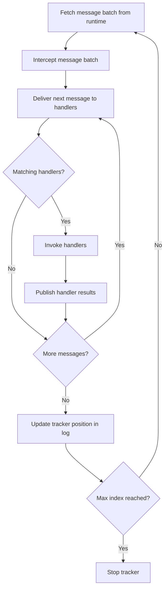
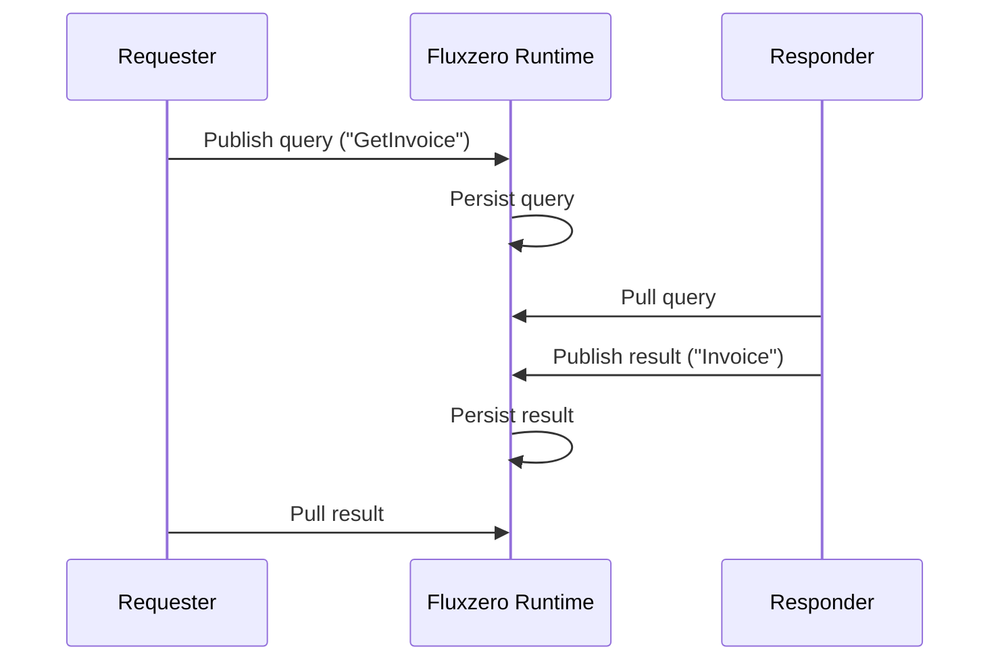

import { Tabs, TabItem } from '@astrojs/starlight/components';

Fluxzero handles message dispatch asynchronously by default. Messages are first written to the Fluxzero Runtime, where they are logged durably and made available to all subscribed consumers. From there, **consumers**, **trackers**, and **handlers** work together to process them.

- **Consumers** define a named subscription to a message type (commands, events, queries, etc.). Each consumer has its own position in the log and its own configuration (threads, fetch size, backpressure strategy).
- **Trackers** are the worker threads belonging to a consumer. A tracker fetches batches of messages from the Runtime and delivers them to handler methods. Multiple trackers per consumer enable parallelism.
- **Handlers** functionally process messages using annotated methods like `@HandleCommand`. You can configure which handlers belong to which consumers.

This separation makes Fluxzero highly flexible: you can isolate workloads into dedicated consumers, scale them independently, or run multiple consumers side by side in the same application.

## Tracking flow

The following diagram shows the lifecycle flow of a single tracker, responsible for fetching messages from the log and invoking the right handlers.
The process repeats in a continuous loop:



Trackers aren’t only useful for consuming commands or events — they also enable request–response communication between services, without direct endpoints.

## Request–Response via tracking

Fluxzero enables services to communicate without making any direct contact and without exposing endpoints. Instead of direct calls, services interact by publishing messages to the Fluxzero Runtime and continuously tracking the relevant logs.

For example, when a handler (the Requester) wants to ask a question, it sends a query to the runtime. Fluxzero first records it in the `QUERY` log. Other consumers will be tracking this log and will receive the query, process it, and then publish a result. That result is durably written to the `RESULT` log, where the Requester tracks for the corresponding answer.

This design ensures:
- **No direct connections between services**: all communication goes through Fluxzero.
- **Durability and auditability**: requests and responses are logged before delivery.
- **Decoupling and scalability**: Requesters and Responders can scale independently, and multiple responders can handle the same type of request if desired.

The diagram below shows the complete cycle:



Both the Requester and the Responder maintain continuous trackers:
- The Requester continuously tracks the `RESULT` log to receive answers.
- The Responder continuously tracks the `QUERY` log to receive new requests.

This ensures that services stay connected to Fluxzero and messages flow asynchronously without direct endpoints.
If multiple consumers handle the same request message type, multiple results can be produced. The requester resolves the first stored result and ignores later ones.

### Command followed by query

When a command handler updates a searchable aggregate, Fluxzero waits for asynchronous after-handler aggregate commits
before publishing the handler result by default. This means a command followed by a query can often read the
just-committed aggregate or search document immediately.

Do not rely on that for downstream side effects. If the query depends on indexing or projection work performed by an
event handler, wait for that projection's own signal, or return the state the caller needs from the command handler.

## Default Consumer Behavior

Handlers without an explicit `@Consumer` or matching custom `ConsumerConfiguration` are assigned according to the
configured unconfigured-handler consumer mode. If no mode is configured explicitly, `fluxzero.defaults.version`
selects the default behavior.

For defaults versions `2026.05.20` and newer, the default behavior is `perHandler`:

```properties
fluxzero.defaults.version=2026.05.20
# equivalent explicit setting:
fluxzero.tracking.unconfiguredHandlerConsumerMode=perHandler
```

With this defaults version, Fluxzero creates an isolated default consumer per handler class. The generated consumer
uses the default consumer configuration for the message type as its template and is named after the application and
handler class, for example `my-app_MyHandler`.

Existing applications without `fluxzero.defaults.version`, or with an older defaults version, keep the compatibility
default: unconfigured handlers join the shared application default consumer for the message type. You can choose either
behavior explicitly:

```properties
fluxzero.tracking.unconfiguredHandlerConsumerMode=perHandler
# or
fluxzero.tracking.unconfiguredHandlerConsumerMode=defaultAppConsumer
```

For example:

<Tabs>
<TabItem value="Java" label="Java">

```java
class MyHandler {
    @HandleCommand
    void handle(SomeCommand command) {
        // business logic here
    }
}
```

</TabItem>
<TabItem value="Kotlin" label="Kotlin">

```kotlin
class MyHandler {
    @HandleCommand
    fun handle(command: SomeCommand) {
        // business logic here
    }
}
```

</TabItem>
</Tabs>

With `perHandler`, this handler gets its own generated command consumer. With `defaultAppConsumer`, it joins the shared
default command consumer. If a consumer is configured through `FluxzeroBuilder` and matches the handler, that
configuration is used before the fallback. An explicit `@Consumer` on the handler remains most specific and therefore
takes precedence.

The practical difference is that `perHandler` gives each unconfigured handler its own tracking position and error
isolation. With `defaultAppConsumer`, unconfigured handlers for the same message type move together through one shared
consumer, which preserves the original compatibility behavior for existing applications.

## Namespaces

Namespaces isolate message logs and tracking state, so a single Fluxzero Runtime can host multiple environments
(for example `test`, `accept`, and `staging`) without clashing data.

- Set `FLUXZERO_NAMESPACE` (env var or property) to define the app's default namespace. This applies across subsystems
  (messaging, tracking, documents/search, event store, and related runtime operations).
- If no namespace is configured, the runtime default namespace is used.
- You can still set a namespace on `@Consumer(namespace = "...")` or via `ConsumerConfiguration.namespace(...)` for
  consumer-specific cross-namespace flows (for example, peeking/replaying from another namespace).

## Custom Consumers with @Consumer

The `@Consumer` annotation creates or selects a named consumer that runs independently of other consumers. Each consumer maintains its own trackers and log position. This lets you:

- Isolate heavy or latency-sensitive message flows into their own consumer.
- Tune concurrency (via `threads`) and throughput (via `maxFetchSize`) separately.
- Deploy multiple consumers side by side in the same app, each with dedicated resources.

<Tabs>
<TabItem value="Java" label="Java">

```java
@Consumer(name = "MyConsumer")
class MyHandler {
    @HandleCommand
    void handle(SomeCommand command) {
        // business logic
    }
}
```

</TabItem>
<TabItem value="Kotlin" label="Kotlin">

```kotlin
@Consumer(name = "MyConsumer")
class MyHandler {
    @HandleCommand
    fun handle(command: SomeCommand) {
        // business logic
    }
}
```

</TabItem>
</Tabs>

To apply this to an entire package (and its subpackages), add a `package-info.java` file:

```java
@Consumer(name = "MyConsumer")
package com.example.handlers;
```

### Customizing consumer configuration

You can also tune the behavior using additional attributes on the `@Consumer` annotation:

<Tabs>
<TabItem value="Java" label="Java">

```java
@Consumer(name = "MyConsumer", threads = 2, maxFetchSize = 100)
class MyHandler {
    @HandleCommand
    void handle(SomeCommand command) {
        // business logic
    }
}
```

</TabItem>
<TabItem value="Kotlin" label="Kotlin">

```kotlin
@Consumer(name = "MyConsumer", threads = 2, maxFetchSize = 100)
class MyHandler {
    @HandleCommand
    fun handle(command: SomeCommand) {
        // business logic
    }
}
```

</TabItem>
</Tabs>

- `threads = 2`: Two threads per application instance will fetch commands.
- `maxFetchSize = 100`: Up to 100 messages fetched per request, helping apply backpressure.

Each thread runs a **tracker**. If you deploy the app multiple times, Fluxzero automatically load-balances messages across all available trackers.

## Consumer settings

Fluxzero provides conservative defaults to ensure safe and sequential processing:

| Setting                | Description | Default value             |
|------------------------|-------------|---------------------------|
| `awaitAsyncResults`    | If true, waits for asynchronous handler results before finishing the batch. | `false`                   |
| `awaitSendAndForgetFutures` | If true, waits for fire-and-forget sends before storing position. | `true`                    |
| `batchInterceptors`    | Batch processing interceptors for this consumer. | `{}`                      |
| `clientControlledIndex` | If true, the app decides which messages to process. | `false`                   |
| `dispatchInterceptors` | Dispatch interceptors active while this consumer handles a batch. | `{}`                      |
| `durationUnit`         | Time unit for `maxWaitDuration`. | `SECONDS`                 |
| `errorHandler`         | Logs processing errors and continues. | `LoggingErrorHandler`     |
| `exclusive`            | Handlers are active in only one consumer. | `true`                    |
| `exclusiveAfterMaxIndex` | If true, keeps exclusivity after `maxIndexExclusive` is reached. | `true`                    |
| `exclusiveBeforeMinIndex` | If true, keeps exclusivity before `minIndex` is reached. | `true`                    |
| `filterMessageTarget`  | If true, only messages targeted to this instance are processed. | `false`                   |
| `flowRegulator`        | Default backpressure strategy; no throttling. | `NoOpFlowRegulator`       |
| `handlerInterceptors`  | Handler invocation interceptors for this consumer. | `{}`                      |
| `ignoreSegment`        | If true, bypasses Runtime sharding and processes all segments. | `false`                   |
| `maxFetchBytes`        | Serialized payload byte limit per fetch; `-1` inherits the global default. | `-1`                      |
| `maxFetchSize`         | Maximum messages per batch; balances throughput and memory. | `1024`                    |
| `maxIndexExclusive`    | Negative means no upper bound. | `-1`                      |
| `maxWaitDuration`      | How long to wait before polling again if no messages are available. | `60`                      |
| `minIndex`             | Negative means start at the end of the log (only new messages). | `-1`                      |
| `namespace`            | Namespace for this consumer; empty uses the client default. | `""` (empty)              |
| `passive`              | If true, handler results are ignored and not published to the result log. | `false`                   |
| `singleTracker`        | If true, a single tracker processes all messages in strict global order. | `false`                   |
| `storePositionManually` | If true, the app must commit tracker position explicitly. | `false`                   |
| `threads`              | Number of tracker threads. Each thread owns a disjoint segment of the log. | `1`                       |
| `typeFilter`           | No server-side filtering; all message types are delivered. | `""` (empty)              |

## Custom routing keys

By default, Fluxzero uses **128 segments** to balance parallelism and ordering guarantees. These segments are evenly split across available trackers to distribute load efficiently. The `ignoreSegment` configuration, when set to `true`, means that each tracker receives all messages regardless of segment assignment. This enables handler-level routing control with custom routing keys when segment-based assignment is not sufficient. The `singleTracker` option can be enabled to force all segments to be managed by a single tracker instance, simplifying ordering at the cost of scalability.

To override routing using a custom routing key at handler level, annotate your handler class with `@Consumer(name = "...", ignoreSegment = true)`. Then, use the `@RoutingKey` annotation on your handler method (or class) to specify which field to use for routing.

<Tabs>
  <TabItem value="java" label="Java">

```java
@Consumer(name = "order-processor", ignoreSegment = true)
class OrderProcessor {
    @HandleCommand
    @RoutingKey("paymentId")
    void handle(SubmitOrder command) {
        // Handler logic here, routing messages by paymentId instead of segment
    }
}
```

  </TabItem>
  <TabItem value="kotlin" label="Kotlin">

```kotlin
@Consumer(name = "order-processor", ignoreSegment = true)
class OrderProcessor {
    @HandleCommand
    @RoutingKey("paymentId")
    fun handle(command: SubmitOrder) {
        // Handler logic here, routing messages by paymentId instead of segment
    }
}
```

  </TabItem>
</Tabs>

---

## Batch interceptors

A `BatchInterceptor` wraps the execution of an entire message batch processed by a single consumer. This makes it well-suited for cross-cutting concerns such as:

- **Structured logging** — log once per batch instead of per message
- **Performance instrumentation** — measure batch latency, throughput, or error rates
- **Scoped resources** — manage transactions or other resources that should span the whole batch

Example: the following interceptor filters out any messages tagged with `testOnly` in their metadata:

<Tabs>
  <TabItem label="Java">
    ```java
    MappingBatchInterceptor filterTestMessages = (batch, tracker) -> {
        var filtered = batch.getMessages().stream()
                .filter(m -> !m.getMetadata().containsKey("testOnly"))
                .toList();
        return batch.withMessages(filtered);
    };
    ```
  </TabItem>
  <TabItem label="Kotlin">
    ```kotlin
    val filterTestMessages = MappingBatchInterceptor { batch, _ ->
        val filtered = batch.messages.stream()
            .filter { !it.metadata.containsKey("testOnly") }
            .toList()
        batch.withMessages(filtered)
    }
    ```
  </TabItem>
</Tabs>

By applying a `BatchInterceptor`, you can centralize logic that would otherwise need to be repeated in every handler. See [Configuring Fluxzero](/docs/guides/configuration/configuring-fluxzero) for details on how to register interceptors.
