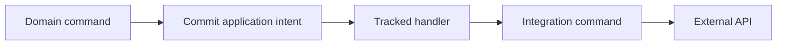

import {Tabs, TabItem} from '@astrojs/starlight/components';

An integration translates what your application wants into an external API call. Give each operation a command or
query of its own, so callers can say “set the target temperature” without knowing the URL, headers or JSON format.

## Start with one operation

This teaching API accepts `POST https://heating.example/target` with `{ "celsius": 21.0 }` and returns HTTP 204.
Its token comes from `heating.api.token` (`HEATING_API_TOKEN` in the environment).

<Tabs>
  <TabItem label="Java">

```java
public record SetHeatingTarget(double celsius) {
    @HandleCommand
    void handle() {
        var request = WebRequest.post("https://heating.example/target")
                .header("Authorization", "Bearer "
                        + ApplicationProperties.requireProperty("heating.api.token"))
                .contentType("application/json")
                .body(new TargetTemperature(celsius))
                .build();
        var response = Fluxzero.sendWebRequestAndWait(request);
        if (response.getStatus() != 204) {
            throw new IllegalStateException(
                    "Heating API returned HTTP " + response.getStatus());
        }
    }
}

public record TargetTemperature(double celsius) {}
```

  </TabItem>
  <TabItem label="Kotlin">

```kotlin
data class SetHeatingTarget(val celsius: Double) {
    @HandleCommand
    fun handle() {
        val request = WebRequest.post("https://heating.example/target")
            .header("Authorization", "Bearer " + ApplicationProperties.requireProperty("heating.api.token"))
            .contentType("application/json")
            .body(TargetTemperature(celsius))
            .build()
        val response = Fluxzero.sendWebRequestAndWait(request)
        check(response.status == 204) { "Heating API returned HTTP ${response.status}" }
    }
}

data class TargetTemperature(val celsius: Double)
```

  </TabItem>
</Tabs>

From an active application context, send `SetHeatingTarget(21.0)` through `Fluxzero.sendCommandAndWait(...)`.
The self-handler runs locally without registration. Its HTTP request still uses the ordinary Fluxzero web gateway,
including tracing, audit and configured transport behavior. Do not invoke `handle()` directly.

An external read follows the same pattern with `@HandleQuery` and `Request<YourReply>`. The
[web-request guide](/docs/guides/messaging/sending-web-requests) shows response decoding and transport settings.

## Test the request at the HTTP boundary

Run the actual command handler. A fixture HTTP handler supplies the remote response; no API-service mock or external
account is needed:

<Tabs>
  <TabItem label="Java">

```java
@Consumer(name = "heating-api-stub")
class HeatingApiStub {
    @HandlePost("https://heating.example/target")
    WebResponse setTarget(TargetTemperature target) {
        return WebResponse.builder().status(204).build();
    }
}

@Test
void sendsTheRequestedTarget() {
    TestFixture.create(new HeatingApiStub())
            .withProperty("heating.api.token", "test-token")
            .whenCommand(new SetHeatingTarget(21.0))
            .expectSuccessfulResult()
            .expectOnlyWebRequests(WebRequest.post("https://heating.example/target")
                    .header("Authorization", "Bearer test-token")
                    .contentType("application/json")
                    .body(new TargetTemperature(21.0)).build());
}
```

  </TabItem>
  <TabItem label="Kotlin">

```kotlin
@Consumer(name = "heating-api-stub")
class HeatingApiStub {
    @HandlePost("https://heating.example/target")
    fun setTarget(target: TargetTemperature): WebResponse = WebResponse.builder().status(204).build()
}

@Test
fun sendsTheRequestedTarget() {
    TestFixture.create(HeatingApiStub())
        .withProperty("heating.api.token", "test-token")
        .whenCommand(SetHeatingTarget(21.0))
        .expectSuccessfulResult()
        .expectOnlyWebRequests(WebRequest.post("https://heating.example/target")
            .header("Authorization", "Bearer test-token")
            .contentType("application/json")
            .body(TargetTemperature(21.0)).build())
}
```

  </TabItem>
</Tabs>

The stub's named consumer gives it independent processing when the fixture runs asynchronously.
The assertion checks the method, destination, credential header and payload. Change the stub's response to test
rejected credentials or remote failures. Use `TestFixture.createAsync(...)` as well when the surrounding workflow
uses tracked handlers or retries.

## Grow the integration without hiding the operations

Once several operations share authentication and request settings, extract those conventions into a small helper,
interface or base class. Keep the concrete command/query responsible for its operation and result type.
For example, `SetHeatingTarget` and `GetHeatingStatus` can share header construction without becoming one generic
“call URL” command.

Keep credentials in `ApplicationProperties`. If operators configure different installations, let application state
select a trusted configuration group; do not accept arbitrary URLs or tokens in public domain commands. Provider
request types belong with the integration, while the domain's API stays independent of that provider.

### Translate responses into useful outcomes

The first example propagates an unexpected HTTP status as a technical failure. As the API grows, distinguish known
refusals, temporary unavailability and malformed responses. Return or throw outcomes your workflow can act on,
without copying remote bodies or credentials into user-facing errors. Unexpected programming failures should still
surface as failures.

Choose timeouts and transport retries using
[`WebRequestSettings`](/docs/guides/messaging/sending-web-requests#timeouts-retries-and-an-explicit-native-alternative).
A retry must be appropriate for that operation: “set target to 21” can usually be repeated more safely than “increase
target by 1”. A timeout can mean the remote operation succeeded but its response was lost.

## Connect external work to committed application state

If the API call follows a domain change, first commit that change. A tracked event handler can then send the
integration command. Keep external I/O out of `@Apply`, because applies can run again during replay or conflict recovery.
The HTTP call is not part of the Model transaction.



A local integration command is one invocation, not a durable job by itself. For work that must survive interruption,
retain pending intent in a [stateful workflow](/docs/guides/modeling-and-persistence/stateful-handlers) and let its
processing/retry policy drive the operation. Do not add `@TrackSelf` merely because the command sends HTTP.

### An acknowledgement is not the final observation

HTTP 204 says the heating API accepted the target. It does not prove that the room has reached 21 °C.
Read observations separately and keep their meaning distinct from the requested setting. If a person later changes
the physical controls, decide whether your product should follow that change or actively enforce a target.
Do not accidentally restore an old, already completed request.

### Repeating work must preserve its identity

For an external action that creates something, retain an operation ID before sending it and reuse the same ID when
retrying. When the provider supports an idempotency key, map that retained ID to its request header. Generating a new
key for each attempt creates new operations. Respect the provider's retention window and use an authoritative lookup
when the outcome is uncertain.

Test interruption after the external call as well as an explicit HTTP error. A successful response followed by a
failed local acknowledgement is a different recovery case. The workflow decides when work is complete; the gateway's
transport retry cannot decide that business outcome.

## Follow the pattern in the example applications

The public examples show these refinements with concrete product rules. These links point to the revisions reviewed
for this guide:

- **Home:** [the service command](https://github.com/fluxzero-io/fluxzero-sample-home/blob/2abcc252e0880666aaf984e2acc8c2fff99a5829/src/main/java/io/fluxzero/home/homeassistant/api/CallHomeAssistantService.java)
  sends one operation; [the endpoint helper](https://github.com/fluxzero-io/fluxzero-sample-home/blob/2abcc252e0880666aaf984e2acc8c2fff99a5829/src/main/java/io/fluxzero/home/homeassistant/HomeAssistantEndpoint.java)
  shares configuration and status handling. [Request tests](https://github.com/fluxzero-io/fluxzero-sample-home/blob/2abcc252e0880666aaf984e2acc8c2fff99a5829/src/test/java/io/fluxzero/home/homeassistant/HomeAssistantRequestTest.java)
  exercise the actual HTTP contract. The [integration boundary](https://github.com/fluxzero-io/fluxzero-sample-home/blob/2abcc252e0880666aaf984e2acc8c2fff99a5829/docs/integration-boundary.md)
  explains requested settings versus observed device state.
- **Ticketing:** [a provider command](https://github.com/fluxzero-io/fluxzero-sample-ticketing/blob/7f8be9bee2eb8d6692f149aba68173f49eca1de6/src/main/java/io/fluxzero/ticketing/payment/stripe/request/CreateStripeIntent.java)
  uses [shared request conventions](https://github.com/fluxzero-io/fluxzero-sample-ticketing/blob/7f8be9bee2eb8d6692f149aba68173f49eca1de6/src/main/java/io/fluxzero/ticketing/payment/stripe/request/SendToStripe.java).
  [The workflow's effect handler](https://github.com/fluxzero-io/fluxzero-sample-ticketing/blob/7f8be9bee2eb8d6692f149aba68173f49eca1de6/src/main/java/io/fluxzero/ticketing/payment/stripe/StripePaymentEffects.java)
  executes retained intent, and [recovery tests](https://github.com/fluxzero-io/fluxzero-sample-ticketing/blob/7f8be9bee2eb8d6692f149aba68173f49eca1de6/src/test/java/io/fluxzero/ticketing/payment/stripe/StripeEffectRecoveryTest.java)
  cover interruptions after effects and acknowledgements.
