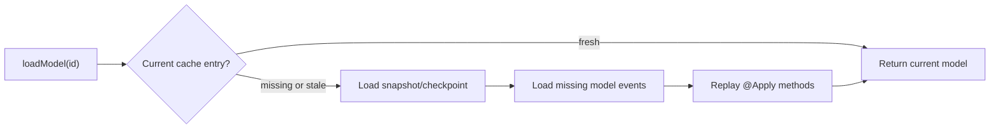

import { Tabs, TabItem } from '@astrojs/starlight/components';
import { Aside } from '@astrojs/starlight/components';

A Fluxzero `@Model` has its own identity, persistence boundary and lifecycle. Its event stream, cache, direct search
document and snapshots are enabled independently through the model settings. Loading one model therefore never requires
loading its parent, siblings or children.

```java
@Model
public record Order(@EntityId OrderId orderId, OrderStatus status) {
}
```

Use a typed `Id<T>` whenever possible. Besides making application code safer, it lets Fluxzero infer the requested
model type without storing the type as part of the identity.

<Tabs>
  <TabItem label="Java">
    ```java
    Order order = Fluxzero.loadModel(orderId).get();
    ```
  </TabItem>
  <TabItem label="Kotlin">
    ```kotlin
    val order: Order? = Fluxzero.loadModel(orderId).get()
    ```
  </TabItem>
</Tabs>

Load a lazy `Graph<T>` when code also needs relationship context, history or transition operations:

```java
Graph<Order> graph = Fluxzero.loadGraph(orderId);
Order order = graph.get();
Graph<Order> previous = graph.previous();
List<LineItem> lines = graph.childModels("lines", LineItem.class);
```

`Graph<T>` carries:

- `isPresent()` distinguishes an existing model from an empty or logically deleted model;
- `id()` and `type()` expose its collision-safe persisted identity and type;
- `functionalId()` exposes the public ID from the current or last present model value, without repository prefixes,
  postfixes or parent scope;
- `previous()` returns the retained previous revision when `cachingDepth` permits it;
- `stateIndex()` pins the whole graph read, while `revisionStateIndex()` says when this concrete node revision became
  current;
- `sequenceNumber()` is the position within this model's own stream;
- `root()`, `parent()`, `children(...)` and `descendants(...)` navigate the temporal model graph;
- `apply(...)`, `update(...)`, `assertAndApply(...)` and `delete()` stage model changes.

Creating a typed graph by ID does not load the source model or complete tree. A typed `Id` makes `id()` available
immediately; an untyped value may be an alias and therefore resolves the source before reporting its true primary ID.
`get()`, history and relationship contents load only when requested. Typed ancestor navigation follows persisted
relationship identities and materializes only the selected ancestor value, so
`graph.ancestorModel(Organisation.class)` need not load the source or intervening location and connection values.

An untyped ID can be loaded by supplying the model class explicitly:

```java
Order order = Fluxzero.loadModel("order-123", Order.class).get();
```

## Alternative model identifiers

Use `@Alias` when an independently stored model must also be addressable by a current business or external identifier:

```java
@Model
record Customer(
        @EntityId CustomerId customerId,
        @Alias(prefix = "email:") String email,
        String name) {
}

Customer customer = Fluxzero.loadModel(
        "email:info@example.com", Customer.class).get();
```

Fluxzero stores the complete alias set atomically with every model transition. When the annotated value changes, the
old alias stops resolving after the commit; logical or physical deletion removes the current aliases as well.

Aliases for independent models are global identities and must be unique across those models. A primary model ID is
always resolved before an equal alias. Keep tree-local alternative identifiers on embedded aggregate members instead
of exposing them as global independent-model aliases.

## Parent-scoped model identifiers

Use `@EntityId(parentScoped = true)` when a parent-owned child ID is intentionally unique only inside one parent:

```java
@Model
record Line(
        @EntityId(parentScoped = true) String lineId,
        @Parent(value = Order.class, pathInParent = "lines") OrderId orderId) {
}
```

The field remains `"one"`; Fluxzero only scopes the persisted model identity. Automatic apply routing selects the
deepest non-null parent relation present in the payload. Within a loaded graph,
`order.find("one", Line.class)` therefore keeps using the functional child ID. An explicit direct load includes the
parent identity and type:

```java
Graph<Line> line = Fluxzero.loadGraph(
        orderId, Order.class, "one", Line.class);
```

All non-null parents must resolve to one unambiguous nearest parent. Parent-scoped identity is unsuitable for a model
that moves while retaining its identity, because changing the parent changes the persisted identity.

## Event-sourced loading

Event sourcing is the default:

```java
@Model
record Order(@EntityId OrderId orderId, OrderStatus status) {
}
```

Fluxzero first checks the model cache, then an applicable snapshot or checkpoint, and finally reads only the required
suffix of that model's stream. Events are replayed through their `@Apply` methods.



Each independently stored child has a short stream of its own. Updating one line item does not replay the lifetime
history of the order, inventory model or its siblings.

## Document-based loading

Set `eventSourced = false` to load the current model directly from its synchronously maintained document:

```java
@Model(eventSourced = false, searchable = true)
record Country(@EntityId CountryId countryId, String name) {
}
```

This changes only the normal **load** strategy. Applied updates are still stored and published as events unless
`eventPublication` or `publicationStrategy` says otherwise. The directly changed searchable document is visible when
the model commit completes.

Document-based models participate in the same durable model-update tracking as event-sourced models, so caches in other
SDK instances are invalidated or refreshed after remote commits.

## Model parameters in message handlers

Every selected message handler can inject directly addressed models and their ancestors. When an event or notification
was produced by a model commit, Fluxzero pins those loads to that action's persisted state boundary:

```java
@HandleEvent
void on(ItemReserved event, Order order, Graph<Inventory> inventory) {
    // order and inventory are exactly as they existed for this event
}
```

Parameter injection uses the ID properties in the event:

- a property matching the model's `@EntityId` name;
- otherwise one unique typed `Id<Model>`;
- `@Association("sourceId")` when two IDs refer to the same model type.

Both `T` and `Graph<T>` are supported. A deleted target can be injected as an empty graph; a non-null bare `T` matches
only when the model exists. `@Association` first checks metadata unless `excludeMetadata = true`.

An ordinary indexed event resolves directly addressed Models at one current pinned boundary. When an
Aggregate-to-Model migration has linked that original global event to a Model commit, the same parameters instead
resolve the exact Model state after that event. Complete graph-change subscriptions still require durable Model commit
metadata because they discover every affected root rather than only IDs addressed by the event.

Parents, grandparents and further ancestors can be injected without repeating their IDs:

```java
@HandleQuery
OrderView inspect(InspectLine query, LineItem line, Order order, Customer customer) {
    // query only needs the typed LineItemId; relations resolve Order and Customer
}
```

The child parameter may be omitted. A typed child ID in the payload is enough to anchor graph traversal when the
selected handler only requests an ancestor. Use `@Association("billingLines")` to select the relation path if several
ancestors of the requested type are reachable.

Later cache entries never leak into historical event handling. Earlier `STORE_ONLY` model transitions are included
because exactness is based on the committed model commit, not only on the globally published event stream.

Ordinary `loadGraph(...)` calls made while handling a message inherit that same coherent read boundary. This is usually
what event and notification handlers need. After sending a synchronous nested command, use `loadCurrentGraph(...)`
only when the remainder of the handler deliberately needs the newer state produced by that command:

```java
Fluxzero.sendCommandAndWait(new ReserveItem(itemId));
Graph<Item> current = Fluxzero.loadCurrentGraph(itemId);
```

This explicit escape prevents a handler from accidentally mixing the event-visible past with unrelated latest state.

### Backfilling Models from legacy events

Configure the SDK-owned migration runner in a dedicated application:

```java
PublishedEventModelMigration.builder()
        .name("orders-model-migration-v1")
        .client(client)
        .serializer(serializerWithLegacyUpcasters)
        .modelsInPackage("com.example.orders")
        .build()
        .run(args);
```

No arguments starts replay; `adopt <cutover-event-index>` verifies catch-up and performs the cutover operation. The
runner owns the catch-all handler and always uses the complete global log, one synchronous thread, a single tracker and
hard failure. It durably completes each event's Model commit before reducing the next event or advancing its tracking
position. Multiple application instances with the same stable migration name provide failover without processing
events concurrently.

This supports gradual read migration while the legacy application remains the only business-write owner. Before
enabling listeners that inject Models or Graphs for legacy events, configure the listener application's repository with
the same stable consumer name:

```java
Fluxzero.get().modelRepository()
        .followPublishedEventMigration("orders-model-migration-v1");
```

Mapped events take the ordinary one-read path. If a legacy event has no mapping yet, the repository checks the durable
migration position and waits only while replay is behind. After catch-up it retries the exact boundary once; passing an
event without producing the requested Model state is an explicit error. The default bounded wait is 30 seconds and can
be overridden with the `Duration` overload. Thus queries and read-only listeners can move to Graphs independently;
command ownership moves later and should remain exclusive per Model type.

Fluxzero reuses the Model replay phase: payload `@Apply` methods run before Model `@Apply` methods, while
`@InterceptApply` and command `@AssertLegal` methods are not rerun. The original message ID is the idempotent commit ID,
the original global index becomes the historical Model boundary, and the event is not published again. One event may
update several Models atomically at one state index.

The handler must receive an indexed event that is still available in the co-located global event log. Legacy
`STORE_ONLY` Aggregate events have no global index and cannot be recovered through this route. The isolated runner
registers no ordinary handlers or automatic Model commands. It can run in an existing process that already contains
the replacement Models, but an old entity and new Model with the same fully qualified class name cannot share one
classloader; use a separate migration application while the legacy application remains live.

For document-backed Models, replayed direct documents remain in invisible staging. The runner discovers or receives
the complete Model catalog, verifies its durable consumer position and delegates adoption to `ModelRepository`.
Fluxzero resolves each durable staged type from that catalog, deserializes and upcasts the staged value and any existing
production document, and requires equal current values and unchanged staged state. If a production document exists,
adoption also uses its observed document index as a compare-and-set condition, leaves the document itself untouched,
and atomically adds only the Model write fence. If it does not exist, the staged document is copied into its normal
collection in the same transaction. Adoption drains bounded batches and then rebuilds all materialized Graph
projections declared by the catalog; repeat the command to resume an interrupted cutover. A value difference, unknown
staged type or concurrent legacy write retains staging and fails adoption.

Qualify catch-up, an explicit final event boundary, exact Model and Graph state, converted listener traffic and
representative performance before switching write ownership. Listeners moved before that point must not apply changes
directly to legacy Aggregates. Once every gate reports `GO`, stop legacy command handling and enable Model commands as
a forward-only ownership change. From the first ordinary Model write, recover by fixing and replaying forward. Durable
Model commit history can support an application-specific emergency projection into legacy state, but Fluxzero does not
promise a generic post-write rollback.

Commands, queries, schedules, results, errors, metrics, documents, custom messages and web handlers use the same
parameter rules. They share one current handler load context: event-sourced targets use its pinned repository boundary,
while document-loaded targets remain current-only direct-document reads. Handler selection itself performs no
repository I/O.

## Handling complete graph changes

Use an unqualified `Graph<T>` as the sole handler parameter to subscribe to every durable change of that root or one of
its descendants:

```java
@HandleEvent
void organisationChanged(Graph<Organisation> graph) {
    Graph<Organisation> before = graph.previous();
}
```

Fluxzero reads the affected model identities from the exact durable model-commit substep, so the published event does
not need to repeat the root ID. Each affected root is invoked once, even when several models in that graph changed in
one atomic action. `graph.previous()` is the complete graph immediately before that action, independent of the model
cache depth.

- creation supplies the new graph and no previous graph;
- deletion supplies an empty current graph and the complete deleted graph through `previous()`;
- moving a child invokes the handler for both the old and the new root;
- `@HandleNotification void changed(Graph<Organisation> graph)` has the same graph semantics without regular consumer
  segmentation.

One handler object may contain multiple such methods for distinct root types. Fluxzero routes each affected root to
the matching typed `Graph<T>` method, so no per-type adapter objects are needed.

A handler that also declares the explicit event payload remains an ordinary payload handler. Its `Graph<T>` parameter
keeps the direct or ancestor-injection semantics described above.

## Loading a complete model graph

Relations declared with `@Parent` can be traversed without turning the models back into one permanent consistency
boundary:

```java
Graph<Order> graph = Fluxzero.loadGraph(orderId);
```

The source value remains lazy; the runtime pins one `stateIndex` when model state is first required and reconstructs
related nodes in batches on the first traversal. Every returned child is itself a graph with its own parent, root and history operations. Use
`loadGraphAt(...)` for an historical graph:

```java
Graph<Order> historical = Fluxzero.get()
        .modelRepository()
        .loadGraphAt(orderId, stateIndex);
```

Graph loads have no caller-imposed depth or model-count limit by default. Pass explicit `Graph.Options` when an
operation intentionally accepts only a bounded graph; use a direct model load when the command needs only one model.

Returning `Graph<T>` from a message or web handler serializes the root and descendants placed through explicit
`@Parent(pathInParent = "...")` edges. Pathless relationships remain available through typed `children(...)` and
`descendants(...)`, but do not invent a public JSON property name.

Use `@GraphProperty` for a response value derived from graph context rather than from one independently stored Model.
The method may receive the current graph or a typed ancestor graph. When many nodes share an already-batched lookup,
attach that response-only value once with `graph.withContext(value)` and read it inside the property method with
`graph.context(ValueType.class)`. The context is shared by the immutable graph view and is never persisted as Model
state.

A current graph load inside an ordered tracking batch includes pending model state produced by earlier messages in the
same routing segment. This includes newly created nodes, changed values and `@Parent` moves. Moving an existing node
into the graph also brings along its durable descendants. `loadGraphAt(...)` is deliberately different: it always
returns the exact requested historical boundary and never overlays pending batch state.

## Embedded members

A model may still contain `@Member` values:

```java
@Model
record SmallOrder(
        @EntityId OrderId orderId,
        @Member List<EmbeddedNote> notes) {
}
```

Embedded members share the model's stream, cache, document, snapshots and lifecycle. Use them only when that is exactly
the intended ownership. Use a separate `@Model` plus `@Parent` when a child must move, be searched independently,
have its own lifecycle or be changed without loading the root.

<Aside type="note" title="Legacy aggregate API">
`@Aggregate`, `loadAggregate(...)` and `loadAggregateFor(...)` remain available for existing Fluxzero 1.x
applications. New code should use `@Model`; the aggregate API is scheduled for deprecation in Fluxzero 2.0.
</Aside>
