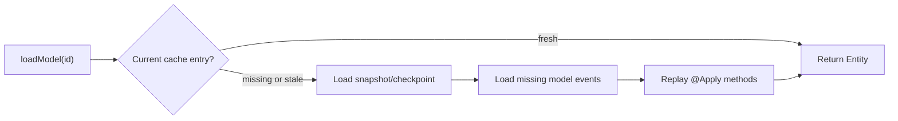

import { Tabs, TabItem } from '@astrojs/starlight/components';
import { Aside } from '@astrojs/starlight/components';

A Fluxzero `@Model` has its own identity, persistence boundary and lifecycle. Its event stream, cache, direct search
document and snapshots are enabled independently through the model settings. Loading one model therefore never requires
loading its parent, siblings or children.

```java
@Model
public record Order(@EntityId OrderId orderId, OrderStatus status) {
}
```

Use a typed `Id<T>` whenever possible. Besides making application code safer, it lets Fluxzero infer the requested
model type without storing the type as part of the identity.

<Tabs>
  <TabItem label="Java">
    ```java
    Entity<Order> entity = Fluxzero.loadModel(orderId);
    Order order = entity.get();
    ```
  </TabItem>
  <TabItem label="Kotlin">
    ```kotlin
    val entity: Entity<Order> = Fluxzero.loadModel(orderId)
    val order: Order? = entity.get()
    ```
  </TabItem>
</Tabs>

`Entity<T>` carries more than the value:

- `isPresent()` distinguishes an existing model from an empty or logically deleted model;
- `id()` and `type()` expose its persisted identity and type;
- `previous()` returns the retained previous revision when `cachingDepth` permits it;
- `sequenceNumber()` is the position within this model's own stream.

An untyped ID can be loaded by supplying the model class explicitly:

```java
Order order = Fluxzero.loadModel("order-123", Order.class).get();
```

## Event-sourced loading

Event sourcing is the default:

```java
@Model
record Order(@EntityId OrderId orderId, OrderStatus status) {
}
```

Fluxzero first checks the model cache, then an applicable snapshot or checkpoint, and finally reads only the required
suffix of that model's stream. Events are replayed through their `@Apply` methods.



Each independently stored child has a short stream of its own. Updating one line item does not replay the lifetime
history of the order, inventory model or its siblings.

## Document-based loading

Set `eventSourced = false` to load the current model directly from its synchronously maintained document:

```java
@Model(eventSourced = false, searchable = true)
record Country(@EntityId CountryId countryId, String name) {
}
```

This changes only the normal **load** strategy. Applied updates are still stored and published as events unless
`eventPublication` or `publicationStrategy` says otherwise. The directly changed searchable document is visible when
the model commit completes.

Document-based models participate in the same durable model-update tracking as event-sourced models, so caches in other
SDK instances are invalidated or refreshed after remote commits.

## Exact loading in event handlers

When an event was produced by a model action, Fluxzero pins model loads to that action's persisted state boundary:

```java
@HandleEvent
void on(ItemReserved event, Order order, Entity<Inventory> inventory) {
    // order and inventory are exactly as they existed for this event
}
```

Parameter injection uses the ID properties in the event:

- a property matching the model's `@EntityId` name;
- otherwise one unique typed `Id<Model>`;
- `@Association("sourceId")` when two IDs refer to the same model type.

Both `T` and `Entity<T>` are supported. A deleted target can be injected as an empty `Entity<T>`; a non-null bare `T`
matches only when the model exists. The same semantics apply to `@HandleNotification`.

Later cache entries never leak into historical event handling. Earlier `STORE_ONLY` model transitions are included
because exactness is based on the committed model action, not only on the globally published event stream.

## Loading a complete model graph

Relations declared with `@ParentId` can be traversed without turning the models back into one permanent consistency
boundary:

```java
ModelGraph<Order> graph = Fluxzero.get()
        .modelRepository()
        .loadGraph(orderId);
```

The runtime pins one `stateIndex`, finds the nodes and edges belonging to the root at that boundary, reconstructs the
models in batches and places children at their declared paths. Use `loadGraphAt(...)` for an historical graph:

```java
ModelGraph<Order> historical = Fluxzero.get()
        .modelRepository()
        .loadGraphAt(orderId, stateIndex);
```

Graph loads are bounded by `ModelGraph.Options`; do not use an unbounded graph as a substitute for loading the direct
model needed by a command.

## Embedded members

A model may still contain `@Member` values:

```java
@Model
record SmallOrder(
        @EntityId OrderId orderId,
        @Member List<EmbeddedNote> notes) {
}
```

Embedded members share the model's stream, cache, document, snapshots and lifecycle. Use them only when that is exactly
the intended ownership. Use a separate `@Model` plus `@ParentId` when a child must move, be searched independently,
have its own lifecycle or be changed without loading the root.

<Aside type="note" title="Legacy aggregate API">
`@Aggregate`, `loadAggregate(...)` and `loadAggregateFor(...)` remain available for existing Fluxzero 1.x
applications. New code should use `@Model`; the aggregate API is scheduled for deprecation in Fluxzero 2.0.
</Aside>
