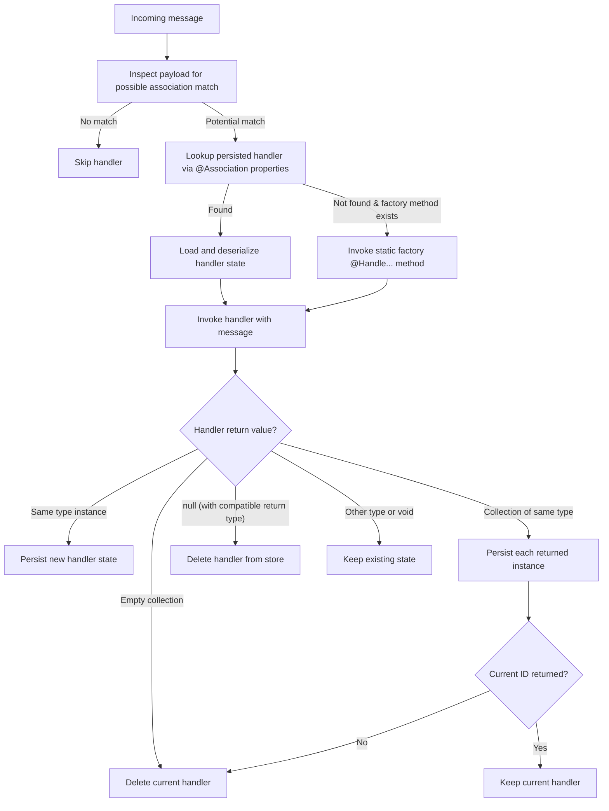

import { Tabs, TabItem } from '@astrojs/starlight/components';
import { Aside } from '@astrojs/starlight/components';

While aggregates represent domain entities, Fluxzero also supports long-lived **stateful handlers** for modeling workflows,
external interactions, or background processes that span multiple messages.

To declare a stateful handler, annotate a class with `@Stateful`:

<Tabs>
  <TabItem label="Java">
    ```java
    @Stateful
    public record PaymentProcess(@EntityId String paymentId,
                                 @Association String pspReference,
                                 PaymentStatus status) {

        @HandleEvent
        static PaymentProcess on(PaymentInitiated event) {
            String pspRef = Fluxzero.sendCommandAndWait(new ExecutePayment(...));
            return new PaymentProcess(event.getPaymentId(), pspRef, PaymentStatus.PENDING);
        }

        @HandleEvent
        PaymentProcess on(PaymentConfirmed event) {
            // pspReference property in PaymentConfirmed is matched
            return withStatus(PaymentStatus.CONFIRMED);
        }
    }
    ```
  </TabItem>
  <TabItem label="Kotlin">
    ```kotlin
    @Stateful
    data class PaymentProcess(
        @EntityId val paymentId: String,
        @Association val pspReference: String,
        val status: PaymentStatus
    ) {

        companion object {
            @HandleEvent
            fun on(event: PaymentInitiated): PaymentProcess {
                val pspRef = Fluxzero.sendCommandAndWait(ExecutePayment(...))
                return PaymentProcess(event.paymentId, pspRef, PaymentStatus.PENDING)
            }
        }

        @HandleEvent
        fun on(event: PaymentConfirmed): PaymentProcess {
            // pspReference property in PaymentConfirmed is matched
            return copy(status = PaymentStatus.CONFIRMED)
        }
    }
    ```
  </TabItem>
</Tabs>

## Key properties

- `@Stateful` classes persist their state using Fluxzero’s document store (or a custom `HandlerRepository`)
- They are automatically invoked when messages match their associations (`@Association` fields or methods)
- Matching is dynamic and supports multiple handler instances per message
- Multiple handler methods can exist for different message types
- Handlers are immutable by convention — they are updated by returning a new version of themselves
- Returning `null` from a handler-compatible return type deletes the current handler instance (useful for terminal flows)

<Aside type="note">
Like other handlers, stateful handlers may be annotated with `@Consumer` for tracking isolation.
</Aside>

<Tabs>
  <TabItem label="Java">
    ```java
    @HandleEvent
    PaymentProcess on(PaymentFailed event) {
        return null; // remove from store
    }
    ```
  </TabItem>
  <TabItem label="Kotlin">
    ```kotlin
    @HandleEvent
    fun on(event: PaymentFailed): PaymentProcess? {
        return null // remove from store
    }
    ```
  </TabItem>
</Tabs>

## Matching via association

Handlers are selected based on one or more `@Association` fields. When a message with a matching association is
published, the handler is loaded and invoked.

<Tabs>
  <TabItem label="Java">
    ```java
    @Association
    String pspReference;
    ```
  </TabItem>
  <TabItem label="Kotlin">
    ```kotlin
    @Association
    val pspReference: String
    ```
  </TabItem>
</Tabs>

<Aside type="note">
This is similar to correlation IDs or saga keys — but built-in and fully indexed.
</Aside>

## State update semantics

- If the handler method returns a new instance of its class, it replaces the previous version in the store
- If it returns a collection, every returned instance of the same stateful type is stored
- Returning an empty collection deletes the current instance
- If a returned collection does not include the current instance ID, the current instance is deleted
- Returning a same-type instance with a different `@EntityId` replaces the current instance (new ID stored, old ID deleted)
- If it returns `void` or a value of another type, state is left unchanged
- This allows safe utility returns (like `Duration` for `@HandleSchedule`)

<Aside type="note">
Collections allow a stateful handler to fan out into multiple stateful instances after handling a single message.
</Aside>

<Tabs>
  <TabItem label="Java">
    ```java
    @HandleSchedule
    Duration on(CheckStatus schedule) {
        // Return next delay (but don’t update handler state)
        return Duration.ofMinutes(5);
    }
    ```
  </TabItem>
  <TabItem label="Kotlin">
    ```kotlin
    @HandleSchedule
    fun on(schedule: CheckStatus): Duration {
        // Return next delay (but don’t update handler state)
        return Duration.ofMinutes(5)
    }
    ```
  </TabItem>
</Tabs>

## Stateful members

A `@Stateful` parent can also own `@Member` children. Members can declare their own `@Handle...` methods and
`@Association` fields; Fluxzero loads the parent, invokes every matching member, and stores the updated parent.

Use this when a child has its own lifecycle but should remain inside the parent document, for example payments inside a
customer.

<Tabs>
  <TabItem label="Java">
    ```java
    @Stateful
    public record Customer(
        @EntityId @Association String customerId,
        @Member List<Payment> payments
    ) {
    }

    public record Payment(@Association String paymentId, int captureCount) {
        @HandleEvent
        static Payment start(PaymentStarted event, Customer customer) {
            return new Payment(event.paymentId(), 0);
        }

        @HandleEvent
        Payment capture(PaymentCaptured event, Customer customer) {
            return new Payment(paymentId, captureCount + 1);
        }

        @HandleEvent
        Payment cancel(PaymentCancelled event) {
            return null;
        }
    }
    ```
  </TabItem>
  <TabItem label="Kotlin">
    ```kotlin
    @Stateful
    data class Customer(
        @EntityId @Association val customerId: String,
        @Member val payments: List<Payment> = emptyList()
    )

    data class Payment(
        @Association val paymentId: String,
        val captureCount: Int = 0
    ) {
        companion object {
            @HandleEvent
            @JvmStatic
            fun start(event: PaymentStarted, customer: Customer): Payment {
                return Payment(event.paymentId)
            }
        }

        @HandleEvent
        fun capture(event: PaymentCaptured, customer: Customer): Payment {
            return copy(captureCount = captureCount + 1)
        }

        @HandleEvent
        fun cancel(event: PaymentCancelled): Payment? {
            return null
        }
    }
    ```
  </TabItem>
</Tabs>

Key behavior:

- A message with only the child association, such as `paymentId`, can target the matching member inside the parent
- Static member handlers can create a child when the message can be associated with a parent; use
  `@Association(always = true)` only when fan-out to all matching parents is intentional
- Instance member handlers update by returning a member instance, delete by returning `null`, or add/replace multiple
  members by returning a collection
- If the parent and a member both handle the same message, Fluxzero applies the parent mutation first and then invokes
  matching members from the updated parent
- Multiple members may match one message, both within one parent and across parents
- For map-backed members, newly added members use `@EntityId` or `@Member(idProperty = "...")` as the map key
- Java record parents do not need `@With` on `@Member` components; records are rebuilt through the canonical
  constructor. Kotlin data classes are rebuilt through copy semantics.

## Batch commit control

By default, changes to a `@Stateful` handler are persisted immediately. Set `commitInBatch = true` to defer updates
until the current message batch completes. Fluxzero ensures that:

- Newly created handlers are matched by subsequent messages
- Deleted handlers won’t receive more messages in the batch
- Updates are consistent within the batch

<Aside type="note">
This dramatically improves performance for high-throughput workflows.
</Aside>

## Indexing support

Stateful handlers are automatically `@Searchable`. You can configure:

- A custom collection name
- Time-based indexing fields (e.g. `timestampPath` or `endPath`)

This allows you to query, filter, and monitor stateful handlers using Fluxzero’s search API — covered in the next section.

---

Stateful handlers are ideal for:

- **Workflows** and **sagas**
- **Pollers**, **reminders**, and **background jobs**
- External **API orchestrations**
- **Process managers** (e.g., order fulfillment, payment retry, etc.)

They complement aggregates without competing with them — and allow modeling temporal behavior in a clean, event-driven way.

## Invocation flow

The following diagram shows how a `@Stateful` handler is matched, loaded, invoked, and updated:



1. The message payload is inspected to see if any `@Association` values might match.
2. If there’s a possible match, Fluxzero looks up the persisted handler document by association.
3. If a handler is not found but a static factory method or constructor (`@Handle...`) exists, that method is invoked to create a new handler.
4. If a persisted handler is found, its state is loaded and deserialized.
5. The handler is invoked with the incoming message.
6. The return value determines what happens next:
   - Returning a new instance of the handler type → the handler state is re-persisted with the updated values.
   - Returning a collection of handler instances → each returned instance is stored; current instance is deleted if its ID is not returned.
   - Returning an empty collection → the current instance is deleted.
   - Returning `null` (with a compatible return type) → the handler is deleted from the store.
   - Returning another type or `void` → the state remains unchanged (useful for utility responses such as durations or acknowledgments).

<Aside type="note">
This entire process typically runs behind a **message tracker**, which continuously delivers messages to eligible stateful handlers. It’s not an on-demand invocation, but part of Fluxzero’s ongoing tracking loop.
</Aside>
