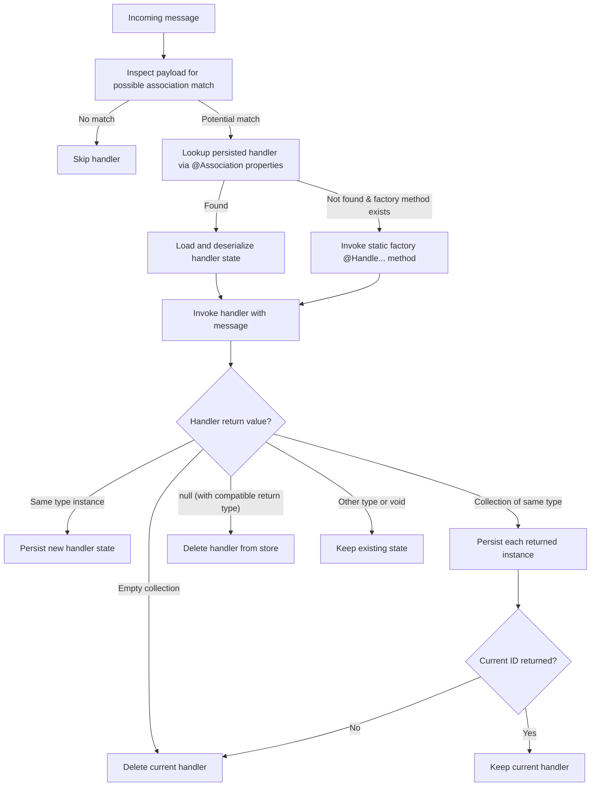

import { Tabs, TabItem } from '@astrojs/starlight/components';
import { Aside } from '@astrojs/starlight/components';

While models represent domain entities, Fluxzero also supports long-lived **stateful handlers** for modeling workflows,
external interactions, or background processes that span multiple messages.

## Choose business state or process memory first

Keep business facts and invariants in Models: an order, payment capture, refund obligation or invoice has meaning
independently of the system used to execute it. Use `@Stateful` for durable execution progress: provider correlation,
operation keys, pending effects, retries and compensation. An attempt having its own identity or lifecycle does not
by itself make it business state. Do not add provider attempts to the business graph solely to retain their progress.
A provider-specific workflow invokes provider-independent domain commands when verified observations justify them.

For webhooks, verify the boundary input and durably publish an internal notification before acknowledging receipt.
Let the associated workflow interpret it; receipt alone does not complete the business transaction. Keep each external
HTTP interaction in a specific local command/query handler using the Fluxzero webrequest API. A consumer is appropriate
for the durable workflow, not as a substitute for calling one local integration operation.

Persist execution intent before issuing the effect. A later `@HandleDocument` observer can reload that intent and call
the local operation. Configure its starting position to include retained pending documents when recovery requires it.
Keep a stable idempotency key through retries, and acknowledge completion only after the domain command is durable.
Stateful storage, external HTTP and domain persistence are separate failure boundaries; test restart and both sides of
each acknowledgement. Partition independent workflows by their correlation identity; do not serialize all business
transactions behind one global consumer or put unbounded related-state scans in the core transaction.

## Choose the trigger and preserve pending work

`@HandleDocument` observes current documents; a consumer can miss intermediate versions. Use `@HandleEvent` for
business transitions that must each cause a reaction. Prefer document handlers for projection or transformation.
A document observer is suitable for **reconciliation** only
when the latest stored state still describes every unfinished effect. A newer observation may supersede an older one only
when it preserves or fully subsumes that unfinished work. Do not delete intent before its effect is acknowledged. Reload current intent before execution;
an old document delivery is a wake-up signal, not permission to execute its obsolete action.

A small explicit workflow can follow these boundaries:

1. An event handler validates correlation and returns state retaining the next action and its stable identity.
2. A later dispatcher reloads that state and selects the action once. Execution and error correlation use that same
   decision, including when another notification arrives during execution.
3. A specific local command/query performs external HTTP. Its provider idempotency key survives uncertain responses
   and retries. A domain command records verified business facts and reaches its durable commit boundary.
4. The dispatcher durably publishes the corresponding acknowledgement. Publication failure must remain retryable;
   do not turn a failed acknowledgement into a completed action or swallow it in provider-error handling.
5. The workflow accepts the matching acknowledgement or retains a problem associated with that action. Stale results
   and failures cannot complete or pause newer work.

Expected conflicting provider facts are explicit reconciliation outcomes: retain the accepted financial fact and
persist the problem. Throwing from the later state-transition handler does not reach an earlier dispatcher's catch
block. `@HandleError` with `@Trigger` is useful for unexpected tracked failures, but correlate its correction with the
actual failed action and consumer; the trigger document may predate the state reloaded by the dispatcher. Do not
correct the same failure at both the local request and outer workflow boundary. A default error policy is not a
guarantee that expected domain failures will be retried.

Bound handler execution as well as individual transactions. For large fan-out, commit a bounded page, then store a
continuation before the consumer advances. Reprocessing either the original trigger or a continuation must be
idempotent. Search may discover candidates, but each command rechecks authoritative state. Define when discovery is
complete; an eventually consistent projection returning no matches alone cannot prove completion. A retryable
consumer and durable continuation do not provide atomic external execution or exactly-once effects.

Keep these rules explicit and domain-sized. Share small wire/failure helpers where useful; do not build an application
workflow engine, duplicate next-action selection, or mistake an in-memory after-save callback for crash recovery.

To declare a stateful handler, annotate a class with `@Stateful`:

<Tabs>
  <TabItem label="Java">
    ```java
    @Stateful
    public record PaymentProcess(@EntityId @Association String paymentId,
                                 String operationKey,
                                 @Association String pspReference,
                                 PaymentStatus status) {

        @HandleEvent
        static PaymentProcess on(PaymentInitiated event) {
            // Execute later, after this intent is stored.
            return new PaymentProcess(event.getPaymentId(), event.getOperationKey(), null, PaymentStatus.PENDING);
        }

        @HandleEvent
        PaymentProcess on(PaymentConfirmed event) {
            // PaymentConfirmed carries paymentId, even before a provider reference has been bound.
            return new PaymentProcess(paymentId, operationKey, event.getPspReference(), PaymentStatus.CONFIRMED);
        }
    }
    ```
  </TabItem>
  <TabItem label="Kotlin">
    ```kotlin
    @Stateful
    data class PaymentProcess(
        @EntityId @Association val paymentId: String,
        val operationKey: String,
        @Association val pspReference: String?,
        val status: PaymentStatus
    ) {

        companion object {
            @HandleEvent
            fun on(event: PaymentInitiated): PaymentProcess {
                // Execute later, after this intent is stored.
                return PaymentProcess(event.paymentId, event.operationKey, null, PaymentStatus.PENDING)
            }
        }

        @HandleEvent
        fun on(event: PaymentConfirmed): PaymentProcess {
            // PaymentConfirmed carries paymentId, even before a provider reference has been bound.
            return copy(pspReference = event.pspReference, status = PaymentStatus.CONFIRMED)
        }
    }
    ```
  </TabItem>
</Tabs>

## Key properties

- `@Stateful` classes persist their state using Fluxzero’s document store (or a custom `HandlerRepository`)
- They are automatically invoked when messages match their associations (`@Association` fields or methods)
- Matching is dynamic and supports multiple handler instances per message
- Multiple handler methods can exist for different message types
- Handlers are immutable by convention — they are updated by returning a new version of themselves
- Returning `null` from a handler-compatible return type deletes the current handler instance (useful for terminal flows)

<Aside type="note">
Like other handlers, stateful handlers may be annotated with `@Consumer` for tracking isolation.
</Aside>

<Tabs>
  <TabItem label="Java">
    ```java
    @HandleEvent
    PaymentProcess on(PaymentFailed event) {
        return null; // remove from store
    }
    ```
  </TabItem>
  <TabItem label="Kotlin">
    ```kotlin
    @HandleEvent
    fun on(event: PaymentFailed): PaymentProcess? {
        return null // remove from store
    }
    ```
  </TabItem>
</Tabs>

## Matching via association

Handlers are selected based on one or more `@Association` fields. When a message with a matching association is
published, the handler is loaded and invoked.

<Tabs>
  <TabItem label="Java">
    ```java
    @Association
    String pspReference;
    ```
  </TabItem>
  <TabItem label="Kotlin">
    ```kotlin
    @Association
    val pspReference: String
    ```
  </TabItem>
</Tabs>

<Aside type="note">
This is similar to correlation IDs or saga keys — but built-in and fully indexed.
</Aside>

## State update semantics

- If the handler method returns a new instance of its class, it replaces the previous version in the store
- If it returns a collection, every returned instance of the same stateful type is stored
- Returning an empty collection deletes the current instance
- If a returned collection does not include the current instance ID, the current instance is deleted
- Returning a same-type instance with a different `@EntityId` replaces the current instance (new ID stored, old ID deleted)
- If it returns `void` or a value of another type, state is left unchanged
- This allows safe utility returns (like `Duration` for `@HandleSchedule`)

<Aside type="note">
Collections allow a stateful handler to fan out into multiple stateful instances after handling a single message.
</Aside>

<Tabs>
  <TabItem label="Java">
    ```java
    @HandleSchedule
    Duration on(CheckStatus schedule) {
        // Return next delay (but don’t update handler state)
        return Duration.ofMinutes(5);
    }
    ```
  </TabItem>
  <TabItem label="Kotlin">
    ```kotlin
    @HandleSchedule
    fun on(schedule: CheckStatus): Duration {
        // Return next delay (but don’t update handler state)
        return Duration.ofMinutes(5)
    }
    ```
  </TabItem>
</Tabs>

## Stateful members

A `@Stateful` parent can also own `@Member` children. Members can declare their own `@Handle...` methods and
`@Association` fields; Fluxzero loads the parent, invokes every matching member, and stores the updated parent.

Use this when a child has its own lifecycle but should remain inside the parent document, for example payments inside a
customer.

<Tabs>
  <TabItem label="Java">
    ```java
    @Stateful
    public record Customer(
        @EntityId @Association String customerId,
        @Member List<Payment> payments
    ) {
    }

    public record Payment(@Association String paymentId, int captureCount) {
        @HandleEvent
        static Payment start(PaymentStarted event, Customer customer) {
            return new Payment(event.paymentId(), 0);
        }

        @HandleEvent
        Payment capture(PaymentCaptured event, Customer customer) {
            return new Payment(paymentId, captureCount + 1);
        }

        @HandleEvent
        Payment cancel(PaymentCancelled event) {
            return null;
        }
    }
    ```
  </TabItem>
  <TabItem label="Kotlin">
    ```kotlin
    @Stateful
    data class Customer(
        @EntityId @Association val customerId: String,
        @Member val payments: List<Payment> = emptyList()
    )

    data class Payment(
        @Association val paymentId: String,
        val captureCount: Int = 0
    ) {
        companion object {
            @HandleEvent
            @JvmStatic
            fun start(event: PaymentStarted, customer: Customer): Payment {
                return Payment(event.paymentId)
            }
        }

        @HandleEvent
        fun capture(event: PaymentCaptured, customer: Customer): Payment {
            return copy(captureCount = captureCount + 1)
        }

        @HandleEvent
        fun cancel(event: PaymentCancelled): Payment? {
            return null
        }
    }
    ```
  </TabItem>
</Tabs>

Key behavior:

- A message with only the child association, such as `paymentId`, can target the matching member inside the parent
- Static member handlers can create a child when the message can be associated with a parent; use
  `@Association(always = true)` only when fan-out to all matching parents is intentional
- Instance member handlers update by returning a member instance, delete by returning `null`, or add/replace multiple
  members by returning a collection
- If the parent and a member both handle the same message, Fluxzero applies the parent mutation first and then invokes
  matching members from the updated parent
- Multiple members may match one message, both within one parent and across parents
- For map-backed members, newly added members use `@EntityId` or `@Member(idProperty = "...")` as the map key
- Java record parents do not need `@With` on `@Member` components; records are rebuilt through the canonical
  constructor. Kotlin data classes are rebuilt through copy semantics.

## Batch commit control

By default, changes to a `@Stateful` handler are persisted immediately. Set `commitInBatch = true` to defer updates
until the current message batch completes. Fluxzero ensures that:

- Newly created handlers are matched by subsequent messages
- Deleted handlers won’t receive more messages in the batch
- Updates are consistent within the batch

<Aside type="note">
This dramatically improves performance for high-throughput workflows.
</Aside>

## Indexing support

Stateful handlers are automatically `@Searchable`. You can configure:

- A custom collection name
- Time-based indexing fields (e.g. `timestampPath` or `endPath`)

This allows you to query, filter, and monitor stateful handlers using Fluxzero’s search API — covered in the next section.

---

Stateful handlers are ideal for:

- **Workflows** and **sagas**
- **Pollers**, **reminders**, and **background jobs**
- External **API orchestrations**
- **Process managers** (e.g., order fulfillment, payment retry, etc.)

They complement models without competing with them — and allow modeling temporal behavior in a clean, event-driven way.

## Invocation flow

The following diagram shows how a `@Stateful` handler is matched, loaded, invoked, and updated:


```mermaid
graph TD
    MSG[Incoming message] --> CHECK[Inspect payload for possible association match]
    CHECK -->|No match| SKIP[Skip handler]
    CHECK -->|Potential match| LOOKUP[Lookup persisted handler via @Association properties]

    LOOKUP -->|Not found & factory method exists| CREATE[Invoke static factory @Handle... method]
    LOOKUP -->|Found| LOAD[Load and deserialize handler state]

    CREATE --> INVOKE[Invoke handler with message]
    LOAD --> INVOKE[Invoke handler with message]

    INVOKE --> RETURN{Handler return value?}
    RETURN -->|Same type instance| UPDATE[Persist new handler state]
    RETURN -->|Collection of same type| UPSERT_MANY[Persist each returned instance]
    UPSERT_MANY --> CURRENT_IN_SET{Current ID returned?}
    CURRENT_IN_SET -->|No| DELETE_CURRENT[Delete current handler]
    CURRENT_IN_SET -->|Yes| KEEP_CURRENT[Keep current handler]
    RETURN -->|Empty collection| DELETE_CURRENT
    RETURN -->|"null (with compatible return type)"| DELETE[Delete handler from store]
    RETURN -->|Other type or void| KEEP[Keep existing state]
```

1. The message payload is inspected to see if any `@Association` values might match.
2. If there’s a possible match, Fluxzero looks up the persisted handler document by association.
3. If a handler is not found but a static factory method or constructor (`@Handle...`) exists, that method is invoked to create a new handler.
4. If a persisted handler is found, its state is loaded and deserialized.
5. The handler is invoked with the incoming message.
6. The return value determines what happens next:
   - Returning a new instance of the handler type → the handler state is re-persisted with the updated values.
   - Returning a collection of handler instances → each returned instance is stored; current instance is deleted if its ID is not returned.
   - Returning an empty collection → the current instance is deleted.
   - Returning `null` (with a compatible return type) → the handler is deleted from the store.
   - Returning another type or `void` → the state remains unchanged (useful for utility responses such as durations or acknowledgments).

<Aside type="note">
This entire process typically runs behind a **message tracker**, which continuously delivers messages to eligible stateful handlers. It’s not an on-demand invocation, but part of Fluxzero’s ongoing tracking loop.
</Aside>
