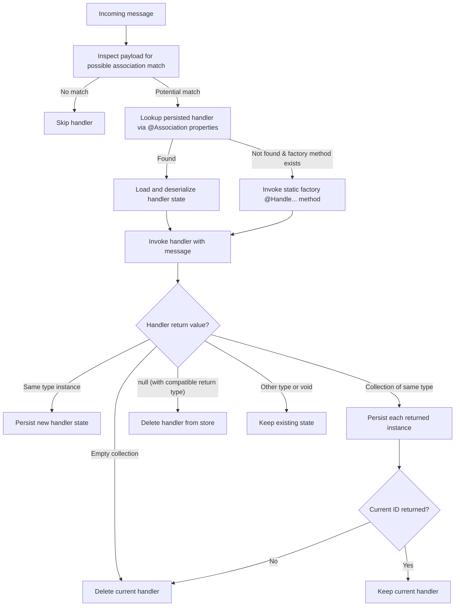

import Jdoclink from '~/components/jdoclink.astro';

import { Tabs, TabItem } from '@astrojs/starlight/components';
import { Aside } from '@astrojs/starlight/components';

While models represent domain entities, Fluxzero also supports long-lived **stateful handlers** for modeling workflows,
external interactions, or background processes that span multiple messages.

Use this when later messages need to remember earlier progress: a payment request waits for confirmation, or a
background operation needs to resume after a temporary failure. A Model holds the business fact; the workflow
remembers what still needs to happen. [Building API integrations](/docs/guides/messaging/building-api-integrations)
shows where the actual external call belongs.

Start with [Wait for a response](/docs/guides/modeling-and-persistence/waiting-for-a-response) for a complete
small example of storing process memory, matching the response and removing the completed process.
The sections below describe the lifecycle and configuration of <Jdoclink className="Stateful" />.

## Key properties

- `@Stateful` classes persist their state using Fluxzero’s document store (or a custom `HandlerRepository`)
- They are automatically invoked when messages match their associations (`@Association` fields or methods)
- Matching is dynamic and supports multiple handler instances per message
- Multiple handler methods can exist for different message types
- Handlers are immutable by convention — they are updated by returning a new version of themselves
- Returning `null` from a handler-compatible return type deletes the current handler instance (useful for terminal flows)

<Aside type="note">
Like other handlers, stateful handlers may be annotated with `@Consumer` for tracking isolation.
</Aside>

## Matching via association

Handlers are selected based on one or more `@Association` fields. When a message with a matching association is
published, the handler is loaded and invoked.

<Tabs>
  <TabItem label="Java">
    ```java
    @Association
    String providerReference;
    ```
  </TabItem>
  <TabItem label="Kotlin">
    ```kotlin
    @Association
    val providerReference: String
    ```
  </TabItem>
</Tabs>

<Aside type="note">
This is similar to correlation IDs or saga keys — but built-in and fully indexed.
</Aside>

## State update semantics

- If the handler method returns a new instance of its class, it replaces the previous version in the store
- If it returns a collection, every returned instance of the same stateful type is stored
- Returning an empty collection deletes the current instance
- If a returned collection does not include the current instance ID, the current instance is deleted
- Returning a same-type instance with a different `@EntityId` replaces the current instance (new ID stored, old ID deleted)
- If it returns `void` or a value of another type, state is left unchanged
- This allows safe utility returns (like `Duration` for `@HandleSchedule`)

<Aside type="note">
Collections allow a stateful handler to fan out into multiple stateful instances after handling a single message.
</Aside>

<Tabs>
  <TabItem label="Java">
    ```java
    @HandleSchedule
    Duration on(CheckStatus schedule) {
        // Return next delay (but don’t update handler state)
        return Duration.ofMinutes(5);
    }
    ```
  </TabItem>
  <TabItem label="Kotlin">
    ```kotlin
    @HandleSchedule
    fun on(schedule: CheckStatus): Duration {
        // Return next delay (but don’t update handler state)
        return Duration.ofMinutes(5)
    }
    ```
  </TabItem>
</Tabs>

## Stateful members

A `@Stateful` parent can also own `@Member` children. Members can declare their own `@Handle...` methods and
`@Association` fields; Fluxzero loads the parent, invokes every matching member, and stores the updated parent.

`@Member` remains supported and is not deprecated. Use it when the child needs its own handlers and identity,
while its persisted state and retention deliberately belong to the parent document. In the example below, payment
workflow entries are stored as part of the customer handler. They are not independently persisted payment records.
Use a separate `@Model` for domain state that needs its own history, retention or deletion; plain nested values
without entity handling need no `@Member`.

<Tabs>
  <TabItem label="Java">
    ```java
    @Stateful
    public record Customer(
        @EntityId @Association String customerId,
        @Member List<Payment> payments
    ) {
    }

    public record Payment(@Association String paymentId, int captureCount) {
        @HandleEvent
        static Payment start(PaymentStarted event, Customer customer) {
            return new Payment(event.paymentId(), 0);
        }

        @HandleEvent
        Payment capture(PaymentCaptured event, Customer customer) {
            return new Payment(paymentId, captureCount + 1);
        }

        @HandleEvent
        Payment cancel(PaymentCancelled event) {
            return null;
        }
    }
    ```
  </TabItem>
  <TabItem label="Kotlin">
    ```kotlin
    @Stateful
    data class Customer(
        @EntityId @Association val customerId: String,
        @Member val payments: List<Payment> = emptyList()
    )

    data class Payment(
        @Association val paymentId: String,
        val captureCount: Int = 0
    ) {
        companion object {
            @HandleEvent
            @JvmStatic
            fun start(event: PaymentStarted, customer: Customer): Payment {
                return Payment(event.paymentId)
            }
        }

        @HandleEvent
        fun capture(event: PaymentCaptured, customer: Customer): Payment {
            return copy(captureCount = captureCount + 1)
        }

        @HandleEvent
        fun cancel(event: PaymentCancelled): Payment? {
            return null
        }
    }
    ```
  </TabItem>
</Tabs>

Key behavior:

- A message with only the child association, such as `paymentId`, can target the matching member inside the parent
- Static member handlers can create a child when the message can be associated with a parent; use
  `@Association(always = true)` only when fan-out to all matching parents is intentional
- Instance member handlers update by returning a member instance, delete by returning `null`, or add/replace multiple
  members by returning a collection
- If the parent and a member both handle the same message, Fluxzero applies the parent mutation first and then invokes
  matching members from the updated parent
- Multiple members may match one message, both within one parent and across parents
- For map-backed members, newly added members use `@EntityId` or `@Member(idProperty = "...")` as the map key
- Java record parents do not need `@With` on `@Member` components; records are rebuilt through the canonical
  constructor. Kotlin data classes are rebuilt through copy semantics.

## Batch commit control

By default, changes to a `@Stateful` handler are persisted immediately. Set `commitInBatch = true` to defer updates
until the current message batch completes. Fluxzero ensures that:

- Newly created handlers are matched by subsequent messages
- Deleted handlers won’t receive more messages in the batch
- Updates are consistent within the batch

<Aside type="note">
This dramatically improves performance for high-throughput workflows.
</Aside>

## Indexing support

Stateful handlers are automatically `@Searchable`. You can configure:

- A custom collection name
- Time-based indexing fields (e.g. `timestampPath` or `endPath`)

This allows you to query, filter, and monitor stateful handlers using Fluxzero’s search API — covered in the next section.

---

Stateful handlers are ideal for:

- **Workflows** and **sagas**
- **Pollers**, **reminders**, and **background jobs**
- External **API orchestrations**
- **Process managers** (e.g., order fulfillment, payment retry, etc.)

They complement models without competing with them — and allow modeling temporal behavior in a clean, event-driven way.

## Choose business state or process memory first

Use Models for business facts, such as an order or a confirmed payment. Use `@Stateful` for progress across messages,
such as a provider reference, a pending action or a retry. A workflow can invoke domain commands when an external
observation justifies a business change. See [Model recipes](./197-model-recipes.mdx) for combining these capabilities.

### Choose the trigger and preserve pending work

Use `@HandleEvent` when each business transition must cause a reaction. A `@HandleDocument` observer can reconcile
pending work only if the latest document still describes every unfinished action: intermediate document versions
may be skipped.

For workflows that call an external service:

1. Persist the pending action and its stable idempotency key before executing it.
2. Reload current intent before executing delayed or replayed work.
3. Record the acknowledgement before removing the pending action, and correlate it with that action so a late result
   cannot complete newer work.

<Aside type="caution" title="External effects have their own completion boundary">
Stateful persistence and an external HTTP call are separate operations. Make retries idempotent and test recovery
when the process stops before or after the external response. Stored workflow state alone does not provide
exactly-once external effects.
</Aside>

Use a [local command or query](/docs/guides/messaging/sending-web-requests) for each external interaction and keep
large workloads bounded, with durable continuation state. For association, persistence and completion details,
see <Jdoclink className="Stateful" />.

## Invocation flow

The following diagram shows how a `@Stateful` handler is matched, loaded, invoked, and updated:


```mermaid
graph TD
    MSG[Incoming message] --> CHECK[Inspect payload for possible association match]
    CHECK -->|No match| SKIP[Skip handler]
    CHECK -->|Potential match| LOOKUP[Lookup persisted handler via @Association properties]

    LOOKUP -->|Not found & factory method exists| CREATE[Invoke static factory @Handle... method]
    LOOKUP -->|Found| LOAD[Load and deserialize handler state]

    CREATE --> INVOKE[Invoke handler with message]
    LOAD --> INVOKE[Invoke handler with message]

    INVOKE --> RETURN{Handler return value?}
    RETURN -->|Same type instance| UPDATE[Persist new handler state]
    RETURN -->|Collection of same type| UPSERT_MANY[Persist each returned instance]
    UPSERT_MANY --> CURRENT_IN_SET{Current ID returned?}
    CURRENT_IN_SET -->|No| DELETE_CURRENT[Delete current handler]
    CURRENT_IN_SET -->|Yes| KEEP_CURRENT[Keep current handler]
    RETURN -->|Empty collection| DELETE_CURRENT
    RETURN -->|"null (with compatible return type)"| DELETE[Delete handler from store]
    RETURN -->|Other type or void| KEEP[Keep existing state]
```

1. The message payload is inspected to see if any `@Association` values might match.
2. If there’s a possible match, Fluxzero looks up the persisted handler document by association.
3. If a handler is not found but a static factory method or constructor (`@Handle...`) exists, that method is invoked to create a new handler.
4. If a persisted handler is found, its state is loaded and deserialized.
5. The handler is invoked with the incoming message.
6. The return value determines what happens next:
   - Returning a new instance of the handler type → the handler state is re-persisted with the updated values.
   - Returning a collection of handler instances → each returned instance is stored; current instance is deleted if its ID is not returned.
   - Returning an empty collection → the current instance is deleted.
   - Returning `null` (with a compatible return type) → the handler is deleted from the store.
   - Returning another type or `void` → the state remains unchanged (useful for utility responses such as durations or acknowledgments).

<Aside type="note">
This entire process typically runs behind a **message tracker**, which continuously delivers messages to eligible stateful handlers. It’s not an on-demand invocation, but part of Fluxzero’s ongoing tracking loop.
</Aside>
