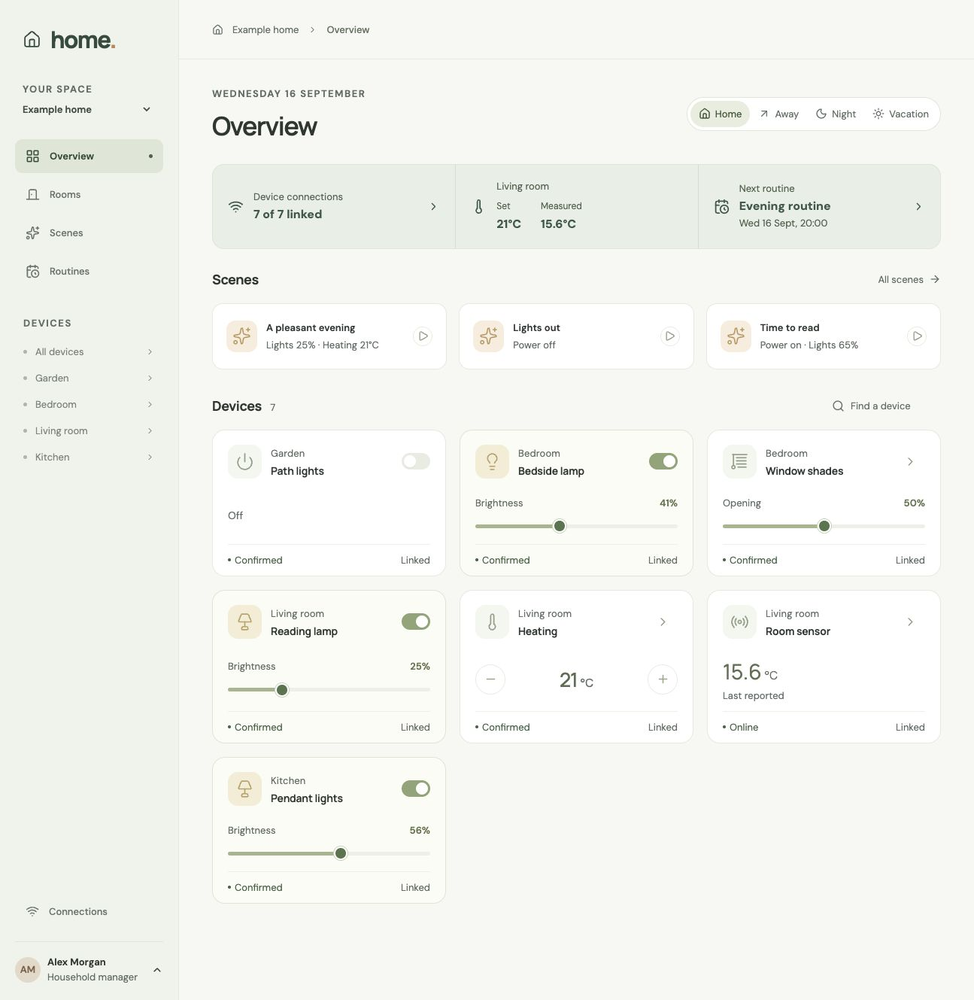

import { LinkButton, Tabs, TabItem } from '@astrojs/starlight/components';

Let's build a home you can control: organize rooms, dim a light, activate a scene, schedule it, and react to
sensor readings. Then connect those actions to Home Assistant and a live browser interface.

<LinkButton href="https://github.com/fluxzero-io/fluxzero-sample-home" icon="github" iconPlacement="start" variant="secondary">
  View on GitHub
</LinkButton>



*The completed Home app, shown with its Home Assistant connection.*

This continues [Building your first app](/docs/tutorials/first-app). We will use its commands, Models, queries
and fixtures without introducing them again.

<span id="run-the-example"></span>

## Work through the app

Clone the current example and open it as your working project:

```shell
git clone https://github.com/fluxzero-io/fluxzero-sample-home.git
cd fluxzero-sample-home
fz dev
```

The checkout contains the completed application. Rebuild the classes and methods below in their existing files,
using the surrounding value types, authentication setup and UI as scaffolding. Each section adds one part of the
application; the source links provide the complete implementation where we show a method rather than a whole file.
The Kotlin tabs express the same steps using the example's existing Java model and value types.

Open the app and sign in as **alex**. Start by creating a room, changing a light and activating **A pleasant evening**.
Keep this result in mind as we build from the household outward. The default profile saves device requests;
connecting real equipment comes later.

## Give rooms their own lifecycle

A home owns rooms, but each room can be renamed, moved or removed independently. Start in `household/api/model`
with `Home` and `Space`. A space's parent can be a home or another space, so a floor can contain several rooms.

```java
@Model(searchable = true)
@With
public record Home(@EntityId HomeId id,
                   HomeDetails details,
                   java.time.ZoneId timeZone,
                   HomeMode mode) implements Place {}

@Model
@With
public record Space(@EntityId SpaceId id,
                    @Parent(types = {Home.class, Space.class}, pathInParent = "spaces")
                    PlaceId<?> parentId,
                    SpaceDetails details,
                    DeviceId primaryLightId) implements Place {}
```

The parent relationship supplies the hierarchy. We do not keep a second list of rooms inside `Home`.
`searchable = true` lets this home and its descendants participate in search.

Now implement the room-creation command. It checks the destination before creating the room:

<Tabs>
  <TabItem label="Java">

```java
public record AddSpace(@NotNull SpaceId spaceId, @NotNull PlaceId<?> parentId,
                       @NotNull @Valid SpaceDetails details) {
    @AssertLegal void parentExists() {
        if (!Fluxzero.loadModel(parentId).isPresent()) {
            throw new IllegalCommandException("Choose an existing home or space.");
        }
    }

    @Apply Space apply() { return new Space(spaceId, parentId, details, null); }
}
```

  </TabItem>
  <TabItem label="Kotlin">

```kotlin
data class AddSpace(
    @field:NotNull val spaceId: SpaceId,
    @field:NotNull val parentId: PlaceId<*>,
    @field:NotNull @field:Valid val details: SpaceDetails
) {
    @AssertLegal
    fun parentExists() {
        if (!Fluxzero.loadModel(parentId).isPresent) {
            throw IllegalCommandException("Choose an existing home or space.")
        }
    }

    @Apply
    fun apply() = Space(spaceId, parentId, details, null)
}
```

  </TabItem>
</Tabs>

Use the existing [CreateHome](https://github.com/fluxzero-io/fluxzero-sample-home/blob/main/src/main/java/io/fluxzero/home/household/api/CreateHome.java) to establish the root first. Create a floor under it and a room under
the floor. The test below uses the IDs and fixed clock from [HouseExample](https://github.com/fluxzero-io/fluxzero-sample-home/blob/main/src/test/java/io/fluxzero/home/HouseExample.java); this first test creates
its own state so you can see the whole setup. Add it to a `HomeTutorialTest` under `src/test/java/io/fluxzero/home`,
with static imports from `HouseExample` and JUnit assertions. Use that class for the later checkpoints too.

<Tabs>
  <TabItem label="Java">

```java
@Test
void createRoom() {
    TestFixture.create().givenCommands(
            new CreateHome(HOME, new HomeDetails("Canal house"), AMSTERDAM),
            new AddSpace(FLOOR, HOME, new SpaceDetails("Ground floor", SpaceKind.FLOOR)))
        .whenCommand(new AddSpace(LIVING, FLOOR, new SpaceDetails("Living room", SpaceKind.ROOM)))
        .expectSuccessfulResult()
        .expectThat(f -> assertEquals(FLOOR, Fluxzero.loadModel(LIVING).get().parentId()));
}
```

  </TabItem>
  <TabItem label="Kotlin">

```kotlin
@Test
fun createRoom() {
    TestFixture.create().givenCommands(
            CreateHome(HOME, HomeDetails("Canal house"), AMSTERDAM),
            AddSpace(FLOOR, HOME, SpaceDetails("Ground floor", SpaceKind.FLOOR)))
        .whenCommand(AddSpace(LIVING, FLOOR, SpaceDetails("Living room", SpaceKind.ROOM)))
        .expectSuccessfulResult()
        .expectThat { assertEquals(FLOOR, Fluxzero.loadModel(LIVING).get().parentId()) }
}
```

  </TabItem>
</Tabs>

### Move rooms and group them

Implement [MoveSpace](https://github.com/fluxzero-io/fluxzero-sample-home/blob/main/src/main/java/io/fluxzero/home/household/api/MoveSpace.java) next: return `space.withParentId(parentId)` after checking that the destination
belongs to the same home. Moving a room changes its relationship; devices in that room keep their identities.

A **zone** is different: it groups existing spaces without moving them. Implement [DefineZone](https://github.com/fluxzero-io/fluxzero-sample-home/blob/main/src/main/java/io/fluxzero/home/household/api/DefineZone.java)
with a set of `SpaceId`s and check each ID against the home graph. For example, “Downstairs” can select the living
room and kitchen while they remain under their original floor.

Residents are independent children too. [AddResident](https://github.com/fluxzero-io/fluxzero-sample-home/blob/main/src/main/java/io/fluxzero/home/household/api/AddResident.java) creates one with unknown presence;
[ArriveHome](https://github.com/fluxzero-io/fluxzero-sample-home/blob/main/src/main/java/io/fluxzero/home/household/api/ArriveHome.java) changes that presence to `HOME`. Home mode is a separate household decision, changed
with `ChangeHomeMode`; an arrival does not automatically choose it.

**Check:** create a second room, move it under the floor and define a zone containing both rooms.
The zone should refer to the same rooms you see under that floor. The existing
[HomeModelTest](https://github.com/fluxzero-io/fluxzero-sample-home/blob/main/src/test/java/io/fluxzero/home/household/HomeModelTest.java) exercises these relationships and their removal rules.

## Add a device and its first control

A lamp belongs to a room. In `devices/api/model/Device`, keep its identity, `@Parent SpaceId`, name,
capabilities and pending settings. Capabilities describe the controls it supports; measurements describe what it
can report. [AddDevice](https://github.com/fluxzero-io/fluxzero-sample-home/blob/main/src/main/java/io/fluxzero/home/devices/api/AddDevice.java) creates the device with empty pending settings.

Build one control first: dimming. Implement `DimLight` in `devices/api`:

<Tabs>
  <TabItem label="Java">

```java
public record DimLight(DeviceId deviceId, @NotNull @Valid LightLevel brightness) implements DeviceCommand {
    @Override
    public DeviceSetting setting() {
        return brightness;
    }

    @Apply
    Device apply(Device device) {
        return device.withPendingSettings(device.pendingSettings().with(brightness));
    }
}
```

  </TabItem>
  <TabItem label="Kotlin">

```kotlin
data class DimLight(
    private val deviceId: DeviceId,
    @field:NotNull @field:Valid val brightness: LightLevel
) : DeviceCommand {
    override fun deviceId() = deviceId
    override fun setting(): DeviceSetting = brightness

    @Apply
    fun apply(device: Device): Device =
        device.withPendingSettings(device.pendingSettings().with(brightness))
}
```

  </TabItem>
</Tabs>

Put the shared capability check in [Device](https://github.com/fluxzero-io/fluxzero-sample-home/blob/main/src/main/java/io/fluxzero/home/devices/api/model/Device.java): a `DeviceCommand` must target a capability the device
has. Its other `@Apply` method records the message timestamp as `requestedAt`. The command changes the requested
setting; it does not invent an observation from the lamp.

For the next tests, `house()` supplies the home, rooms, a light, heating and a sensor using ordinary creation
commands. It also fixes the clock at `NOW`. Check the control through the fixture:

<Tabs>
  <TabItem label="Java">

```java
@Test
void dimLight() {
    house().whenCommand(new DimLight(LIGHT, new LightLevel(40)))
        .expectSuccessfulResult()
        .expectThat(f -> {
            assertEquals(new LightLevel(40),
                    Fluxzero.loadModel(LIGHT).get().pendingSettings().get(Capability.LIGHT_LEVEL));
            assertNull(Fluxzero.loadModel(LIGHT, DeviceStatus.class).get());
        });
}
```

  </TabItem>
  <TabItem label="Kotlin">

```kotlin
@Test
fun dimLight() {
    house().whenCommand(DimLight(LIGHT, LightLevel(40)))
        .expectSuccessfulResult()
        .expectThat {
            assertEquals(LightLevel(40),
                Fluxzero.loadModel(LIGHT).get().pendingSettings()[Capability.LIGHT_LEVEL])
            assertNull(Fluxzero.loadModel(LIGHT, DeviceStatus::class.java).get())
        }
}
```

  </TabItem>
</Tabs>

Add `TurnOn`, `TurnOff` and `SetRoomTemperature` using the same pattern. The other controls—blinds, locks,
media and charging—vary the setting value, so we will not repeat their implementations here.
[DeviceBehaviorTest](https://github.com/fluxzero-io/fluxzero-sample-home/blob/main/src/test/java/io/fluxzero/home/devices/DeviceBehaviorTest.java) checks the capability and value rules for the complete set.

## Let device observations confirm requests

After asking for 40%, we need to know whether the lamp reached it. Give observations their own
[DeviceStatus](https://github.com/fluxzero-io/fluxzero-sample-home/blob/main/src/main/java/io/fluxzero/home/devices/api/model/DeviceStatus.java) Model, parented to the device. It stores the observation time, availability,
reported settings and sensor readings.

Implement [ReportDeviceStatus](https://github.com/fluxzero-io/fluxzero-sample-home/blob/main/src/main/java/io/fluxzero/home/devices/api/ReportDeviceStatus.java) to update that Model. In the same command, remove pending settings
that a newer online report confirms. This is the `confirmRequest` method:

<Tabs>
  <TabItem label="Java">

```java
@Apply Device confirmRequest(Device device) {
    if (availability != Availability.ONLINE || device.requestedAt() == null
            || !observedAt.isAfter(device.requestedAt())) return device;
    var pending = device.pendingSettings().withoutConfirmedBy(reportedSettings);
    return device.withPendingSettings(pending).withRequestedAt(pending.isEmpty() ? null : device.requestedAt());
}
```

  </TabItem>
  <TabItem label="Kotlin">

```kotlin
@Apply
fun confirmRequest(device: Device): Device {
    if (availability != Availability.ONLINE || device.requestedAt() == null
        || !observedAt.isAfter(device.requestedAt())) return device
    val pending = device.pendingSettings().withoutConfirmedBy(reportedSettings)
    return device.withPendingSettings(pending)
        .withRequestedAt(if (pending.isEmpty) null else device.requestedAt())
}
```

  </TabItem>
</Tabs>

Keep the command's checks for supported measurements and observation time. An older report must not replace a
newer one. Now demonstrate the useful behavior: after confirmation, a physical change leads the displayed state.

<Tabs>
  <TabItem label="Java">

```java
@Test
void followPhysicalChange() {
    house().givenCommands(new DimLight(LIGHT, new LightLevel(40)))
        .givenElapsedTime(Duration.ofSeconds(1))
        .whenCommand(new ReportDeviceStatus(LIGHT, NOW.plusSeconds(1), Availability.ONLINE,
                new DeviceSettings(List.of(new LightLevel(40))), Map.of()))
        .expectThat(f -> assertTrue(Fluxzero.loadModel(LIGHT).get().pendingSettings().isEmpty()))
        .andThen().givenElapsedTime(Duration.ofSeconds(1))
        .whenCommand(new ReportDeviceStatus(LIGHT, NOW.plusSeconds(2), Availability.ONLINE,
                new DeviceSettings(List.of(new LightLevel(10))), Map.of()))
        .expectThat(f -> {
            assertTrue(Fluxzero.loadModel(LIGHT).get().pendingSettings().isEmpty());
            assertEquals(new LightLevel(10), Fluxzero.loadModel(LIGHT, DeviceStatus.class)
                    .get().reportedSettings().get(Capability.LIGHT_LEVEL));
        });
}
```

  </TabItem>
  <TabItem label="Kotlin">

```kotlin
@Test
fun followPhysicalChange() {
    house().givenCommands(DimLight(LIGHT, LightLevel(40)))
        .givenElapsedTime(Duration.ofSeconds(1))
        .whenCommand(ReportDeviceStatus(LIGHT, NOW.plusSeconds(1), Availability.ONLINE,
            DeviceSettings(listOf(LightLevel(40))), emptyMap()))
        .expectThat { assertTrue(Fluxzero.loadModel(LIGHT).get().pendingSettings().isEmpty) }
        .andThen().givenElapsedTime(Duration.ofSeconds(1))
        .whenCommand(ReportDeviceStatus(LIGHT, NOW.plusSeconds(2), Availability.ONLINE,
            DeviceSettings(listOf(LightLevel(10))), emptyMap()))
        .expectThat {
            assertTrue(Fluxzero.loadModel(LIGHT).get().pendingSettings().isEmpty)
            assertEquals(LightLevel(10), Fluxzero.loadModel(LIGHT, DeviceStatus::class.java)
                .get().reportedSettings()[Capability.LIGHT_LEVEL])
        }
}
```

  </TabItem>
</Tabs>

The old 40% request has finished. We do not keep sending it when someone changes the lamp elsewhere.

<span id="follow-the-scene-into-the-code"></span>

## Combine controls into a scene

A scene stores actions rather than device state. Implement `Scene` with its own ID, a Home parent, details and a
list of `SceneAction`s. Each action selects targets and creates a normal device command. For dimming, implement:

```java
public record DimLights(@NotNull @Valid SceneTarget target, @NotNull @Valid LightLevel brightness) implements SceneAction {
    @Override
    public Capability capability() {
        return Capability.LIGHT_LEVEL;
    }

    @Override
    public DeviceCommand commandFor(DeviceId deviceId) {
        return new DimLight(deviceId, brightness);
    }
}
```

Implement [InSpace](https://github.com/fluxzero-io/fluxzero-sample-home/blob/main/src/main/java/io/fluxzero/home/scenes/api/model/InSpace.java) by selecting descendant devices that support the action's capability.
`OneDevice`, `InZone` and `WholeHome` change the selection, not the control command.
[DefineScene](https://github.com/fluxzero-io/fluxzero-sample-home/blob/main/src/main/java/io/fluxzero/home/scenes/api/DefineScene.java) validates those targets and saves the action list.

Next, make activation expand the actions into one set of Model changes. Add this method to `ActivateScene`:

<Tabs>
  <TabItem label="Java">

```java
@InterceptApply
List<Object> prepare(Scene scene, Graph<Home> home) {
    var commands = new LinkedHashMap<DeviceId, EnumMap<Capability, DeviceCommand>>();
    for (var action : scene.actions()) {
        for (var device : action.target().select(home, action.capability())) {
            commands.computeIfAbsent(device.deviceId(), ignored -> new EnumMap<>(Capability.class))
                    .put(action.capability(), action.commandFor(device.deviceId()));
        }
    }
    var result = new ArrayList<Object>();
    commands.values().forEach(perDevice -> result.addAll(perDevice.values()));
    result.add(this);
    return result;
}
```

  </TabItem>
  <TabItem label="Kotlin">

```kotlin
@InterceptApply
fun prepare(scene: Scene, home: Graph<Home>): List<Any> {
    val commands = linkedMapOf<Pair<DeviceId, Capability>, DeviceCommand>()
    for (action in scene.actions()) {
        for (device in action.target().select(home, action.capability())) {
            commands[device.deviceId() to action.capability()] = action.commandFor(device.deviceId())
        }
    }
    return commands.values.toList() + this
}
```

  </TabItem>
</Tabs>

<span id="change-a-scene-with-a-test"></span>

The last action for a device capability wins. Returning the commands together makes the scene one atomic change.
Keep `ActivateScene`'s `@Apply(eventPublication = ALWAYS)` method returning the scene: activation is worth recording
even though its definition is unchanged.

[evening() in HouseExample](https://github.com/fluxzero-io/fluxzero-sample-home/blob/main/src/test/java/io/fluxzero/home/HouseExample.java) defines a scene with a light at 25% and heating at 21 °C.
Try both the complete activation and a missing target:

<Tabs>
  <TabItem label="Java">

```java
@Test
void activateTogether() {
    house().givenCommands(evening())
        .whenCommand(new ActivateScene(EVENING))
        .expectSuccessfulResult()
        .expectThat(f -> assertEvening());
}

@Test
void missingTargetLeavesLightUntouched() {
    house().givenCommands(evening(), new RemoveDevice(HEAT))
        .whenCommand(new ActivateScene(EVENING))
        .expectExceptionalResult(IllegalCommandException.class)
        .expectThat(f -> assertTrue(Fluxzero.loadModel(LIGHT).get().pendingSettings().isEmpty()));
}
```

  </TabItem>
  <TabItem label="Kotlin">

```kotlin
@Test
fun activateTogether() {
    house().givenCommands(evening())
        .whenCommand(ActivateScene(EVENING))
        .expectSuccessfulResult()
        .expectThat { assertEvening() }
}

@Test
fun missingTargetLeavesLightUntouched() {
    house().givenCommands(evening(), RemoveDevice(HEAT))
        .whenCommand(ActivateScene(EVENING))
        .expectExceptionalResult(IllegalCommandException::class.java)
        .expectThat { assertTrue(Fluxzero.loadModel(LIGHT).get().pendingSettings().isEmpty) }
}
```

  </TabItem>
</Tabs>

## Run a scene on a schedule

A routine answers “which scene, when?” Give [Routine](https://github.com/fluxzero-io/fluxzero-sample-home/blob/main/src/main/java/io/fluxzero/home/automation/api/model/Routine.java) its own Model, parented to Home, with a scene
reference, timing, enabled flag, next run and generation. A scene can then be reused by several routines.

Implement [PlanRoutine](https://github.com/fluxzero-io/fluxzero-sample-home/blob/main/src/main/java/io/fluxzero/home/automation/api/PlanRoutine.java): check that the scene belongs to the home, calculate the next occurrence
using the home's timezone, and increment the generation whenever the plan changes.
`Once` supplies one instant; `Weekly` supplies days and a local time.

### Turn the plan into scheduled work

Add `RoutineSchedules` as a handler. Reconcile from the current routine so that pause and replan replace the
scheduled intention:

<Tabs>
  <TabItem label="Java">

```java
@Component
@Consumer(name = "home-routine-schedules", singleTracker = true, errorHandler = ThrowingErrorHandler.class)
public class RoutineSchedules {
    public static ScheduleId scheduleId(RoutineId id) { return ScheduleId.of("home-routine", id); }
    @HandleEvent
    void changed(Graph<Routine> eventGraph) {
        var routine = eventGraph.current().get();
        if (routine == null) return; // Parent ownership cancels work belonging to a deleted routine.
        var id = routine.routineId();
        if (!routine.enabled() || routine.nextRun() == null) {
            Fluxzero.cancelSchedule(scheduleId(id));
        } else {
            Fluxzero.scheduleCommand(new RunRoutine(id, routine.generation(), routine.nextRun()),
                    scheduleId(id), routine.nextRun());
        }
    }
}
```

  </TabItem>
  <TabItem label="Kotlin">

```kotlin
@Component
@Consumer(name = "home-routine-schedules", singleTracker = true,
    errorHandler = ThrowingErrorHandler::class)
class RoutineSchedules {
    companion object {
        @JvmStatic
        fun scheduleId(id: RoutineId): ScheduleId = ScheduleId.of("home-routine", id)
    }

    @HandleEvent
    fun changed(eventGraph: Graph<Routine>) {
        val routine = eventGraph.current().get() ?: return
        val id = routine.routineId()
        if (!routine.enabled() || routine.nextRun() == null) {
            Fluxzero.cancelSchedule(scheduleId(id))
        } else {
            Fluxzero.scheduleCommand(RunRoutine(id, routine.generation(), routine.nextRun()),
                scheduleId(id), routine.nextRun())
        }
    }
}
```

  </TabItem>
</Tabs>

Implement [RunRoutine](https://github.com/fluxzero-io/fluxzero-sample-home/blob/main/src/main/java/io/fluxzero/home/automation/api/RunRoutine.java) with `@Parent RoutineId`: deleting the routine also cancels its stored
work. Its `@InterceptApply` returns `ActivateScene` and the routine progress update together, after checking the
current generation and deadline. A completed one-off routine clears `nextRun`; a weekly one calculates its next date.

Keep the command's small `@HandleCommand` wrapper: it calls `assertAndApply`, and pauses the routine with a reason
if the scene is functionally refused. That pause happens after the failed scene has rolled back.

### Check execution and pause

`once(due)` below constructs a `PlanRoutine` for the evening scene. Advance the fixture clock instead of waiting:

<Tabs>
  <TabItem label="Java">

```java
@Test
void scheduledScene() {
    house(new RoutineSchedules()).givenCommands(evening(), once(NOW.plusSeconds(60)))
        .whenTimeElapses(Duration.ofSeconds(60))
        .expectNoErrors()
        .expectThat(f -> assertEvening())
        .expectNoSchedules();
}

@Test
void pauseRoutine() {
    house(new RoutineSchedules()).givenCommands(evening(), once(NOW.plusSeconds(60)))
        .whenCommand(new PauseRoutine(BEDTIME))
        .expectNoSchedules()
        .andThen().whenTimeElapses(Duration.ofSeconds(60))
        .expectNoEventsLike(ActivateScene.class);
}
```

  </TabItem>
  <TabItem label="Kotlin">

```kotlin
@Test
fun scheduledScene() {
    house(RoutineSchedules()).givenCommands(evening(), once(NOW.plusSeconds(60)))
        .whenTimeElapses(Duration.ofSeconds(60))
        .expectNoErrors()
        .expectThat { assertEvening() }
        .expectNoSchedules()
}

@Test
fun pauseRoutine() {
    house(RoutineSchedules()).givenCommands(evening(), once(NOW.plusSeconds(60)))
        .whenCommand(PauseRoutine(BEDTIME))
        .expectNoSchedules()
        .andThen().whenTimeElapses(Duration.ofSeconds(60))
        .expectNoEventsLike(ActivateScene::class.java)
}
```

  </TabItem>
</Tabs>

Finish pause, resume and removal using [PauseRoutine](https://github.com/fluxzero-io/fluxzero-sample-home/blob/main/src/main/java/io/fluxzero/home/automation/api/PauseRoutine.java), [ResumeRoutine](https://github.com/fluxzero-io/fluxzero-sample-home/blob/main/src/main/java/io/fluxzero/home/automation/api/ResumeRoutine.java) and
[RemoveRoutine](https://github.com/fluxzero-io/fluxzero-sample-home/blob/main/src/main/java/io/fluxzero/home/automation/api/RemoveRoutine.java). In the UI, create a weekly routine, pause it, resume it and remove it.
Its next execution should follow those changes. Calendar-specific behavior is already covered by
[RoutineBehaviorTest](https://github.com/fluxzero-io/fluxzero-sample-home/blob/main/src/test/java/io/fluxzero/home/automation/RoutineBehaviorTest.java); you do not need a separate scheduler for each timing type.

## React to home and sensor changes

Now run the same scenes in response to changes. An [automation definition](https://github.com/fluxzero-io/fluxzero-sample-home/blob/main/src/main/java/io/fluxzero/home/automation/api/DefineAutomation.java)
contains a scene, a trigger and a cooldown. Start with `HomeBecomes(AWAY)`, then add a sensor trigger.

Implement `HomeReactions` as an event handler. The observation method reads the before and after values from the
event's graph, rather than storing a second “previous temperature” field:

<Tabs>
  <TabItem label="Java">

```java
@HandleEvent
void observed(ReportDeviceStatus event, Graph<DeviceStatus> status, Message message) {
    var home = status.ancestor(Home.class).orElseThrow();
    var previous = status.previous();
    react(home.get().id(), new DeviceObservationChanged(status.get().deviceId(), message.getTimestamp(),
            previous == null || previous.isEmpty() ? Map.of() : previous.get().readings(), status.get().readings()));
}
```

  </TabItem>
  <TabItem label="Kotlin">

```kotlin
@HandleEvent
fun observed(event: ReportDeviceStatus, status: Graph<DeviceStatus>, message: Message) {
    val home = status.ancestor(Home::class.java).orElseThrow()
    val previous = status.previous()
    react(home.get()!!.id(), DeviceObservationChanged(status.get()!!.deviceId(), message.timestamp,
        if (previous == null || previous.isEmpty) emptyMap() else previous.get()!!.readings(),
        status.get()!!.readings()))
}
```

  </TabItem>
</Tabs>

Complete the handler's `react` method by finding this home's automations, matching their triggers and sending
`ReactToHome`. Implement [MeasurementCrosses](https://github.com/fluxzero-io/fluxzero-sample-home/blob/main/src/main/java/io/fluxzero/home/automation/api/model/MeasurementCrosses.java) so a rise above 24 °C requires a previous reading at
or below 24 and a new reading above it. A single warm reading cannot establish a crossing.

[ReactToHome](https://github.com/fluxzero-io/fluxzero-sample-home/blob/main/src/main/java/io/fluxzero/home/automation/api/ReactToHome.java) follows the routine pattern: apply the scene and cooldown together, or pause with a
reason when the scene cannot run. It checks the current enabled state before doing anything.

Add this scenario. `temperature(at, value)` builds a `ReportDeviceStatus` for the fixture's sensor:

<Tabs>
  <TabItem label="Java">

```java
@Test
void reactToTemperature() {
    var trigger = new MeasurementCrosses(SENSOR, Measurement.TEMPERATURE,
            MeasurementCrosses.Direction.RISES_ABOVE, new BigDecimal("24"));
    house(new HomeReactions()).givenCommands(evening(),
            new DefineAutomation(REACTION, HOME, new AutomationDetails("Warm room"),
                    EVENING, trigger, Duration.ofMinutes(5)), temperature(NOW, "23"))
        .givenElapsedTime(Duration.ofSeconds(1))
        .whenCommand(temperature(NOW.plusSeconds(1), "25"))
        .expectEvents(new ActivateScene(EVENING))
        .expectThat(f -> assertEvening())
        .andThen().givenElapsedTime(Duration.ofSeconds(1))
        .whenCommand(temperature(NOW.plusSeconds(2), "26"))
        .expectNoEventsLike(ActivateScene.class);
}
```

  </TabItem>
  <TabItem label="Kotlin">

```kotlin
@Test
fun reactToTemperature() {
    val trigger = MeasurementCrosses(SENSOR, Measurement.TEMPERATURE,
        MeasurementCrosses.Direction.RISES_ABOVE, BigDecimal("24"))
    house(HomeReactions()).givenCommands(evening(),
            DefineAutomation(REACTION, HOME, AutomationDetails("Warm room"),
                EVENING, trigger, Duration.ofMinutes(5)), temperature(NOW, "23"))
        .givenElapsedTime(Duration.ofSeconds(1))
        .whenCommand(temperature(NOW.plusSeconds(1), "25"))
        .expectEvents(ActivateScene(EVENING))
        .expectThat { assertEvening() }
        .andThen().givenElapsedTime(Duration.ofSeconds(1))
        .whenCommand(temperature(NOW.plusSeconds(2), "26"))
        .expectNoEventsLike(ActivateScene::class.java)
}
```

  </TabItem>
</Tabs>

The third reading remains above the threshold and should not activate the scene again. Use
[AutomationBehaviorTest](https://github.com/fluxzero-io/fluxzero-sample-home/blob/main/src/test/java/io/fluxzero/home/automation/AutomationBehaviorTest.java) for a second crossing during cooldown and for a paused automation.
The example defines automations through commands; its browser does not yet contain an automation editor.

## Connect the requests to Home Assistant

The domain can now run without equipment. Add delivery in `homeassistant`, after device changes have committed.
Keep three jobs separate:

1. `ConnectHomeAssistant` stores the connection; `DiscoverHomeAssistantDevices` reads its available equipment.
2. `LinkHomeAssistantDevice` associates a Home device with provider entity IDs.
3. `HomeAssistantIntegration` reacts to committed device commands, delivers current pending settings and polls observations.

Implement the outbound service call as a self-handling command, using the existing
[HomeAssistantEndpoint](https://github.com/fluxzero-io/fluxzero-sample-home/blob/main/src/main/java/io/fluxzero/home/homeassistant/HomeAssistantEndpoint.java) to build the authenticated request:

<Tabs>
  <TabItem label="Java">

```java
public record CallHomeAssistantService(@NotNull HomeAssistantId connectionId, @NotNull @Valid HomeAssistantAction action) {
    @HandleCommand
    void handle() {
        var request = HomeAssistantEndpoint.load(connectionId)
                .post("api/services/" + action.domain() + "/" + action.service(), action.body());
        try {
            requireSuccess(Fluxzero.sendWebRequestAndWait(request, REQUEST_SETTINGS));
        } catch (GatewayException | TimeoutException failure) {
            throw new HomeAssistantUnavailable("Home Assistant could not be reached or did not respond in time.");
        }
    }
}
```

  </TabItem>
  <TabItem label="Kotlin">

```kotlin
data class CallHomeAssistantService(
    @field:NotNull val connectionId: HomeAssistantId,
    @field:NotNull @field:Valid val action: HomeAssistantAction
) {
    @HandleCommand
    fun handle() {
        val request = HomeAssistantEndpoint.load(connectionId)
            .post("api/services/" + action.domain() + "/" + action.service(), action.body())
        try {
            requireSuccess(Fluxzero.sendWebRequestAndWait(request, REQUEST_SETTINGS))
        } catch (failure: GatewayException) {
            throw HomeAssistantUnavailable("Home Assistant could not be reached or did not respond in time.")
        } catch (failure: TimeoutException) {
            throw HomeAssistantUnavailable("Home Assistant could not be reached or did not respond in time.")
        }
    }
}
```

  </TabItem>
</Tabs>

The endpoint helper resolves connection properties and the bearer token. Keep those outside device Models and
commands. Implement [GetHomeAssistantStates](https://github.com/fluxzero-io/fluxzero-sample-home/blob/main/src/main/java/io/fluxzero/home/homeassistant/api/GetHomeAssistantStates.java) as the matching query for `/api/states`.
Its snapshot translates provider values into our `ReportDeviceStatus` messages.

In [HomeAssistantIntegration](https://github.com/fluxzero-io/fluxzero-sample-home/blob/main/src/main/java/io/fluxzero/home/homeassistant/HomeAssistantIntegration.java), build `deliver` around three steps: load the current binding and
pending settings, create provider actions from the snapshot, then send each `CallHomeAssistantService` through
Fluxzero. Build `refresh` by fetching a snapshot and submitting changed observations through
`AcceptHomeAssistantObservation`. The integration reschedules temporary failures using the connection's refresh interval.

A successful service request does not clear the lamp's pending setting; only the observation from the earlier
chapter can do that.

**Check:** use [HomeAssistantTest](https://github.com/fluxzero-io/fluxzero-sample-home/blob/main/src/test/java/io/fluxzero/home/homeassistant/HomeAssistantTest.java) to exercise discovery, linking, delivery and observation with
controlled HTTP responses. Then follow the app's
[Home Assistant demo](https://github.com/fluxzero-io/fluxzero-sample-home/blob/main/docs/testing-home-assistant.md)
to try the same path against virtual devices through the real API. Dim a light, wait for its report, then change
it directly in Home Assistant: Home should follow the new value.

## Expose household controls to the browser

Use the existing sign-in and session setup in `access`. Implement [HomeAccess](https://github.com/fluxzero-io/fluxzero-sample-home/blob/main/src/main/java/io/fluxzero/home/access/HomeAccess.java) against the account's
home-specific permission: view, control or manage. A resident in the domain is not automatically an authenticated
account with permission to control equipment.

For the brightness route in `DeviceEndpoint`, translate the request into the command we already built:

<Tabs>
  <TabItem label="Java">

```java
@HandlePost("/brightness") @ApiDoc(operationId = "dimLight")
void dimLight(@PathParam HomeId homeId, @PathParam DeviceId deviceId, @Valid Percent value, HomeUser user, WebRequest request) {
    requireControl(homeId, deviceId, user, request);
    Fluxzero.sendCommandAndWait(new DimLight(deviceId, new LightLevel(value.percent())));
}
```

  </TabItem>
  <TabItem label="Kotlin">

```kotlin
@HandlePost("/brightness")
@ApiDoc(operationId = "dimLight")
fun dimLight(@PathParam homeId: HomeId, @PathParam deviceId: DeviceId,
             @Valid value: Percent, user: HomeUser, request: WebRequest) {
    requireControl(homeId, deviceId, user, request)
    Fluxzero.sendCommandAndWait<Any?>(DimLight(deviceId, LightLevel(value.percent())))
}
```

  </TabItem>
</Tabs>

Keep `requireControl` beside the endpoint. It checks the browser origin, the account's control permission and
that the device is actually inside this home. Room creation uses management permission. Build the scene and routine
routes in the same way; their domain behavior stays in the commands.

For queries, implement [FindDevices](https://github.com/fluxzero-io/fluxzero-sample-home/blob/main/src/main/java/io/fluxzero/home/devices/api/FindDevices.java) with `Fluxzero.search(Device.class).whereAncestor(homeId)` and an
optional capability filter. The ancestor filter includes nested rooms. [GetHomeOverview](https://github.com/fluxzero-io/fluxzero-sample-home/blob/main/src/main/java/io/fluxzero/home/household/api/GetHomeOverview.java) assembles the
household view used by the interface.

In `frontend/src/Devices.jsx`, wire the slider to the existing `api` helper. The relevant browser call is:

```javascript
await api(`/api/homes/${homeId}/devices/${deviceId}/brightness`, {
  method: "POST",
  body: { percent: 40 },
});
```

The helper adds the session credentials and same-origin request header. Render pending and reported values
separately using `frontend/src/home.js`; the interface can then show a request that has not yet reached its device.

**Check:** as alex, change the light. Sign in as **sam** and try the same action: viewing is allowed, control is
refused. Keep these checks in `HomeWebTest` as well as trying the interface.

## Keep every open screen current

Finish `HomeSocket` at `/api/homes/{homeId}/live`. On opening, authorize the home and send its overview.
A notification for that home asks the socket to refresh:

<Tabs>
  <TabItem label="Java">

```java
@HandleNotification
void changed(Graph<Home> home) {
    if (homeId.getId().equals(home.functionalId())) refresh();
}
```

  </TabItem>
  <TabItem label="Kotlin">

```kotlin
@HandleNotification
fun changed(home: Graph<Home>) {
    if (homeId.id == home.functionalId()) refresh()
}
```

  </TabItem>
</Tabs>

Implement `refresh` with the existing [HomeSocket](https://github.com/fluxzero-io/fluxzero-sample-home/blob/main/src/main/java/io/fluxzero/home/household/HomeSocket.java) session and permission checks. Each connection
sends the current overview; an expired session or revoked permission closes it.

In `frontend/src/App.jsx`, connect after sign-in and replace the displayed home when a message arrives.
This is the essential part of that effect:

```javascript
const socket = new WebSocket(
  `${location.protocol === "https:" ? "wss:" : "ws:"}//${location.host}/api/homes/${encodeURIComponent(homeId)}/live`
);
socket.onmessage = event => setData(JSON.parse(event.data));
return () => socket.close();
```

Use the app's existing effect for refresh requests and reconnects. Room, scene and routine screens now consume the
same live overview instead of each maintaining a separate copy of household state.

**Check:** open two windows as alex. Create a room in one, change a light in the other, then pause a routine.
Both windows should reflect each change without reloading. Finish by activating the evening scene and confirming
that the lamp and heating requests change together.

You now have the distinct pieces of the Home app: household relationships, controls and observations, reusable
scenes, time and sensor automation, an external adapter, access-controlled endpoints and live views.
To add another device control, repeat the small setting-and-command pattern; the scene, routine and integration
boundaries remain the same.
