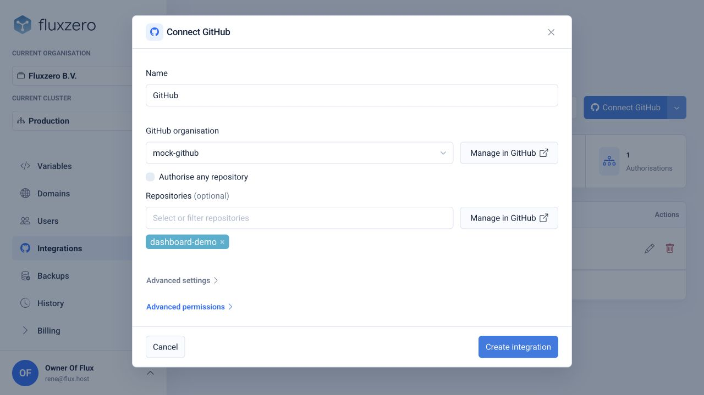
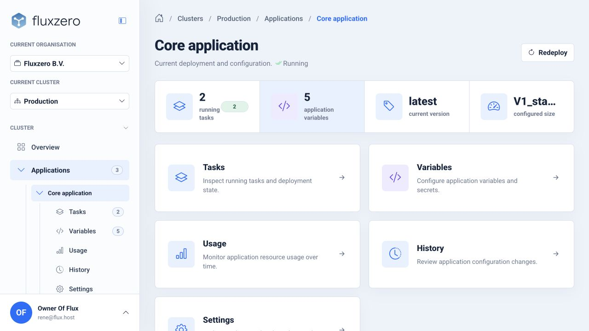

import { Card, CardGrid } from '@astrojs/starlight/components';

Your local preview is where you build and try changes. **Fluxzero is the cloud that runs your frontend and backend for real users**, with data, messaging, security, recovery,
and observability already in place. GitHub holds the application code and the workflow used to deliver it.

This guide uses screenshots from the local Fluxzero dashboard demo. The organization, GitHub repository, and deployment
shown are example data; choose your own equivalents when publishing.

<CardGrid>
  <Card title="You and your agent" icon="pencil">
    Choose the release, verify its product rules, and prepare the repository and configuration.
  </Card>
  <Card title="Fluxzero" icon="rocket">
    Run the published app, preserve its data and work, and provide the history you need to operate it.
  </Card>
</CardGrid>

## 1. Prepare the app with your agent

Ask your agent to check the app's tests and help you try its main user flows in Devboard. Then ask it to prepare the
GitHub repository and Fluxzero deployment workflow. Starter projects include deployment files; your agent can check
that they match the application, including its frontend and any required configuration.

Agree on the version you want to deploy. Local demo data and development credentials are not production setup:
ask the agent to identify which configuration, sign-in settings, and external services your live app needs.

## 2. Connect GitHub to Fluxzero

Sign in to [Fluxzero](https://dashboard.fluxzero.io) and select your organization. If this is your first app,
create an organization and choose the cloud setup that fits it. Review the plan and cost before provisioning.
Your agent can explain the choices in terms of the app you want to run.

Open **Integrations** under **Organisation**, then choose **Connect GitHub**. Connect your GitHub account or
organization and give the Fluxzero GitHub App access to the repository you want to deploy.

In the integration form, select the GitHub organization. To limit this integration to your app, turn off
**Authorise any repository** and select the app's repository. Review the permissions, then choose **Create integration**.
The default **Deployer** role is intended for delivering applications; **Advanced permissions** lets you restrict
its scope. Your agent can help match that scope to the app's destination.

*The local demo uses `mock-github` and `dashboard-demo`. Select your own GitHub organization and repository.*

**Advanced settings** can restrict which workflows and GitHub environments may use the integration. Your agent can
match these to the deployment workflow it prepared. If the repository is missing, check the selected GitHub
organization and the GitHub App's repository access using **Manage in GitHub**.

## 3. Deploy a checked version

Choose the target Fluxzero cluster and application for the deployment workflow. A cluster is the managed environment
where the app runs. Configure the settings and secrets the app requires on Fluxzero, then run the repository's deployment
workflow for the version you want to release.

The workflow builds the app, publishes its container image, and deploys it to Fluxzero. Follow the workflow result and
open your cluster's **Applications** page in the Fluxzero dashboard, then select the app. Its overview shows the current
version and running tasks. **Tasks** shows deployment state; **History** helps you check which version or configuration
changed. Check these results before treating the version as published.

*This is the local demo's Core application. Open your own app to check the version you published.*

If delivery fails, give your agent the failed workflow step or deployment message. Have it check the cause and the
version currently running before trying again.

For developers customizing delivery, the [deployment action](https://github.com/fluxzero-io/fluxzero-deploy-action)
and [CLI repository](https://github.com/fluxzero-io/fluxzero-cli) document the integration points.

## 4. Open the live app

Open the cluster's endpoint from its overview, using the app's path if the cluster serves several applications.
Your agent can give you the complete link for the frontend it deployed. Check its main flow again in the deployed
environment, including sign-in and any external integrations. You can configure your own domain in the dashboard.

Fluxzero provides deployment and application visibility, including logs and message inspection, so you and your agent
can investigate behavior after release. It also manages the execution infrastructure underneath your application.
[Understand your app](/docs/building/monitoring) walks through every monitoring view.

## Keep improving it

Continue developing locally with the [Dev Server and Devboard](/docs/building/local-development). Review and test a
change, commit it to GitHub, and deploy the next checked version through the same workflow. Your local development
environment and the live app have separate data and configuration. A GitHub push publishes automatically only if
your workflow is configured to deploy on that push; ask your agent which branch or manual action releases a version.

For the ongoing feedback loop, see [Test and improve your app](/docs/building/test-and-improve).
