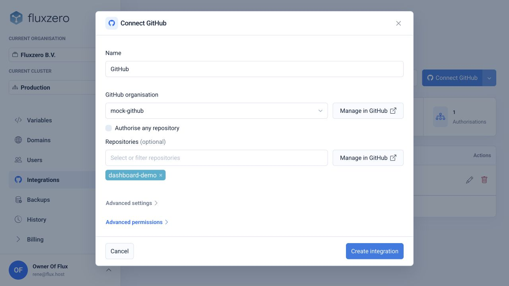
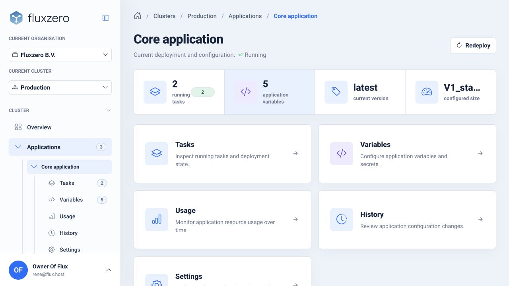

import { Steps } from '@astrojs/starlight/components';

Make your checked app available to users. Your agent helps prepare the release, and Fluxzero runs the same product in the cloud.

Before you start

You need a project you can run locally, its GitHub repository, access to the destination Fluxzero organization and permission to configure its deployment integration. If the organization/environment still needs provisioning, review the current plan and cost before creating it.

Your live app has its own data and configuration. Publishing delivers the application; it does not copy local demo users, reservations or development credentials. See [Local and live environments](/docs/building/environments).

The screenshots use a local dashboard demo. Select your own organization, repository and application.

First releaseGitHub repository + Fluxzero organization

<Steps>

1. ## Prepare the app with your agent

   

   Ask your agent to check the app's tests and help you try its main user flows in Devboard. Then ask it to prepare the
   GitHub repository and Fluxzero deployment workflow. Have the agent inspect the existing build and workflow files. Some projects include only verification; others already have delivery configured. Prepare the missing delivery steps for the actual application, including its production frontend. [Build and publish](/docs/tools/build-and-publish) explains the packaging choices; [GitHub Actions](/docs/tools/github-actions) provides an explicit workflow and action reference.

   Agree on the version you want to deploy. Local demo data and development credentials are not production setup:
   ask the agent to identify which configuration, sign-in settings, and external services your live app needs.

   

2. ## Connect GitHub to Fluxzero

   

   Sign in to [Fluxzero](https://dashboard.fluxzero.io) and select your organization. If this is your first app,
   create an organization and choose the cloud setup that fits it. Review the plan and cost before provisioning.
   Your agent can explain the choices in terms of the app you want to run.

   Open **Integrations** under **Organisation**, then choose **Connect GitHub**. Connect your GitHub account or
   organization and give the Fluxzero GitHub App access to the repository you want to deploy.

   In the integration form, select the GitHub organization. To limit this integration to your app, turn off
   **Authorise any repository** and select the app's repository. Review the permissions, then choose **Create integration**.
   The default **Deployer** role is intended for delivering applications; **Advanced permissions** lets you restrict
   its scope. Your agent can help match that scope to the app's destination.

   

   *The local demo uses `mock-github` and `dashboard-demo`. Select your own GitHub organization and repository.*

   **Advanced settings** can restrict which workflows and GitHub environments may use the integration. Your agent can
   match these to the deployment workflow it prepared. If the repository is missing, check the selected GitHub
   organization and the GitHub App's repository access using **Manage in GitHub**.

3. ## Deploy a checked version

   

   Choose the target Fluxzero cluster and application for the deployment workflow. A cluster is the managed environment
   where the app runs. Follow [Configure settings and secrets](/docs/building/configuration) for the live settings, then run the repository's deployment workflow for the exact code revision you want to release. Confirm the target names and an immutable image reference before submitting: the deployment API can create a missing cluster or application when the caller has permission.

   The workflow builds the app, publishes its container image, and deploys it to Fluxzero. Follow the workflow result and
   open your cluster's **Applications** page in the Fluxzero dashboard, then select the app. Its overview shows the current
   version and running tasks. **Tasks** shows deployment state; **History** helps you check which version or configuration
   changed. Check these results before treating the version as published.

   

   *This is the local demo's Core application. Open your own app to check the version you published.*

   If delivery fails, give your agent the failed workflow step or deployment message. Have it check the cause and the
   version currently running before trying again.

   For custom delivery, use [GitHub Actions](/docs/tools/github-actions) and the [System API reference](/docs/tools/system-api). A successful API request confirms command handling, not completed workload startup. For a failed stage, use [Investigate a failed deployment](/docs/building/deployment-problems).

4. ## Open the live app

   

   Open the cluster's endpoint from its overview, using the app's path if the cluster serves several applications.
   Your agent can give you the complete link for the frontend it deployed. Check its main flow again in the deployed
   environment, including sign-in and any external integrations. Use [Connect a custom domain](/docs/building/custom-domain) when the app should use your own hostname.

   Fluxzero provides deployment and application visibility, including logs and message inspection, so you and your agent
   can investigate behavior after release. It also manages the execution infrastructure underneath your application.
   [Understand your app](/docs/building/monitoring) walks through every monitoring view.

   
<strong>Your first release</strong>
The checked version is available at its live address and its main flow works with live sign-in and services.

</Steps>

## Keep improving it

Follow [Publish an update](/docs/building/publish-updates) for subsequent releases. The [dashboard reference](/docs/building/dashboard) links to access, configuration, domains, usage and recovery. A GitHub push publishes only when the workflow is configured to deploy on that event; keep the release trigger explicit.
