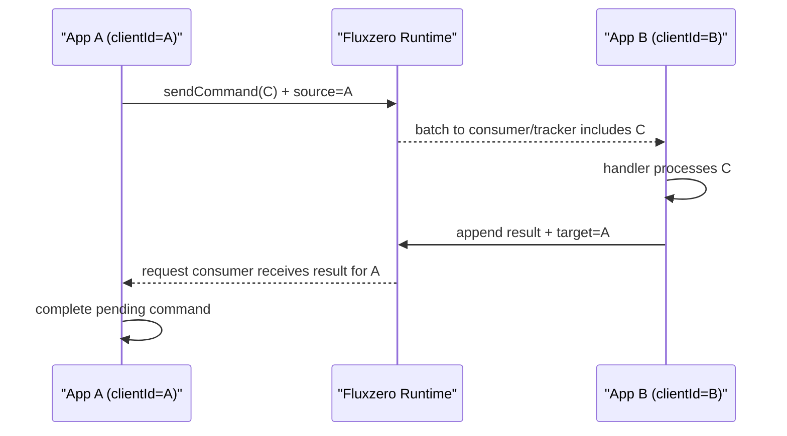
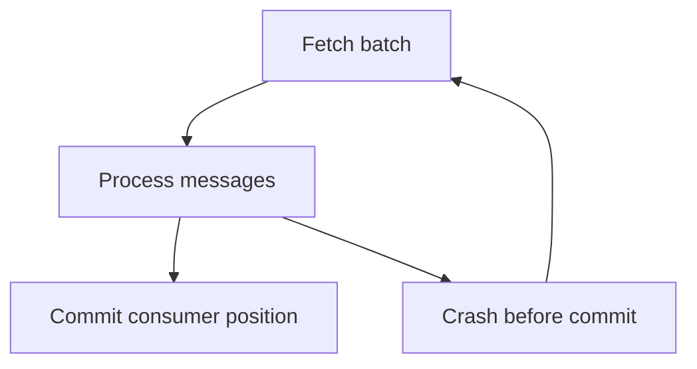
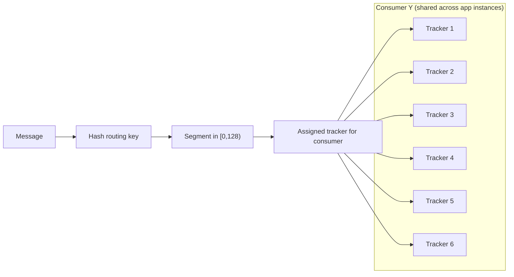
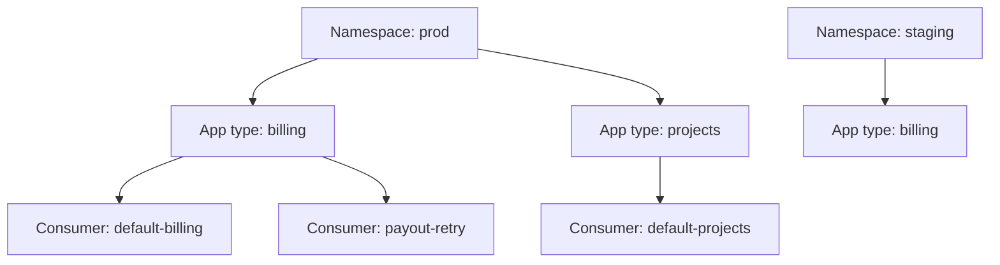

# Runtime Interaction Model

This page explains how Fluxzero applications interact with the Fluxzero Runtime, how tracking behaves under load/failures,
and how applications can collaborate without direct app-to-app coupling.

---

## Quick Navigation

- [Command-to-Result Flow Across Apps](#command-result-flow)
- [Delivery Semantics (At-Least-Once)](#delivery-semantics)
- [Scaling Model (Consumer / Tracker / Segment)](#scaling-model)
- [Application Name, Consumer Name, Namespace](#boundaries)
- [Replay Safety Model](#replay-safety)
- [Architecture Fit for Common App Types](#app-types)

---

## Command-to-Result Flow Across Apps

Fluxzero uses request/result logs in the runtime. Apps do not call each other directly.

1. App A sends command `C`.
2. SDK in App A sets `source = clientId(A)` on the request message.
3. A tracker in App B consumes a batch containing `C`.
4. A handler in App B handles `C`.
5. App B appends the handler result to the result log; SDK sets `target = clientId(A)`.
6. Request consumer in App A tails the result log and receives the result.
7. App A completes the pending command call.

---

## Delivery Semantics (At-Least-Once)

Fluxzero aims to prevent duplicates, but the effective delivery contract for handlers is **at-least-once**.

Tracking loop (conceptually):

1. Get batch.
2. Process batch.
3. Commit tracking position in runtime.

If a consumer crashes before step 3, part of the batch can be handled again.

### Agent Rules

- Handlers with external side effects MUST be idempotent or compensatable.
- Replays/resetting consumer position intentionally re-deliver messages.
- If replay impact is unclear, ask the user before executing replay changes.

---

## Scaling Model (Consumer / Tracker / Segment)

- Segment space is `[0, 128)`.
- Each message is hashed to one segment via routing key.
- Per consumer, each segment is assigned to exactly one active tracker.
- If you run multiple instances of the same app, trackers from all instances share that consumer's segment space.

Example:

- 2 app instances
- Same consumer config with `threads = 3`
- Total active trackers for that consumer = 6
- Segment space is divided over those 6 trackers

### Important Clarification

If multiple **different consumers** handle the same command type, that command can be handled multiple times and multiple
results can be produced.

Current request/result behavior:

- The first result appended to the runtime result log (lowest insertion index) is delivered first and used to complete the
  waiting request.
- Later results for the same request are currently ignored by the SDK.

This multi-consumer same-command setup is an advanced pattern and is discouraged by default unless explicitly requested.

---

## Application Name, Consumer Name, Namespace

### Application Name

- The app name scopes defaults, especially the default consumer naming.
- Different app names prevent default-consumer clashes between app types.

### Consumer Name

- Distribution, replay position, and message claiming are per consumer.
- Consumer selection priority:
  1. Explicit `@Consumer` on handler/class/package (most specific).
  2. Consumer configuration via `FluxzeroBuilder` predicates.
  3. Application default consumer (fallback).
- If multiple `FluxzeroBuilder` consumer predicates match, the first-registered configuration wins.

Builder-based consumer configs are less specific than `@Consumer`, but more specific than the app default.
This enables:

- Grouping multiple handlers into one consumer via a handler fitness predicate.
- Assigning the same handler to multiple consumers when `exclusive = false`.
  This is useful for retroactive replay on one consumer (possibly bounded by `maxIndexExclusive`) while another consumer
  continues live processing.

### Namespace

- Namespace is environment/tenant isolation (similar to separate database schemas).
- Different namespaces are isolated by default.
- Cross-namespace publishing/consuming/search is possible when explicitly configured and authorized.
- A single Fluxzero runtime can host multiple environments in parallel (for example `test`, `accept`, `staging`) by
  using separate namespaces.
- Agent default: assume cross-namespace access is off unless explicitly configured. Suggest it only when no elegant
  same-namespace/custom-topic alternative exists.

---

## Replay Safety Model

Replay safety depends on handler side effects, not just on runtime mechanics.

Replays are allowed and encouraged for agile, retroactive evolution of systems. The key is replaying with clear side
effect awareness.

Usually safe:

- Rebuilding/refreshing documents/projections.
- Reprocessing technical errors where downstream effects are idempotent.

Needs review:

- External side effects (payments, emails, third-party writes) without idempotency keys.
- Any handler where duplicate execution has business impact.

### Agent Rule

Before adding or running replay logic, inspect side effects of impacted handlers. If impact is uncertain, ask the user.

### Replay Readiness Checklist

1. **Scope**: Identify exactly which consumer(s) and handler(s) are affected.
2. **Effect Type**: Classify side effects as projection-only vs external/business-impacting.
3. **Idempotency Risk**: Confirm duplicate processing is safe for affected handlers.
4. **Window**: Define replay bounds (`minIndex`, optional `maxIndexExclusive`) and why.
   Use `IndexUtils` for timestamp-to-index conversion. Conceptually: `idx = ts << 16`.
5. **Parallel Live Processing**: Decide whether replay runs in a separate consumer while live traffic continues.
6. **Success Signal**: Define what “done and correct” means (documents rebuilt, errors cleared, metrics stable).
7. **User Confirmation**: If any replay impact is uncertain, ask the user before applying replay changes.

---

## Architecture Fit for Common App Types

### API-only request/response services

Still a strong fit: auditing, message-level security boundaries, back-pressure, and high-throughput scaling.

### Data-migration-heavy workloads

Strong fit: producer/consumer decoupling, pause/resume consumption, replayability, and inspection during migration.

### External-side-effect-heavy workflows

Preferred path: use Fluxzero web request/proxy pipeline for retriable and auditable outgoing calls.

Fallback path: direct protocols (e.g., UDP/gRPC) can still be used if cluster policy allows; keep idempotency and tracking
implications explicit.

---

## Agent Defaults

- Handling the same command type in multiple consumers is discouraged by default unless explicitly requested.
- For command handlers, do not use `exclusive = false` unless explicitly requested.
- Default outgoing integrations to Fluxzero web request/proxy handling; use direct networking only when explicitly
  requested or required by cluster policy.
- For ad-hoc trace propagation across message chains, use metadata keys prefixed with `$trace.`.
